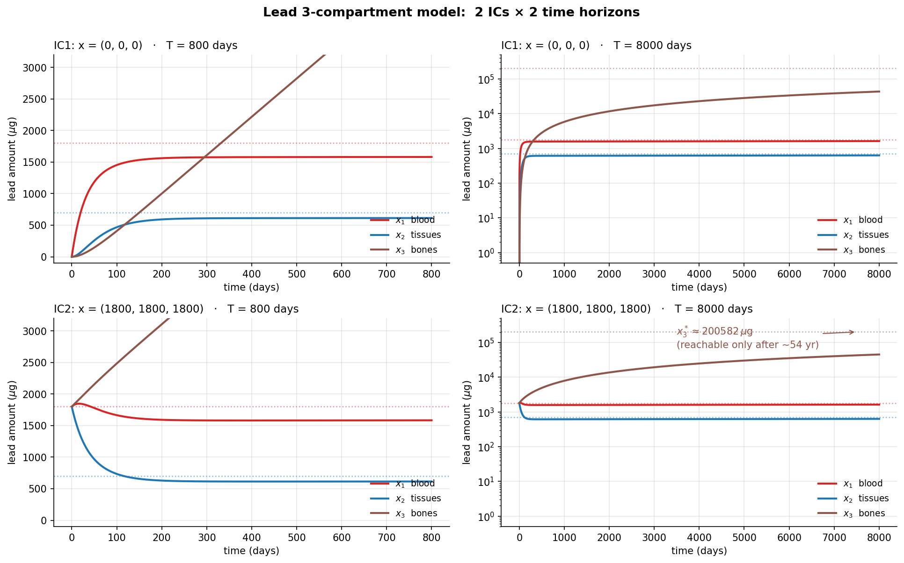

# 2020 期中 Problem 2 — 鉛在人體內三隔室模型 (15%)

## 原題(完整)

> **Problem 2: (15%) – In-Class Problem**
>
> Lead is an ingredient in many objects of everyday life: car batteries, water pipes, glassware, ceramics, paint, and gasoline. But lead is toxic, and high levels in the blood and tissues will impair motor and mental capacities. One way to begin to understand this is to build a model of lead flow in the body.
>
> Lead enters the bloodstream via food, air, and water. It accumulates in the blood, in tissues, and especially in the bones. Some lead is excreted by the kidneys and by hair, nails, and sweat. Numbering the body compartments as 1, 2, and 3, the following schematic diagram represents the flow of lead through the compartment. Applying the conservation law to the lead flow through the blood, tissue, and bone compartments, we can model the system with three rate equations:
>
> **Schematic**(PDF 給的圖):
>
> ```
>                              I₁  (Lead input)
>                              │
>                              ▼
>     ┌─────────┐   k₃₁·x₁   ┌─────────┐   k₂₁·x₁   ┌─────────┐
>     │    3    │ ◄────────  │    1    │ ─────────► │    2    │
>     │  Bones  │            │  Blood  │            │ Tissues │
>     │  x₃(t)  │ ─────────► │  x₁(t)  │ ◄───────── │  x₂(t)  │
>     └─────────┘   k₁₃·x₃   └────┬────┘   k₁₂·x₂   └────┬────┘
>                                 │                       │
>                          k₀₁·x₁ ▼ (Urine)        k₀₂·x₂ ▼ (Hair, nails, sweat)
> ```
>
> **三條速率方程**:
> $$
> \begin{aligned}
> \text{blood:}\quad & \tfrac{dx_1}{dt} = -(k_{01}+k_{21}+k_{31})\,x_1 + k_{12}\,x_2 + k_{13}\,x_3 + I_1 \\
> \text{tissues:}\quad & \tfrac{dx_2}{dt} = k_{21}\,x_1 - (k_{02}+k_{12})\,x_2 \\
> \text{bones:}\quad & \tfrac{dx_3}{dt} = k_{31}\,x_1 - k_{13}\,x_3
> \end{aligned}
> $$
>
> Michael Rabinowitz, George Wetherill, and Joel Kopple made a controlled study of the lead intake and excretion of a healthy volunteer living in Southern California. The data from this study were used to estimate the values of the lead intake rate $I_1$ in micrograms/day and the rate constants $k_{ji}$ in (days)$^{-1}$:
>
> $$
> I_1 = 49.3;\quad k_{01}=0.0211;\quad k_{21}=0.0111;\quad k_{31}=0.0039
> $$
>
> $$
> k_{02}=0.0162;\quad k_{12}=0.0124;\quad k_{13}=0.000035
> $$
>
> Using the above model and parameters, and taking the following two different sets of initial values, perform numerical simulations and plot the lead levels in the bloodstream, tissues, and bones over a period of **800 days** and **8000 days**, respectively. **Discuss your simulation results.**
>
> - **Initial condition 1**: $x_1(0)=0,\;x_2(0)=0,\;x_3(0)=0$
> - **Initial condition 2**: $x_1(0)=1800,\;x_2(0)=1800,\;x_3(0)=1800$

---

## 1. 用「人話」讀方程(verbal first)

### 1.1 三個隔室的故事

把整個模型想成「三個水桶 + 一條進水管 + 三條排水管」(這就是 [03-質性建模與Forrester圖.md §3.3](../../redesigned/03-質性建模與Forrester圖.md) 的隔室模型):

```
   I1=49.3 μg/day
         │
         ▼
       ┌─────┐   k21·x1   ┌─────┐
       │ x1  │ ─────────► │ x2  │
       │blood│ ◄───────── │tiss │
       └──┬──┘   k12·x2   └──┬──┘
          │ k01·x1            │ k02·x2 (毛髮、汗)
          ▼ (尿液)             ▼
       ┌─────┐
       │ x3  │ ◄─ k31·x1 ─ (from blood)
       │bones│
       │     │ ─ k13·x3 ─► (回 blood)
       └─────┘
```

> 詳細 Forrester 圖見 `fig1_compartment_diagram.py`。

### 1.2 參數意義

| 參數 | 從 → 到 | 數值 ($\text{day}^{-1}$) | 半衰期 $\ln 2/k$ |
|---|---|---:|---|
| $k_{01}$ | $x_1 \to$ 尿液 | 0.0211 | 32.8 day |
| $k_{21}$ | $x_1 \to x_2$ | 0.0111 | 62.4 day |
| $k_{31}$ | $x_1 \to x_3$ | 0.0039 | 178 day |
| $k_{02}$ | $x_2 \to$ 體外 | 0.0162 | 42.8 day |
| $k_{12}$ | $x_2 \to x_1$ | 0.0124 | 55.9 day |
| $k_{13}$ | $x_3 \to x_1$ | **0.000035** | **19,805 day ≈ 54 年** |

**最關鍵的數字是 $k_{13}$**——它比其他速率小**三個數量級**。骨骼像個「黑洞」:鉛**進得快、出得超慢**。

> **預測現象**(在動手算之前):血液和組織會在**幾百天內達穩定**,骨骼則要花**數十年**慢慢累積。**800 天和 8000 天會看到完全不同的故事**——這正是這題在考的「**多時間尺度**」。

---

## 2. 平衡點(代數解)

把所有導數設為 0。先用較簡單的兩條:

**從 $x_2$ 方程式**:
$$
k_{21}\, x_1^* = (k_{02}+k_{12})\, x_2^* \;\Rightarrow\; x_2^* = \frac{k_{21}}{k_{02}+k_{12}}\, x_1^*
$$

**從 $x_3$ 方程式**:
$$
k_{31}\, x_1^* = k_{13}\, x_3^* \;\Rightarrow\; x_3^* = \frac{k_{31}}{k_{13}}\, x_1^*
$$

代入 $x_1$ 方程式整理後:

$$
x_1^* = \frac{I_1}{k_{01} + \dfrac{k_{21}\,k_{02}}{k_{02}+k_{12}}}
$$

**數值**(代入):
$$
x_1^* \approx \frac{49.3}{0.0211 + 0.0111 \cdot \frac{0.0162}{0.0286}} \approx \frac{49.3}{0.02738} \approx 1800\,\mu\text{g}
$$

$$
x_2^* = \frac{0.0111}{0.0286} \cdot 1800 \approx 699\,\mu\text{g}
$$

$$
x_3^* = \frac{0.0039}{0.000035} \cdot 1800 \approx \boxed{200{,}640\,\mu\text{g}}
$$

**注意 $x_3^*$ 是 $x_1^*$ 的 111 倍**——骨骼是巨大的儲存槽。

---

## 3. 兩組初值會跑出什麼?

### 3.1 IC1: 全部 = 0(健康人剛開始接觸鉛)

- **早期(0–幾十天)**:$x_1$ 直線上升,因為 $I_1$ 進來而排出還小。
- **數百天內**:$x_1$ 與 $x_2$ 接近各自的穩態(1800 與 699 μg)。
- **數千–數萬天**:$x_3$ 持續累積,但**遠遠沒達到 200,640 μg**。8000 天時 $x_3$ 大概只到幾萬 μg。

### 3.2 IC2: 全部 = 1800(已長期接觸的人)

- **$x_1$**:幾乎已經是穩態(1800 ≈ $x_1^*$),所以變化不大。
- **$x_2$**:從 1800 **掉下來**到 $\approx 699$,需要 $\sim 1/(k_{02}+k_{12}) = 35$ 天的時間常數,大約 100–200 天平穩。
- **$x_3$**:從 1800 **緩慢爬升**朝 200,640 μg 走——8000 天內遠遠到不了。

> **這就是「多時間尺度系統」的特徵**:不同隔室的特徵時間差很多。短期看血液和組織,長期看骨骼。

### 3.3 兩組 IC 最終會收斂到同一個平衡點嗎?

**會,但時間是 $1/k_{13} \approx 19{,}800$ 天**(54 年)的量級——8000 天 (~22 年) 連一個時間常數都還沒走完。



> 圖由 [`simulate_edu.py`](./simulate_edu.py) 產出(英文乾淨版,附詳細教學註解);中文版 `fig2_simulations.png` 由 [`fig2_simulations.py`](./fig2_simulations.py) 產出。

---

## 4. 守恆檢查(總質量)

整個系統流入只有 $I_1$,流出只有 $k_{01}x_1$(尿)和 $k_{02}x_2$(毛髮汗液)。把三條 ODE 加起來:

$$
\frac{d(x_1+x_2+x_3)}{dt} = I_1 - k_{01} x_1 - k_{02} x_2
$$

**在平衡時**:$I_1 = k_{01}x_1^* + k_{02}x_2^*$
$\approx 0.0211 \cdot 1800 + 0.0162 \cdot 699 \approx 37.98 + 11.32 \approx 49.3$ ✓

**完美**——這就是 [05-量化建模II.md §5.2.2 守恆檢查](../../redesigned/05-量化建模II.md) 教的:**寫完模型一定要做質量守恆的代數檢查**,不然你的 ODE 可能有 bug。

---

## 5. 健康警示與生物意義

這個模型解釋了**為什麼鉛中毒治療這麼困難**:

- **血液裡的鉛半衰期**短(~30 天),停止接觸後驗血會看到快速下降——**檢驗會以為康復了**。
- **骨骼裡的鉛幾乎不出來**($1/k_{13} \approx 54$ 年)。終生累積。
- **更可怕的是**:骨頭裡的鉛在**懷孕、哺乳、骨質流失時可能釋回血液**(這個模型沒包含,但實際醫學文獻常提)——舊傷口幾十年後重新出現。

這也是為什麼 1970s 美國禁了含鉛汽油:**現在處於暴露的兒童,他們的骨骼幾十年後還會回送鉛**。

---

## 6. 對照講義

| 題目要素 | 講義來源 |
|---|---|
| 隔室(compartment)模型概念 | [03-質性建模與Forrester圖.md §3.3.4](../../redesigned/03-質性建模與Forrester圖.md) |
| 線性 ODE 系統 | [04-量化建模I.md §4.3.5](../../redesigned/04-量化建模I.md) |
| 守恆 / 單位檢查 | [05-量化建模II.md §5.2.1-5.2.2](../../redesigned/05-量化建模II.md) |
| 多時間尺度(slow/fast) | [09-模型分析.md](../../redesigned/09-模型分析.md) |
| 數值積分(Euler / RK / `solve_ivp`) | [06-數值技巧.md](../../redesigned/06-數值技巧.md) |

---

## 7. 答題建議

1. **先解析地把 $x_1^*, x_2^*, x_3^*$ 列出來**——這幫你預測模擬會看到什麼。
2. **發現 $k_{13}$ 比其他都小三個數量級**——這是 paper key insight,寫下來。
3. **800 vs 8000 天的對比**:強調**血液/組織快、骨骼慢**。不是兩個一樣的圖。
4. **兩組 IC 對比**:IC2 給的就是 $x_1^*$,所以 $x_1$ 不動;但 IC2 給的 $x_2 = 1800$ **不是** $x_2^*=699$,所以 $x_2$ 會掉下來。$x_3$ 兩種 IC 行為很不同(0 vs 1800 起點,終點都是 200,640)。
5. **質量守恆檢查必寫**——即使閱卷者沒明問,寫上去能展現你會做 sanity check。

---

## 附錄:重現圖檔

```bash
conda activate bsma-pdf
cd example-questions/2020-p2-lead-flow

# 原始版(中文標籤)
python fig1_compartment_diagram.py    # → fig1_compartment_diagram.png
python fig2_simulations.py            # → fig2_simulations.png

# 教育版(英文乾淨圖,逐行教學註解;額外解釋為何用 solve_ivp、rtol/atol 選擇)
python simulate_edu.py                # → fig2_simulations_clean.png
```

**何時用哪一個**:
- **原始版** — 中文標籤,最簡可用程式碼參考。
- **`simulate_edu.py`** — 想了解「**為什麼**這樣寫」(為何 RK45 而不是 Euler、為何 `rtol=1e-9, atol=1e-12`、`max_step=2.0` 的意義、守恆檢查怎麼做)。**初值的關鍵教學**:兩組 IC 揭露的是「多時間尺度的不同故事」——IC1 看累積,IC2 看重分布。
