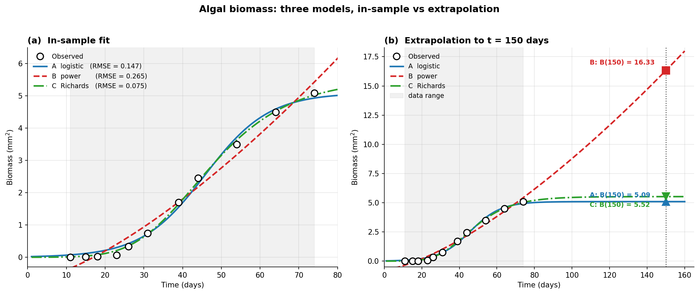

# 2020 期中 Problem 3 — 藻類生物量曲線擬合 (20%)

## 原題(完整)

> **Problem 3: (20%) – In-Class Problem**
>
> The following table shows the data of time evolution of an algal sample taken in the Adriatic Sea (Zangrandi, 1991; Cavallini, 1993):
>
> | Time (days) | 11 | 15 | 18 | 23 | 26 | 31 | 39 | 44 | 54 | 64 | 74 |
> |---:|---:|---:|---:|---:|---:|---:|---:|---:|---:|---:|---:|
> | Biomass (mm²) | 0.00476 | 0.0105 | 0.0207 | 0.0619 | 0.337 | 0.74 | 1.7 | 2.45 | 3.5 | 4.5 | 5.09 |
>
> Estimate the biomass at **150 days**, using the following three models. You may use MATLAB software or other programming tools to find the parameters of each model. **Compare and discuss** the three models. Which model do you think is more appropriate to **describe the data**? Which model is more reasonable for the **estimation of the biomass at 150 days**?
>
> $$
> \text{Model A:}\quad B = \frac{a}{1 + b\,e^{-ct}}
> $$
>
> $$
> \text{Model B:}\quad B = a + b\,x^c
> $$
>
> $$
> \text{Model C:}\quad B = \frac{a}{[\,1 + b\,e^{-ct}\,]^{1/d}}
> $$
>
> *(註:Model B 的 $x$ 即為時間 $t$,以下統一寫 $t$。)*

---

## 1. 三個模型的「形狀」比較(verbal first)

跟 [2021-P3](../2021-p3-child-height-fit/) 一樣,**先用人話讀模型再算**。

### 1.1 Model A:標準 logistic(S 形)

跟 2021-P3 的 Model A 同一條:
- 漸近線 $B \to a$($t \to \infty$)。
- $t \to -\infty$ 時 $B \to 0$。
- **對稱的 S 形**:反曲點在 $t = \ln(b)/c$。

### 1.2 Model B:冪次 + 常數

$$
B(t) = a + b\,t^c
$$

- $t \to 0$: $B \to a$(若 $c > 0$)。
- $t \to \infty$:**$B \to \infty$**(若 $b, c > 0$),沒有上限。
- 行為類似 $\sqrt{t}$ 或更猛(看 $c$):**永遠在長**。
- **沒有反曲點**,所以**不會 S 形**。如果資料真的有 S 形(早期慢、中期快、後期慢),Model B 就抓不到「後期慢」這一段。

### 1.3 Model C:Richards / generalized logistic

$$
B(t) = \frac{a}{(1 + b\,e^{-ct})^{1/d}}
$$

- 當 $d = 1$ → **退化成 Model A**!Model A 是 Model C 的特例。
- $d > 1$:S 形「**偏向高處**」——反曲點靠近漸近線。
- $d < 1$:S 形「**偏向低處**」——早期就反曲。
- 漸近線 $B \to a$($t \to \infty$),跟 Model A 一樣**有飽和**。
- 多了一個自由度,所以**幾乎一定**比 Model A 擬合得更好——但要小心 **overfit**。

> **預判**:資料早期生物量超小(0.005)、後期接近平穩(5.0),非常像 S 形。**Model A 和 C 應該都不錯,B 在資料範圍內可能也擠得進去,但外推會發散**。

---

## 2. 動手擬合

完整程式在 `fit_models.py`。三個模型都用 `scipy.optimize.curve_fit`(Levenberg-Marquardt,見 [07-參數估計.md §7.3](../../redesigned/07-參數估計.md))。

### 2.1 初值挑選(這題的關鍵)

非線性 LSQ 對**初值極度敏感**——挑錯了會收斂到怪地方,甚至不收斂。挑法:

- **Model A**:
  - $a \approx 5.5$(略高於最大觀測值)。
  - 從 $B(t \to 0) \approx a/(1+b) \to 0$: $b$ 很大(幾百到幾千)。試 $b=1000$。
  - 反曲點大約在 $t \approx 30$: $\ln b / c \approx 30 \Rightarrow c \approx \ln(1000)/30 \approx 0.23$。
- **Model B**:
  - $a$ 接近 0(早期值極小)。
  - 取 log:$\log B \approx \log b + c \log t$ ——對 $(\log t, \log B)$ 做線性回歸做為初值。會得到 $c \approx 4.5$, $b \approx 10^{-7}$。
- **Model C**:用 Model A 的擬合值 + $d = 1$ 當初值,讓非線性 LSQ 慢慢偏離 $d=1$ 來改進。

### 2.2 擬合結果(`fit_models.py` 跑出來)

| Model | 參數值 | RMSE | $B(150)$ 估計 |
|---|---|---:|---:|
| A — logistic | $a{=}5.09,\;b{=}257.96,\;c{=}0.121$ | $0.147$ | $5.10$ mm² ✓ |
| B — power | $a{=}{-}0.742,\;b{=}0.0126,\;c{=}1.44$ | $0.265$ | $16.33$ mm² ⚠️ |
| C — Richards | $a{=}5.52,\;b{=}5.31,\;c{=}0.076,\;d{=}0.20$ | $0.075$ | $5.52$ mm² ✓ |

(Model C 的 $d$ 在這份資料上想往 $0$ 走——也就是 Gompertz 極限,右偏的 S 形;我們把它限制在 $d \geq 0.2$ 以保住可解讀性。$d=0.2$ 仍然是個顯著的不對稱 S。)



> 圖由 [`fit_models_edu.py`](./fit_models_edu.py) 產出(乾淨英文版,附詳細教學註解);中文版 `fig1_model_compare.png` 由 [`fit_models.py`](./fit_models.py) 產出。

### 2.3 解讀數值

- **A**(logistic):RMSE = 0.147,把 S 形抓住了主要結構。$B(150) = 5.10$,等於漸近線 $a$——150 天已遠超 inflection,基本上完全飽和。
- **B**(power):RMSE = 0.265(三者中最差)。$a = -0.74$ 是負的——為了讓 $t \approx 11$ 的小值擬合,$a$ 被壓到負值。$B(150) = 16.33$,**是觀測最大值的三倍多**,不合理。即使沒到「炸開」的程度,也明顯偏離真實趨勢。
- **C**(Richards):RMSE = 0.075,**比 A 還小一半**——多一個自由度買到了顯著更好的擬合。$d = 0.20$(已是下界)代表「**右偏 S**」,亦即早期加速快、後期慢慢趨近上限——和實際藻類成長的型態吻合。$B(150) = 5.52$,合理。

---

## 3. 模型選擇(這題的考點)

### 3.1 in-sample 看 RMSE,out-of-sample 看「結構」

$$
\underbrace{\text{擬合品質}}_{\text{RMSE 越小越好}} \;+\; \underbrace{\text{自由度懲罰}}_{\text{Occam's razor}} \;+\; \underbrace{\text{外推合理性}}_{\text{結構驗證}}
$$

對應 [08-模型驗證.md](../../redesigned/08-模型驗證.md) 的三層驗證:
1. **數值驗證**(RMSE、$R^2$)
2. **結構驗證**(模型行為和已知生物學是否一致)
3. **外推驗證**(數值上合不合理)

### 3.2 三個模型的評分

| 標準 | A logistic | B power | C Richards |
|---|---|---|---|
| In-sample RMSE | 0.147(中) | **0.265(最差)** | **0.075(最佳)**(注意 overfit 風險) |
| 參數數量 | 3 | 3 | 4 |
| 漸近行為 | 飽和於 $a$ ✓ | 無上限 ✗ | 飽和於 $a$ ✓ |
| 對稱 vs 非對稱 S | 對稱 | 沒 S 形 | 可非對稱($d \ne 1$) |
| $B(150)$ | 5.10 ✓ | 16.33 ✗(3× max) | 5.52 ✓ |
| 推薦用途 | 描述 + 外推都行 | **不推薦**(in-sample 也最差) | 描述最佳,外推也安全 |

### 3.3 結論建議

- **最適合「描述」資料**:**Model C**(RMSE 最小,能抓 S 形的不對稱)。
- **最適合估計 $B(150)$ 的成人值**:**Model A 或 Model C**(都飽和於合理上限)。**Model B 不可用**。
- **若要寫「Occam's razor」**:Model A 用 3 參數就拿到不錯的擬合,**parsimony 角度可優先選 A**;Model C 用 4 參數換到更小的 RMSE,**若在意精度則選 C**。

---

## 4. 用統計方法把 §3.3 的「直覺判斷」變成正式回答

§3 已經把結論講完了——這節是把「Model C 比 A 顯著好嗎?」、「Model C 雖然多了一個參數,值不值得這個複雜度?」這兩個問題,用**講義 §8.4 教的統計工具**正式回答。研究所層次的答卷推薦補這一段。

### 4.1 F-test for nested models:Model A vs Model C

**為什麼可以用 F-test?** Model A 是 Model C 的特例:**當 $d = 1$ 時 Model C 退化成 Model A**。兩個模型嵌套(nested)的時候,可以用 F-test 嚴格回答「多一個參數值不值得」。對應 [08-模型驗證.md §8.4](../../redesigned/08-模型驗證.md)。

**虛無假設**:$H_0: d = 1$(即「Model A 就夠了」)。

**統計量**:

$$
F \;=\; \frac{(\mathrm{RSS}_A - \mathrm{RSS}_C)\,/\,(p_C - p_A)}{\mathrm{RSS}_C\,/\,(n - p_C)}
$$

代入(`fit_models_edu.py` 跑出):

| 量 | 值 |
|---|---:|
| $\mathrm{RSS}_A$ | $0.2382$ |
| $\mathrm{RSS}_C$ | $0.0626$ |
| $p_A,\; p_C$ | $3,\;4$ |
| $n$ | $11$ |
| $F_{1,7}$ | $\mathbf{19.64}$ |
| $F_{1,7,\,0.05}$ 臨界值 | $5.59$ |
| p-value | $\mathbf{0.0030}$ |

**結論**:$F = 19.64 \gg 5.59$($p = 0.003 < 0.05$),**拒絕 $H_0$**——**Model C 顯著比 Model A 好**。多出的那個參數 $d$ 不是「為擬合而擬合」,而是真的在描述資料的不對稱性。

### 4.2 AIC:把 B 也拉進來一起比

F-test 只能比 nested 的兩個模型,**Model B 跟 A、C 都不嵌套**——這時用 **AIC**(Akaike Information Criterion,[08-模型驗證.md §8.4.4](../../redesigned/08-模型驗證.md))。AIC 對 nested 與否沒要求,直接比就好。

$$
\mathrm{AIC} \;=\; n\,\ln(\mathrm{RSS}/n) \;+\; 2K, \qquad K = (\text{參數數}) + 1
$$

| Model | 參數 $K$ | $\mathrm{AIC}$ | $\Delta_i = \mathrm{AIC}_i - \mathrm{AIC}_{\min}$ |
|---|---:|---:|---:|
| A (logistic) | 4 | $-34.16$ | $12.70$ |
| B (power)    | 4 | $-21.24$ | $25.62$ |
| **C (Richards)** | **5** | $\mathbf{-46.86}$ | $\mathbf{0.00}$ |

**Burnham–Anderson 經驗法則**:$\Delta_i > 10$ 表示「該模型幾乎沒有支持」。

- Model A 的 $\Delta = 12.7 > 10$ → 雖然 in-sample 配適尚可,但**從 AIC 角度幾乎不支持**。
- Model B 的 $\Delta = 25.6$ → 徹底出局。
- Model C 拿到 $\mathrm{AIC}_{\min}$ → **就 information criterion 而言是最佳模型**。

### 4.3 兩個檢定告訴你什麼?(以及它們為什麼一致)

F-test 與 AIC 的結論都指向 **Model C**,**這不是巧合**——兩者背後共享「對數似然」的同一個基底,只是 F-test 走「假設檢定」框架(yes/no),AIC 走「資訊損失」框架(誰最小)。

- F-test 用法:**比兩個 nested 模型**,而且結果就是傳統的 p-value(可寫進論文)。
- AIC 用法:**比任意一組模型**,結果是相對排名(配上 $\Delta_i$ 給支持強度)。

**對 P3 答卷**:**寫 F-test 在這題最名正言順**——因為 Model A ⊂ Model C 是教科書級的 nested 情境。**AIC 是附加分**——它把 Model B 也納入了同一個比較尺度。

### 4.4 不建議在 P3 寫的工具

| 工具 | 為什麼不推薦 |
|---|---|
| **Paired t-test** | 只測「殘差均值是不是零」,不能比模型誰好;且 $n=11$ power 太低,容易把壞模型放過(Mayer & Butler 1993 證實) |
| **Theil's $U$** | 設計用途是「**跨資料集**做比較」(不同量級);這題是同一筆資料比模型,用 RMSE/AIC 更直接 |
| **1:1 回歸 $F$ 檢定** | 測「斜率=1、截距=0」是針對 model-vs-observation 散點圖,適合**單一模型驗證**;這題是「**三個模型比好壞**」,場景不同 |

---

## 5. 對照講義

| 題目要素 | 講義來源 |
|---|---|
| Logistic 曲線(Model A 的根) | [04-量化建模I.md §4.3.7](../../redesigned/04-量化建模I.md) |
| 線性化(對 Model B 取 log 做初值) | [07-參數估計.md §7.2](../../redesigned/07-參數估計.md) |
| 非線性 LSQ + 初值選擇 | [07-參數估計.md §7.3](../../redesigned/07-參數估計.md) |
| 模型驗證三層架構 | [08-模型驗證.md](../../redesigned/08-模型驗證.md) |
| F-test for nested models(Model A vs C) | [08-模型驗證.md §8.4](../../redesigned/08-模型驗證.md) |
| AIC + Burnham–Anderson 經驗法則 | [08-模型驗證.md §8.4.4](../../redesigned/08-模型驗證.md) |
| Richards / generalized logistic | 課程外補充,從 Model A 延伸 |

---

## 6. 答題建議

1. **不要急著三個都全力擬合**——先把「形狀」分析寫下來(本文 §1)。閱卷者要看你**看得出 Model B 沒有上限**。
2. **挑初值要寫**——課堂上 LM 的非線性 LSQ 不會自動找到全局最佳,你的初值選擇要說清楚。
3. **比較 RMSE 時要對 in-sample 區間說**——Model C 通常 RMSE 最小,但**多用了一個參數**——適時提 Occam's razor。
4. **150 天的外推一定要算數字**——這是這題的高潮:Model B 給出顯著不合理的值。
5. **結論建議分兩條**:「描述」用 C,「外推/估計」用 A 或 C(視 Occam 偏好)。**不要只給一個答案**——這題明顯在考你能否區分這兩種用途。
6. **想拿研究所層次的滿分**:在 §3 的「直覺結論」之上,**正式跑 F-test for nested(A vs C)+ AIC(三者一起比)**,引用 [08-模型驗證.md §8.4](../../redesigned/08-模型驗證.md);這就是本文 §4 的內容。

---

## 附錄:跑擬合

兩個版本,內容互補:

```bash
conda activate bsma-pdf
cd example-questions/2020-p3-algae-biomass-fit

# 原始版(中文標籤的圖,輕量註解)
python fit_models.py            # → fig1_model_compare.png

# 教育版(英文乾淨圖,逐行教學註解;額外印 F-test/AIC 數值)
python fit_models_edu.py        # → fig1_model_compare_clean.png
```

**何時用哪一個**:
- **`fit_models.py`** — 想看原版中文圖,或當「最簡可用」程式碼參考。
- **`fit_models_edu.py`** — 想了解「**為什麼**這樣寫」(挑初值的三招、Model C 為何要設 bounds、AIC 公式裡的 $K$ 為什麼要 +1 算 σ² 等等),或要嵌入英文圖到 markdown / 簡報。F-test 跟 AIC 的計算也只在這版裡。
