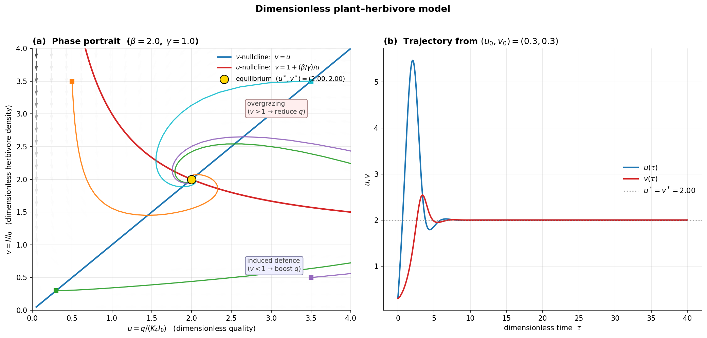

# 2021 期中 Problem 1 — 植物–食草者連續模型 (15%)

## 原題(完整)

> **Problem 1: (15%) – In-Class Problem**
>
> In this problem we examine a continuous plant-herbivore model. We shall define $q$ as the chemical rate of the plant. Low values of $q$ mean that the plant is toxic; higher values mean that the herbivores derive some nutritious value from it. Consider a situation in which plant quality is **enhanced** when the vegetation is subjected to a **low to moderate** level of herbivory, and **declines** when herbivory is **extensive**. Assume that herbivores whose density is $I$ are small insects (such as **scale bugs**) that attach themselves to one plant for long periods of time. Further assume that their growth rate depends on the quality of the vegetation they consume.
>
> Typical equations that have been suggested for such a system are
>
> $$
> \frac{dq}{dt} = K_1 - K_2\,q\,(I - I_0)
> $$
>
> $$
> \frac{dI}{dt} = K_3\,I\,\left(1 - \frac{K_4 I}{q}\right)
> $$
>
> 1. Explain the equations, and suggest possible meanings for $K_1, K_2, I_0, K_3,$ and $K_4$.
> 2. Derive the above differential equations into **dimensionless form**. Determine the new parameters in terms of original parameters.

---

## 1. 先用「人話」讀方程式 (verbal first)

### 1.1 第一條:植物品質 $q$ 的變動

$$
\underbrace{\frac{dq}{dt}}_{\text{品質的變化}} = \underbrace{K_1}_{\text{內生補充}} \;-\; \underbrace{K_2\,q\,(I - I_0)}_{\text{食草交互作用項}}
$$

- $K_1$:**常數補充**,可以想成「植物本身一直在合成防禦化合物 / 累積糖分」,跟食草者無關 → **品質的基線輸入**。
- $K_2\,q\,(I - I_0)$:這項的**正負號取決於 $I$ 和 $I_0$ 的大小**。
  - 當 $I < I_0$(食草壓力低於閾值)→ 整項 < 0 ,但**前面有負號**,所以**整體效應是讓 $q$ 上升**。
    - 生物學上叫 **induced response / 誘導防禦反應**:植物被輕咬一下,反而會分泌更多次級代謝物。
  - 當 $I > I_0$(食草壓力大)→ 整項 > 0 ,**讓 $q$ 下降**。
    - 過度啃食消耗植物資源,品質下滑。
  - 之所以乘上 $q$,是因為**改變的速率與「現有品質」成正比**(消化現有化合物的反應、或合成基於現有底物的物質)。
- $I_0$:**「適度食草」的臨界密度**。低於這個密度,食草是好事;高於這個密度,食草是壞事。

### 1.2 第二條:食草者數量 $I$ 的變動

$$
\frac{dI}{dt} = K_3\,I\,\left(1 - \frac{K_4 I}{q}\right)
$$

把它跟標準 **logistic** 方程比一下(見 [04-量化建模I §4.3.7](../../redesigned/04-量化建模I.md)):

$$
\frac{dN}{dt} = r N \left(1 - \frac{N}{K}\right)
$$

對應關係很清楚:**$K_3 \leftrightarrow r$**(內生繁殖率),**有效承載力 $K_{\text{eff}} = q/K_4$**——食草者的「上限」**不是常數**,而是**正比於當下的植物品質 $q$**。

- $K_3$:食草者在資源無限時的內生增長率 $[1/\text{time}]$。
- $K_4$:**「每單位品質可以養多少蟲」的倒數**——換句話說,**養活一隻蟲需要多少品質**。
  - $K_4$ 越大 → 食草者越「挑剔」、需要越多品質才能存活。
  - 在平衡時 $I = q/K_4$,所以 $K_4 = q/I$ = 每隻蟲攤到的品質。

### 1.3 五個參數一覽

| 符號 | 含義 | 量綱 |
|---|---|---|
| $K_1$ | 植物品質的基線補充率 | $[q]/[t]$ |
| $K_2$ | 食草-品質交互作用係數 | $1/([t]\cdot[I])$ |
| $I_0$ | 食草臨界密度(induced/overgrazed 分界) | $[I]$ |
| $K_3$ | 食草者內生增長率(logistic 的 $r$) | $1/[t]$ |
| $K_4$ | 每隻食草者所需的「品質量」 | $[q]/[I]$ |

> **單位是否一致(§3.4 第 9 條)?** 量綱檢查見表;每一項在自己的方程式中都對得上,這是 §5.2.1 的單位檢查例行公事——我們現在做了一遍。

---

## 2. 為什麼要無因次化?(先講 why,再講 how)

原方程有 **5 個參數**($K_1, K_2, I_0, K_3, K_4$)。**「5 個參數」聽起來很多** — 想做掃描(parameter sweep)時要試很多組合,做出來的圖也難以詮釋。

**π 定理**([05-量化建模II §5.2.3](../../redesigned/05-量化建模II.md#523-無因次化non-dimensionalization))告訴我們:**$P$ 個參數、$D$ 個獨立量綱單位 → 可化簡到 $P - D$ 個無因次群**。

這裡:
- 5 個參數
- 3 個獨立量綱:$[t]$、 $[q]$、 $[I]$
- → **理論上只剩 $5 - 3 = 2$ 個無因次參數**

從 5 個壓到 2 個,**整個參數空間從 5D 變 2D**。畫圖、做穩定性分析、跟別人比較都容易得多。

---

## 3. 動手無因次化

**核心想法**:**為每個變數選一個「自然尺度」**,然後用這個尺度當新單位。

### 3.1 選尺度

| 變數 | 選的尺度 | 理由 |
|---|---|---|
| $t$ | $1/K_3$ | 食草者內生增長率的「時間單位」,自然得很 |
| $I$ | $I_0$ | 題目本身就給了一個臨界密度,**它就是天然的尺度** |
| $q$ | $K_4 I_0$ | 在平衡時 $I = q/K_4$,代回去 $q = K_4 I$,當 $I \sim I_0$ 時 $q \sim K_4 I_0$ — 這是 logistic 邏輯下「對應 $I_0$ 的品質」 |

定義新變數:

$$
\tau \equiv K_3\, t,\qquad v \equiv \frac{I}{I_0},\qquad u \equiv \frac{q}{K_4 I_0}
$$

### 3.2 代回方程式

**對 $v$**(比較容易,先做):

$$
\frac{dI}{dt} = I_0 \cdot K_3 \cdot \frac{dv}{d\tau}
$$

代入原式:

$$
I_0 K_3 \frac{dv}{d\tau} = K_3 (I_0 v)\left(1 - \frac{K_4 (I_0 v)}{K_4 I_0 u}\right) = K_3 I_0 v \left(1 - \frac{v}{u}\right)
$$

兩邊除掉 $K_3 I_0$:

$$
\boxed{\;\frac{dv}{d\tau} = v\left(1 - \frac{v}{u}\right)\;}
$$

——**完全沒有剩下任何參數**。

**對 $u$**:

$$
\frac{dq}{dt} = K_4 I_0 \cdot K_3 \cdot \frac{du}{d\tau}
$$

代入原式:

$$
K_3 K_4 I_0 \frac{du}{d\tau} = K_1 - K_2 (K_4 I_0 u)(I_0 v - I_0) = K_1 - K_2 K_4 I_0^2\, u\,(v-1)
$$

兩邊除以 $K_3 K_4 I_0$:

$$
\frac{du}{d\tau} = \underbrace{\frac{K_1}{K_3 K_4 I_0}}_{\equiv\,\beta} \;-\; \underbrace{\frac{K_2 I_0}{K_3}}_{\equiv\,\gamma}\, u\,(v-1)
$$

$$
\boxed{\;\frac{du}{d\tau} = \beta - \gamma\, u\,(v-1)\;}
$$

### 3.3 結果

| 無因次參數 | 用原參數表示 | 物理意義 |
|---|---|---|
| $\beta$ | $\dfrac{K_1}{K_3 K_4 I_0}$ | 「品質基線補充」相對於「養活臨界食草者數量所需的合成量」的比 |
| $\gamma$ | $\dfrac{K_2 I_0}{K_3}$ | 「食草-品質交互作用」相對於「食草者內生時間」的比 |

從 5 個變到 2 個,**確認 π 定理的預測 $5 - 3 = 2$**。

---

## 4. 對無因次模型的快速分析(看圖最快)

無因次方程組是:

$$
\frac{du}{d\tau} = \beta - \gamma\, u\,(v-1),\qquad \frac{dv}{d\tau} = v\left(1 - \frac{v}{u}\right)
$$

### 4.1 平衡點(§9.3.1)

設兩個導數同時 $= 0$:

- $\dfrac{dv}{d\tau} = 0$ → $v = 0$ 或 $v = u$。
- 取**非零解** $v = u$,代入 $\dfrac{du}{d\tau} = 0$:
  $$
  \beta = \gamma\, u\,(u - 1) \;\Rightarrow\; \gamma\, u^2 - \gamma\, u - \beta = 0
  $$
  $$
  u^* = \frac{1 + \sqrt{1 + 4\beta/\gamma}}{2},\qquad v^* = u^*.
  $$

**直觀**:$u^* > 1$(食草者超過閾值 $I_0$)→ 在 induced/overgrazed 的分界**右邊**。注意這裡 $u^* > 1$ 對應 $I^* > I_0$,**也就是說平衡時 $v-1 > 0$,品質的「交互作用項」是負的**——是品質的拉力。基線補充 $\beta$ 剛好抵消這個拉力,維持穩定。

### 4.2 Nullclines(§9.3.3)

- **$v$-nullcline**($dv/d\tau = 0$):$v = u$(45° 線)和 $v = 0$ 軸。
- **$u$-nullcline**($du/d\tau = 0$):$u(v-1) = \beta/\gamma$,在 $v > 1$ 區域是雙曲線形狀的曲線。

兩條 nullcline 的交點即為 $(u^*, v^*)$。

### 4.3 步入平衡的時序(time evolution)

從不同初值開始,$u, v$ 都會收斂到 $(u^*, v^*)$ — 為穩定螺旋(複根)或穩定節點(實根),取決於 $(\beta, \gamma)$ 是否讓 Jacobian 的判別式 $< 0$。



> 圖由 [`analyze_edu.py`](./analyze_edu.py) 產出(英文乾淨版,附詳細教學註解);中文版 `fig1_phase_portrait.png` 與 `fig2_time_series.png` 由原始腳本產出。

---

## 5. 對照講義(我用了哪些章節)

| 題目要素 | 講義來源 |
|---|---|
| Logistic 形式($r, K$) → $K_3, q/K_4$ 對應 | [04-量化建模I.md §4.3.7](../../redesigned/04-量化建模I.md) |
| 單位檢查 | [05-量化建模II.md §5.2.1](../../redesigned/05-量化建模II.md) |
| 無因次化 + π 定理 | [05-量化建模II.md §5.2.3](../../redesigned/05-量化建模II.md) |
| 平衡點 | [09-模型分析.md §9.3.1](../../redesigned/09-模型分析.md) |
| Nullclines | [09-模型分析.md §9.3.3](../../redesigned/09-模型分析.md) |

---

## 6. 課堂答題建議

1. **第 1 小題先說「生物意義」再說「數學意義」**——閱卷者最在乎你會不會把「induced defense」這個故事抓出來,把 $I_0$ 那條臨界線講清楚。
2. **無因次化挑尺度時,先看「題目本身有沒有送你尺度」**——$I_0$ 就是天上掉下來的,$1/K_3$ 也是很自然的時間單位。剩下 $q$ 的尺度從 logistic 對應($q = K_4 I$)推一下就出來。
3. **檢查 π 定理數對不對**:5 個參數 - 3 個量綱 = 2 個無因次參數。**寫到答案紙上**——加分點。
4. **如果有時間**,把平衡點 $(u^*, v^*)$ 算出來,$\gamma u^2 - \gamma u - \beta = 0$ 是一行的二次方程。

---

## 附錄:重現圖檔

```bash
conda activate data__env  # or: conda activate bsma-pdf
cd example-questions/2021-p1-plant-herbivore

# 原始版(中文標籤)
python fig1_phase_portrait.py    # → fig1_phase_portrait.png
python fig2_time_series.py       # → fig2_time_series.png

# 教育版(英文乾淨圖,phase portrait + 時序合併;逐行教學註解)
python analyze_edu.py            # → fig1_phase_portrait_clean.png
```

**何時用哪一個**:
- **原始版** — 中文標籤,最簡可用程式碼參考。
- **`analyze_edu.py`** — 想了解「**為什麼**這樣寫」(為何挑 β=2, γ=1 當代表參數、向量場為何要正規化箭頭、軌跡 IC 為何挑四個角落、`max_step=0.1` 對畫圖平滑度的影響)。**初值的關鍵教學**:模型參數初值 (β, γ) 跟軌跡狀態初值 (u₀, v₀) 兩種「初值」都要分開談。
