# 第一課:系統、模型,與建模

什麼是「模型」?為什麼科學家、工程師、做天氣預報的人,都離不開模型?
這一課,我們從最基本的定義開始,一步一步建立起「建模」這件事的全貌。

## 課程綱要

- 1.1 系統、模型、與建模
- 1.2 科學模型的用途
- 1.3 範例:島嶼生物地理學
- 1.4 模型的分類
- 1.5 模型結構的限制
- 1.6 重要名詞
- 1.7 模型的誤用

---

## 1.1 系統、模型、與建模

我們先把四個最基本的概念說清楚:

- **物件 (object)**:可以被觀察的最小單位。它的內部結構要嘛不存在,要嘛我們**故意忽略**。
  舉例:研究「一座池塘」時,池塘裡的每隻青蛙是一個物件——我們不深究青蛙體內的細胞。
- **系統 (system)**:由「會互相影響」的物件組成的集合。
  舉例:「池塘」是一個系統,裡面有青蛙、水草、蜻蜓、水……它們之間有關係(青蛙吃蜻蜓、蜻蜓需要水草、水草需要陽光……)。
- **描述 (description)**:一段「能被人類解讀」的訊號——可能是文字、是圖、是公式。
- **模型 (model)**:對一個系統的描述。

一句話總結:**模型就是讓我們可以「談論」一個系統的工具。**

下圖把這四個概念與彼此的關係畫出來:

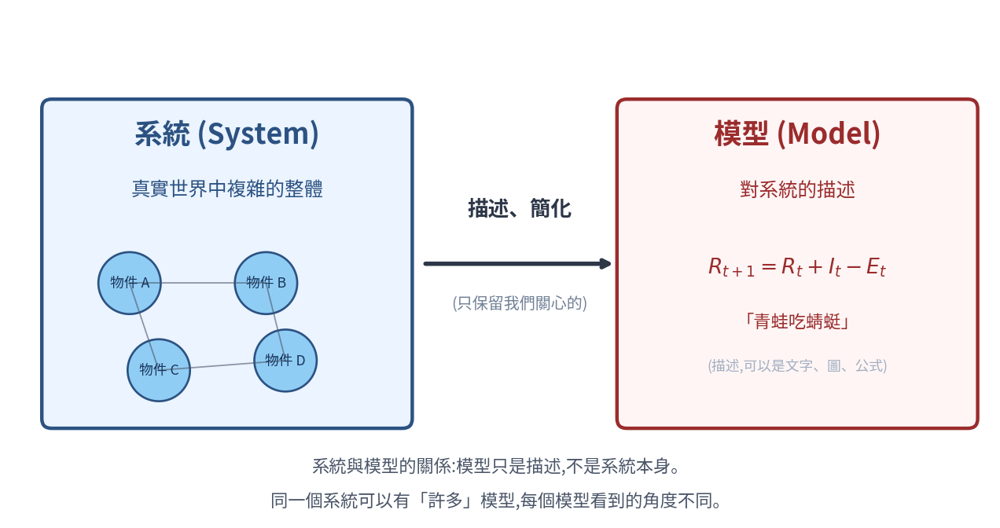

注意兩個重點:

1. **從系統到模型,只有單方向**——我們從觀察系統得到模型;模型不會反過來改變系統(改變的是我們**對系統的理解**)。
2. **同一個系統可以有許多模型**——每個模型只看到一個面向。下面的故事說明了這一點。

### 為什麼需要模型——六位盲人的故事

從前有六位盲人,從沒見過大象。他們各自去摸:

- 摸到鼻子 → 「大象像水管」
- 摸到象牙 → 「大象像長矛」
- 摸到耳朵 → 「大象像扇子」
- 摸到腿  → 「大象像樹幹」
- 摸到身體 → 「大象像牆」
- 摸到尾巴 → 「大象像繩子」

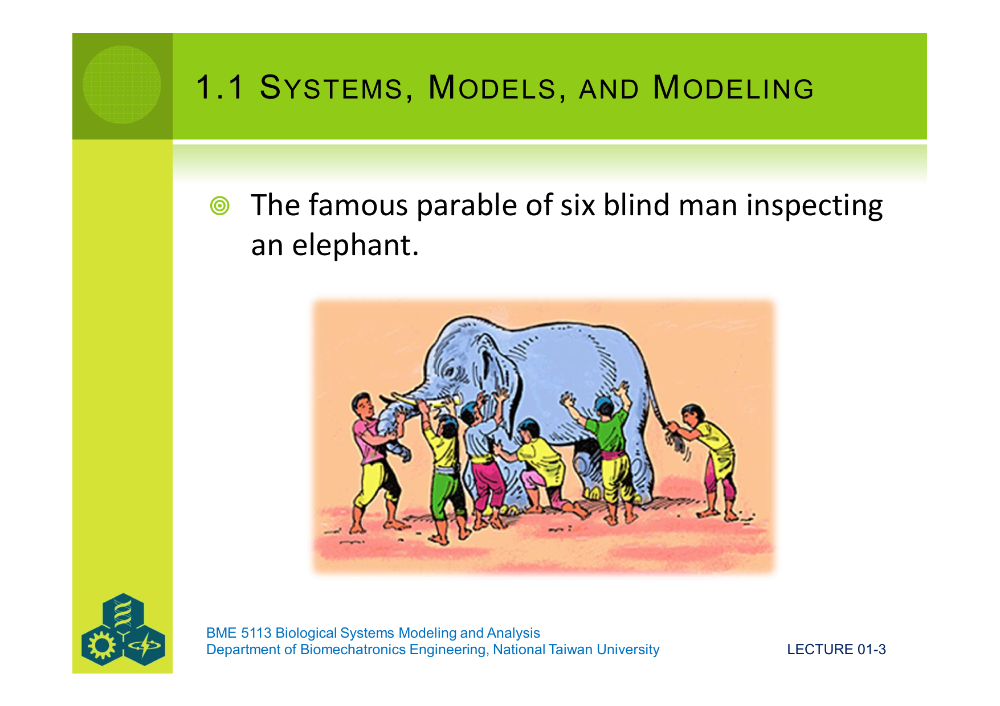

**每個人說的都是真的,但每個人手上的「模型」都不完整。**

這故事告訴我們一件重要的事:

> **任何一個模型,都只能描述系統的某個面向,絕對不會是完整的真實。**
> 但即使如此,一個好的模型仍然能幫助我們做有用的事——只要我們**知道它的侷限**。

如果六位盲人能**把彼此的描述放在一起**,他們就能拼出一隻更完整的大象。
科學研究也是這樣:不同的模型描述同一個系統的不同角度,**合在一起**才接近真實。

---

## 1.2 科學模型的用途

> 「Modeler 是一個把『假設』變成『結論』的裝置。」  — Schimel (2002)

科學上使用模型,有三個主要的用途:

| 用途 | 想回答的問題 |
|---|---|
| **理解 (Understanding)** | 為什麼這個系統會這樣? |
| **預測 (Prediction)** | 以後會發生什麼?(或現在我不知道的部分是什麼?) |
| **控制 (Control)** | 我要怎麼改變這個系統,讓它變成我想要的樣子? |

這三個用途不是同一回事。**我們做模型前必須先想清楚:「我這個模型是為了理解、預測、還是控制?」** 不同目的,模型會長得很不一樣。

### Karplus 的綜合 / 分析 / 儀器設計框架

物理學家 W. J. Karplus(1983)把這三種用途整理成一個簡單框架。
設一個系統可以畫成:

```
   E ──→ [ S ] ──→ R
   輸入     系統     輸出
```

- **輸入 $E$**:從外面進入系統的東西(刺激、能量、訊號)
- **系統 $S$**:系統內部的構造與規則
- **輸出 $R$**:系統送出來的反應、結果

依「我們已知什麼、想找出什麼」,有三種問題類型,對應三種模型用途:

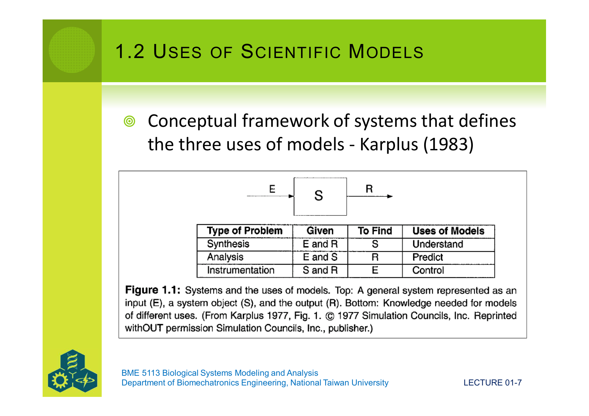

| 問題類型 | 我們已知 | 我們要找 | 對應用途 |
|---|---|---|---|
| **綜合 (Synthesis)** | $E$、$R$ | $S$ | 理解(從輸入輸出反推內部) |
| **分析 (Analysis)** | $E$、$S$ | $R$ | 預測(從系統與刺激算出反應) |
| **儀器設計 (Instrumentation)** | $S$、$R$ | $E$ | 控制(系統與目標已知,設計輸入) |

舉例:

- 看到病人發燒,推測身體哪裡出了問題 → **綜合**
- 知道明天颱風的路徑,推測台北的降雨量 → **分析**
- 想讓教室裡的二氧化碳維持低濃度,決定通風口要開多大 → **儀器設計**

### 模型的次要用途

模型在科學社群中,還有幾個比較不那麼「技術」的用途,但同樣重要:

1. **整理研究**:作為設計實驗、決定樣本、分配研究經費的依據。
2. **濃縮資料**:用簡單公式取代一大堆資料——例如線性回歸 $y = mx + b$,只用兩個參數 $m$、$b$ 就能描述所有 $x$–$y$ 對應。
3. **找出我們不懂的地方**:特別是物件之間的關係——例如:「物種 A 真的會吃物種 B 嗎?」如果模型需要這個關係但我們不確定,就知道下一步研究要做什麼。
4. **What-if 模擬**:讓決策者「玩」一下——「如果我們做了 X,會發生什麼?」

---

## 1.3 範例:島嶼生物地理學

我們現在用一個真實的研究例子,把上面的概念串起來:**一座海島上,會住幾種動物?**

### 真實情境

1969 年,生態學家 Simberloff 和 Wilson 做了一個有名的實驗。他們把佛羅里達州海邊一座小紅樹林島上的「所有節肢動物」清空(用煙燻),然後觀察:**物種會以怎樣的方式回到島上?**

實驗結果就是原講義的圖 1.2:

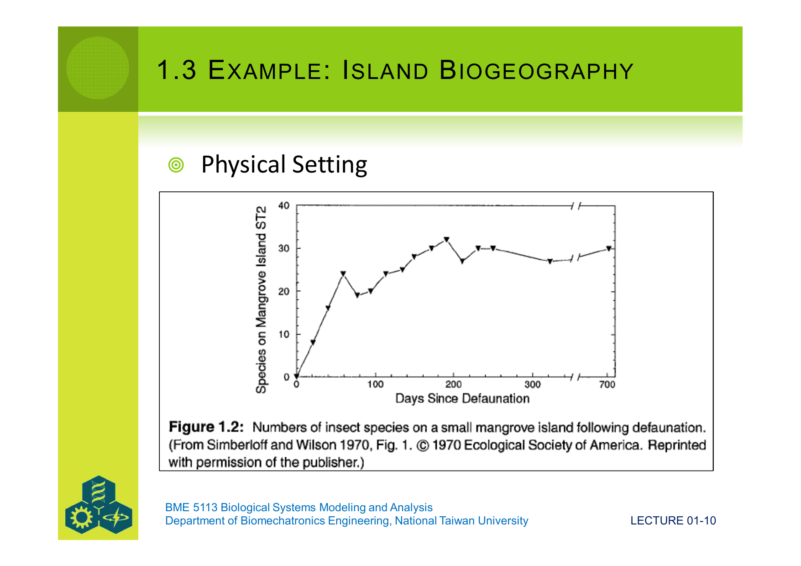

可以清楚看到三件事:

1. 一開始,島上的物種數從 0 上升;
2. 上升速度越來越慢;
3. 大約 200 天後,**停在某個數字**——既不再上升,也不下降。

問題來了:**為什麼會「停在某個數字」?那個數字是什麼?可以預測嗎?**

### 物理場景與直覺

實驗的物理場景如下圖:大陸是一個固定的「物種池」(裡面有 A、B、C、D、E、F……共 $P$ 種),這些物種以一定機率往外飛、漂、跳。離大陸近的島接收到的會多,遠的少;大島能容納的多,小島少。

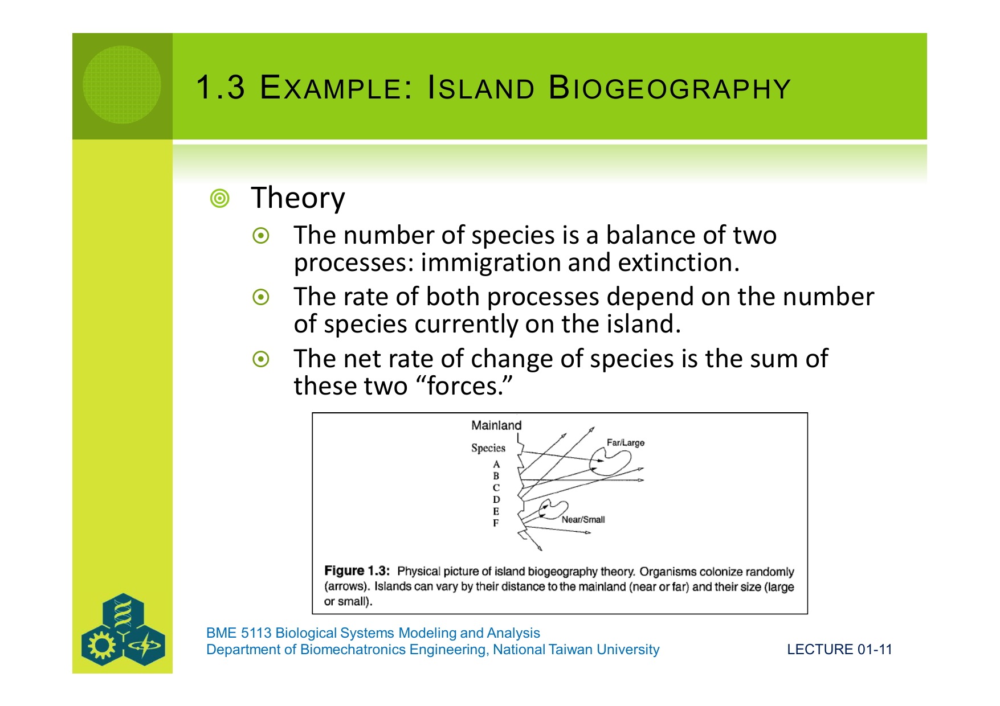

### 理論

科學家提出一個簡單的想法:島上的物種數,是**兩個過程平衡**的結果——

- **遷入 (Immigration)**:從大陸來的新物種飛過來、漂過來。
- **滅絕 (Extinction)**:島上原本有的物種,個體全部死光、消失。

也就是:

> 島上物種數的淨變化率 = 遷入率 − 滅絕率

關鍵的地方是:**這兩個率,都會隨著「島上現在有幾種」而變**。

### 生物學假設

科學家提出兩個假設來具體化:

**假設 1(關於遷入)**:每一個個體都有一個固定的機率從大陸飛來島上,所有物種、所有個體相同。
但**只有當這個個體屬於一個「島上還沒有的物種」時,才算是新遷入**。

**假設 2(關於滅絕)**:每一個物種,在任何時刻,都有一個固定的滅絕機率。

接下來最重要的步驟——**先用直覺想出兩個率怎麼變,再寫出公式**。

### 從直覺到圖形——先想清楚變化的方向

#### 遷入率 $I$ 為什麼會隨 $R$ 上升而**下降**?

大陸上共有 $P$ 種物種。
- 如果**島上一種都沒有**($R = 0$):整個 $P$ 種對島來說「都還沒到過」,任何一種飛過來都算新遷入,遷入率**最大**。
- 如果**島上已經有 $R$ 種**:大陸還剩下 $P - R$ 種「對島來說是新的」。其他已經在島上的 $R$ 種,即使飛過來也**不算新遷入**(假設 1 的後半句)。
- 如果**島上把大陸的物種全裝下了**($R = P$):大陸上再沒有「新物種」可以遷入,遷入率 = $0$。

所以:**遷入率隨 $R$ 從 $0$ 上升到 $P$,從最大值線性下降到 $0$**。

#### 滅絕率 $E$ 為什麼會隨 $R$ 上升而**上升**?

由假設 2,**每一個**物種有固定的滅絕機率。
- 如果**島上一種都沒有**($R = 0$):沒有東西可以滅絕,滅絕率 = $0$。
- 如果**島上有 $R$ 種**:每一種都有可能滅絕,所以「某一種剛好滅絕」的總機率,就會跟 $R$ 成正比。
- 如果**島上裝滿了**($R = P$):滅絕率達到最大值。

所以:**滅絕率隨 $R$ 從 $0$ 上升到 $P$,從 $0$ 線性上升到最大值**。

把這兩個直覺畫出來,就是原講義的圖 1.4:

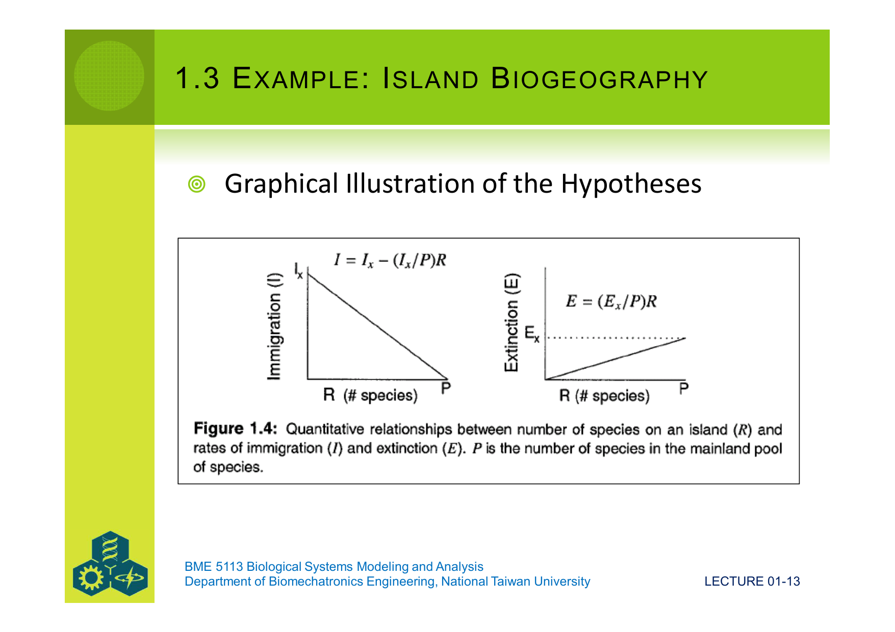

### 把直覺轉成公式——一個一個拆給你看

現在我們知道「方向」了,接下來才把它寫成式子。先定義符號:

- $R$ = 島上目前的物種數
- $P$ = 大陸物種池的總物種數
- $I_x$ = 「最大遷入率」(島上一種都沒有時的遷入率,$R = 0$)
- $E_x$ = 「最大滅絕率」(島上滿了時的滅絕率,$R = P$)

#### 推導遷入率公式

從上面的直覺,當島上有 $R$ 種時,**大陸還剩 $P - R$ 種能造成新遷入**。
也就是說,「能造成遷入的物種比例」是 $\dfrac{P - R}{P}$。

如果「最大可能的遷入率」是 $I_x$(發生在比例 = 1 的時候),那麼一般情況下:

$$
I \;=\; I_x \cdot \underbrace{\frac{P - R}{P}}_{\text{能造成遷入的比例}} \;=\; I_x \cdot \left(1 - \frac{R}{P}\right)
$$

把括號展開:

$$
\boxed{\;I \;=\; I_x \;-\; \frac{I_x}{P}\,R\;}
$$

看清楚這個式子的兩個部分:

| 項 | 意義 |
|---|---|
| $I_x$ | $R = 0$ 時的遷入率(最大值)——這條直線的 **y 截距** |
| $-\dfrac{I_x}{P}\,R$ | $R$ 每增加 1,遷入率就減少 $\dfrac{I_x}{P}$ ——這條直線的**斜率** |

驗證一下兩個極端:
- $R = 0$:$I = I_x - 0 = I_x$ ✓
- $R = P$:$I = I_x - \dfrac{I_x}{P} \cdot P = I_x - I_x = 0$ ✓

#### 推導滅絕率公式

從直覺,**島上的物種越多,「某一個物種剛好滅絕」的總機率就越高**。
這個總機率跟 $R$ 成正比。比例常數是 $\dfrac{E_x}{P}$(由「$R = P$ 時 $E = E_x$」這個條件決定)。

$$
\boxed{\;E \;=\; \frac{E_x}{P}\,R\;}
$$

驗證:
- $R = 0$:$E = 0$ ✓
- $R = P$:$E = \dfrac{E_x}{P} \cdot P = E_x$ ✓

### 把兩個率組成一個「動態方程式」

用下標 $t$ 表示「第 $t$ 個時間點」(例如:第 $t$ 天)。**下一個時間點**的物種數,等於現在的物種數,加上這段時間進來的,減掉這段時間消失的:

$$
R_{t+1} \;=\; R_t \;+\; I_t \;-\; E_t
$$

把上面兩個式子代進來:

$$
\boxed{\;R_{t+1} \;=\; R_t \;+\; \underbrace{\left( I_x - \frac{I_x}{P} R_t \right)}_{I_t} \;-\; \underbrace{\frac{E_x}{P} R_t}_{E_t}\;} \qquad (\text{式 1.1})
$$

這就是一個**動態模型** (dynamic model)——給定現在的 $R_t$,我們可以算出下一個時刻的 $R_{t+1}$;再用 $R_{t+1}$ 算出 $R_{t+2}$,一步一步推到未來。

### 用真實資料估出來的版本

Simberloff 和 Wilson 用實驗資料做迴歸分析,得到一個用具體數字的版本:

$$
R_{t+1} \;=\; R_t \;+\; (8.963 - 0.359\, R_t) \;-\; (0.011 + 0.0656\, R_t) \qquad (\text{式 1.2})
$$

對照式 1.1 可以看出每一項對應的物理意義:

| 式 1.2 的項 | 對應式 1.1 的 | 意義 |
|---|---|---|
| $8.963$ | $I_x$ | 最大遷入率 ≈ 8.963 種/單位時間 |
| $0.359$ | $\dfrac{I_x}{P}$ | 由此可推估 $P \approx 8.963 / 0.359 \approx 25$ 種 |
| $0.011$ | (誤差截距) | 觀測誤差——理論上應該是 0,但實驗資料總會有偏差 |
| $0.0656$ | $\dfrac{E_x}{P}$ | 由此可推估 $E_x \approx 0.0656 \times 25 \approx 1.64$ 種/單位時間 |

下圖是 Simberloff–Wilson 的實驗結果(圖 1.5)。左圖 (a) 是用觀察到的遷入率(實心菱形)與滅絕率(空心圓)畫的散布圖,以及做迴歸後的兩條直線——這正是上面圖 1.4 那兩條直線的「真實版本」。右圖 (b) 是把式 1.2 一步一步迭代,得到的物種數隨時間變化曲線,跟實際觀察(方塊)很吻合。

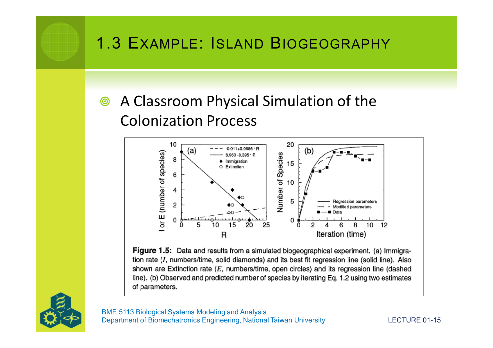

### 平衡點的計算

我們在實驗資料(圖 1.2)中看到「停在某個數字」的現象。這個「某個數字」就是**平衡物種數** $\hat{R}$。

平衡的定義:**物種數不再變化**,也就是 $R_{t+1} = R_t$。
把式 1.1 套用這個條件,$R_t$ 被約掉:

$$
R_t = R_t + I_t - E_t \;\;\Longrightarrow\;\; I_t = E_t
$$

也就是說,**平衡點就是兩條曲線交叉的地方**(遷入率 = 滅絕率)。把遷入率與滅絕率的公式代入:

$$
I_x - \frac{I_x}{P} \hat{R} \;=\; \frac{E_x}{P} \hat{R}
$$

把含 $\hat{R}$ 的項移到右邊:

$$
I_x \;=\; \frac{I_x}{P} \hat{R} + \frac{E_x}{P} \hat{R} \;=\; \frac{I_x + E_x}{P} \hat{R}
$$

兩邊同乘 $\dfrac{P}{I_x + E_x}$,解出 $\hat{R}$:

$$
\boxed{\;\hat{R} \;=\; \frac{I_x \cdot P}{I_x + E_x}\;}
$$

這就是**平衡時的物種數**。給定 $I_x$、$E_x$、$P$,我們就能預測:「這座島最後會穩定在幾種?」

下面的圖把這個結構畫得更清楚:藍線是遷入率(從 $I_x$ 往下降),紅線是滅絕率(從 0 往上升),兩條線交叉的點就是平衡點 $\hat{R}$。左邊綠色區域:$I > E$,物種數**會增加**;右邊橘色區域:$I < E$,物種數**會減少**——所以系統會「自動」朝平衡點靠近。

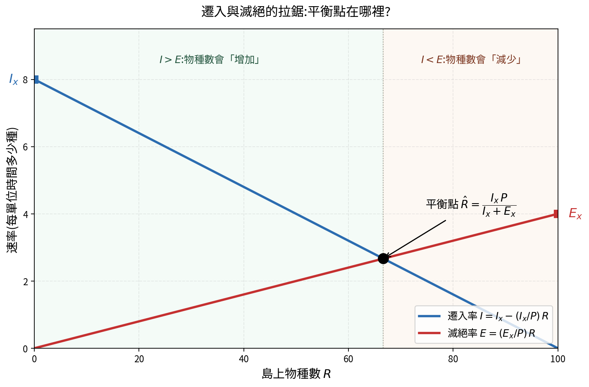

### 這段示範了「建模」的精神

從兩個生物學假設(遷入與滅絕的兩個簡單規則),我們:

1. **先用直覺**推出「方向」——遷入率隨 $R$ 下降、滅絕率隨 $R$ 上升;
2. **再用兩個極端條件**($R = 0$ 與 $R = P$)決定線性關係的截距與斜率;
3. **再寫成公式**——式 1.1;
4. **再用實驗資料**對照,得到具體數字版——式 1.2;
5. **再做數學分析**——解出平衡點 $\hat{R}$。

這五步,就是「建模」的核心流程。後面幾課會把它正式化。

---

## 1.4 模型的分類

模型可以用幾種不同的方式來分類。

### 1.4.1 模型的「形式」

依「長相」分,有四種:

1. **概念/語言模型 (Conceptual / Verbal)**:用自然語言描述。
   例:「青蛙吃蜻蜓,蜻蜓需要水草,水草需要陽光。」
2. **圖形模型 (Diagrammatic)**:用圖示表達物件與關係。
   例:生態學的「箱─箭頭圖」、生化學的克氏循環(Krebs cycle)代謝路徑圖。
3. **實體模型 (Physical)**:做一個真實尺寸縮放的物理模型。
   例:DNA 的「Tinker-toy」分子模型、風洞用的縮小飛機模型。
4. **形式模型 (Formal)**:用數學表達(代數方程式、微分方程式等)。
   式 1.1 就是一個形式模型。

### 1.4.2 數學分類——五個問題

當模型屬於「形式模型」時,還可以再問五個是非題:

**問題 1:模型是否明確表達「機制」?**
- 是 → **機制模型 (Mechanistic)**。例:用牛頓力學與化學定律建立的水文模型。
- 否 → **描述模型 (Phenomenological)**。例:島嶼生物地理學模型——它沒有解釋「為什麼一個物種會滅絕」,只描述率隨 $R$ 變化的樣子。

**問題 2:模型是否明確表達「未來」狀態?**
- 是 → **動態模型 (Dynamic)**。式 1.1 是動態的(會算下一個時刻)。
- 否 → **靜態模型 (Static)**。例:線性回歸 $y = mx + b$——給 $x$ 直接算 $y$,沒有時間概念。

**問題 3:時間是「連續」還是「離散」?**
- 連續 → 時間可以是任何實數(3.3 秒、3.14 秒……),用**微分方程式**表達。
- 離散 → 時間只能是整數,用**差分方程式**表達。式 1.1 是離散的(看 $t$ 與 $t+1$)。

**問題 4:模型是否明確表達「空間」?**
- 是 → **空間異質模型 (Spatially heterogeneous)**:物件有位置,或佔據一塊空間。
  又分:**離散空間**(把空間切成格子)、**連續空間**(每個點都不同,如物理的擴散方程式)。
- 否 → **空間同質模型 (Spatially homogeneous)**:不關心位置。式 1.1 屬於這類——它沒講「這個物種在島的哪一角」。

**問題 5:模型允許「隨機事件」嗎?**
- 是 → **隨機模型 (Stochastic)**。例:把溫度視為隨機變數,進而讓族群增長率也是隨機的。
- 否 → **確定模型 (Deterministic)**:所有參數都是常數,輸入相同則輸出相同。式 1.1 屬於這類。

**綜合結論**:島嶼生物地理學模型(式 1.1)是一個
**確定的、空間同質的、離散時間的、描述性的、動態的**模型。
(請對照五個問題,確認你能說出為什麼每一個分類成立。)

### 1.4.3 「系統概念」分類

依物件與物件之間的關係怎麼處理,還可以分:

1. **隔室模型 (Compartment model)**:把系統切成幾個「隔室」(如:水庫、族群、年齡層),用差分或微分方程式描述各隔室之間的流。
2. **傳輸模型 (Transport model)**:用偏微分方程式,描述東西在空間中怎麼移動(如:污染物在河流中擴散)。
3. **粒子模型 (Particle model)**:追蹤每一個個體粒子或生物的命運(個體在空間中移動,或狀態改變)。
4. **有限狀態自動機 (Finite state automata)**:每個物件只能處於少數幾個「狀態」(如:存活/死亡、感染/未感染),依規則切換。

---

## 1.5 模型結構的限制

任何模型都受到三個性質的限制。重點是:**這三個性質不能同時最大化**,建模者必須做取捨。

- **真實性 (Realism)**:模型結構在多大程度上「模仿真實世界」。
  在形式模型中,「真實」指方程式本身正確,不只是輸出對。
  在實體模型中(如縮小飛機),「真實」指物理細節完備——連每一根鉚釘都有。

- **精確性 (Precision)**:模型「預測值」與真實值的接近程度。
  在精確的縮小飛機模型中,風洞裡飛機四周的氣流,跟真實飛機四周的氣流**一模一樣**。
  注意:這裡的精確性**不是**統計學上的精確(variability),而是「輸出對不對」。

- **普遍性 (Generality)**:這個模型能正確套用在多少不同系統上。
  一個普遍的飛機模型,既能套用 Piper Cub 小型單引擎飛機,也能套用 Boeing 747 大型多引擎飛機。

**為什麼不能同時最大化?** 三者之間的拉鋸如下圖:

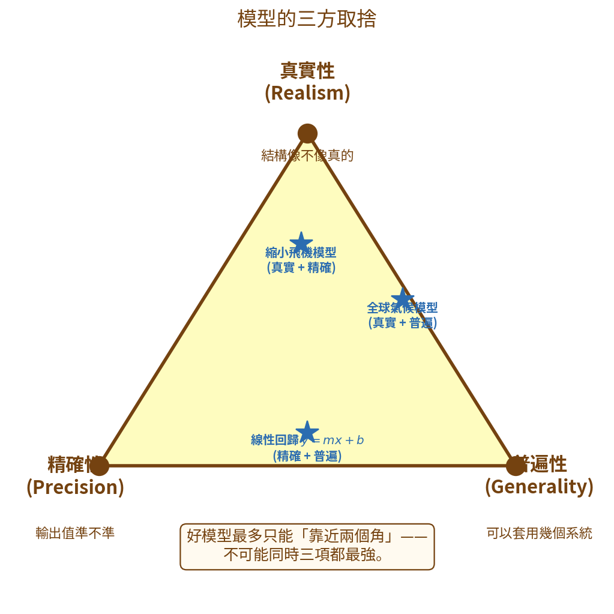

- 越追求**真實** → 模型越複雜 → 越貼著特定系統 → **普遍性下降**。
- 越追求**普遍** → 模型越簡化 → 細節不夠 → **真實性、精確性下降**。
- 越追求**精確** → 通常需要更多參數、更多細節 → **普遍性下降**。

建模者必須**根據用途**決定:在這三者之間怎麼取捨。
例如:做全球氣候模型(預測全球氣溫)就要犧牲一些局部的精確性,換取普遍性;
做某座水壩的洪水預測模型,則寧可犧牲普遍性,換取對這座水壩的高真實性與精確性。

---

## 1.6 重要名詞

下表收錄本課與後續課常用的術語(取自原講義 Table 1.1):

| 名詞 | 定義 |
|---|---|
| **analytical model 解析模型** | 解不是用數值近似或模擬,而是用純數學論證得到的模型;或那些數學性質(如平衡點的穩定性)可以用數學論證的模型。 |
| **dynamic model 動態模型** | 描述系統物件的量(如族群大小)如何隨時間變化的數學模型。 |
| **mathematical model 數學模型** | 一組描述系統的數學方程式。 |
| **mathematical modeling 數學建模** | 「人」建立一組描述系統的數學方程式的活動。 |
| **model 模型** | (a) 名詞:系統的描述;(b) 動詞:建立系統描述的活動。 |
| **objective 目標** | (a) 做某事的目的;(b) 引導與限制建模的語句;(c) 通常包括:要建模的物件與關係、系統環境(會影響的變數、不建模的物件)、模型適用的時間範圍、空間與時間的解析度、要回答的問題。 |
| **simulate 模擬(動詞)** | (a) 對一個模擬模型產生解;(b) 建模。 |
| **simulation 模擬(名詞)** | (a) 一組數字,共同構成模擬模型的數值解;(b) 一次「跑」電腦程式以數值求解模擬模型。 |
| **simulation model 模擬模型** | 解是用數值近似得到的數學模型(通常用電腦),相對於解析模型。 |
| **solution 解** | (a) 對一個問題的答案;(b) 一組能滿足某數學方程式的數值(如多項式方程式的根)。 |
| **system 系統** | 物件以及物件之間的關係構成的集合。 |
| **system state 系統狀態** | 某時刻系統內所有物件的具體數值集合(例:某時刻生態系中所有物種的碳含量)。 |
| **well-defined system 完備系統** | 滿足模型目標所需的「最小」物件與關係集合——沒有任何成員可被證明為不必要的。 |

---

## 1.7 模型的誤用

### Karplus 的「白箱─黑箱」光譜

Karplus(1983)用一條光譜,把不同學科的模型排在一起。光譜的橫軸,代表我們對該系統「了解多深」:

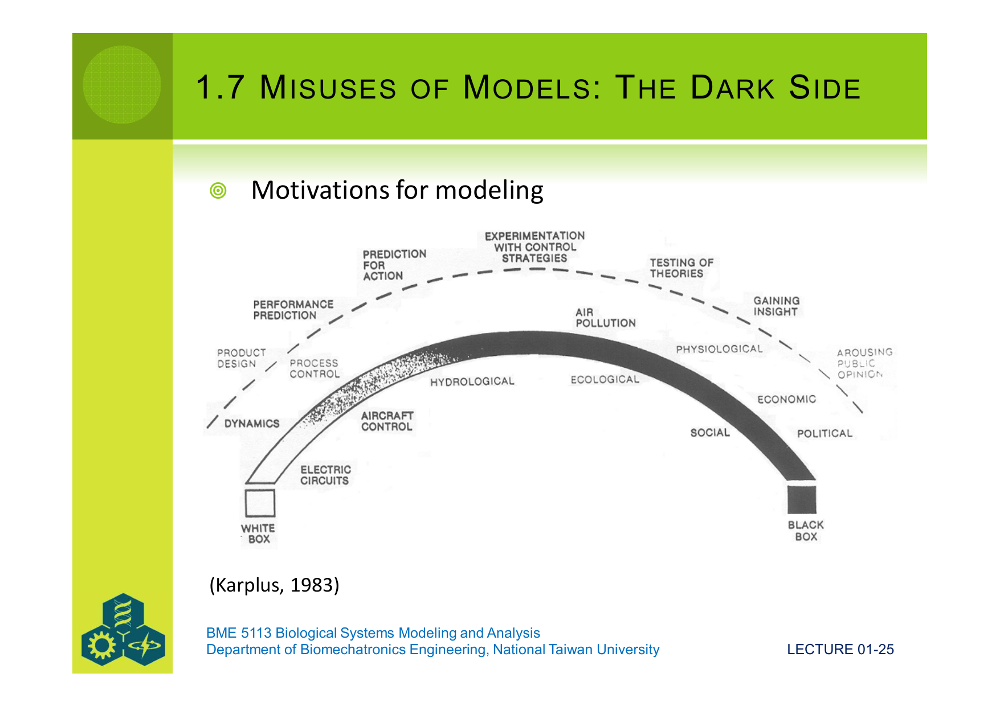

- **白箱 (White Box)**:我們**完全理解**內部機制。
  例:電路、飛機控制、產品設計。
  → 模型可用於**性能預測、流程控制、產品設計**。

- **中間地帶**:理解中等。
  例:水文學、生態學、生理學、空氣污染。
  → 模型可用於**實驗以了解控制策略、預測未來行為**。

- **黑箱 (Black Box)**:我們**幾乎不了解**內部機制,只看得到輸入與輸出。
  例:社會、政治、經濟。
  → 模型主要用於**獲得洞見、檢驗理論、引起公眾注意**。

**關鍵**:我們對系統了解得**越少**,模型**越不應該**被用來做精準預測或控制——它只能用來**探索**或**啟發思考**。

**誤用發生在哪裡?**
把一個「黑箱」系統的模型,當成「白箱」來用——用它做精確預測、據以制定政策。後果是錯誤的決策被「精確的數字」包裝起來,看起來很可信,實際上不可靠。

### 兩個重要的對立

**「白箱」vs「黑箱」**

- 白箱模型寫出方程式時,**每一項都有物理或生物意義**(如式 1.1:遷入項、滅絕項都可以追溯到生物假設)。
- 黑箱模型只是把輸入輸出對應起來,**沒有解釋為什麼**(如純機器學習擬合,輸入 $x$ 得到 $y$,但不知道內部機制)。

**量化模型 vs 質性模型**

- **量化模型 (Quantitative)**:給出具體數字。例:「明天台北氣溫 28°C,降雨機率 70%。」
- **質性模型 (Qualitative)**:給出方向或關係,不給具體數字。例:「砍掉森林,鳥類數量會下降。」

兩種都有價值,但要用對地方:
- 對「白箱」系統,我們有資格做量化模型。
- 對「黑箱」系統,有時候誠實地只給質性結論,比給出假裝精確的數字要好。

### 圖 1.6 的訊息

把模型用途,依「資料品質」(縱軸)與「了解程度」(橫軸)分布:

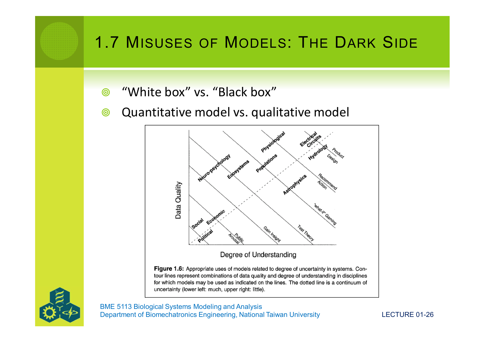

- **左下角**:資料差、了解低 → 模型適合「引起公眾注意」、「獲得洞見」。
- **右上角**:資料好、了解深 → 模型適合「產品設計」、「給出行動建議」。

**這張圖的提醒是**:做模型的人,要先誠實面對自己「資料有多好」與「對系統了解多深」,然後**再**決定:這個模型應該被用來做什麼。

---

## 本課小結

我們在這一課:

- 定義了**系統、物件、模型、描述**;
- 列出了模型的三大用途(**理解、預測、控制**),以及 Karplus 的**綜合 / 分析 / 儀器設計**框架;
- 用**島嶼生物地理學**為例,**從直覺先想出兩個率怎麼變,再寫成公式**,一步一步推出動態方程式(式 1.1),並計算了平衡物種數 $\hat{R} = \dfrac{I_x P}{I_x + E_x}$;
- 用四種形式 × 五個數學問題 × 四種系統概念,把模型分了類;
- 列出**真實性、精確性、普遍性**的三方取捨;
- 用 Karplus 的**白箱─黑箱光譜**提醒:**模型適合的用途,取決於我們對系統的了解**——用錯地方就是誤用。

下一課,我們會深入討論「**建模的步驟**」——拿到一個系統,該怎麼一步一步把模型做出來。
