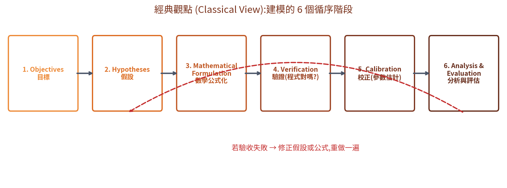
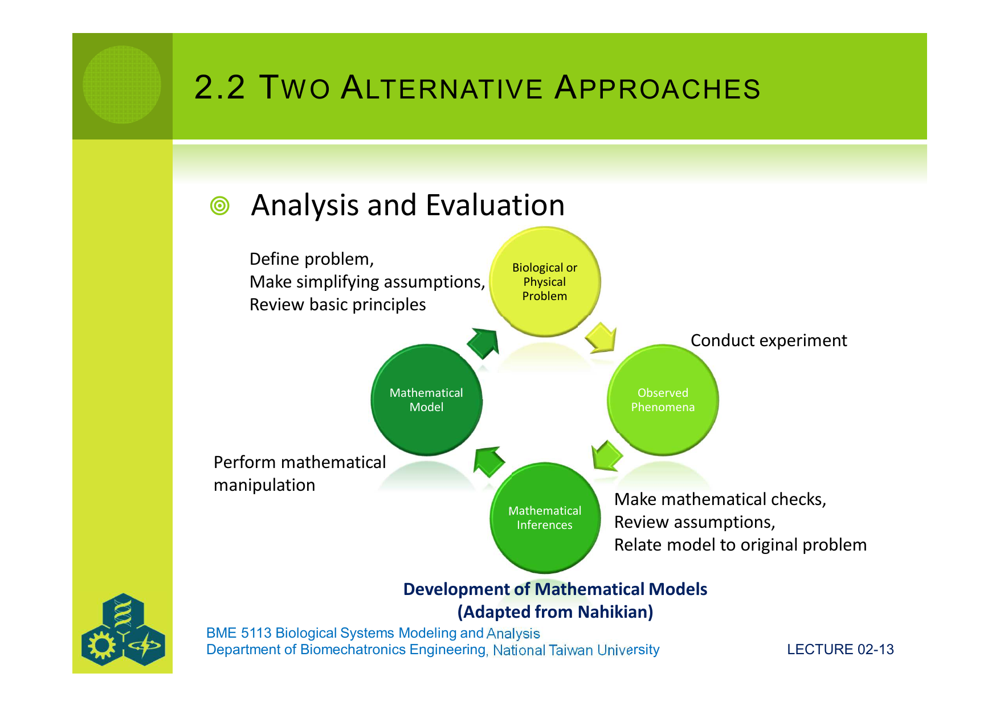
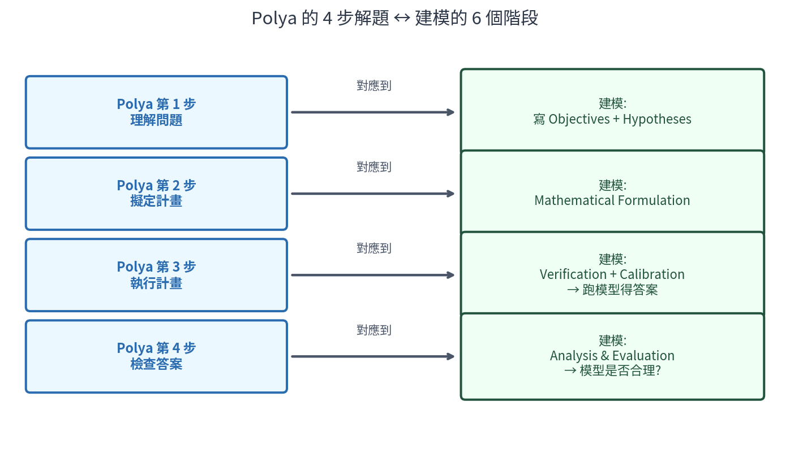
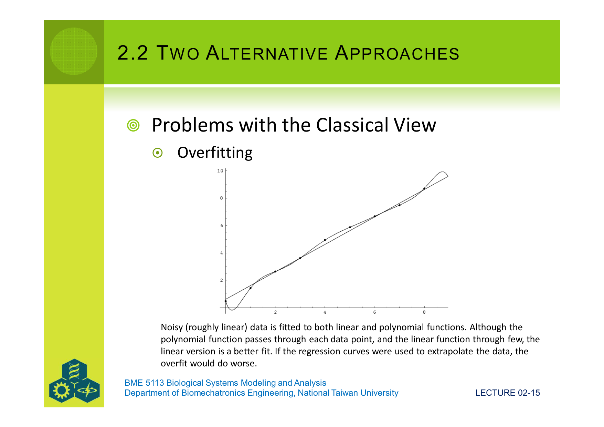
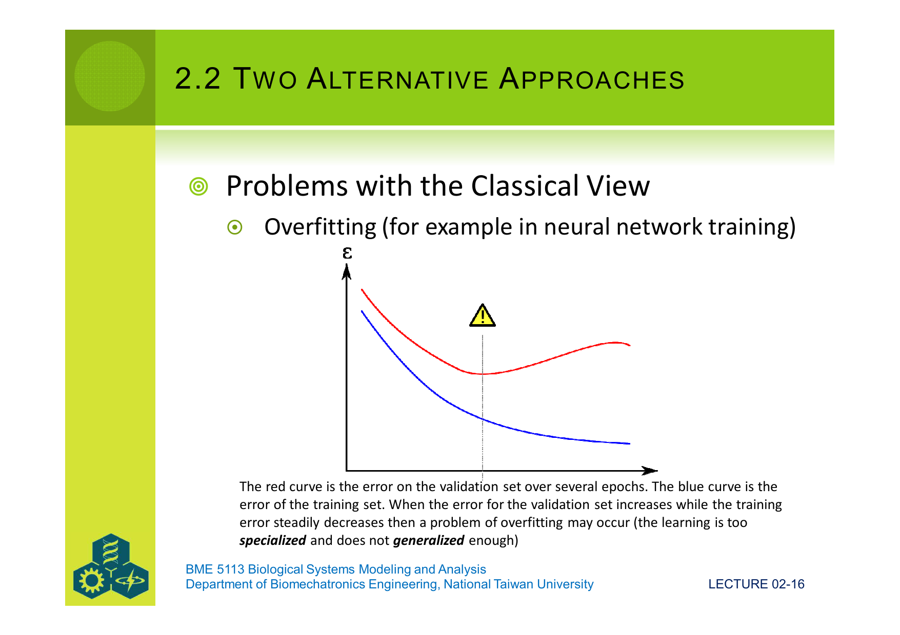
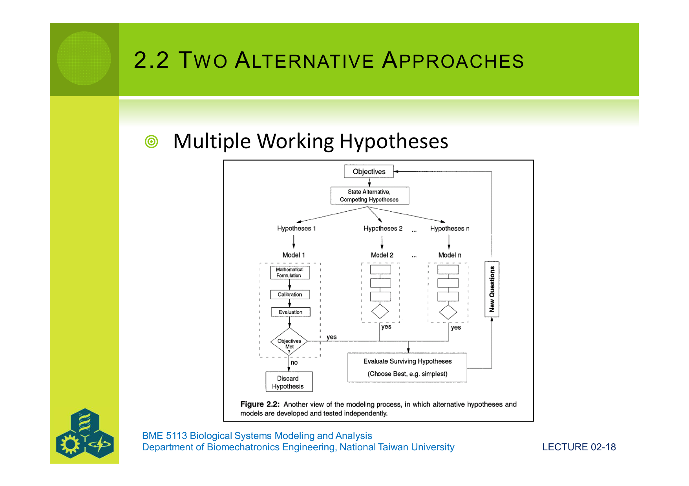
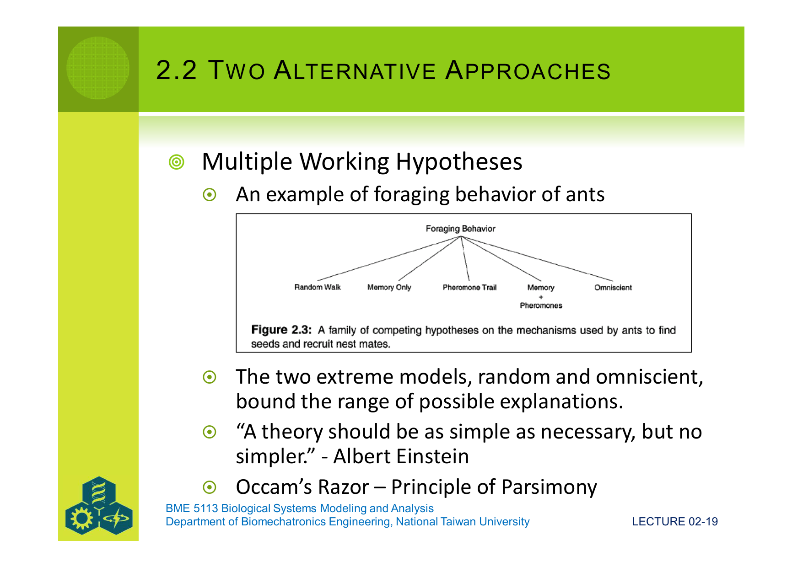
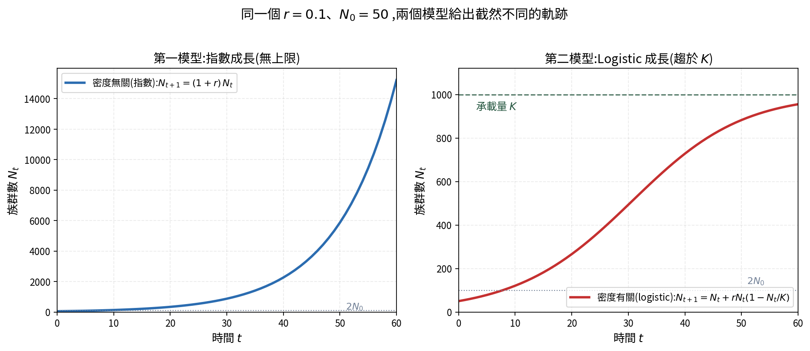
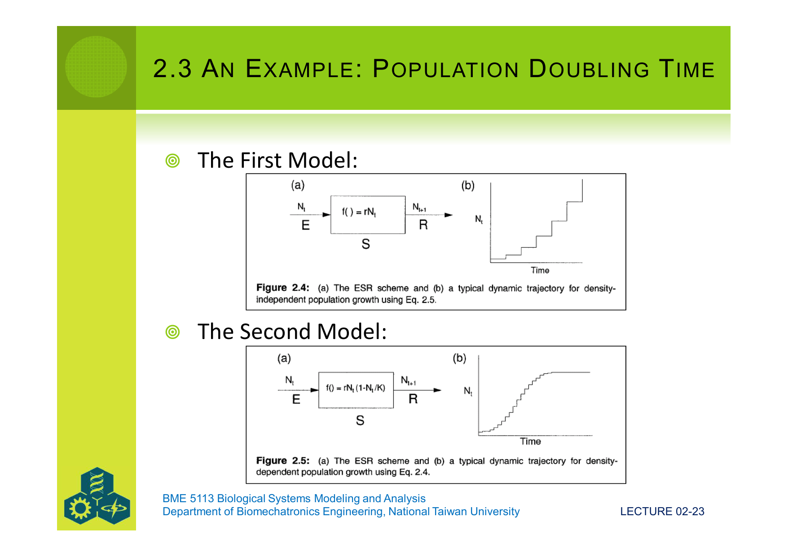
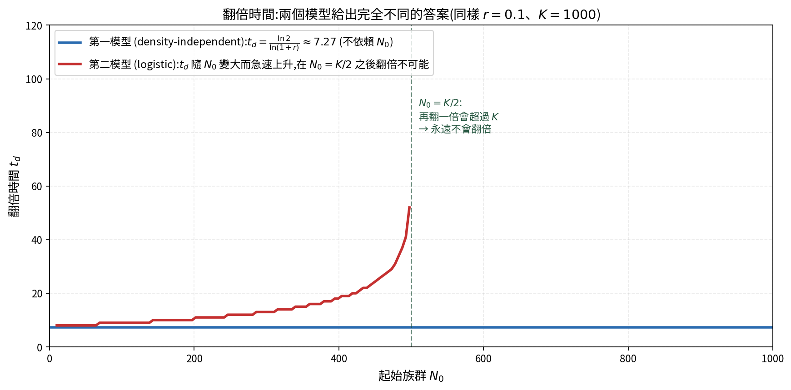

# 第二課:建模的步驟

第一課我們知道什麼是模型、模型可以做什麼。**但拿到一個系統,要怎麼一步一步把模型做出來?** 這一課就要把這個過程寫清楚。

## 課程綱要

- 2.1 建模就是「解問題」
- 2.2 兩種建模方法:循序 vs 平行
- 2.3 範例:人口翻倍時間
- 2.4 模型的「目標宣言 (Objective Statement)」

---

## 2.1 建模就是「解問題」

數學家 **George Pólya** 在 1973 年寫過一本經典的書《How to Solve It》。他把「解數學問題」拆成 **4 個步驟**:

1. **Understand the problem 理解問題**——問題到底在問什麼?
2. **Devise a plan 擬定計畫**——我們要怎麼解它?
3. **Execute the plan 執行計畫**——做出答案是什麼?
4. **Check the correctness 檢查答案**——答案對嗎?

> **建模,就是「用數學的方式做科學」**——也就是把 Pólya 的解題流程,套到「描述一個真實系統」這件事上面。

寫成口語的話:**建模是 hypothetico-deductive(假設—演繹)的科學流程**。也就是說:

- 先**提出假設**(關於系統怎麼運作),
- 再**演繹**(推算這個假設會導出什麼可觀察的結果),
- 然後**對照真實觀察**,看假設站不站得住腳。

下一節我們會看到,這個流程有兩種做法:**循序的**(一次做一個模型)與 **平行的**(同時做好幾個競爭模型)。

---

## 2.2 兩種建模方法:循序 vs 平行

### 2.2.1 經典觀點 (Classical View)——循序的 6 個階段

「經典觀點」把建模拆成 6 個依序進行的階段:

每一個階段在做什麼:

| 階段 | 內容 |
|---|---|
| **1. Objectives 目標** | 寫下「為什麼要做這個模型」——要回答什麼問題、用在哪裡、模型要多好才算「夠好」、輸出怎麼分析。詳見 §2.4。 |
| **2. Hypotheses 假設** | 把目標+我們對系統的現有知識,翻譯成一**串具體的假設**(可以是文字的,也可以是定量關係)。記得:建模者必須隨時想著目標——「我這個模型是為了 理解 / 預測 / 控制 哪一個?」 |
| **3. Mathematical Formulation 數學公式化** | 把上一階段那些**質性的**假設,改寫成**定量的**方程式。用上現有的物理、化學、生物知識來「推導出」方程式,並檢查推導正不正確。 |
| **4. Verification 驗證** | 把方程式**翻譯成電腦程式碼**,並驗證程式碼跟方程式一致——數值演算法的選擇會影響結果,寫對程式不是件小事。 |
| **5. Calibration 校正** | 估計「方程式裡的常數」——例如初始條件(第一天有幾個物種?)、參數值。一般用統計方法(如線性回歸)來從資料估計;有時還需要做特定實驗。 |
| **6. Analysis & Evaluation 分析與評估** | 跑模型,得到結果。如果結果通過「目標」設定的驗收標準,模型專案完成;**如果沒通過,就回到前面修正假設或公式,整個流程重做一遍**。最後依目標進一步分析(電腦模擬或數學推導)。 |

### Nahikian 的「建模循環圖」

把上面的 6 個階段壓縮成一個循環,就是 Nahikian 提出的觀點:

四個節點互相連著走:
- **Biological / Physical Problem 生物或物理問題**(現實的系統)
- **Mathematical Model 數學模型**(我們建立的模型)
- **Mathematical Inferences 數學推論**(從模型推導出的結果)
- **Observed Phenomena 觀察到的現象**(對照實驗的真實資料)

每兩個節點之間有對應的「動作」:從問題到模型要「定義問題、做簡化假設、回顧基本原理」;從模型到推論要「做數學運算」;從推論回到觀察要「做數學檢查、回顧假設、把模型對應回原問題」;從觀察回到問題要「做實驗」。

### Pólya 的 4 步 ↔ 建模的 6 階段

兩者可以對得起來:

換句話說,**建模不是新發明的東西**——它就是把「解題」這件事,系統化地套到「描述真實世界」上頭。

### 2.2.2 經典觀點的問題:Overfitting

經典觀點的最大缺點:**獨立的驗證資料(independent validation data sets)很難取得,通常很貴**。
如果建模者「邊建邊看資料」、不斷修改模型直到完美地通過驗收,就會掉進 **overfitting(過度擬合)** 的陷阱。

**什麼是 overfitting?** 用一個例子來看:

圖中有一些「**大致呈直線**的散布資料」。我們用兩條曲線去擬合:

- **直線**(linear function):只通過少數幾個點,看起來「不完美」。
- **高次多項式**(polynomial function):**每一個點都精準通過**,看起來「完美」。

直覺上會以為多項式比較好——畢竟它「擬合得更準」。但這個直覺是錯的。

**為什麼?** 因為**真實資料總是帶著雜訊**(觀測誤差、隨機波動……)。多項式為了通過每個點,**把雜訊也學進去了**——它捕捉的是「這次量到的特定資料」,不是「真實世界的規律」。

具體後果:**如果我們用兩條曲線去外推(extrapolate)、預測新的點**,多項式的表現會**比直線差很多**——因為它過度貼著舊資料,反而失去普遍性(回想第一課的 generality)。

這個現象在機器學習中特別常見:

橫軸是訓練回合(epoch),縱軸是誤差 $\varepsilon$。
- **藍線**:模型在「訓練資料」上的誤差——隨訓練越久越低。
- **紅線**:模型在「驗證資料」(它沒見過的)的誤差——一開始下降,但**到某個點之後反而開始上升**。

紅線開始上升的地方,**就是 overfitting 的轉折點**:模型已經學「太特定」了,失去了對新資料的概括能力。

> **重點是**:在經典觀點裡,因為是循序進行,建模者很容易在不知不覺中,**為了通過驗收而過度調整模型**——表面上模型「越來越準」,實際上是越來越脆弱。

### 2.2.3 替代方案:Multiple Working Hypotheses(平行建模)

為了避開 overfitting,有一種替代做法:**同時建立幾個競爭模型**,平行地比較它們。

流程的精神:

1. 訂下相同的 **Objectives**;
2. 列出**幾組互相競爭的假設**(Hypotheses 1, 2, ..., n);
3. 為**每一組**假設分別建立模型,做數學公式化、校正、評估;
4. 看哪些模型通過驗收;
5. 在通過的模型中,選出最「合理」的(通常是**最簡單**的)。

#### 範例:螞蟻是怎麼找到食物的?

考慮一個經典生態學問題:**一群螞蟻是怎麼找到食物,並把訊息傳給同伴的?** 至少有 5 個競爭假設:

- **Random Walk 隨機遊走**:螞蟻完全亂走,找到食物純屬巧合。
- **Memory Only 只靠記憶**:螞蟻記得以前去過的地方。
- **Pheromone Trail 費洛蒙路徑**:螞蟻沿著前蟻留下的化學氣味走。
- **Memory + Pheromones 記憶 + 費洛蒙**:兩者並用。
- **Omniscient 全知**:螞蟻「知道」食物在哪裡(極端理論假設)。

「隨機遊走」與「全知」這兩個極端,**框出了所有合理解釋的範圍**——真實的螞蟻一定介於兩者之間。

#### Occam's Razor(奧坎剃刀)——簡約原則

當好幾個模型都通過驗收,該選哪一個?

> **「A theory should be as simple as necessary, but no simpler.」 — Albert Einstein**

**Occam's Razor**(奧坎剃刀)、又稱**簡約原則 (Principle of Parsimony)**:
- 在能解釋現象的所有模型裡,**選假設最少、結構最簡單的**;
- 不要為了「多解釋一點點」而增加大量複雜性。

理由:複雜模型容易 overfit;簡單模型參數少,在新狀況下比較可靠。
回到第一課的三方取捨——簡單模型通常**普遍性 (generality)** 較強。

---

## 2.3 範例:人口翻倍時間

來看一個用 Multiple Working Hypotheses 的真實例子。

### 2.3.1 目標

**Objective 目標**:
> 「建立全世界人口動態的描述,使得**起始人口翻倍**(從 $N_0$ 變成 $2 N_0$)所需的時間可被計算。」

這個 objective 同時包含**目的**(計算翻倍時間)與**範圍**(全球人口)。我們會做出兩個競爭模型來回答它。

### 2.3.2 兩個競爭模型(以及它們共同的假設)

**共同假設(兩個模型都成立)**:
1. **per capita 成長率不受外在因素影響**(臭氧、紫外線、溫度都不算)。
2. **男女比例 1:1**(或假設只有單一性別)。
3. **個體沒有年齡差異**(沒有「老人」、「小孩」分組)。
4. **沒有地理差異**(全球任何地方成長率都一樣)。

**競爭的地方**:per capita 成長率「怎麼變」——

- **第一模型(密度無關 density-independent)**:
  每個人的繁殖率是**常數**,不管總人口多大都不變。
- **第二模型(密度有關 density-dependent)**:
  人越多,**每個人**的繁殖率就**線性下降**(因為資源不夠分、競爭變激烈)。

### 2.3.3 先用直覺想——per capita 成長率該怎麼變?

#### 第一模型的直覺
想像一個原始農村,土地、食物**永遠夠用**。每對夫妻平均生 3 個孩子(超過維持人口的數量),不管村裡有多少人。**每個個體**對人口貢獻的速率,就是一個固定的數字 $r$。

寫成公式語言:**per capita 成長率 = $r$**(常數)。

#### 第二模型的直覺
現在想像一個現代城市,土地、食物**有限**。當城市裡人很少時,每對夫妻仍然能生很多;但人口越來越多,擁擠、資源競爭、生活成本上升,**每對夫妻的「平均生育數」會下降**。

**最關鍵的問題**:多到什麼時候,**每個人**的繁殖率會**變成 0**?

我們把這個數字叫做 **環境承載量 (carrying capacity) $K$**——這是這個環境**最多能養活**的人口。當 $N = K$,人口剛好「補上死的」,不再淨增長,per capita 率 = 0。

如果假設「per capita 率隨 $N$ 線性下降」,且
- 當 $N = 0$:per capita 率 = $r$(沒有競爭,跟第一模型一樣的最大率);
- 當 $N = K$:per capita 率 = $0$。

那麼一般情況下:**per capita 成長率 = $r \cdot (1 - N/K)$**。

### 2.3.4 把直覺寫成公式——拆解每一項

我們用一個**通用框架**來表達這兩個模型。設 $N_t$ = 第 $t$ 個時間點的人口數,$f(N_t)$ = 第 $t$ 時的 **per capita 成長率**。

#### 通用形式

下一個時刻的人口 = 現在的人口 + 這段時間總共新增的人。
而新增的人 = 「總人口」乘上「每個人貢獻的速率」:

$$
\boxed{\; N_{t+1} \;=\; N_t \;+\; N_t \cdot f(N_t) \;} \qquad (\text{式 2.1})
$$

拆解這個式子的每一項:

| 項 | 意義 |
|---|---|
| $N_{t+1}$ | 下一時刻的人口 |
| $N_t$ | 現在的人口 |
| $N_t \cdot f(N_t)$ | 這段時間「新增的人」總數——是「總人數」乘上「每人成長率」 |
| $f(N_t)$ | per capita 成長率——這就是兩個模型唯一不同的地方 |

#### 第一模型:$f(N_t) = r$ (常數)

把 $f$ = 常數 $r$ 代入式 2.1:

$$
\boxed{\; N_{t+1} \;=\; N_t \;+\; r \cdot N_t \;} \qquad (\text{式 2.5})
$$

可以把右邊提出 $N_t$:

$$
N_{t+1} \;=\; (1 + r) \cdot N_t
$$

**這就是指數成長(exponential growth)**:每個時刻,人口都乘上一個固定倍數 $(1 + r)$。連續迭代就是 $N_t = N_0 \cdot (1 + r)^t$。

#### 第二模型:$f(N_t) = a - b N_t$ (線性遞減)

先用最一般的線性形式,設 $f(N_t) = a - b N_t$:

$$
N_{t+1} \;=\; N_t \;+\; N_t \cdot (a - b N_t) \qquad (\text{式 2.3})
$$

接下來**換符號**,把 $a$、$b$ 換成更有生物意義的 $r$、$K$:
由直覺(§2.3.3):當 $N = 0$,per capita 率 = $r$;當 $N = K$,per capita 率 = $0$。
- $N = 0$:$f = a - b \cdot 0 = a = r$ → $a = r$。
- $N = K$:$f = a - bK = r - bK = 0$ → $b = r / K$。

代回:

$$
\boxed{\; N_{t+1} \;=\; N_t \;+\; N_t \cdot \Bigl[ r - \frac{r}{K} N_t \Bigr] \;=\; N_t \;+\; r\, N_t \Bigl(1 - \frac{N_t}{K}\Bigr) \;} \qquad (\text{式 2.4})
$$

**這就是有名的 logistic growth(邏輯式成長)方程**。它的兩個極端:
- $N \ll K$:括號接近 1,行為像第一模型(指數成長)。
- $N \to K$:括號接近 0,新增量接近 0,人口停在 $K$。

### 2.3.5 兩個模型的軌跡

把式 2.5(第一模型)與式 2.4(第二模型)用同一組參數(同樣 $r$,同樣 $N_0$)分別跑,得到兩條完全不同的曲線:

兩個模型對應的「ESR(輸入—系統—輸出)示意圖」+ 典型軌跡(原講義 Fig 2.4 與 2.5):

- 第一模型(Fig 2.4):**指數無上限**,人口會永遠以越來越快的速度成長。
- 第二模型(Fig 2.5):**S 形曲線**,人口先快速上升,接近 $K$ 時放慢,最終停在 $K$。

### 2.3.6 計算翻倍時間——這就是我們的目標

#### 第一模型的翻倍時間

從 $N_t = N_0 (1 + r)^t$,設 $N_t = 2 N_0$:

$$
2 N_0 = N_0 (1 + r)^t
\;\;\Longrightarrow\;\;
2 = (1 + r)^t
$$

**現在卡住了**:我們要解出 $t$,但 $t$ **被困在「指數」的位置**。一般的加減乘除沒辦法把 $t$ 從上面拉下來。要怎麼辦?

##### 救星:對數(logarithm)

先問一個小問題:**「$2$ 要乘上自己幾次,才會等於 $8$?」**
答案是 $3$,因為 $2 \times 2 \times 2 = 8$,也就是 $2^3 = 8$。

數學家發明一個叫做 **對數(logarithm)** 的東西,專門用來回答這種「乘了幾次」的問題。寫法是:

$$
\log_2 8 = 3 \quad \Longleftrightarrow \quad 2^3 = 8
$$

讀作「以 $2$ 為底,$8$ 的對數是 $3$」。
意思就是:**對數是次方的「反向操作」**——就像減法是加法的反向、除法是乘法的反向。

科學裡最常用的「底」不是 2,而是一個大約等於 $2.71828...$ 的特殊數字 $e$,這時的對數叫做 **自然對數(natural logarithm)**,寫成 $\ln$:

$$
\ln x \;=\; \log_e x
$$

不用記 $e$ 是多少——它在計算機上是一個按鍵。重要的是它的**性質**。

##### 對數的關鍵性質:把次方變成乘法

對數有一個威力強大的性質:

$$
\boxed{\; \ln(a^b) \;=\; b \cdot \ln a \;}
$$

**為什麼這成立?** 直覺地想:$a^b$ 就是 $a$ 連乘 $b$ 次。「對數」問的是「要乘幾次才得到這個數」。連乘 $b$ 次 $a$,所需要的「乘的次數」當然就是「乘一次 $a$ 的次數」乘上 $b$ 倍。

用具體數字驗證:
- $\ln(2^3) = \ln 8 \approx 2.08$
- $3 \cdot \ln 2 \approx 3 \times 0.693 \approx 2.08$ ✓ 兩邊一樣。

**這個性質就是我們的救星**——它能把「$t$ 在指數位置」變成「$t$ 在乘號位置」。

##### 解出 $t$

把對數性質套到我們的方程式 $2 = (1+r)^t$。**兩邊**都取 $\ln$:

$$
\ln 2 \;=\; \ln\bigl((1+r)^t\bigr)
$$

用對數性質,右邊的 $t$ 可以「掉下來」變成乘號:

$$
\ln 2 \;=\; t \cdot \ln(1+r)
$$

**$t$ 不再在指數位置了**,只是一個普通的乘數。把 $\ln(1+r)$ 移到左邊(兩邊同除以 $\ln(1+r)$):

$$
\boxed{\; t_d \;=\; \frac{\ln 2}{\ln(1 + r)} \;}
$$

##### 用具體數字驗證

假設 $r = 0.10$(每年人口成長 10%):

- $\ln 2 \approx 0.693$
- $\ln(1.10) \approx 0.0953$
- $t_d \approx 0.693 \,/\, 0.0953 \approx 7.27$ 年

也就是說:**每年成長 10% 的話,人口大約 7.27 年翻一倍**。
這跟前面 helper-4 圖中的藍色水平線數值一致 ✓。

(這個結果也跟一個常聽到的「**70 法則**」吻合:翻倍年數 $\approx$ 70 / 年成長率(%)。法則的來源就是上面這個公式,只是把 $\ln 2 \approx 0.693$ 近似成 $70/100$。)

##### 這個公式告訴我們什麼?

**注意**:翻倍時間 $t_d$ **只依賴 $r$,不依賴 $N_0$**。
也就是說:**從 100 人翻到 200 人,跟從 100 億翻到 200 億,所需時間一樣**!(在這個模型下。)

#### 第二模型的翻倍時間

第二模型沒有像第一模型那樣的封閉解,但**直覺上**很清楚:
- 當 $N_0$ 很小($N_0 \ll K$),括號 $(1 - N_t/K)$ 接近 1,行為很像第一模型,翻倍時間接近 $\ln 2 / \ln(1 + r)$。
- 當 $N_0$ 接近 $K/2$,「$2 N_0$」已經接近 $K$ 了,而模型告訴我們「永遠不會超過 $K$」——所以翻倍會**越來越慢**。
- 當 $N_0 = K/2$,目標 $2 N_0 = K$——只能在無窮遠的未來才達到,翻倍時間 = $\infty$。
- 當 $N_0 > K/2$,目標 $2 N_0 > K$——**永遠不會翻倍**,翻倍時間「沒有定義」。

用電腦模擬,把兩個模型的翻倍時間 $t_d$ 畫成「隨 $N_0$ 變化」的曲線:

- **藍線(第一模型)**:水平線,$t_d \approx 7.27$,完全不依賴 $N_0$。
- **紅線(第二模型)**:隨 $N_0$ 上升而急速增加,在 $N_0 = K/2$ 之後消失(永遠不會翻倍)。

> **這就是「為什麼要做兩個競爭模型」的核心價值**——
> 同樣的問題(「全世界人口什麼時候翻倍?」),兩個模型給出**完全不同的答案**。
> 哪一個對?取決於 **per capita 成長率到底會不會隨密度下降**——這是個生物學問題,要用資料來判斷。

### 2.3.7 校正(Calibration)兩個模型

回到 §2.2.1 講的「校正」階段——怎麼從真實資料估出 $r$、$K$?

#### 第一模型

從式 2.5 反推:$N_{t+1} - N_t = r N_t$,兩邊除以 $N_t$:

$$
\boxed{\; r \;=\; \frac{N_{t+1} - N_t}{N_t} \;}
$$

也就是說,**用觀察到的「每年人口變化率」就能直接估出 $r$**。
如果在不同時刻量到不同的 $r$ 值,可以取平均。

#### 第二模型

從式 2.4 反推:$N_{t+1} - N_t = r N_t - \frac{r}{K} N_t^2$,兩邊除以 $N_t$:

$$
\boxed{\; \frac{N_{t+1} - N_t}{N_t} \;=\; r \;-\; \frac{r}{K} N_t \;}
$$

注意這是一個**線性回歸**的形式:
- $y = \dfrac{N_{t+1} - N_t}{N_t}$ 是「每人成長率」(觀察值);
- $x = N_t$ 是「當下人口」;
- 截距是 $r$;斜率是 $-r/K$。

把資料畫成散布圖($y$ 對 $x$),做線性回歸:
- 截距告訴我們 $r$;
- 斜率告訴我們 $-r/K$,進一步可以推出 $K$ = $-r$/斜率。

兩個模型校正完之後,就能用真實的 $r$、$K$,**對翻倍時間做具體的數值預測**——這就完成了 Pólya 第 3 步:執行計畫。

### 2.3.8 對不確定學科的提醒

> 「在生態學等較不成熟的學科,因為機制尚未被理解,模型不確定性較高;
> **使用一組特定方程的影響,需要用替代模型來檢驗**。」  — 原講義

換句話說:**越不確定,就越要用 Multiple Working Hypotheses,而不是 Classical View**。

---

## 2.4 模型的「目標宣言 (Objective Statement)」

### 為什麼目標宣言這麼重要?

> **「The objective statement is a document that defines the reasons for producing the model in the first place.」**

目標宣言是建模流程的**第一步**(經典觀點的 Stage 1),它決定了:
- 要解什麼問題;
- 模型用在哪裡;
- 怎麼判斷模型「夠好」;
- 後面所有階段的工作範圍。

**沒有清楚的目標宣言,後面所有努力都可能白費**——你可能做出一個「很厲害但回答錯誤問題」的模型。

### 有效的目標宣言:「goal + purpose」

> **Effective objectives are those that are stated as *goals* with *purposes*.**

範例:

> 「Construct a model of photosynthesis [**goal**] to determine the effects of elevated UV light [**purpose**].」
> (建立光合作用的模型 [**目標**],以評估紫外線增強的影響 [**用途**]。)

注意它**同時**說明了:做什麼(goal)+ 為什麼做(purpose)。
這是檢驗目標宣言的最低標準。

### 一個完整的目標宣言必須包含 7 件事

| # | 內容 | 為什麼重要 |
|---|---|---|
| 1 | **The objective question(s)**——要回答什麼具體問題? | 沒有問題就沒有答案的衡量 |
| 2 | **The perturbations and stimuli accommodated**——模型會考慮哪些擾動或輸入? | 決定模型能應對哪些情境 |
| 3 | **The exact system and environment**——精確的系統與它的環境邊界? | 第一課的「物件 + 關係」要明確定義 |
| 4 | **Temporal and spatial scales of description**——時間與空間的描述尺度? | 模型是描述每秒、每天、還是每十年? 一公分還是一公里? |
| 5 | **Temporal and spatial scales of extrapolation and prediction**——外推/預測的時空尺度? | 模型可以推到多遠的未來、多大的範圍? |
| 6 | **Factual information and theoretical concepts**——用了什麼資料、假設、來源、理論概念? | 讓人能審查、能重現 |
| 7 | **Criteria of validation**——驗證標準是什麼?(實證 + 理論) | 沒有驗收標準,就不知道模型「夠好沒有」 |

回頭看本課的人口翻倍範例,可以對應到這 7 點:
1. 翻倍時間是多少?
2. 沒有外部擾動(共同假設第 1 條)。
3. 系統 = 全世界總人口;環境 = 整個地球。
4. 時間尺度:年(離散差分方程)。空間:全球,空間同質(共同假設第 4 條)。
5. 預測尺度:未來幾十年。
6. 假設:無年齡分布、無性別差異(共同假設)。資料:歷史人口統計。
7. 驗證:預測的翻倍時間 vs 實際觀察到的歷史翻倍時間。

---

## 本課小結

我們在這一課:

- 把建模對應到 Pólya 解題的 **4 個步驟**,理解「建模 = 用數學做科學」;
- 介紹了兩種建模方法:
  - **Classical View(循序)**:6 階段流程,直覺簡單但容易 overfit;
  - **Multiple Working Hypotheses(平行)**:同時做多個競爭模型,用 Occam's Razor 挑出最簡潔的;
- 用**人口翻倍時間**為例,從直覺出發,推導了:
  - 通用形式 $N_{t+1} = N_t + N_t \cdot f(N_t)$(式 2.1);
  - 密度無關模型 $N_{t+1} = N_t + r N_t$(式 2.5)——指數成長,翻倍時間 $t_d = \dfrac{\ln 2}{\ln(1+r)}$;
  - 密度有關 logistic 模型 $N_{t+1} = N_t + r N_t (1 - N_t/K)$(式 2.4)——S 形曲線,翻倍時間隨 $N_0$ 變化;
  - 並示範了**兩個模型用線性回歸校正參數**的方法;
- 列出**目標宣言**必須包含的 7 件事,並用人口範例驗證。

下一課,我們會深入到「假設的階段」——什麼樣的假設算是好假設?要如何把直覺翻譯成可量化的關係?
