# 第三課:質性建模——Forrester 圖

第二課我們學了「建模的步驟」:目標 → 假設 → **數學公式化** → 驗證 → 校正 → 評估。
這一課要往前一步:在寫方程式之前,**先把腦中的概念畫成一張圖**——這就是「**質性建模 (qualitative formulation)**」要做的事。

## 課程綱要

- 3.1 如何「吃掉一隻大象」?
- 3.2 Forrester 圖:語言與符號
- 3.3 範例:從草—鹿生態系到族群模型
- 3.4 常見錯誤:畫 Forrester 圖時要避開的 10 個坑
- 3.5 Forrester 圖的優缺點
- 3.6 質性建模的原則
- 3.7 模型簡化的策略
- 3.8 其他建模問題(Transport / Particle / Finite State)

---

## 3.1 如何「吃掉一隻大象」?

一句西方諺語問:**"How do you eat an elephant?"** 答案是:**"One bite at a time."**(一口一口地吃。)

建模時也是這樣:面對一個複雜的真實系統,我們無法一口氣把所有方程式都寫出來。**質性建模**就是「先把大象切成幾塊」——

> **質性建模 (qualitative model formulation)**:把「目標宣言」與「一組假設」轉換成一個**非正式的、概念性的模型**。
> 這種模型**還沒有明確方程式**,但它的目的是「提供足夠的細節與結構,使得後續可以一致地寫出方程式」。

也就是說,質性建模是**從第二課的『假設』階段,過渡到『數學公式化』階段的橋樑**——
這座橋通常是用「**圖**」搭起來的。

### 三種常見的圖表系統

書上提到三種:

1. **Block structure diagram(方塊結構圖)**——電機工程常用,把系統畫成方塊與訊號流。
2. **Odum energy flow diagram(Odum 能量流圖)**——生態學家 H. T. Odum 提出的「能量電路語言」。
3. **Forrester diagram(Forrester 圖)**——本課重點,系統動力學的標準語言。

#### 補充:Odum 能量流圖長什麼樣?

Odum 把生態系想成一個「能量電路」——每個物種、每個過程,都用特殊符號畫出來:

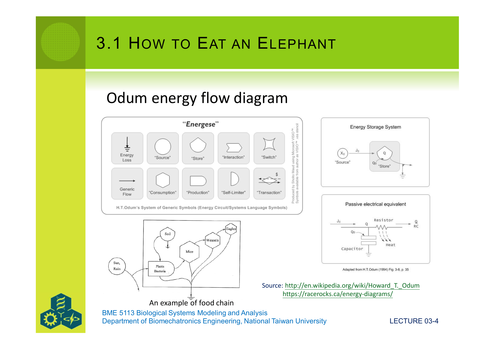

上半是 Odum 設計的「符號字典」(Energese):能量流、源、儲、互動、轉換、消費、生產、自我限制、交易……每種畫法都不一樣。右下角還有一個「被動電路等效圖」——把生態系類比成電路,儲量 = 電容、阻力 = 電阻、損耗 = 接地。

左下是一個食物鏈的例子:陽光、雨 → 植物/細菌 → 土壤、Mice、Weasels、Eagles ……

Odum 圖很美、很精確,但**符號太多、學習成本高**。**Forrester 圖只用 8 個符號**就能描述大多數動態系統——這就是為什麼這門課選用它。

---

## 3.2 Forrester 圖:語言與符號

**Forrester 圖**是 MIT 教授 Jay W. Forrester(1918–2016)在 1950 年代發明的「系統動力學」標準畫法。它有兩個核心目的:

1. **描述**:任何一個「有可測量的量在元件之間流動」的動態系統。
2. **抽象**:把「系統元件」與「物質流」的概念抽象出來——成為通用工具。

直接看一個簡單例子:**草—鹿生態系**(原講義圖 3.1)。

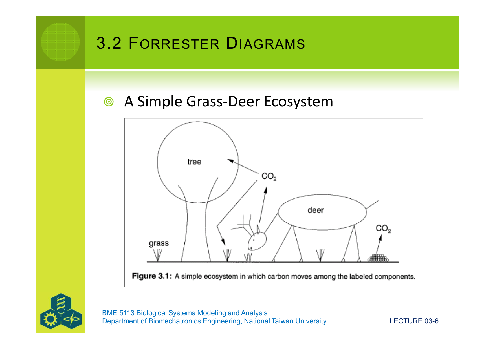

這個系統裡,「碳 (C)」這個量會在元件之間移動:
- 樹、草透過光合作用,從大氣 CO2 吸收碳。
- 鹿吃草,把碳從「草」搬到「鹿」。
- 鹿透過呼吸、排泄,又把碳放回大氣或廢物。

我們的任務是:**把這個流動關係,畫成一個 Forrester 圖**。但要先學符號。

### 核心概念:狀態變數、源、匯、流、影響

正式介紹符號前,先把概念分清楚:

- **狀態變數 (state variable)** 或 **位準 (level)**:**我們在系統內、要明確建模的物件**。每一個狀態變數都對應一個方程式(後面會寫)。所有狀態變數的當下值,就構成了系統的「**狀態 (state)**」。
  例:草—鹿系統的狀態變數是「草的碳含量」與「鹿的碳含量」。

- **外部變數 (external variables)**:**系統之外**、我們**不**明確建模的東西。分兩類:
  - **源 (source)**:從外面流入系統的供給(如大氣 CO2 對草)。
  - **匯 (sink)**:從系統流到外面的接收者(如鹿排出的廢物)。
  我們**不為源/匯寫方程式**——它們的量我們假定是無限的、或我們不在意。

- **關係 (relations)**:系統內的物件之間有**兩種關係**:
  1. **流的方向與速率**(物質本身在流動)
  2. **變數的值對流速的影響**(沒有物質流動,只有資訊)

**這兩種關係,Forrester 圖用兩種不同的箭頭表示**——這是整個圖表系統最關鍵的區別。

### Forrester 圖的 8 個基本符號

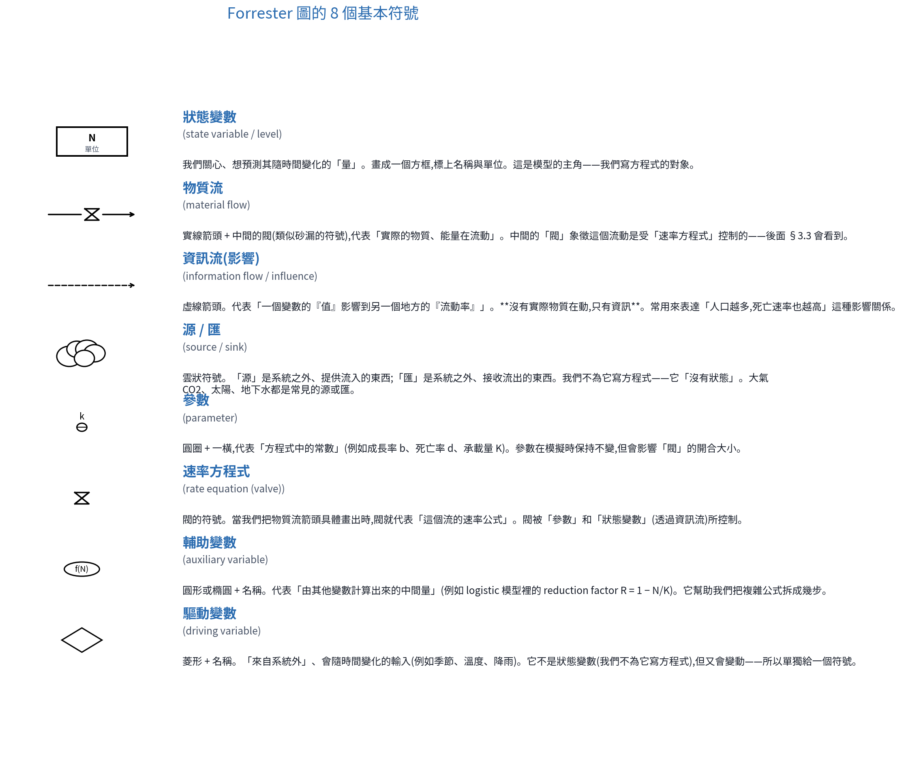

對照原講義的圖 3.2(完全等價,只是英文版):

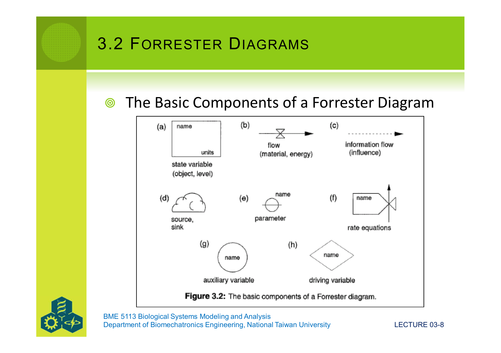

下面這張表是同樣 8 個符號的快速摘要:

| 符號 | 中文名 | 英文名 | 角色 |
|---|---|---|---|
| `□` (方框) | 狀態變數 / 位準 | state variable / level | 系統內、要建模的量 |
| `——⋈——→` | 物質流 + 閥 | material flow with rate valve | 實際物質、能量在流動 |
| `- - - - →` | 資訊流 | information flow / influence | 一個值「影響」一個流速 |
| 雲狀 | 源 / 匯 | source / sink | 系統外、不建模 |
| `○─` | 參數 | parameter | 方程式中的常數 |
| `⋈` (砂漏) | 速率方程式 | rate equation (valve) | 控制物質流的公式 |
| `○`(橢圓) | 輔助變數 | auxiliary variable | 中間計算量 |
| `◇` | 驅動變數 | driving variable | 系統外、會隨時間變動的輸入 |

**最容易混淆的兩個是「物質流」和「資訊流」**:

- **物質流**:**實線**箭頭 + 中間有閥。實際的「東西」在流動(碳、水、人口、能量)。
- **資訊流**:**虛線**箭頭。**沒有東西在流動**,只是「一個變數的值會影響另一個地方的流速」。
  例:當鹿越多,鹿吃草的「速率」就越快——這是資訊流(鹿的「數量」影響到「吃」的速率,但鹿本身沒有流到「吃」這個閥裡)。

---

## 3.3 範例:從草—鹿生態系到族群模型

### 3.3.1 草—鹿生態系——分 4 步畫出來

我們現在實際把第 3.2 節開頭那張草—鹿圖,畫成 Forrester 圖。**質性建模時有一個固定流程**:

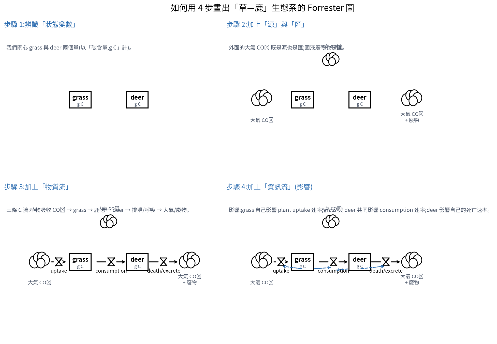

四個步驟分別是:

**步驟 1:辨識「狀態變數」(state variables)**
問:「我們關心哪些『量』隨時間的變化?」
草—鹿系統的答案:**草的碳含量**、**鹿的碳含量**(都以 g C 計)。畫兩個方框,標上名稱與單位。

**步驟 2:加上「源」與「匯」**
問:「碳是從哪裡來、又到哪裡去?」
- 從外面進來:大氣 CO2(光合作用)。
- 出去:大氣 CO2(呼吸)、固液廢物(排泄)。
畫雲狀符號,代表這些是系統外的。

**步驟 3:加上「物質流」**
問:「碳在元件之間是怎麼流動的?」
三條主要 C 流:
1. **植物吸收 (plant uptake)**:大氣 CO2 → 草。
2. **消費 (consumption)**:草 → 鹿。但要注意——消費過程中也有碳逸散到大氣(鹿呼吸),所以這條流還會分出一條去大氣。
3. **死亡/排泄 (death/excrete)**:鹿 → 大氣 + 廢物。
每條流用實線箭頭 + 閥畫出。

**步驟 4:加上「資訊流」(影響)**
問:「每一個閥的速率,被誰影響?」
依本系統的假設(原講義 §3.3):
- **uptake 速率**:依「草自己的量」(光合速率正比於現有葉量)而變 → 一條從 grass 回到 uptake 閥的資訊流。
- **consumption 速率**:依「草的量」+「鹿的量」(假設 3:鹿越多每隻分到越少;鹿越多就吃越多)→ 兩條資訊流(一條從 grass、一條從 deer)。
- **death/excrete 速率**:依「鹿自己的量」(死亡率 ∝ 現有鹿群)→ 一條從 deer 回到 death 閥。

用**虛線**畫這些影響,完成 Forrester 圖。對照原講義的圖 3.3:

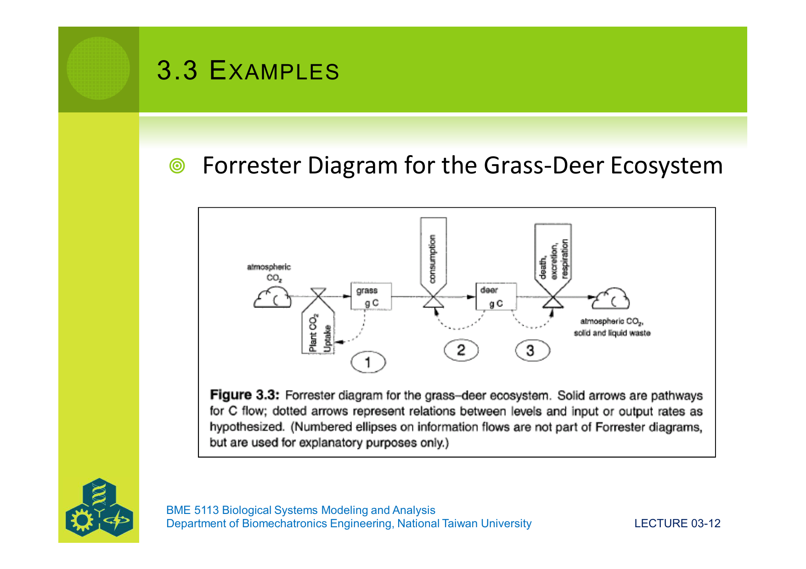

(圖中編號 1、2、3 的橢圓,**不是 Forrester 圖的標準符號**,只是這份原講義用來解釋三條資訊流而已。)

**注意**:整個圖完全沒有寫任何方程式,但它**告訴我們**:
- 草的方程式長什麼樣(會有 +uptake、−consumption)
- 鹿的方程式長什麼樣(會有 +consumption、−death/excrete)
- 而每個「閥」的具體公式,**由它接到哪些資訊流決定**

這就是質性建模——**用圖把『方程式的骨架』先建好**,後面寫方程式時就不會漏項。

### 3.3.2 簡化版:純人口的兩個模型

第二課我們已經看過「人口翻倍」的兩個競爭模型(指數 vs logistic)。現在我們**回過頭來,用 Forrester 圖把它們的結構畫出來**——這樣才能看清「為什麼第二個模型多出一個 $\bigl(1 - N_t/K\bigr)$ 項」。

#### 密度無關模型(Density-Independent)

假設:
- 出生率 = $b \cdot N$ (每隻平均生 $b$ 隻)
- 死亡率 = $d \cdot N$ (每隻平均死亡率 $d$)
- 兩者都「**不隨**人口大小變化」

對應的方程式(原講義式 3.1):

$$
\boxed{\; N_{t+1} \;=\; N_t \;+\; b\,N_t \;-\; d\,N_t \;} \qquad (\text{式 3.1})
$$

對應的 Forrester 圖(原講義圖 3.4):

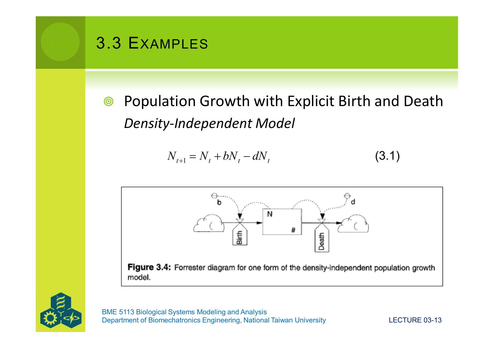

逐項對應如下:

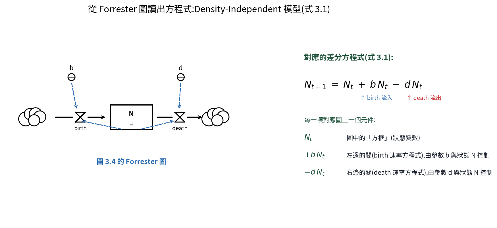

注意這張圖告訴我們的**結構**:
- **方框 N**:對應方程式中的 $N_t$ 與 $N_{t+1}$。
- **左邊的閥(birth)**:對應 $+bN_t$。閥被「參數 b」與「狀態 N」(自影響)兩條資訊流控制。
- **右邊的閥(death)**:對應 $-dN_t$。閥被「參數 d」與「狀態 N」控制。
- **兩朵雲**:對應外部世界(出生來源、死亡去向),我們不為它們寫方程式。

#### 密度有關模型(Density-Dependent, Logistic)

假設:
- 出生率 = $b \cdot N \cdot \bigl(1 - N/K\bigr)$ ——擁擠時降低
- 死亡率 = $d \cdot N$ ——維持不變

對應的方程式(原講義式 3.2):

$$
\boxed{\; N_{t+1} \;=\; N_t \;+\; b\,N_t \Bigl(1 - \frac{N_t}{K}\Bigr) \;-\; d\,N_t \;} \qquad (\text{式 3.2})
$$

對應的 Forrester 圖(原講義圖 3.5):

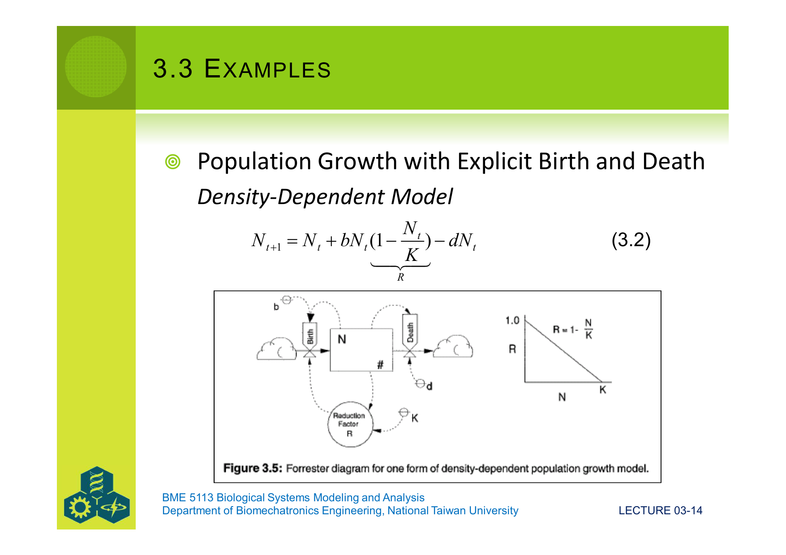

**和密度無關模型相比,只多了一個東西**:一個叫 R(reduction factor,縮減因子)的**輔助變數**,定義為 $R = 1 - N/K$。
這個 R 接受兩條資訊流的影響:狀態變數 $N$ 和參數 $K$。然後 R 再去影響出生率的閥。

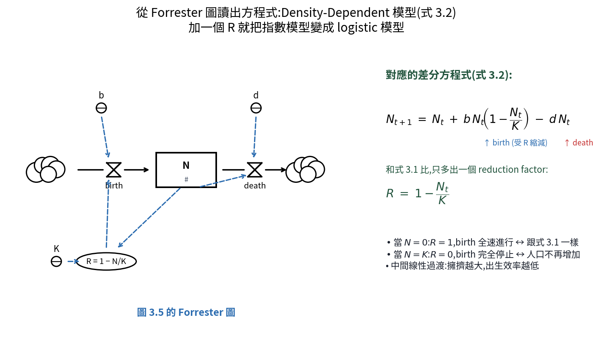

R 的物理意義:
- $N = 0$ 時:$R = 1$,出生全速進行(跟密度無關模型一樣)。
- $N = K$ 時:$R = 0$,出生完全停止(達到承載量)。
- 中間:線性過渡,擁擠越大,出生效率越低。

**這就是 Forrester 圖的價值**:從質性圖 → 量性方程式,**只是把每個閥的速率公式寫下來**。圖告訴我們**有幾個閥、每個閥被誰影響**——方程式自然就有了形狀。

#### 另一種等價畫法

原講義的圖 3.6 顯示同樣兩個模型還可以用「**淨成長**」的觀點畫(把出生死亡合成一條淨流):

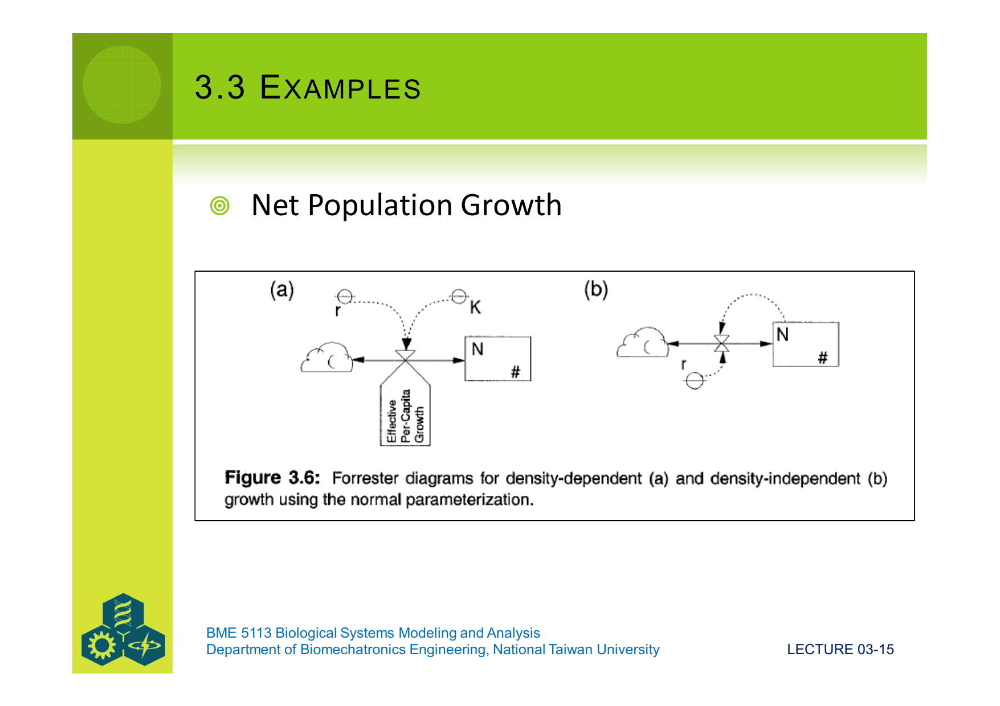

- (a) 密度有關:一個閥代表淨成長率,接受 $r$ 與 $K$ 兩個參數影響,加上「Effective Per-Capita Growth」這個輔助變數。
- (b) 密度無關:一個閥,只接受 $r$ 影響。

兩種畫法對應的方程式相同,只是「分得多細」不一樣。**這是質性建模常見的設計選擇**——畫多細,取決於目標和讀者。

### 3.3.3 多狀態變數與並聯模型

當系統有多個物種、多個區隔時,**每一個都用一個方框畫出來**,彼此用流、用資訊流連接。例如一個假想的農業生態系(原講義圖 3.8):

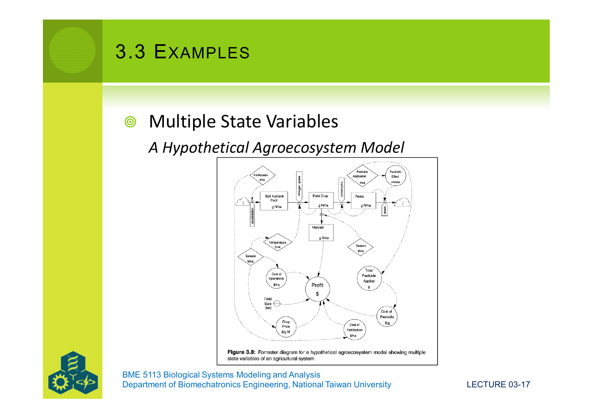

這張圖裡有多個狀態變數:
- 土壤養分池 (Soil Nutrient Pool, g N/ha)
- 田間作物 (Field Crop, g N/ha)
- 害蟲 (Pests, g N/ha)
- 收穫 (Harvest, g N/ha)
- 利潤 (Profit, $)

並用多個輔助變數、驅動變數(季節、施肥時間、施藥時間)、參數連結。**看似複雜,但只要每個元件都遵守符號規則,就可以一步一步逐塊閱讀**——「一口一口吃」。

### 3.3.4 多種流動變數——「g N 不能流進 g C」

當系統內有不同單位的量(例:碳、氮),它們**不能直接互流**——這違反質量守恆。
解決方法:**畫多個平行的 Forrester 圖**,每個圖只描述一種單位的流動,但圖之間可以用**資訊流**互相影響。

#### 神經細胞模型(Na 與 K 兩種離子)

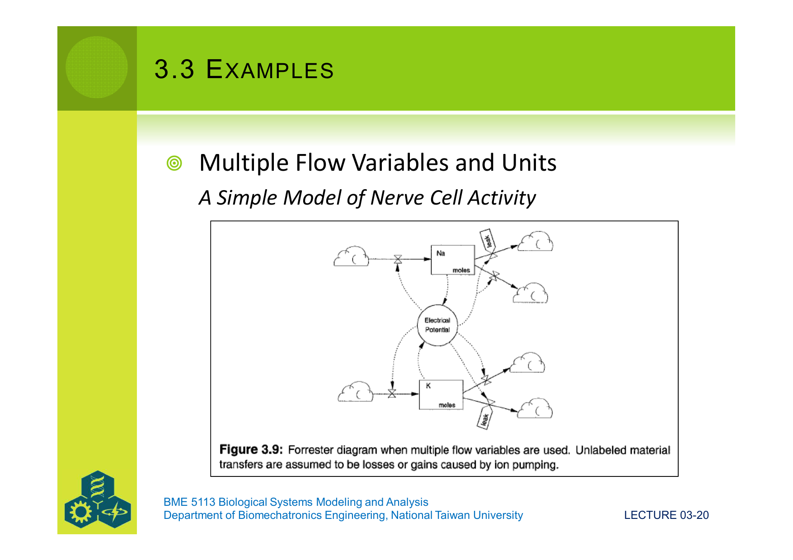

- 上面是 **Na+(鈉離子)** 的流動,單位 mol。
- 下面是 **K+(鉀離子)** 的流動,單位 mol。
- 中間有一個輔助變數「Electrical Potential(電位)」,**同時接受兩個離子量的影響**,又回頭影響兩種離子的流速——這就是離子幫浦的本質。

#### 捕食者—被食者模型(Predator–Prey)

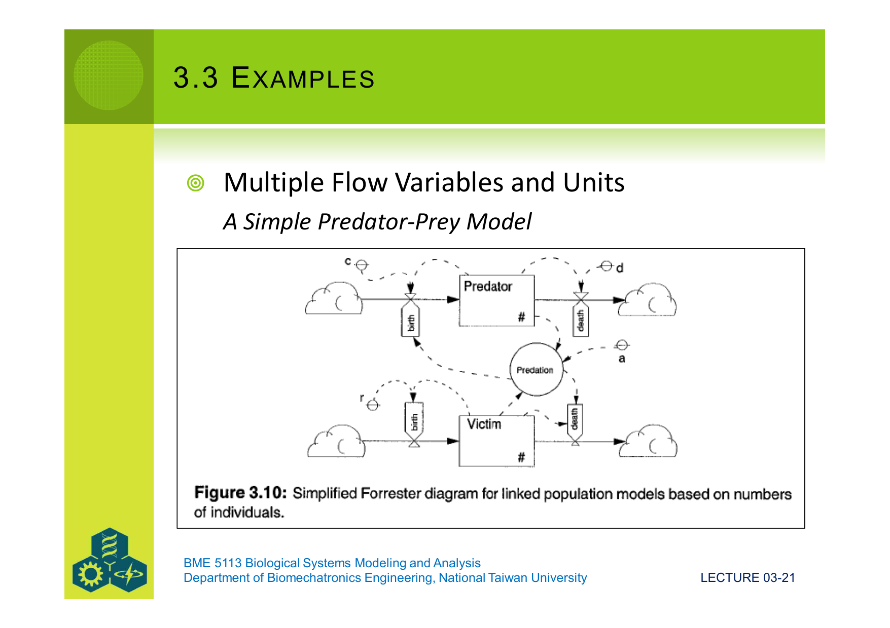

- 上面是「捕食者 (Predator)」的數量流動。
- 下面是「被食者 (Victim/Prey)」的數量流動。
- 兩者用一個叫做「Predation(捕食率)」的輔助變數連起來——它接受 Predator 與 Victim 兩個狀態變數的影響,既影響 Victim 的死亡率,也影響 Predator 的出生率。

這個模型就是有名的 **Lotka–Volterra 模型**——下一節會看到它跑起來的樣子。

#### 多變數的互動方式

當兩個變數在「同一個生物組織層級」上影響某個過程時,常見的互動方式有:
- **負反饋 (negative feedback)**:互相抑制(像草原上的兩種競爭物種)。
- **協同 (synergism)**:互相增強(像維生素 D + 鈣質一起促進骨骼生長)。
- **替代 (substitutable)**:獨立、可互換(像不同氮源都能餵植物)。

質性建模時要先決定:**這兩個變數的互動屬於哪一種?** 這會直接影響後面方程式的形式。

---

## 3.4 常見錯誤:畫 Forrester 圖時要避開的 10 個坑

Forrester 圖看似簡單,但有許多「畫了等於沒畫」的常見錯誤。原講義列出 10 個:

| # | 錯誤 |
|---|---|
| 1 | 使用 Fig 3.2 沒定義的符號(例如沒有箭頭的實線) |
| 2 | 沒有為每個方框、變數、參數標**名稱與單位** |
| 3 | 顯示「源/匯」影響速率(源/匯不會影響任何東西) |
| 4 | 顯示「速率」影響狀態變數(速率不直接連到方框上,要透過閥) |
| 5 | 顯示資訊流直接進入狀態變數(**狀態變數只能透過速率改變**) |
| 6 | 顯示物質流連到「不是狀態變數或源/匯」的東西 |
| 7 | 顯示「不會變的量」(如參數)被影響 |
| 8 | 顯示資訊流直接從狀態變數連到另一個狀態變數(中間沒經過閥) |
| 9 | 流動或狀態變數的「單位不相容」(g N 流入 g C) |
| 10 | 圖中的狀態變數,**沒出現在目標或方程式中**(或反之) |

原講義的圖 3.11 把 6 個錯誤示範收在一起:

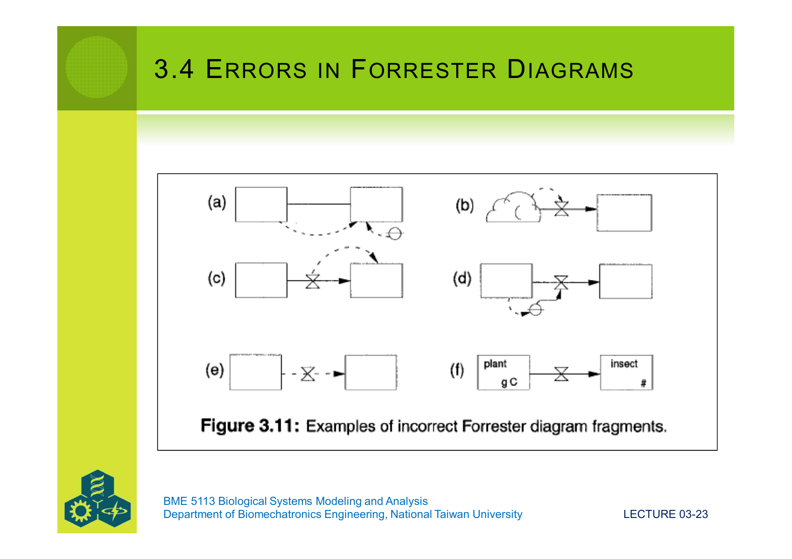

- (a) 沒有箭頭的實線 + 沒標籤(犯了規則 1、2、5)
- (b) 源直接影響閥(規則 3)
- (c) 速率箭頭影響狀態(規則 4)
- (d) 影響到參數(規則 7)
- (e) 兩個狀態之間用虛線連(規則 8)
- (f) g C 直接流到「# 個體數」(規則 9)

**自我檢查清單**:畫完 Forrester 圖後,從 1 到 10 一條一條檢查,可以避免大部分粗心錯誤。

---

## 3.5 Forrester 圖的優缺點

### 優點

- **學習基本概念很有幫助**:強迫你思考「什麼是狀態、什麼是流、什麼是影響」。
- **理解快、批評容易**:同事看圖很快能找出你假設的漏洞。
- **可作為電腦模擬的藍圖**:有現成軟體(如 **Vensim**、Stella、Insight Maker)可以直接把畫好的 Forrester 圖**自動轉成可執行的模擬程式**。

#### Vensim 範例

下圖是 Vensim 直接執行第 3.3.4 節的捕食者—被食者模型,跑出來的真實 Lotka–Volterra 振盪曲線:

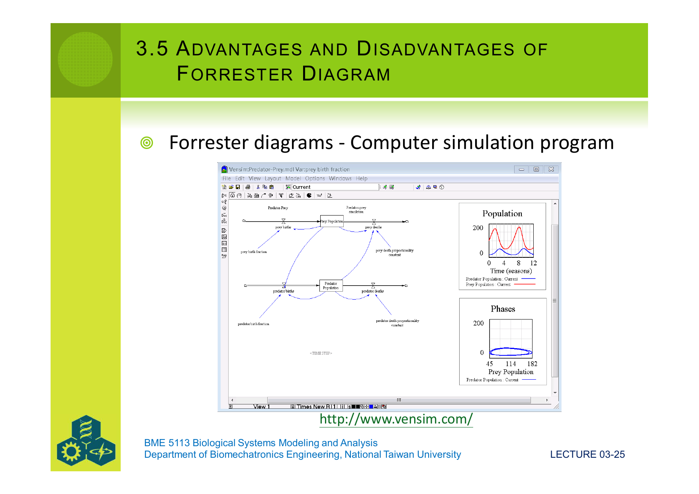

- 左邊是 Forrester 圖(由使用者畫出)。
- 右上是時間軌跡圖:藍線是 Predator、紅線是 Prey,兩者**周期性振盪**。
- 右下是相空間圖:Predator vs Prey 在 (Predator, Prey) 平面上畫出**封閉軌跡**(這是 Lotka–Volterra 系統的招牌特徵)。

軟體連結:[http://www.vensim.com/](http://www.vensim.com/)

### 缺點

- **超過一個複雜度後,圖會變成義大利麵**——元件太多、連線太多,反而看不懂。**Forrester 圖最適合中等複雜度的模型**;太簡單時直接寫方程式更快,太複雜時要分塊或改用其他方式表達。

### 課堂練習:鍋蓋水循環

原講義給的一個分組練習——把下面這個簡單的物理系統,畫成 Forrester 圖:

> **鍋蓋水循環模型 (Pan Water Cycle)**:
> 一鍋水會蒸發 → 凝結在鍋蓋上 → 又滴回鍋裡。這個小系統可以模擬全球海洋的水循環。
> 水分三類:**鍋裡的水、空氣中的水、鍋蓋上的水**。它們之間透過**蒸發、凝結、降水**互轉。

完成的 Forrester 圖長這樣:

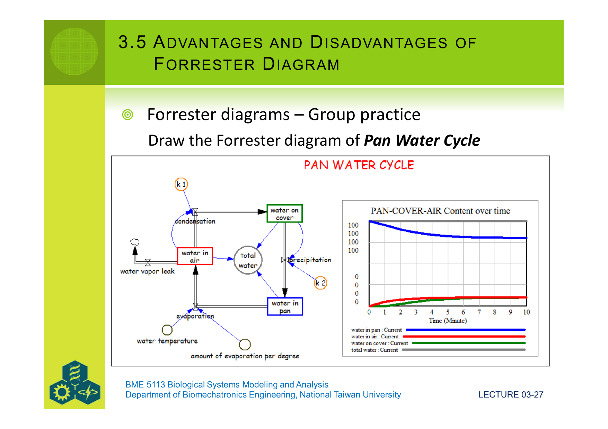

注意:
- 三個狀態變數(藍框、紅框、綠框)
- 三個閥(condensation、precipitation、evaporation)
- 一個源/匯(water vapor leak)
- 兩個參數 k1、k2 控制凝結與降水速率
- 兩個輔助變數(water temperature、amount of evaporation per degree)影響蒸發速率
- 一個輔助變數 total water = pan + air + cover

右邊的曲線顯示:**最後系統會趨於平衡**(三條曲線都變平),但因為有 leak,總水量(灰線)會持續下降。

**請對應 §3.4 的 10 條規則,檢查這張圖每個元件是否合規。**

---

## 3.6 質性建模的原則

把上面所有觀察整理成一個**簡單的流程**:

### 4 個關鍵步驟

1. **Identify the state variables (levels)**——找出狀態變數
2. **Identify the flows among the state variables**——找出狀態變數之間的流
3. **Identify the controls on the flow rates**——找出影響每個流速的因素
4. **Identify the auxiliary and driving variables**——找出輔助變數與驅動變數

### 在動筆前要先回答的 7 個問題

| # | 問題 |
|---|---|
| 1 | **要回答什麼問題?**(回到第二課的 Objective) |
| 2 | 為了回答問題,需要哪些**量**? |
| 3 | 需要哪些**方程式**? |
| 4 | 還有哪些**主要的流量**會用到? |
| 5 | 需不需要**明確的空間表示**?(對應第一課的空間異質 vs 同質) |
| 6 | 狀態變數之間的流速,**受什麼控制**? |
| 7 | 你**知道哪些參數的名稱**?(這幫你之後找文獻) |

**最重要的提醒**:這 7 個問題的順序**不是隨便排的**——前面問題沒回答清楚,後面的就會出錯。回到第二課的 Pólya 第一步:**理解問題比解問題更重要**。

---

## 3.7 模型簡化的策略

質性建模常常會「畫太多」——一開始想把所有細節都放進去,結果圖變成義大利麵。原講義給了 4 類簡化策略:

### 策略 1:消除狀態變數 (Eliminate state variables)

- **把某個狀態變數變成常數或輔助變數**:當某個量「相對來說不太變」,就不要把它當狀態變數。例:研究池塘水質時,如果太陽輻射量已知,可以把它當作驅動變數而不是狀態變數。
- **合併狀態變數**:當兩個量「行為很像」,合併成一個。例:把 5 個小型魚種合併成「小型魚 (small fish)」一個狀態變數。

### 策略 2:做「更強」的假設 (Make stronger assumptions)

- **把狀態變數的函數,換成常數**:例如把「per capita 出生率隨年齡變化」簡化成「per capita 出生率是個常數」。
- **把非線性關係換成線性**:logistic 模型本身就是這樣——「per capita 率隨 N 線性下降」,而真實世界可能是更複雜的曲線。

### 策略 3:去掉時間複雜度 (Remove temporal complexity)

- **把隨機模型變成確定模型**:第一課提過隨機/確定的對比;模擬隨機模型成本高很多。
- **把驅動變數變成常數**:例如「不考慮季節變化」,把溫度當常數。

### 策略 4:去掉空間複雜度 (Remove spatial complexity)

把空間異質模型(每個位置都不同)簡化成空間同質模型(只看「整個系統的平均」)。**第一課 §1.4 的島嶼生物地理學模型,就是這樣**——我們不關心物種在島的哪一角。

**核心精神**:**每加一層複雜度,就要問:「這個複雜度對我的 objective 有幫助嗎?」** 沒幫助就拿掉。這呼應第二課的 Occam's Razor。

---

## 3.8 其他建模問題:Forrester 不夠用的時候

Forrester 圖適合**隔室模型 (compartment models)**——把系統切成幾塊,每塊一個方框。但有些系統不適合這樣畫:

### 3.8.1 傳輸模型 (Transport Models)

當系統是**空間連續**的(例如河流裡的污染物分布、空氣中的熱擴散),沒辦法清楚地切成「幾個方框」。
這類問題用**偏微分方程式 (partial differential equation, PDE)** 描述:

$$
\frac{\partial p(x, t)}{\partial t} \;=\;
\bigl(\text{Advection In}\bigr) - \bigl(\text{Advection Out}\bigr)
+ \bigl(\text{Diffusion In}\bigr) - \bigl(\text{Diffusion Out}\bigr)
+ \bigl(\text{Pollutant Creation}\bigr) - \bigl(\text{Pollutant Destruction}\bigr)
$$

#### 名詞解釋

- **$p(x, t)$**:位置 $x$、時間 $t$ 的污染物濃度。
- **$\partial / \partial t$**:**偏微分** (partial derivative)——下一課會詳細介紹。簡單說就是「**在某個位置 $x$,濃度隨時間 $t$ 的變化率**」。
- **Advection 平流**:被「整體流動」帶過去的(像河水把垃圾沖下游)。
- **Diffusion 擴散**:因濃度差自己「擴散」過去的(像香水在房間裡瀰漫)。
- **Creation / Destruction**:化學反應產生/分解了污染物。

雖然 Forrester 圖**不**直接適合連續空間,但在建模的**早期階段**,還是可以用「**把連續空間切成許多小格子**」的方式,**先用 Forrester 圖描述每個格子內部的流動結構**,然後再轉成 PDE:

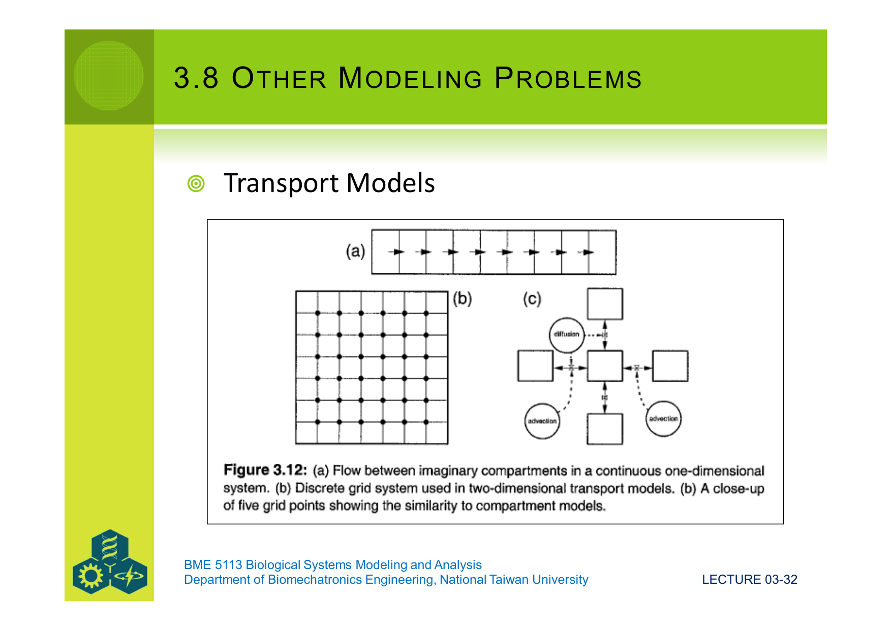

(a) 一維連續系統,想像切成許多小隔室。
(b) 二維離散網格,每個交點都是一個小隔室。
(c) 把中間某個小隔室放大——它其實長得跟 Forrester 圖的方框一樣,只是有 4 個方向的流入/流出。

### 3.8.2 粒子模型 (Particle Models) — Lagrangian 視角

當系統的「物件是離散的個體」(撞球、單個生物、單個分子),而且我們**追蹤每一個個體**,就叫**粒子模型**。

> 這跟 Forrester 圖(把所有同類生物加總起來)是**完全相反的視角**——
> - **Eulerian 視角**(歐拉):固定在空間的某一點,看「有多少東西經過」。傳輸模型屬此。
> - **Lagrangian 視角**(拉格朗日):跟著每一個粒子走,記錄它的軌跡。粒子模型屬此。

例:**單一捕食者追逐單一獵物**——

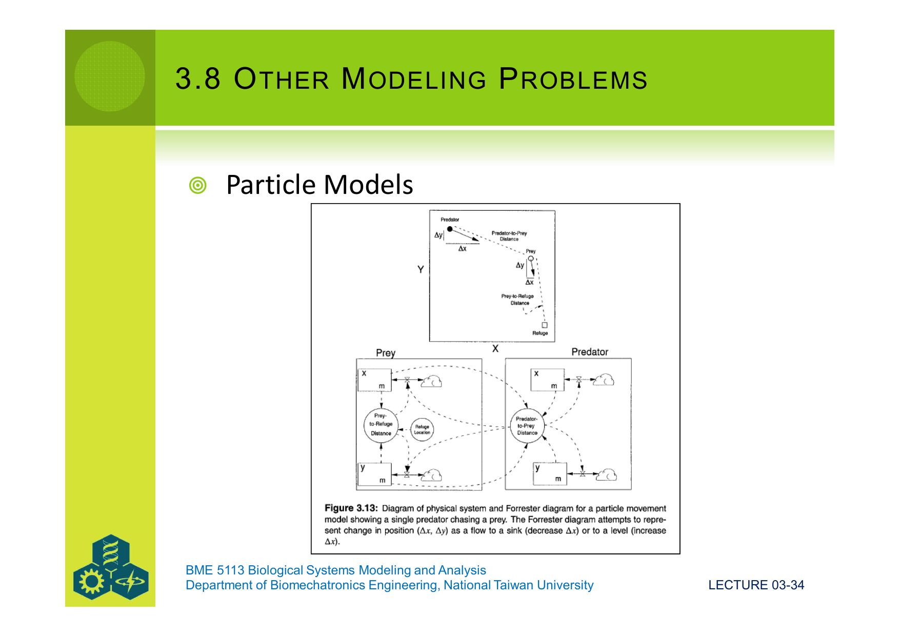

上方:物理空間中的場景——一個捕食者(黑點)在追一個獵物(空圈),獵物想跑回 refuge(避難所,方形)。狀態變數是 $(x, y)$ 坐標,以及與目標的距離 $\Delta x, \Delta y$。

下方:把這個場景用 Forrester 圖表達——但需要**兩個並聯的子圖**(prey 一份、predator 一份),且各自有狀態變數 $x, y$。雖然能畫,但**對所有個體都這樣畫並不實用**——只對少數重點個體有用。

粒子模型通常直接用程式碼寫(每個粒子是一個物件),Forrester 圖只在**早期形成概念**時使用。

### 3.8.3 有限狀態模型 (Finite State Models)

第一課提過,有些系統的物件只有「**少數幾個離散狀態**」(存活/死亡、感染/未感染、晴天/雨天/多雲),隨機(或依規則)地轉換。

例:**簡化的天氣模型**——

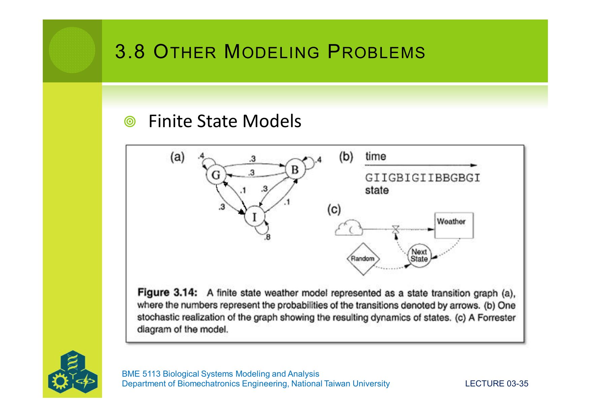

- (a) 狀態轉移圖:三個狀態 G (Good/晴)、B (Bad/雨)、I (Intermediate/多雲),箭頭上的數字是「轉移機率」。例:今天晴,明天有 0.3 機率變多雲、0.3 機率變雨、0.4 機率還是晴。**這叫做 Markov chain(馬可夫鏈)**。
- (b) 一次隨機模擬的結果:「G I I G B I G I I B B G B G I……」——一連串的狀態序列。
- (c) 把上面用 Forrester 圖表達:一個叫做「Weather」的狀態方框,接受一個「Next State」輔助變數的更新,而 Next State 由一個「Random」驅動變數(隨機數產生器)決定。

對這類系統,**直接畫狀態轉移圖比 Forrester 圖清楚**。但 Forrester 圖仍可以作為「把模型放進電腦」的中介。

---

## 本課小結

我們在這一課:

- 學到**質性建模**是「從假設到方程式」的橋樑——目的是讓我們**能一致地寫出方程式**。
- 認識了三種圖表系統(Block / Odum / Forrester),選定 **Forrester 圖**為標準語言。
- 學會 **Forrester 圖的 8 個基本符號**,特別是**物質流(實線)與資訊流(虛線)的區別**。
- 用**草—鹿生態系**作為四步建構的範例;用**人口模型**作為「Forrester 圖 → 方程式」的範例(式 3.1 與式 3.2 都是這樣讀出來的)。
- 看了**多狀態變數、多流動單位**的進階範例(農業、神經、捕食者—被食者)。
- 列出 **10 個常見錯誤**作為自我檢查表。
- 學了 Forrester 圖的優缺點,看到 **Vensim** 等軟體把圖自動轉成模擬程式。
- 用 4 步驟、7 個問題,把**質性建模的流程**形式化。
- 用 4 類策略應對**模型簡化**。
- 認識了 Forrester 圖**不夠用**的三類情境:**傳輸模型(PDE)、粒子模型(Lagrangian)、有限狀態模型(Markov)**——它們各有自己的合適表達方式。

下一課,我們會深入到**數學公式化**——當我們已經有一張漂亮的 Forrester 圖,要怎麼把每個閥的速率公式具體寫出來?哪些常見的數學形式可以選?
