# 第四課:量化建模(一)——從圖到方程式

第三課我們把假設畫成了 Forrester 圖。**這一課要把每個「閥」的速率公式具體寫出來**——這是從質性到量化的關鍵一步,也是把模型放進電腦前的最後準備。

但要寫方程式,我們需要更多數學工具。本課會系統介紹:**差分方程式、微分方程式、導數、積分、ODE**;然後用這些工具掌握**生物系統中最常見的速率形式**——尤其是各種「反饋 (feedback)」。

## 課程綱要

- 4.1 從質性到量化
- 4.2 差分方程式與微分方程式(數學工具總整理)
- 4.3 量化模型中的生物反饋
- 4.4 範例模型:Chemostat 與 BZ 反應

---

## 4.1 從質性到量化

回顧第三課:**Forrester 圖的方框 = 狀態變數**——我們關心、想預測其隨時間變化的量。
要把模型「啟動」,每個方框都需要一個**狀態(動態)方程式**:

> 把「**下一刻的狀態值**」表達為「**現在的狀態值 + 所有輸入流 − 所有輸出流**」的關係。

每個輸入/輸出流,則由**速率方程式 (rate equation)** 控制——速率方程式裡會用到:
- 狀態變數(透過資訊流影響速率)
- 參數
- 輔助方程式
- 驅動變數

也就是說:**Forrester 圖告訴我們「方程式有幾個、每個由誰影響」,但每個方程式長什麼樣、用什麼數學形式,需要這一課的工具**。

---

## 4.2 差分方程式與微分方程式

時間有兩種寫法:**離散時間**(只在 $t=0,1,2,\ldots$ 等整數點看)用**差分方程式**;**連續時間**(任何時刻都可以看)用**微分方程式**。

### 4.2.1 差分方程式

最一般的形式:

$$
N_{t+1} \;=\; f(N_t) \qquad (\text{式 4.1})
$$

意思是:「下一時刻的 N,完全由現在的 N 決定」。$f$ 可以任意複雜。

特殊情況——如果我們可以「把 $N_t$ 單獨拉出來」,就會寫成第二課看過的形式:

$$
N_{t+1} \;=\; N_t \;+\; f(\text{狀態變數, 參數, } t) \qquad (\text{式 4.2})
$$

例如,密度無關成長 $f = rN_t$,得到:

$$
N_{t+1} \;=\; N_t \;+\; r\,N_t \qquad (\text{式 4.3})
$$

#### 用迭代法求解析解

從 $N_0$ 開始,一步一步往下推:

$$
\begin{aligned}
N_1 &= N_0 + r N_0 = N_0 (1+r) \\
N_2 &= N_1 + r N_1 = N_1 (1+r) = N_0 (1+r)^2 \\
N_3 &= N_2 + r N_2 = N_0 (1+r)^3 \\
&\vdots \\
N_{t+1} &= N_t (1+r) = N_0 (1+r)^{t+1} \qquad (\text{式 4.4})
\end{aligned}
$$

這就是上一課提到的「指數成長」的離散版。它假定:**時間是離散的,事件只在整數時間點發生**(例如:秋季同步繁殖的昆蟲、每年一次的人口普查)。

### 4.2.2 從離散到連續——介紹「導數」

很多生物過程**不是**離散的:細胞分裂、化學反應、溫度變化、河水流動……這些都是「**每一個瞬間**」都在發生。要描述它們,我們需要**連續時間**——這就要引入**導數 (derivative)**。

#### 什麼是導數?——從割線到切線

考慮一條曲線 $y = f(x)$。

**問題**:「在某一點 $x_0$,曲線『正在以多快的速度上升』?」

如果只有兩個點 $(x_0, y_0)$ 和 $(x_0 + \Delta x, y_0 + \Delta y)$,我們能算的只是**割線斜率**:

$$
\text{割線斜率} = \frac{\Delta y}{\Delta x} = \frac{y_{x_0+\Delta x} - y_{x_0}}{\Delta x}
$$

但**割線**不等於曲線在 $x_0$「那一點」的真實斜率——它只是「兩點連線」的斜率。如果 $\Delta x$ 太大,誤差就大。

**那如果讓 $\Delta x$ 越來越小呢?** 直覺上:**$\Delta x$ 越小,割線就越接近曲線在那一點的「切線」**。

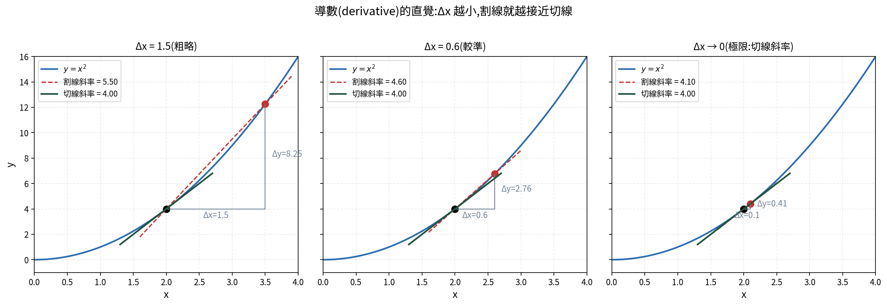

從上圖可以看到,對 $y = x^2$ 在 $x_0 = 2$ 這一點:
- $\Delta x = 1.5$ 時,割線斜率 $= 5.50$(粗略)
- $\Delta x = 0.6$ 時,割線斜率 $= 4.60$(較準)
- $\Delta x \to 0$ 時,割線斜率 $\to 4.00$(真值)

**「真值 4」就是 $y = x^2$ 在 $x = 2$ 的導數**。寫法是:

$$
\boxed{\; \frac{dy}{dx} \;=\; \lim_{\Delta x \to 0} \frac{y_{x+\Delta x} - y_x}{\Delta x} \;} \qquad (\text{式 4.5})
$$

「$\lim$」(limit)讀作「極限」,意思是「當 $\Delta x$ 趨近於 0 時,這個分式的值趨近什麼」。

**直覺記法**:把 $dy/dx$ 念成「**$y$ 對 $x$ 的瞬時變化率**」。
- 物理上,如果 $y$ 是位置、$x$ 是時間,那 $dy/dx$ 就是**速度**。
- 生物上,如果 $y$ 是族群數量、$x$ 是時間,那 $dy/dx$ 就是**族群增長率**。

#### 一個常用的求導規則

可以證明(微積分課會教):**冪函數的導數**

$$
\frac{d}{dx}(x^n) \;=\; n \cdot x^{n-1}
$$

驗證:$\dfrac{d}{dx}(x^2) = 2 x^{2-1} = 2x$。代入 $x = 2$ 得 $2 \times 2 = 4$ ✓——跟上圖的極限結果一致!

### 4.2.3 反向操作——介紹「積分」

如果**導數**是「給曲線、求斜率」,那**積分 (integral)** 就是「給斜率(或某個函數)、求曲線」——也可以理解為「**曲線下面積累的總量**」。

兩種理解方式:

#### (a) 把積分當「加總」(Riemann sum)

要算曲線 $f(x)$ 在 $x = a$ 到 $x = b$「下面的面積」,可以把這段 $x$ 切成 $n$ 個小矩形,加起來:

$$
\text{面積} \;\approx\; \sum_{i=1}^{n} f(x_i) \cdot \Delta x
$$

當 $n \to \infty$(矩形越切越細),這個加總就趨近於**真實面積**——這就是定積分:

$$
\int_a^b f(x)\,dx \;=\; \lim_{n \to \infty} \sum_{i=1}^{n} f(x_i) \cdot \Delta x
$$

「$\int$」(integral 符號)就是長條的「S」,代表 sum(加總)。

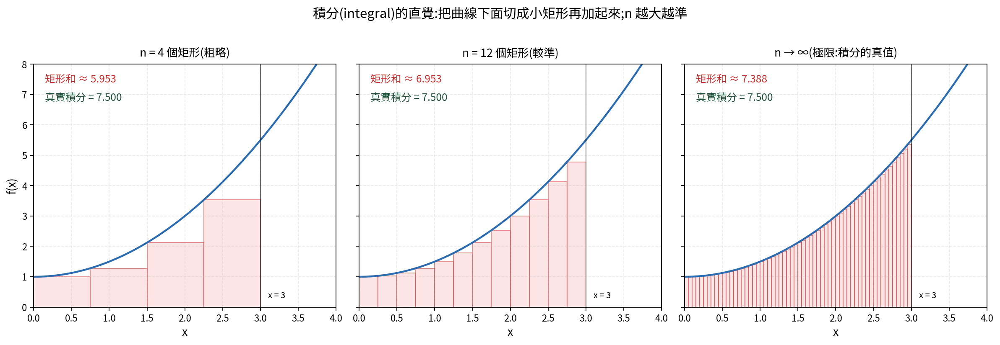

#### (b) 應用積分規則(反導數)

積分跟導數是**反向操作**——這叫做**微積分基本定理**:

> **如果 $\dfrac{dF}{dx} = f(x)$,那麼 $\displaystyle\int f(x)\,dx = F(x) + C$**($C$ 是任意常數)。

也就是說:**找出哪個函數 $F$ 的導數是 $f$,那麼 $F$ 就是 $f$ 的「反導數」**——加一個任意常數 $C$,就是不定積分。

例:**$\displaystyle\int 2x\,dx = ?$**
我們知道 $\dfrac{d}{dx}(x^2) = 2x$,所以反過來 $\displaystyle\int 2x\,dx = x^2 + C$。

#### 一個小例題

求解 $\dfrac{dy}{dx} = 2x$:

| 步驟 | 動作 | 結果 |
|---|---|---|
| 分離變數 | 兩邊乘 $dx$ | $dy = 2x\,dx$ |
| 兩邊積分 | 加 ∫ | $\int dy = \int 2x\,dx$ |
| 左邊算積分 | $\int dy = y + C_1$ | |
| 右邊算積分 | $\int 2x\,dx = x^2 + C_2$ | |
| 兩邊相等 | 合併常數 $C_1, C_2$ | $\boxed{\;y = x^2 + C\;}$ |

對照原講義圖 4.2:$y = x^2 + C$ 是一族「上下平移的拋物線」(不同 $C$ 給不同曲線);$dy/dx = 2x$ 卻是**同一條斜直線**(因為平移不改變斜率)。
這就是為什麼**從 ODE 求解時會多出一個 $C$**——需要「初始條件」(例如 $y$ 在某個 $x$ 的值)才能定下來。

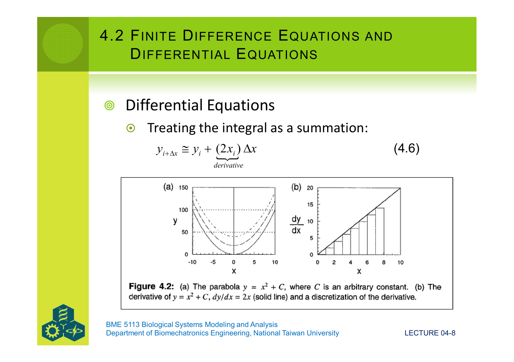

### 4.2.4 常微分方程式(ODE)

**常微分方程式 (Ordinary Differential Equation, ODE)**:**任何「包含因變數對自變數的導數」的方程式**。

例:第二課的密度無關成長,連續時間版本是:

$$
\boxed{\; \frac{dN}{dt} \;=\; r\,N \;} \qquad (\text{式 4.7})
$$

意思:「人口的瞬時變化率,等於 $r$ 乘上當下人口」。

#### 解這個 ODE——用「分離變數法」

| 步驟 | 動作 | 結果 |
|---|---|---|
| 起點 | | $\dfrac{dN}{dt} = rN$ |
| 分離變數 | 把含 $N$ 的全部移左、含 $t$ 的移右 | $\dfrac{dN}{N} = r\,dt$ |
| 兩邊積分 | | $\int \dfrac{1}{N}\,dN = \int r\,dt$ |
| 左邊 | $\int \frac{1}{N}dN = \ln N + C_1$(基本積分) | |
| 右邊 | $\int r\,dt = rt + C_2$ | |
| 合併 | 把常數合併成 $C_3$ | $\ln N = rt + C_3$ |
| 兩邊取 $e$(自然對數的反操作) | | $N_t = e^{rt + C_3} = e^{C_3} \cdot e^{rt}$ |
| 用初始條件 $N_0$(當 $t=0$,$N = N_0$) | $e^{C_3} = N_0$ | $\boxed{\; N_t = N_0\, e^{rt} \;}$ |

**這就是連續時間下的指數成長**——比第二課離散版的 $N_0 (1+r)^t$ 平滑(用 $e^{rt}$ 而不是 $(1+r)^t$),但兩者形狀類似(當 $r$ 小時 $e^r \approx 1 + r$)。

#### Euler approximation:用差分逼近微分

很多 ODE **沒有**簡單的解析解(像第二課的 logistic 方程其實有,但複雜)。這時我們用**數值方法**——最簡單的是 **Euler 法 (Euler approximation)**:

把導數 $\dfrac{dN}{dt}$ 近似成 $\dfrac{N_{t+\Delta t} - N_t}{\Delta t}$,然後解出 $N_{t+\Delta t}$:

$$
\frac{N_{t+\Delta t} - N_t}{\Delta t} \approx r\,N_t
\;\;\Longrightarrow\;\;
\boxed{\; N_{t+\Delta t} \;\approx\; N_t \;+\; r\,N_t \cdot \Delta t \;} \qquad (\text{式 4.8})
$$

**意思**:從現在的 $N_t$ 開始,用「當下的斜率」乘上一個小時間步 $\Delta t$,得到下一步的近似值。然後再用新的 $N$ 算下一個斜率,一步一步往前推。
$\Delta t$ 越小,近似越準。**這就是電腦做數值模擬的基礎**——第五課會深入。

> **總結**:差分方程式 ≈ ODE 用 Euler 法數值化的結果。兩者是同一現象的兩種寫法,各有優缺點。

---

## 4.3 量化模型中的生物反饋

現在我們有工具了——可以開始把 Forrester 圖「轉換」成方程式。

### 4.3.1 從 Forrester 圖到方程式的三條規則

| # | 規則 |
|---|---|
| 1 | **每一個 level(狀態變數)需要一條微分(或差分)方程式** |
| 2 | **每一條進入/離開狀態變數的物質流,需要一個代數表達式**(速率方程式)。所有「流入」加起來、減掉「流出」,就是右手邊 |
| 3 | **生物系統雖然複雜,但常見的過程只有幾類**——學會這幾類,就能組合出大部分模型 |

第二條規則寫成公式:

$$
\frac{dx}{dt} \;=\; \sum (\text{流入}) \;-\; \sum (\text{流出})
$$

接下來幾節,就在學這「幾類常見過程」的數學形式。

### 4.3.2 常數流與整體流(Constant and Bulk Flow)

最簡單的情況:**速率是常數**(不隨任何狀態變化)。

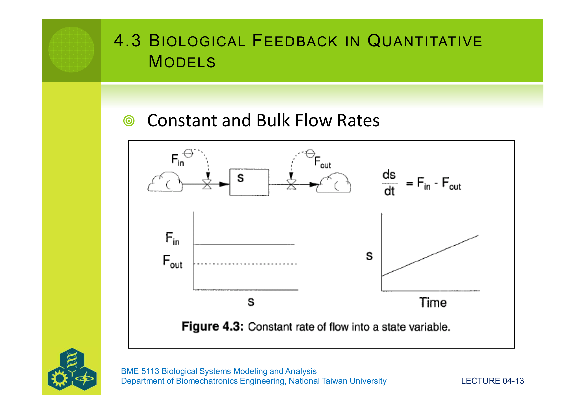

設 $F_{\text{in}}$、$F_{\text{out}}$ 都是常數:

$$
\frac{ds}{dt} \;=\; F_{\text{in}} - F_{\text{out}}
$$

如果 $F_{\text{in}} > F_{\text{out}}$,$s$ 就**線性上升**;反之線性下降。

**三隔室例子**——三個狀態變數,所有流動都是常數:

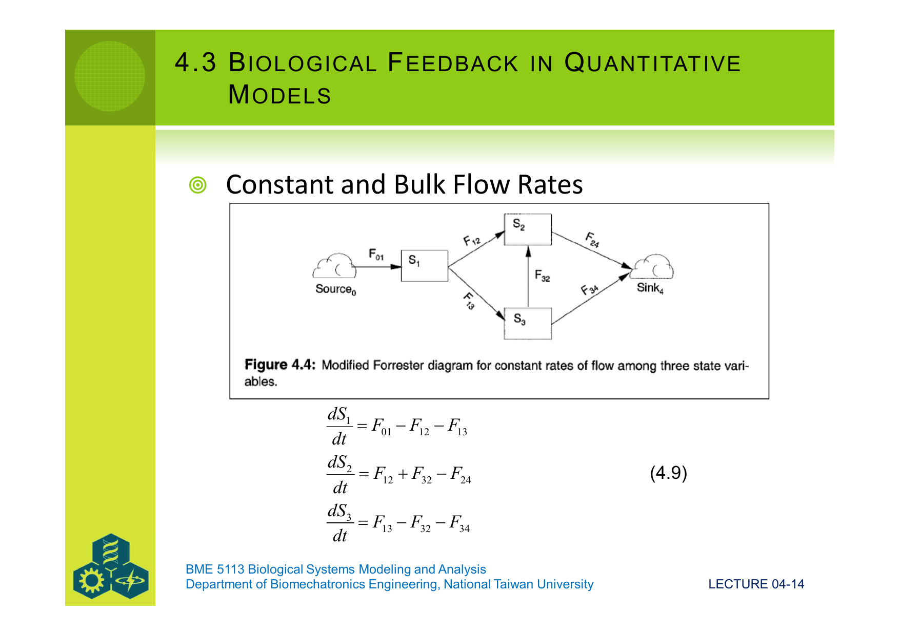

逐一寫出每個方框的方程式(對應第 1 條規則):

$$
\begin{aligned}
\frac{dS_1}{dt} &= F_{01} - F_{12} - F_{13} \\
\frac{dS_2}{dt} &= F_{12} + F_{32} - F_{24} \\
\frac{dS_3}{dt} &= F_{13} - F_{32} - F_{34}
\end{aligned}
\qquad (\text{式 4.9})
$$

**注意對應關係**:每一個物質流箭頭,在「上游」方框的方程式裡是「**減**」(它流出),在「下游」方框的方程式裡是「**加**」(它流入)。$F_{32}$ 同時出現在 $S_2$(加)與 $S_3$(減)的方程式裡——這是**質量守恆**。

### 4.3.3 動態相對速率(Dynamic Relative Rates)

更常見的情況:**速率受其他狀態變數的影響**——也就是有資訊流進入閥。

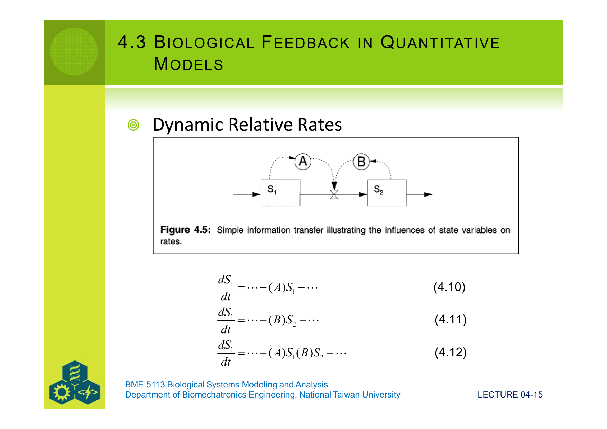

設 $S_1$ 是「捐贈者 (donor)」、$S_2$ 是「接收者 (recipient)」。三種可能寫法:

| 公式 | 名稱 | 意義 |
|---|---|---|
| $\dfrac{dS_1}{dt} = \cdots - A\,S_1 - \cdots$  (式 4.10) | **Donor-controlled 捐贈者控制** | 速率正比於「上游有多少」(像水從滿杯流到空杯) |
| $\dfrac{dS_1}{dt} = \cdots - B\,S_2 - \cdots$  (式 4.11) | **Recipient-controlled 接收者控制** | 速率正比於「下游能接多少」(像泵浦,接收者主導) |
| $\dfrac{dS_1}{dt} = \cdots - A\,S_1 \cdot B\,S_2 - \cdots$  (式 4.12) | **Mass action 質量作用** | 速率正比於「上下游的乘積」(像化學反應、捕食) |

> $A$、$B$ 都叫做**per capita 率**(每單位的速率)。這樣寫的好處:**用「每個個體的行為」來估參數,可以套用到任何族群大小**。

#### 用島嶼生物地理學再寫一遍

對照第一課的式 1.1,連續時間版本是:

$$
\frac{dR}{dt} = I_x - \frac{I_x}{P}R - \frac{E_x}{P}R = I_x - \frac{I_x + E_x}{P}R \qquad (\text{式 4.13})
$$

對應第一課的平衡點 $\hat{R} = \dfrac{I_x \cdot P}{I_x + E_x}$。**只是把差分換成微分,結論一樣。**

### 4.3.4 「反饋」的概念

> **Feedback(反饋)**:當一個變數的值上升或下降,**回頭影響**某個過程的速率。

反饋是**幾乎所有有趣的生物模型**的核心。原講義圖 4.6 把反饋分成兩個維度:**直接 vs 間接**、**正 vs 負**:

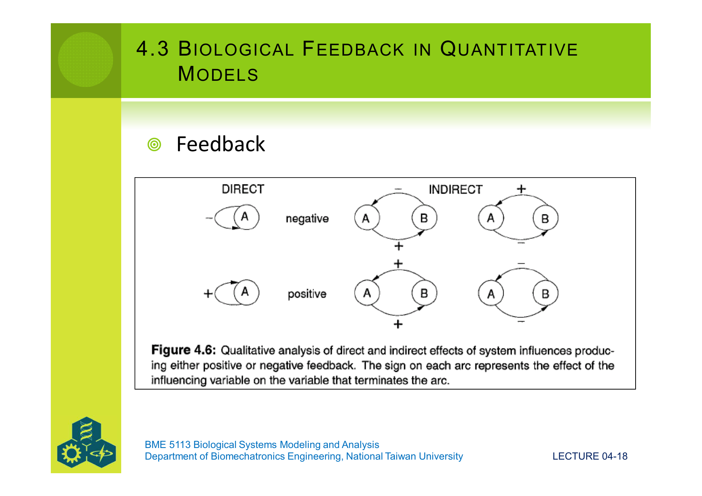

弧上的「+」或「−」號表示**影響的正負**:「A → B(+)」表示「A 增加會讓 B 增加」。
直接反饋:A 影響到自己(自迴圈)。
間接反饋:A → B → A 形成迴路。

直接和間接的「負反饋」與「正反饋」可以混合——下面我們分別看細節。

### 4.3.5 正反饋(Positive Feedback)

> **正反饋的關鍵特徵:速率隨變數無上限地增加**(「越多 → 增加得越快」)。

最經典的例子就是指數成長:

$$
\frac{ds}{dt} \;=\; k\,s
$$

(這跟式 4.7 結構一樣,但這裡寫成更一般的形式。)

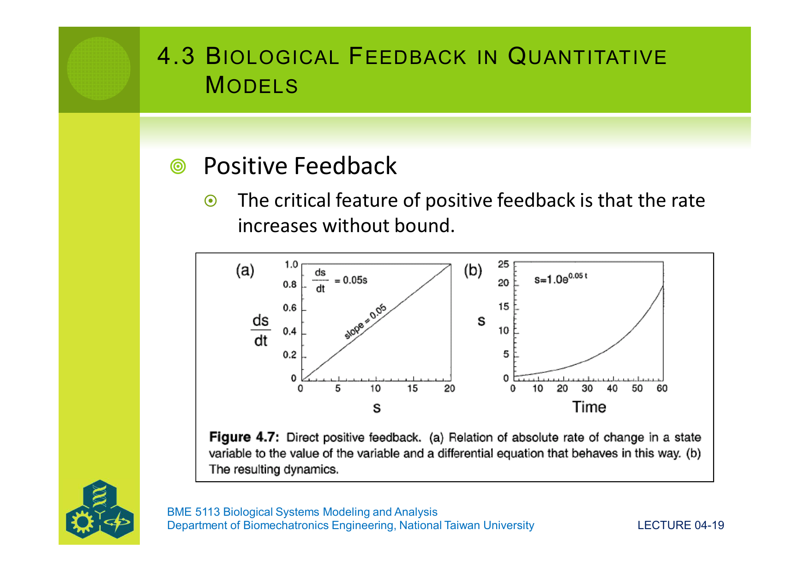

(a) 速率隨 $s$ **線性上升**(斜率 = $k$)。
(b) 因此 $s$ 隨時間**指數爆炸**——$s = s_0\,e^{kt}$。

**生物學意義**:沒有任何限制因素時,任何成長的東西都會「爆炸」。從細胞分裂到核反應到病毒傳播——這就是為什麼真實系統**一定**還會有負反饋來抑制。

### 4.3.6 負反饋的三種數學形式

> **負反饋的關鍵特徵:速率被「限制住」——當變數很大時,速率不會繼續增加。**

原講義列出**三種數學方法**讓負反饋成真:

| 類型 | 機制 | 典型例子 |
|---|---|---|
| **(a) 自我抑制 Self-inhibition** | 變數自己壓制自己的成長 | logistic、$dy/dt = ay - cy^2$ |
| **(b) 外部因素 Extrinsic** | 來自系統外的另一個量限制速率 | 牛頓冷卻定律 |
| **(c) 飽和 Saturation** | 接收者「吃不下了」,速率達上限 | Michaelis-Menten、Holling disc |

下圖把三種形式的「速率 vs 控制變數」曲線並排放,可以一眼看出它們的差別:

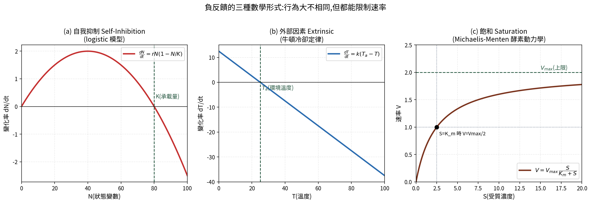

下面分別深入。

#### (a) 自我抑制——以 logistic 為例

第二課寫過 logistic 的離散版,本課寫連續版:

$$
\boxed{\; \frac{dN}{dt} = \left[ r\bigl(1 - \frac{N}{K}\bigr) \right] N \;=\; rN - \frac{r}{K}N^2 \;} \qquad (\text{式 4.14})
$$

「$-\dfrac{r}{K}N^2$」這一項就是**自我抑制**——它隨 $N^2$ 增大而越來越強,把成長壓下來。

兩邊除以 $N$,看 **per capita** 率(每個個體的平均成長速率):

$$
\frac{1}{N}\frac{dN}{dt} \;=\; r - \frac{r}{K}N \qquad (\text{式 4.15})
$$

這是 **$N$ 的線性遞減函數**(從 $r$ 下降到 0)——可以直接畫出來:

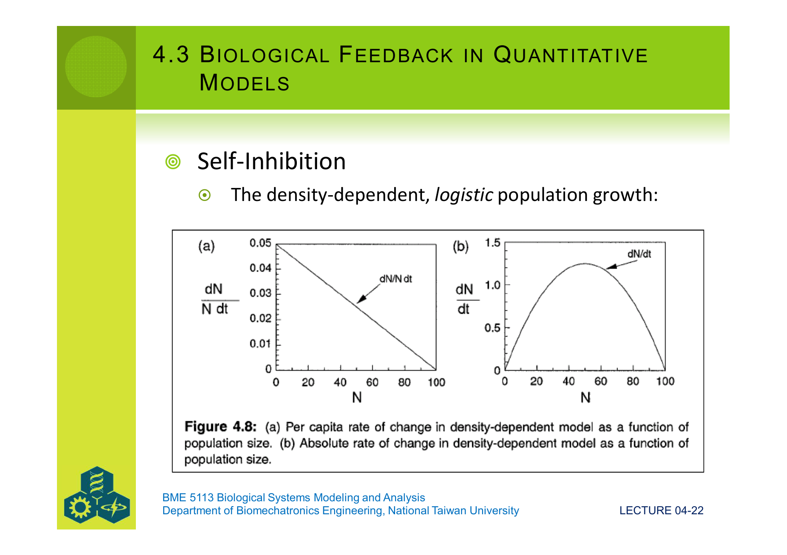

(a) per capita 率 $\dfrac{1}{N}\dfrac{dN}{dt}$ 是**直線下降**——從 $r$(在 $N=0$)到 $0$(在 $N=K$)。
(b) 絕對速率 $\dfrac{dN}{dt}$ 是**拋物線**——在 $N = K/2$ 處達到最大,在 $N = 0$ 和 $N = K$ 都為 0。

#### 自我抑制的其他形式——比率

不只 logistic。原講義給了幾個變形:

**加法式自我抑制(additive)**:
$$
\frac{dy}{dt} = ay - cy^2
$$
跟 logistic 同型(只是換符號)。

**乘法式自我抑制(multiplicative,$y > 1$ 時用)**:
$$
\frac{dy}{dt} = \frac{b}{y}
$$
$y$ 越大、速率越小。但這個式子在 $y \to 0$ 會**爆炸**(分母趨近 0)。

**更安全的形式**——讓 $y \to 0$ 時 $dy/dt$ **不會爆炸**:
$$
\frac{dy}{dt} = b \cdot \frac{1}{1+y}
$$
當 $y = 0$,速率是 $b$(有限大);當 $y$ 大,速率趨近 0。這個形式跟下面的 Michaelis-Menten **同型**——後面會看到。

#### (b) 外部因素——以牛頓冷卻定律為例

> **牛頓冷卻定律**:一個物體的溫度變化率,正比於它與環境溫度的差。

$$
\boxed{\; \frac{dT}{dt} \;=\; k(T_a - T) \;}
$$

其中:
- $T$:物體當前溫度(狀態變數)
- $T_a$:環境溫度(**外部因素**,不在被建模的狀態變數裡)
- $k$:導熱常數(正值)

行為分析:
- 當 $T < T_a$:$(T_a - T) > 0$ → $dT/dt > 0$(物體升溫)
- 當 $T > T_a$:$(T_a - T) < 0$ → $dT/dt < 0$(物體降溫)
- 當 $T = T_a$:速率 = 0(達到熱平衡)

**這是一個典型的「外部因素 negative feedback」**:$T$ 的變化由它**與外部 $T_a$ 的差**決定——當差距為零,變化也停止。

#### (c) 飽和——以 Michaelis-Menten 酵素動力學為例

很多生化反應有**飽和**現象:當受質很少時速率正比於受質,但當受質很多時速率達到一個上限(因為酵素都被佔滿了,再多受質也沒用)。

**生化機制**:酵素 E 跟受質 S 結合成複合物 C,C 再分解出產物 P:

$$
E + S \;\underset{k_2}{\overset{k_1}{\rightleftharpoons}}\; C \;\underset{k_4}{\overset{k_3}{\rightleftharpoons}}\; E + P
$$

每個物質的微分方程式(就是規則 2 的應用):

$$
\begin{aligned}
\frac{dE}{dt} &= -k_1 ES + k_2 C + k_4 C - k_3 EP \qquad (\text{式 4.16}) \\
\frac{dS}{dt} &= -k_1 ES + k_2 C \qquad (\text{式 4.17}) \\
\frac{dC}{dt} &= k_1 ES - k_2 C - k_4 C + k_3 EP \qquad (\text{式 4.18}) \\
\frac{dP}{dt} &= k_4 C - k_3 EP \qquad (\text{式 4.19})
\end{aligned}
$$

在「**準穩態**」(quasi-steady-state)假設下:
1. 產物濃度 $P$ 很小(實驗剛開始)
2. C 的形成速率等於分解速率 → $dC/dt = 0$

這兩個假設讓我們把 4 個方程式**化簡成一個**(數學細節在生化課本):

$$
\boxed{\; V \;=\; V_{\max} \cdot \frac{S}{K_m + S} \;} \qquad (\text{式 4.20})
$$

- $V_{\max}$:最大反應速率(當 $S$ 很大時的上限)
- $K_m$:**半飽和常數** ——「$S = K_m$ 時,$V = V_{\max}/2$」

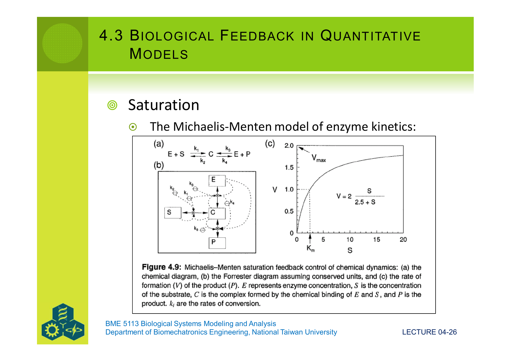

兩個極端:
- 當 $S \ll K_m$:$V \approx (V_{\max}/K_m)\,S$ → **線性正比**(像沒有飽和)
- 當 $S \gg K_m$:$V \approx V_{\max}$ → **平台**(完全飽和)

#### Holling 圓盤方程式

捕食者—被食者也有類似的飽和——捕食者一天能吃的獵物有上限(時間有限、處理時間有限)。

$$
\boxed{\; y \;=\; a T_T \cdot \frac{x}{1 + a h x} \;} \qquad (\text{式 4.21})
$$

- $y$:固定時間 $T_T$ 內捕食者吃掉的獵物總數
- $x$:獵物密度
- $a$:搜尋速率
- $h$:單個獵物的處理時間

形狀跟 M-M 一樣(只是符號不同)——這就是規則 3 的精神:**「同樣的數學形式,出現在完全不同的生物背景中」**。

### 4.3.7 組合反饋:光合作用的「光抑制」

有時系統會**同時**有正反饋與負反饋。原講義的例子:**光抑制 (photoinhibition)**——光太弱時光合作用慢,光剛好時最快,光太強時**酵素被破壞、反而變慢**。

$$
P = P_{\max} \cdot \underbrace{(aI)}_{\text{光越強 → 越快}} \cdot \underbrace{e^{1 - aI}}_{\text{光太強 → 抑制}} \qquad (\text{式 4.22})
$$

這個函數有個**最大值在中間**,然後兩邊都會下降——典型「先升後降」曲線。
**常見技巧**:用「兩個因子相乘」來組合正、負反饋。

### 4.3.8 Allee 效應——「太少也不行」

正常想像中,人口越少越好成長(競爭少)。但有些物種**剛好相反**——人口太少時,**反而**因為找不到配偶、無法協力獵食而瀕臨滅絕。這叫 **Allee effect**。

**立方成長模型**:

$$
\boxed{\; \frac{dN}{dt} = r N \left( \frac{N}{A} - 1 \right) \left( 1 - \frac{N}{K} \right) \;}
$$

其中 $0 < A < K$,$A$ 叫做 **Allee threshold(Allee 閾值)**。

分析(看每個括號的正負):
- $N < A$:第一個括號 < 0,第二個 > 0 → **負成長**(滅絕中)
- $A < N < K$:兩個括號都 > 0 → **正成長**
- $N > K$:第一個 > 0,第二個 < 0 → **負成長**(超過承載量)

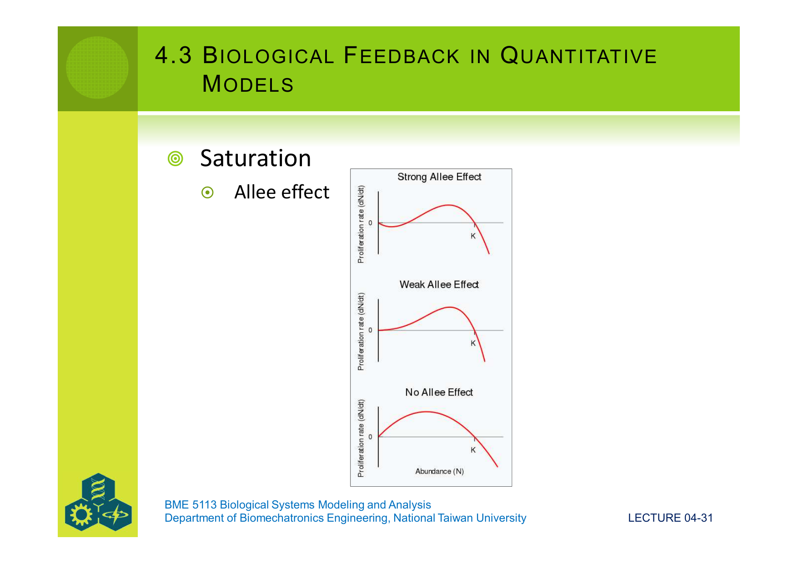

對照圖:
- **Strong Allee Effect**:存在閾值 $A$,$N < A$ 就會滅絕。
- **Weak Allee Effect**:沒有滅絕閾值,但低密度時成長率很低。
- **No Allee Effect**:就是普通 logistic。

### 4.3.9 質量作用(Mass Action)——化學反應與捕食

**質量作用定律 (Law of Mass Action)**:**反應速率正比於各反應物濃度的整數次方乘積**。

$$
R \;=\; a \cdot Q^\alpha \cdot P^\beta
$$

- $\alpha$、$\beta$:**反應級數**(integer powers),通常由反應的化學計量(stoichiometry)決定。

例:反應 $\mathrm{A} + 2\mathrm{B} \rightleftharpoons \mathrm{C}$ 的速率方程式:

$$
\frac{dC}{dt} \;=\; k_1 \cdot A \cdot B^2 \;-\; k_2 \cdot C
$$

(B 的次方 = 2,因為化學式裡有 $2\mathrm{B}$。)

#### Lotka-Volterra 捕食者—被食者方程式

把質量作用套到捕食關係——**捕食速率正比於「捕食者 × 被食者」的乘積**(化學裡兩個分子相遇的機率類比):

$$
\begin{aligned}
\frac{dV}{dt} &= \underbrace{r V}_{\text{被食者正反饋(指數成長)}} \;-\; \underbrace{a V P}_{\text{被吃掉(mass action)}} \qquad (\text{式 4.23}) \\
\frac{dP}{dt} &= \underbrace{a b V P}_{\text{捕食者轉換食物→新生}} \;-\; \underbrace{d P}_{\text{捕食者死亡}} \qquad (\text{式 4.24})
\end{aligned}
$$

其中:
- $V$:被食者(victim)
- $P$:捕食者(predator)
- $r$:被食者密度無關成長率
- $d$:捕食者 per capita 死亡率
- $a$:**搜尋速率**(捕食者多快找到被食者)
- $b$:**轉換效率**(吃下的食物中有多少變成新捕食者)

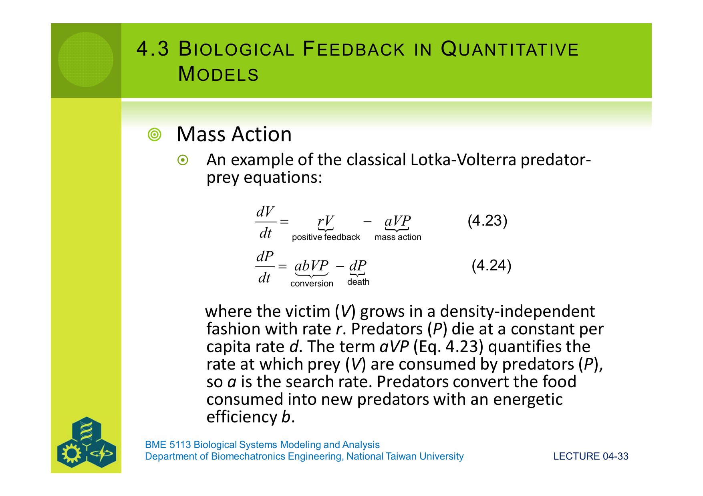

回想第三課 Vensim 的振盪曲線——這對方程式的解就是那條封閉軌跡。**正反饋(被食者繁殖)+ 質量作用(捕食)+ 線性死亡(捕食者死)** = **持續振盪**。

### 4.3.10 多因子控制(Multiple Controlling Factors)

當**多個因素同時影響一個速率**,有兩種狀況:

#### 情境 1:「參數」被次要因子影響

主變數一個、把方程式中的**參數**當成另一變數的函數。

例:光合作用速率 $P$ 跟光強 $I$ 是 M-M 關係,但**最大速率 $P_{\max}$** 跟碳濃度 $C$ 成正比:

$$
P = \frac{\alpha I P_{\max}}{\alpha I + P_{\max}}, \qquad P_{\max} = bC
$$

代入合併:

$$
\boxed{\; P = \frac{\alpha b I C}{\alpha I + b C} \;} \qquad (\text{式 4.25})
$$

#### 情境 2:多個因子「同時」影響——必須全部都有

例:植物需要碳、氮、磷**三種**營養,**缺一不可**。

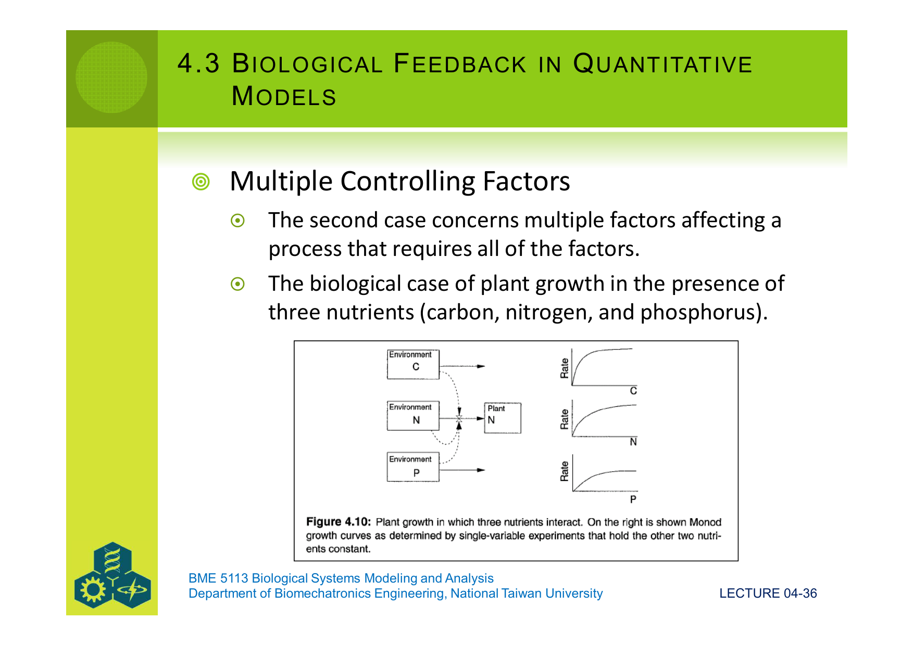

每個單獨的營養做實驗,得到 M-M 形狀的 **Monod 曲線**:

$$
\mu = \mu^* \cdot \frac{N}{K_m + N}
$$

但**如何把三個都組合進來**?有 5 種主要的方法:

| 名稱 | 公式 | 直覺 |
|---|---|---|
| **Liebig 最小值定律** | $\mu = \mu^* \cdot \min\!\left[\frac{C}{K_{m_C}+C},\frac{N}{K_{m_N}+N},\frac{P}{K_{m_P}+P}\right]$ | 整體速率被**最缺的**那個營養限制(木桶理論) |
| **乘法** | $\mu = \mu^* \cdot \left[\cdot\right]\cdot\left[\cdot\right]\cdot\left[\cdot\right]$ | 三個都要同時夠,任何一個低都會讓速率下降很多 |
| **算術平均** | $\mu = \mu^* \cdot \frac{1}{3}\left[\cdot+\cdot+\cdot\right]$ | 一個營養可以「補」另一個(常常不對) |
| **調和平均(電阻類比)** | $\mu = \mu^* \cdot H_{\text{eff}}$,$H_{\text{eff}} = \dfrac{n}{\sum 1/S_{\text{eff},i}}$ | 跟「電阻串聯」一樣的數學形式,瓶頸效應強 |
| **加法(O'Neill 1989)** | $PI_{\text{eff}} = P \cdot \frac{CN}{k_2 N + CN + k_1 C}$ | 適合各因子本身就是 M-M 型 |

**用相同的 (C, N, P) 數值,五種方法給出截然不同的速率**——下面是四種方法的對比:

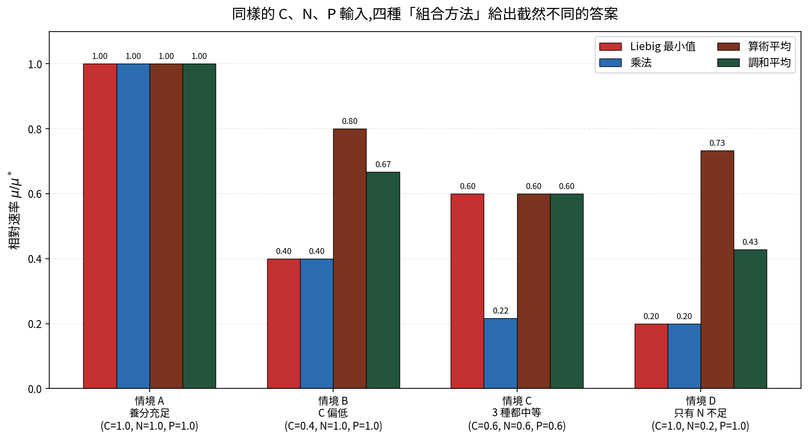

特別看**情境 D(C 與 P 都充足,只有 N 不足,$N = 0.2$)**:
- Liebig 最小值:$0.20$(直接看 N 的瓶頸)
- 乘法:$0.20$
- **算術平均:$0.73$(N 被 C、P 的「平均」補了!)**
- 調和平均:$0.43$

**意義**:**選擇哪個組合方法,直接影響你的預測——數字差好幾倍**!原講義的建議:
- 一般情況優先選 **Liebig 最小值**或**調和平均**(都強調瓶頸效應)
- 如果單獨形式是 M-M,**加法**也合理
- **算術平均要慎用**——它隱含「不同營養可以互相替代」,通常不符合生物學

---

## 4.4 範例模型

### 4.4.1 Chemostat(化學恆量培養槽)

**Chemostat** 是實驗室養微生物的標準裝置:固定體積 $V$ 的容器,**連續**注入恆定濃度的營養,微生物在裡面繁殖,廢液被同時抽走。

設兩種營養 $R_1$、$R_2$,微生物族群 $N$。用前面學的工具寫方程式:

$$
\begin{aligned}
\frac{dR_1}{dt} &= \underbrace{(P/V)(R_{10} - R_1)}_{\text{注入−排出}} \;-\; \underbrace{N \cdot \frac{\mu^*}{Y_1} \cdot \min\!\left[\frac{R_1}{R_1+K_{m_1}},\frac{R_2}{R_2+K_{m_2}}\right]}_{\text{被微生物消耗(Liebig 最小值)}} \\[2pt]
\frac{dR_2}{dt} &= (P/V)(R_{20} - R_2) - N \cdot \frac{\mu^*}{Y_2} \cdot \min[\cdots] \\[2pt]
\frac{dN}{dt} &= \underbrace{N\,\mu^* \min[\cdots]}_{\text{細胞繁殖}} \;-\; \underbrace{(P/V) N}_{\text{被沖走}}
\end{aligned}
\qquad (\text{式 4.27})
$$

注意:**這個模型把本課所有工具都用上了**——常數流(注入排出)、質量作用、M-M 飽和、Liebig 最小值組合、per capita 率。

### 4.4.2 Belousov-Zhabotinsky 反應——化學的「永動振盪」

化學反應通常會「停在平衡」,但 **BZ 反應**很神奇:**濃度會週期性地振盪**,空間上甚至出現螺旋波。

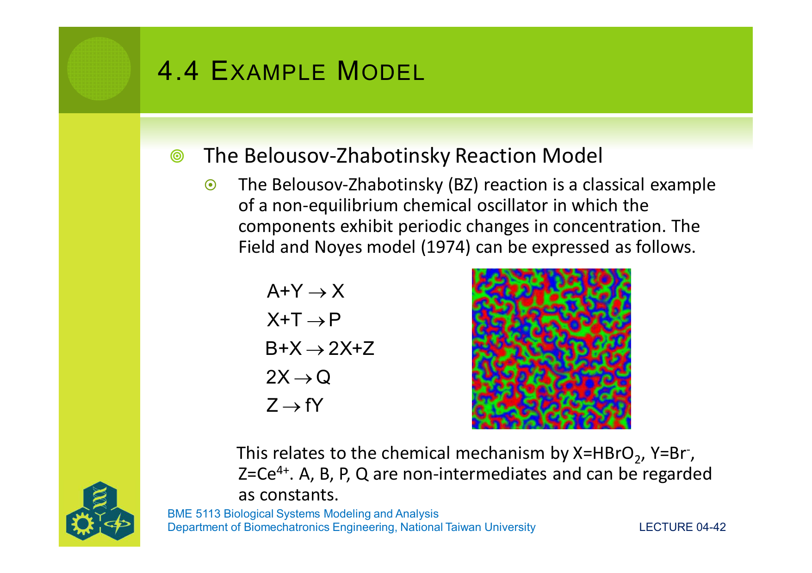

Field-Noyes 模型(1974)的 ODE 版本:

$$
\begin{aligned}
\frac{dX}{dt} &= k_1 AY - k_2 XY + k_3 BX - 2k_4 X^2 \\
\frac{dY}{dt} &= -k_1 AY - k_2 XY + f k_5 Z \\
\frac{dZ}{dt} &= k_3 BX - k_5 Z
\end{aligned}
$$

每一項都對應本課學過的某種反饋:質量作用(乘積項)、自我抑制($-2k_4 X^2$)、正反饋($+k_3 BX$)等等。

Turner(2009)簡化版可以在 Vensim 中模擬:

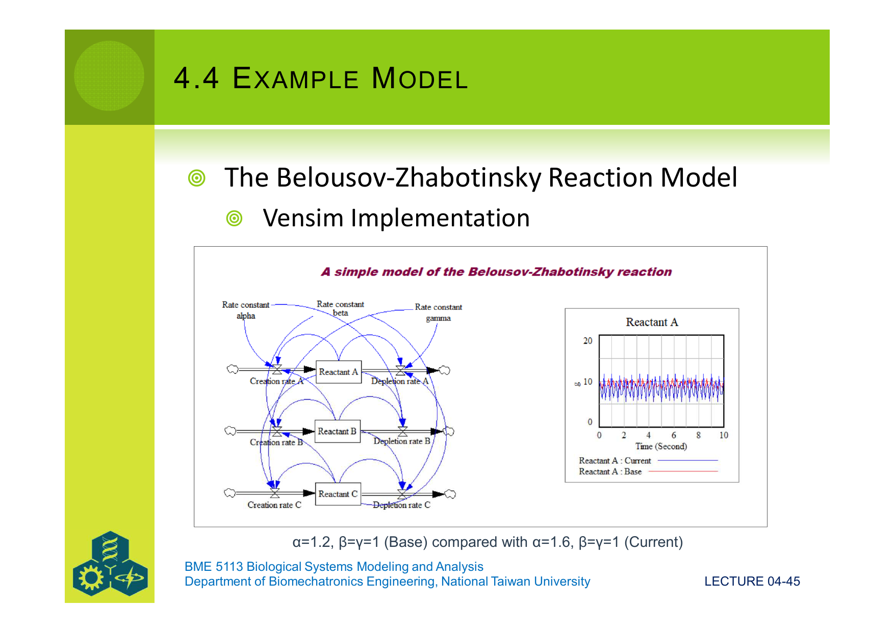

右邊的時間圖顯示濃度持續振盪,**永遠不會穩定**——這是 saturated 反饋的特徵。

---

## 本課小結

我們在這一課:

- 介紹了**導數**和**積分**這兩個微積分工具——導數是「瞬時變化率」(極限定義),積分是「曲線下面積/累積總量」;
- 用分離變數法解了 $dN/dt = rN$,得到連續版指數成長 $N_t = N_0 e^{rt}$;
- 介紹了 **Euler approximation** —— 差分方程式跟 ODE 的數值化橋樑;
- 學了**從 Forrester 圖到方程式的 3 條規則**;
- 探討了**速率方程式的常見形式**:
  - 常數流、整體流
  - Donor-controlled vs Recipient-controlled vs Mass action
  - **正反饋**(指數爆炸)
  - **負反饋的三種形式**:自我抑制(logistic)、外部因素(牛頓冷卻)、飽和(Michaelis-Menten、Holling)
  - 組合反饋(光抑制)
  - Allee 效應(立方成長)
  - 質量作用 → Lotka-Volterra
  - 多因子控制的 5 種組合方法(Liebig、乘法、算術平均、調和平均、加法)
- 用 **Chemostat** 與 **BZ 反應**兩個範例,看到所有工具如何在真實模型中組合。

下一課,我們會深入**數值技巧**——當 ODE 沒有解析解時,電腦怎麼一步步算出近似解?Euler 法只是最簡單的入門,還有 Runge-Kutta 等更精準的方法。
