# 第五課:量化建模(二)——物理過程、工具箱、實用函數

第四課我們把 Forrester 圖轉成了 ODE,並學了一系列「速率方程式的常見形式」。**這一課要把工具箱完整化**:加上空間維度(PDE)、加上不連續性與時間驅動、加上實務技巧(單位檢查、無因次化),最後給一個豐富的「函數速查表」與四個完整範例。

## 課程綱要

- 5.1 物理過程——當系統有空間維度時
- 5.2 用好「生物過程工具箱」——單位檢查、無因次化、守恆原理
- 5.3 實用函數速查
- 5.4 範例:多單位流、驅動變數、騎車、釀啤酒

---

## 5.1 物理過程

### 5.1.1 質能守恆——所有模型的基石

> **質能守恆 (Conservation of Mass and Energy)**:從一個地方流到另一個地方的物質或能量,**從第一個地方失去多少,第二個地方就獲得多少**——不會憑空出現或消失。

這是建模時最基本的「記帳規則」,前面幾課已經默默使用了(例如第三課的草—鹿系統)。本節要把它**正式化**,並推到空間連續的情境。

### 5.1.2 範例:陸地生態系的碳流

四個狀態變數:大氣 (A)、草 (G)、鹿 (D)、廢物/分解物 (L):

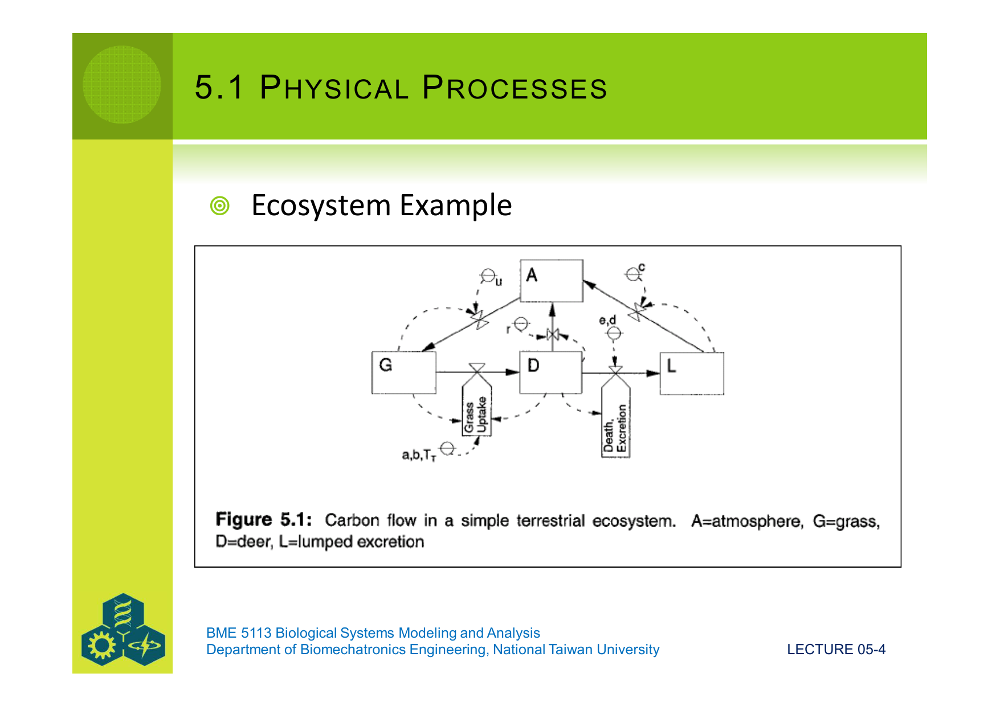

依守恆規則寫方程式組(原講義式 5.1–5.4):

$$
\begin{aligned}
\frac{dD}{dt} &= \underbrace{\left(\frac{a T_T G}{1 + a b G}\right) D}_{\text{鹿吃草(Holling II)}} \;-\; \underbrace{r D}_{\text{呼吸}} \;-\; \underbrace{D(e + d)}_{\text{死亡+排泄}} \qquad (\text{式 5.1}) \\[3pt]
\frac{dG}{dt} &= \underbrace{u G}_{\text{光合作用}} \;-\; \underbrace{\left(\frac{a T_T G}{1 + a b G}\right) D}_{\text{被鹿吃}} \qquad (\text{式 5.2}) \\[3pt]
\frac{dL}{dt} &= \underbrace{D(e + d)}_{\text{死亡+排泄}} \;-\; \underbrace{c L}_{\text{被細菌分解}} \qquad (\text{式 5.3}) \\[3pt]
\frac{dA}{dt} &= -\underbrace{u G}_{\text{被草吸收}} \;+\; \underbrace{r D}_{\text{鹿呼吸}} \;+\; \underbrace{c L}_{\text{分解產生 CO}_2} \qquad (\text{式 5.4})
\end{aligned}
$$

**檢驗守恆**:把這 4 個式子加起來,**每一個流項都剛好出現一次正、一次負,加起來等於 0**。
也就是:$\dfrac{dD}{dt} + \dfrac{dG}{dt} + \dfrac{dL}{dt} + \dfrac{dA}{dt} = 0$——整個系統的總碳量是常數!**這就是守恆**。

### 5.1.3 從 ODE 到 PDE——當空間是「連續」的

上面的模型把「大氣」、「草」當成「一整塊」處理(空間同質)。但有些系統**沒辦法**這樣切——河流裡的污染物擴散、空氣中的熱傳導、培養皿裡的化學波……**位置不同,濃度也不同,而且是連續變化的**。

這時需要新工具:**偏微分方程式 (Partial Differential Equation, PDE)**。

#### 介紹「偏導數」(∂)

PDE 的核心符號是 $\partial$(讀作「partial」)。在介紹它之前,先回憶第四課的「導數」:**對單一變數的瞬時變化率**。

但如果一個函數 $f(x, t)$ **同時依賴兩個變數**(空間 $x$ 和時間 $t$)呢?
這時我們可以問兩個不同的「變化率」問題:

- 「**固定時間 $t$**,只看 $f$ 怎麼隨 $x$ 變」 → 寫作 $\dfrac{\partial f}{\partial x}$
- 「**固定位置 $x$**,只看 $f$ 怎麼隨 $t$ 變」 → 寫作 $\dfrac{\partial f}{\partial t}$

「偏」的意思就是「**只看其中一部分的變化,把其他變數凍住**」。

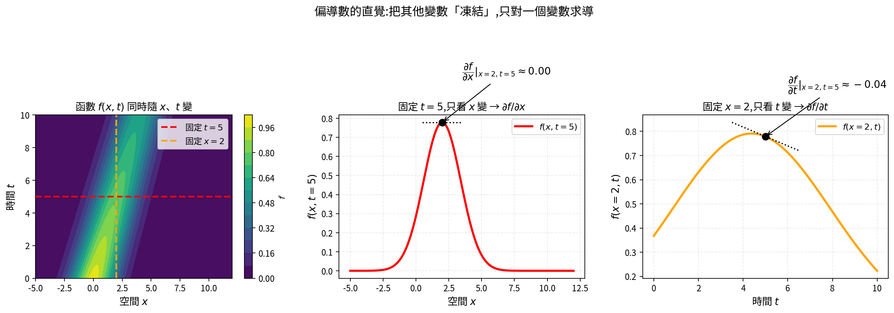

上圖最左邊是 $f(x, t)$ 的「全景」(熱圖,顏色 = $f$ 的值);中間是「水平切一刀(固定 $t=5$)」得到的曲線,沿這條曲線量斜率就是 $\partial f / \partial x$;右邊是「垂直切一刀(固定 $x=2$)」得到的曲線,斜率是 $\partial f / \partial t$。

**規則**:求偏導數時,**把其他變數當成常數**,然後用普通導數規則。

例:$f(x, t) = 3 x^2 t + t^3$
- $\dfrac{\partial f}{\partial x} = 6xt$($t$ 當常數,$t^3$ 對 $x$ 是常數,導數為 0)
- $\dfrac{\partial f}{\partial t} = 3x^2 + 3t^2$($x$ 當常數,$3x^2 t$ 對 $t$ 的導數是 $3x^2$)

### 5.1.4 1D 守恆方程的推導——「進來的」減「出去的」

考慮一根管子,**沿空間 $x$ 方向**,某物質的濃度 $C(x, t)$ 會變化:

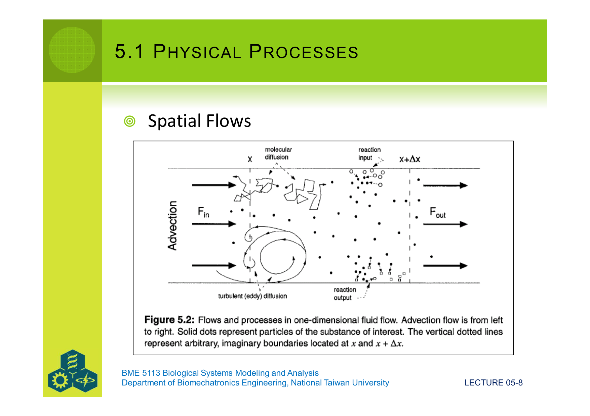

圖中有四種會「改變 $C$」的過程,我們先聚焦在第一條:**沿 $x$ 的流動**。

#### 切一小段 $\Delta x$ 來看

取一段 $[x, x + \Delta x]$ 的小空間。設這段的截面積是 $A$,流入這段的「通量 (flux)」 $F$ 是「**每單位時間、每單位面積經過的物質量**」。

> 質量守恆說:**這段空間內的物質變化量 = 從 $x$ 進來的 − 從 $x+\Delta x$ 出去的**。
>
> $$\Delta M \;=\; A \left[\,F_x \;-\; F_{x+\Delta x}\,\right] \cdot \Delta t$$

當 $\Delta x$ 很小,通量在右側的值可以用「**$x$ 處的值 + 斜率乘 $\Delta x$**」近似:

$$
F_{x + \Delta x} \;\approx\; F_x \;+\; \frac{\partial F}{\partial x} \Delta x
$$

代回去:

$$
\Delta M \;\approx\; A \left[\,F_x - F_x - \frac{\partial F}{\partial x} \Delta x \,\right] \cdot \Delta t \;=\; -A\, \frac{\partial F}{\partial x} \,\Delta x \, \Delta t
$$

兩邊都除以「體積 × $\Delta t$」(體積 $V = A \Delta x$),得到濃度變化率:

$$
\frac{\Delta C}{\Delta t} \;=\; -\frac{\partial F}{\partial x}
$$

取極限 $\Delta t \to 0$:

$$
\boxed{\; \frac{\partial C}{\partial t} \;=\; -\frac{\partial F}{\partial x} \;} \qquad (\text{式 5.7})
$$

**這就是 1D 守恆方程**——「濃度隨時間的變化率」= 「通量沿空間的負梯度」。

**直覺檢驗**:
- 如果 $\partial F / \partial x > 0$(通量沿 $x$ 越來越大),代表「出去的比進來的多」→ $\partial C/\partial t < 0$,濃度下降 ✓
- 如果 $\partial F / \partial x < 0$(通量越來越小),代表「進來多、出去少」→ $\partial C / \partial t > 0$,濃度上升 ✓

### 5.1.5 四種空間流動過程

通量 $F$ 是什麼?**取決於物理過程**。生物系統最常見的四種:

| 過程 | 物理意義 | 通量 $F$ 的形式 |
|---|---|---|
| **平流 (Advection)** | 整體流動把物質「帶」過去(像河水沖下垃圾) | $F = U \cdot C$ |
| **分子擴散 (Molecular diffusion)** | 個別分子隨機運動造成的均勻化 | $F = -D \cdot \dfrac{\partial C}{\partial x}$ |
| **湍流擴散 (Turbulent diffusion)** | 流體的渦流造成的混合(尺度大於分子) | 同擴散形式,只是 $D$ 大很多 |
| **反應 (Reaction)** | 任何不涉及空間移動、但會改變濃度的過程(化學反應、生物吸收) | 加在 $\partial C/\partial t$ 的右邊 |

#### 平流方程

把 $F = UC$($U$ 是流速)代入式 5.7:

$$
\boxed{\; \frac{\partial C}{\partial t} \;=\; -\frac{\partial (UC)}{\partial x} \;} \qquad (\text{式 5.8})
$$

**直覺**:整個分布隨著 $U$ 的速度向右漂移——**中心動,形狀不變**。

#### 擴散方程(Fick's Law)

直覺:**分子總是從高濃度往低濃度散開**,擴散通量大小正比於濃度梯度,方向反向:

$$
F = -D \cdot \frac{\partial C}{\partial x}
$$

代入式 5.7:

$$
\boxed{\; \frac{\partial C}{\partial t} \;=\; D \, \frac{\partial^2 C}{\partial x^2} \;} \qquad (\text{式 5.9})
$$

**注意**:$\partial^2 C / \partial x^2$ 是「對 $x$ 求兩次偏導」——空間二階曲率。
**直覺**:濃度往「曲率為正」的地方流(往凹陷處流入)——**中心不動,形狀越攤越開**。

#### 平流 + 擴散:守恆方程

兩個機制一起作用:

$$
\boxed{\; \frac{\partial C}{\partial t} \;=\; D \frac{\partial^2 C}{\partial x^2} \;-\; \frac{\partial (UC)}{\partial x} \;} \qquad (\text{式 5.10})
$$

#### 直觀比較:平流 vs 擴散

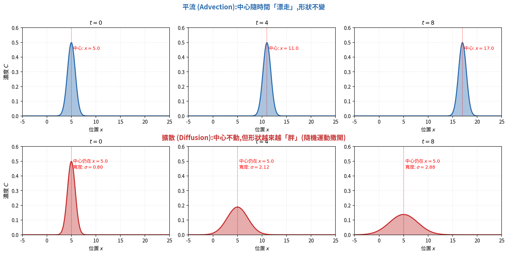

兩者對「初始的高斯濃度分布」造成截然不同的效果:
- **平流**:中心向右漂移,形狀完全不變;
- **擴散**:中心不動,但分布越來越寬、高度越來越低。

#### 反應—擴散方程式

把「反應」加進去——例如浮游植物 $N$ 被光合作用合成,又被掠食者 $P$ 吃掉:

$$
\frac{\partial N}{\partial t} \;=\; \underbrace{D \frac{\partial^2 N}{\partial x^2}}_{\text{擴散}} \;-\; \underbrace{\frac{\partial (UN)}{\partial x}}_{\text{平流}} \;-\; \underbrace{\mu_{\max} \frac{NP}{K_m + N}}_{\text{被吃(M-M)}} \;+\; \underbrace{eS}_{\text{排泄}} \qquad (\text{式 5.11})
$$

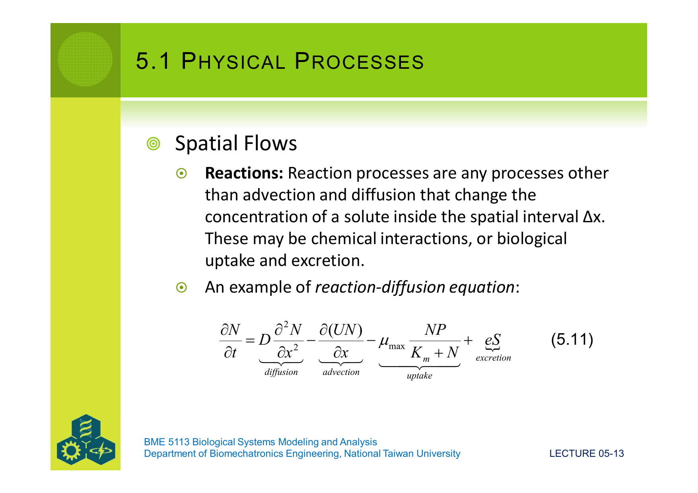

這個方程式組合了**第四課的所有反應模式**(M-M 飽和)+ **本節的空間項**(擴散 + 平流)。

### 5.1.6 Turing 系統——圖案從哪裡來?

1952 年,Alan Turing(電腦科學之父)發表了一篇驚世論文 *The Chemical Basis of Morphogenesis*。他問:**生物身上的條紋、斑點,是怎麼「自發」形成的?** 沒有「藍圖」告訴每個細胞「你該變什麼顏色」啊!

他的答案令人震撼:**兩種化學物質 + 不同的擴散率 + 適當的反應 → 自發產生空間圖案**。

#### 激活子—抑制子系統

設兩個物質:
- **激活子 $u$**(activator):會**正反饋**地促進自己的產生(autocatalysis),也會促進**抑制子 $v$** 的產生。
- **抑制子 $v$**:**反過來抑制** $u$ 的產生。

對應的 PDE 組:

$$
\begin{aligned}
\frac{\partial u}{\partial t} &= D_u \nabla^2 u \;+\; f(u, v) \\[3pt]
\frac{\partial v}{\partial t} &= D_v \nabla^2 v \;+\; g(u, v)
\end{aligned}
$$

$\nabla^2$(讀作 nabla squared)是「**Laplacian**」,在 1D 就是 $\partial^2/\partial x^2$,在 2D 是 $\partial^2/\partial x^2 + \partial^2/\partial y^2$,表示「空間擴散」。

**Turing 的關鍵發現**:當 $D_v \gg D_u$(抑制子擴散快、激活子擴散慢),這個系統會**自發產生穩定的空間圖案**。

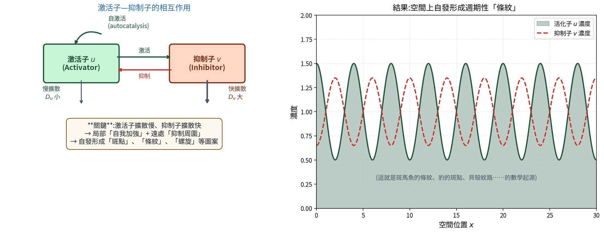

也對照原講義:

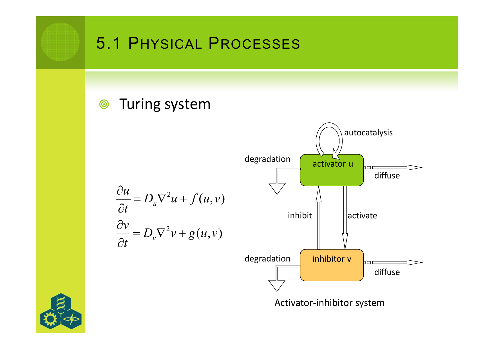

**為什麼會這樣?** 直覺解釋:
1. 隨機波動讓某一點 $u$ 稍微高。
2. 由於自激活,該點 $u$ 上升更快。
3. $u$ 同時激發 $v$,但**$v$ 擴散快**——它向四面八方擴散出去,抑制**周圍**的 $u$。
4. **結果**:該點變成 $u$ 的「峰」,周圍變成 $u$ 的「谷」。週期性圖案誕生。

這叫做 **diffusion-driven instability**——靜態的系統因為擴散而失穩,反而產生秩序。

### 5.1.7 Gray-Scott 模型

最有名的 Turing 系統具體例子之一:

化學反應:$U + 2V \to 3V$、$V \to P$

方程式:

$$
\begin{aligned}
\frac{\partial u}{\partial t} &= D_u \nabla^2 u \;-\; uv^2 \;+\; F(1 - u) \\[3pt]
\frac{\partial v}{\partial t} &= D_v \nabla^2 v \;+\; uv^2 \;-\; (F + k) v
\end{aligned}
$$

不同的參數 $F$、$k$ 給出**截然不同的圖案**:

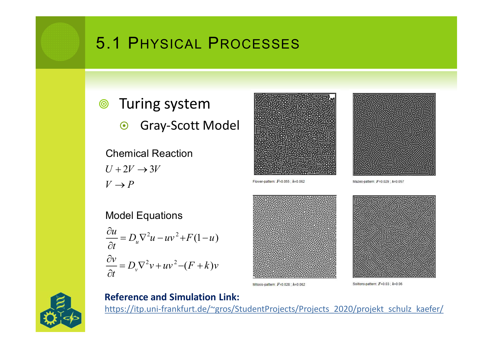

從花朵、迷宮、有絲分裂、孤立子……這些圖案**完全由方程式自動生成**,只需要兩個物質和它們的擴散!

### 5.1.8 真實的生物圖案

Turing 機制不只是好玩的數學——**真的生物上有**:

#### 斑馬魚的條紋

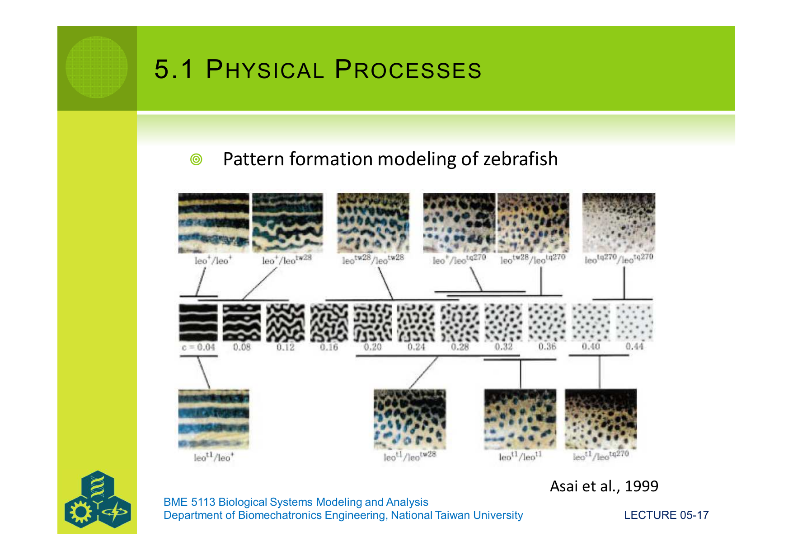

Asai 等人(1999)用 Turing 模型模擬斑馬魚的條紋,**改變一個參數**就能產生從「條紋」到「點點」的所有中間態——而**真實的突變斑馬魚**剛好對應這些中間態!

#### 蝴蝶翅膀的眼斑

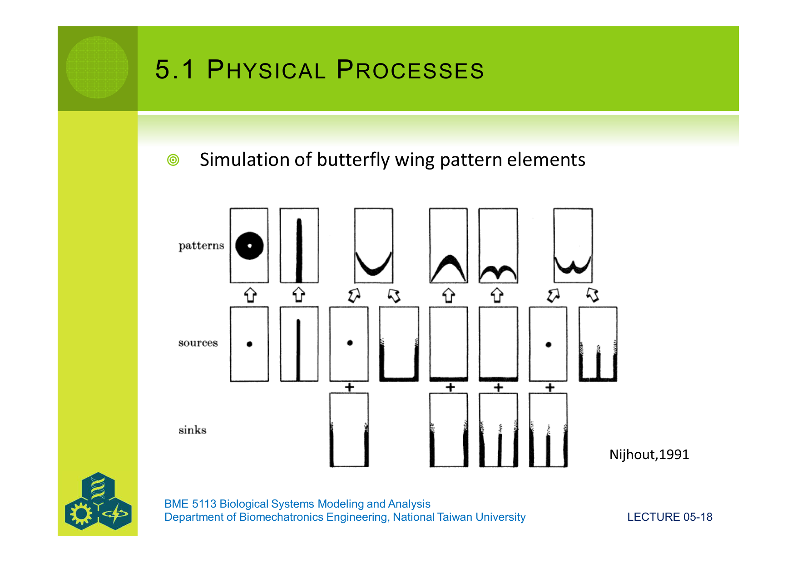

設「源 (source)」與「匯 (sink)」分布,擴散+反應就能生出**各種翅膀圖案**:

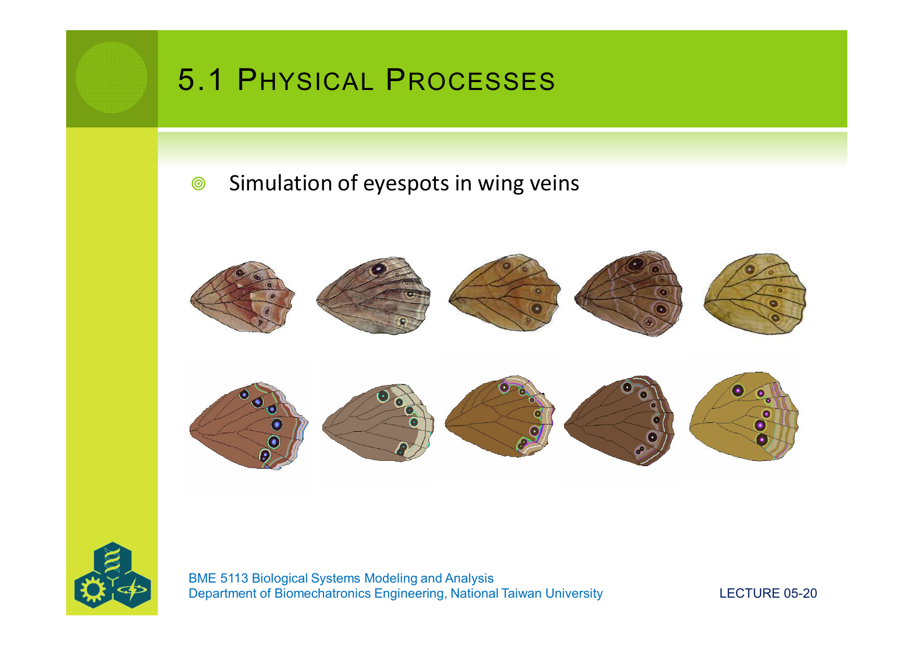

**生物的形態學**(morphogenesis),很大一部分就是 Turing 系統在運作。從豹皮、貝殼、珊瑚、到我們手指的形成——都遵循這套數學。

### 5.1.9 不連續函數——「開/關」式的關係

有些生物過程不是平滑變化的,而是「臨界值之後突然改變」。例如**氣孔(stomata)**:

> 葉子表面的氣孔開合,當「保衛細胞滲透壓 $b_g P_g$」**大於**「表皮細胞滲透壓 $b_e P_e$」時打開:

$$
a = \begin{cases} b_g P_g - b_e P_e & \text{if } b_g P_g > b_e P_e \\ 0 & \text{otherwise} \end{cases}
$$

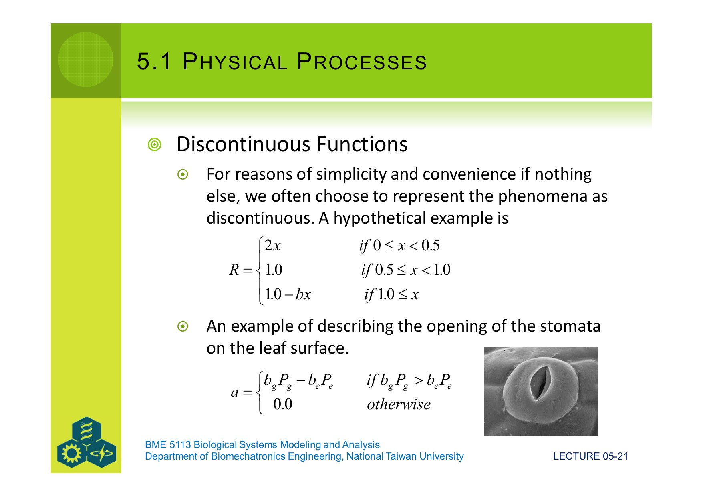

**不連續函數**用 if-else 寫,有時是真實的生物學(像氣孔閥),有時只是**為了簡化**(原本是平滑曲線,但我們用幾段直線拼接近似)。

### 5.1.10 時間驅動變數——讓時間「直接進入」方程式

有些變數**本身就是時間的函數**,不需要透過微分方程描述——例如**日照、季節溫度**。

最常用的形式:**餘弦函數**(代表週期性、有最大值最小值):

$$
y \;=\; M + A \cos\bigl(\omega (t - t_0)\bigr) \qquad (\text{式 5.12})
$$

- $M$:平均值(中心)
- $A$:振幅(波動範圍)
- $\omega$:角頻率(振動快慢)
- $t_0$:時間相位(峰值出現的時間)

例:北半球每日平均溫度(年週期):

$$
T \;=\; 40 \;+\; 25 \cos\!\left(\frac{2\pi}{365} (t - 211)\right)
$$

意思:**平均溫度 40°F、年振幅 25°F、第 211 天(七月底)最熱**。

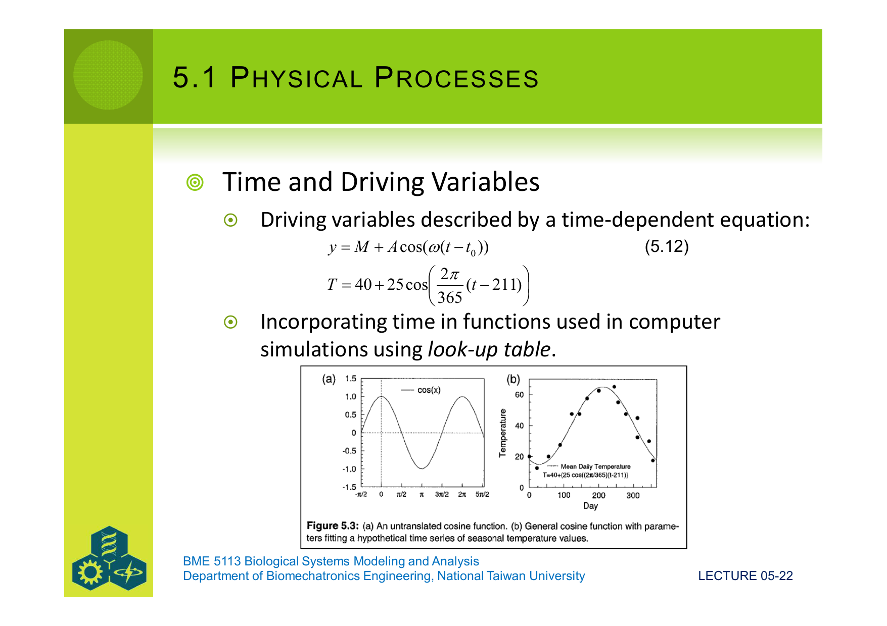

---

## 5.2 用好「生物過程工具箱」

到此我們已經有了一個**完整的工具箱**——可以拼裝幾乎任何生物模型:

### 5.2.1 8 種基本工具

| # | 工具 | 主要形式 | 出現在 |
|---|---|---|---|
| 1 | **常數速率** | $F = $ const | §4.3.2 |
| 2 | **相對速率(per capita)** | $F = A \cdot S$ | §4.3.3 |
| 3 | **反饋(正/負)** | logistic、自抑制… | §4.3.5–6 |
| 4 | **質量作用** | $\propto S_1 S_2$ | §4.3.9 |
| 5 | **質能守恆** | 加總所有方程 = 常數 | §5.1.1 |
| 6 | **多因子限制** | min / 乘法 / 調和… | §4.3.10 |
| 7 | **不連續函數** | if-else | §5.1.9 |
| 8 | **時間驅動** | $\cos(\omega t)$、季節… | §5.1.10 |

**寫一個量化模型,本質上就是「從這 8 種裡挑幾種組合起來」**。

### 5.2.2 單位檢查——最簡單也最重要的 debug

> **規則**:**方程式右邊每一項的單位,必須跟左邊一致**。

如果單位對不上,模型一定有錯——要嘛公式寫錯,要嘛參數的單位不合理。

#### 例:對 logistic 方程做單位檢查

$$
\frac{dN}{dt} \;=\; r N \;-\; \frac{r}{K} N^2
$$

設 $N$ 的單位是「**個體數 (numbers)**」、$t$ 的單位是「**時間 (time)**」、$K$ 也是「個體數」、$r$ 的單位待定。

- **左邊** $\dfrac{dN}{dt}$:單位是「**numbers / time**」。
- **右邊第一項** $rN$:單位是「$r$ 的單位 × numbers」 → 要等於 numbers / time → 所以 **$r$ 的單位是 $1/\text{time}$**。
- **右邊第二項** $\dfrac{r}{K} N^2$:單位是 $\dfrac{1/\text{time}}{\text{numbers}} \times \text{numbers}^2 = \dfrac{\text{numbers}}{\text{time}}$ ✓ 跟左邊一致。

通過!如果不通過(例如某個地方多了或少了 $K$),就要回頭檢查。

**這個檢查通常能在 5 分鐘內,抓出花了 5 小時也找不到的 bug**——務必養成習慣。

### 5.2.3 無因次化(Non-dimensionalization)——把參數壓縮

很多模型有**太多參數**——例如 logistic 有 $r$、$K$ 兩個,Michaelis-Menten 有 $V_{\max}$、$K_m$ 兩個。
**無因次化**是個技巧:**用新的單位「丈量」變數,讓方程式只剩最少的獨立參數**。

#### 範例:logistic 的無因次化

從原式 $\dfrac{dN}{dt} = rN(1 - N/K)$ 出發。

**步驟 1**:設新變數 $\bar{n} = N / K$($N$ 用 $K$ 來丈量,$\bar{n}$ 是無因次的「相對人口」)。
**步驟 2**:設新時間 $\bar{\tau} = r t$($t$ 用 $1/r$ 來丈量,$\bar{\tau}$ 是無因次的「相對時間」)。

代換:$N = K \bar{n}$,$t = \bar{\tau}/r$,所以 $dN = K\,d\bar{n}$,$dt = d\bar{\tau}/r$。

$$
\frac{K\,d\bar{n}}{d\bar{\tau}/r} \;=\; r \cdot K \bar{n} \cdot \left(1 - \bar{n}\right)
$$

整理:

$$
\boxed{\; \frac{d\bar{n}}{d\bar{\tau}} \;=\; \bar{n}(1 - \bar{n}) \;}
$$

**沒有 $r$、沒有 $K$ 了!** 從「2 個參數」變成「0 個參數」(初始條件 $\bar{n}_0 = N_0/K$ 還是有,但那是初始狀態,不算參數)。

#### 視覺呈現:多組參數,同一條曲線

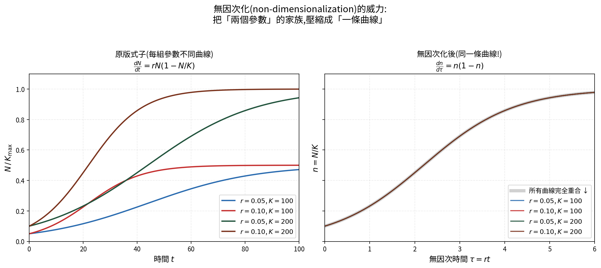

左邊:四組不同的 $(r, K)$ 給出四條不同的曲線(在原始的時間與人口尺度上)。
右邊:**只要把 $t$ 換成 $\bar{\tau} = rt$、$N$ 換成 $\bar{n} = N/K$,四條曲線完全重合**——它們本質上是「同一個故事,只是用不同的尺子量」。

#### 為什麼這有用?

- **理論上**:看清模型的本質——所有「形狀類似」的 logistic 模型,行為都一樣,只差「拉伸時間與空間」。
- **實務上**:減少參數 → 校正容易、分析容易、避免 overfitting。
- **跨領域比較**:無論是細菌、人口、化學反應,只要無因次形式相同,就可以共用結論。

#### Buckingham Pi 定理

**1914 年 Edgar Buckingham 證明**:
> 有 $P$ 個參數、$D$ 個獨立量綱單位的物理關係,可以化簡成 **$P - D$ 個獨立無因次群**——不改變數學行為,只是參數變少。

例:logistic 模型有 $P = 2$ 個參數 ($r$、$K$),$D = 2$ 個量綱(時間、numbers)→ $P - D = 0$ 個獨立無因次參數。**這跟我們的推導結果完全一致**!

### 5.2.4 守恆原理——消除冗餘狀態變數

如果模型用到一個守恆量(例如總碳 $K$),且所有源/匯都建模了,則**可以消掉一個狀態變數**。

例:三個狀態變數 $x_1, x_2, x_3$ 之間的碳流動,總碳量 $K = x_1 + x_2 + x_3$ 是常數。那麼:

$$
x_3 \;=\; K - x_1 - x_2
$$

**$x_3$ 變成輔助變數**,不再需要寫它的 ODE——只要寫 $x_1$、$x_2$ 兩個就夠了,**模型從 3 個 ODE 變成 2 個**。

這就是為什麼 §5.1.2 的碳流模型最後**第 4 個方程式(大氣 A)沒有獨立資訊**——它的值由前 3 個決定。

### 5.2.5 建模的 7 條經驗法則

| # | 法則 |
|---|---|
| 1 | **Know the purpose**——知道為什麼做這個模型 |
| 2 | **Know the question**——知道要回答什麼問題 |
| 3 | **Understand the objects**——搞清楚每個物件的意義 |
| 4 | **Reconcile the diagram with the rate equation**——圖跟方程要對得起來 |
| 5 | **Check the units**——單位檢查永遠不嫌多 |
| 6 | **Extrapolate the functions**——測試一下極端情況的行為 |
| 7 | **Simplify the model**——能簡化就簡化 |

### 5.2.6 6 個簡化技巧

| # | 技巧 |
|---|---|
| 1 | **化成無因次變數**(§5.2.3) |
| 2 | **合併狀態變數**(把行為類似的合在一起,§3.7) |
| 3 | **善用守恆原理**(§5.2.4) |
| 4 | **先用線性函數**(複雜的非線性留到後面) |
| 5 | **先用描述性、後改機制性**——當目標需要,再加細節 |
| 6 | **假設空間同質**(用 ODE 而非 PDE) |

---

## 5.3 實用函數速查表

到目前為止,我們已經看過了很多函數形式:logistic、Michaelis-Menten、Holling、指數、餘弦……
實務上,當你在實驗資料上看到某種曲線形狀,可以從一個「**已知函數家族**」中挑選最合適的。

### 5.3.1 常見的單調函數

| 函數 | 形狀 |
|---|---|
| **線性 (Linear)**:$y = k_1 + k_2 x$ | 直線 |
| **指數 (Exponential)**:$y = k_1 e^{k_2 x}$ | 上升或下降的指數曲線 |
| **冪次 (Power)**:$y = k_1 + k_2 x^{k_3}$ | $k_3>1$ 凹,$0<k_3<1$ 凸 |

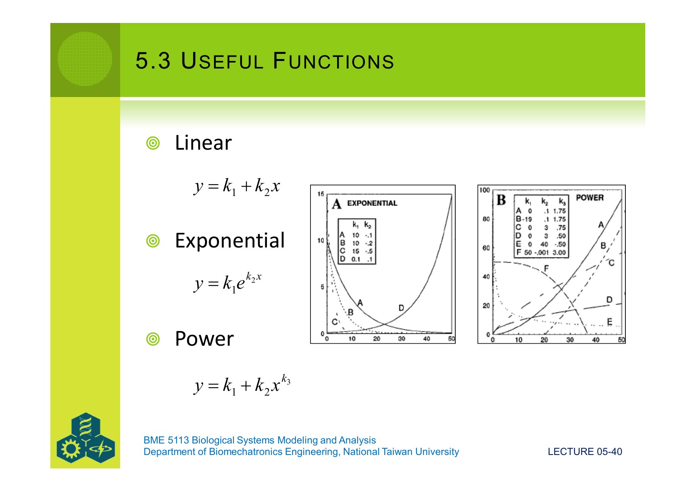

### 5.3.2 飽和類函數

| 函數 | 形狀 | 用途 |
|---|---|---|
| **雙曲飽和 (Hyperbolic)**:$y = k_1 \dfrac{x - k_3}{k_2 + (x - k_3)}$ | M-M 形 | 酵素動力學、Holling II |
| **指數飽和 (Exponential saturation)**:$y = k_1(1 - e^{k_2 x})$ | S 型 | 化學反應達平衡 |
| **Hill**:$y = k_1 \dfrac{x^{k_2}}{k_3^{k_2} + x^{k_2}}$ | 比 M-M 更陡的「開關」型 | 合作結合(haemoglobin) |

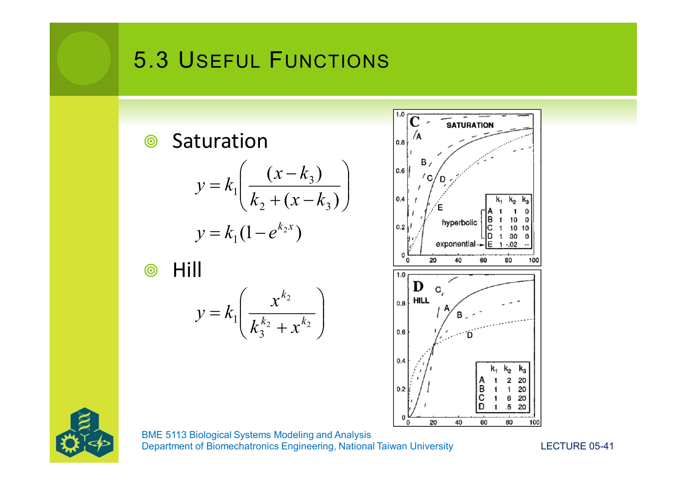

**Hill 函數的特別之處**:當 $k_2 > 1$,曲線比 M-M **更陡**——接近「開關」式行為。常用於需要「合作性 (cooperativity)」的生物過程(像 haemoglobin 結合氧氣)。

### 5.3.3 S 形成長與下降類

- **Richards (absolute)**:$y = \dfrac{k_1}{\bigl(1 + (k_1/k_2 - 1) e^{-k_3 k_4 x}\bigr)^{1/k_4}}$ ——通用 S 型曲線,logistic 是其特例。
- **Richards (relative)**:per capita 版本。
- **Blumberg**、**Complemented Weibull**——其他可調的 S 形與下降曲線。

### 5.3.4 有「最大值」的曲線

| 函數 | 形狀 | 用途 |
|---|---|---|
| **三角形 (Triangular)** | 三段直線拼成「人字形」 | 簡化版的最適值關係 |
| **Maxima**:$y = k_1 x^{k_2} e^{k_3 x}$ 或 $y = k_1 e^{k_2 x}(1 - k_3 e^{k_4 x})$ | 平滑的「先上升後下降」 | 光抑制、酵素的溫度依賴 |

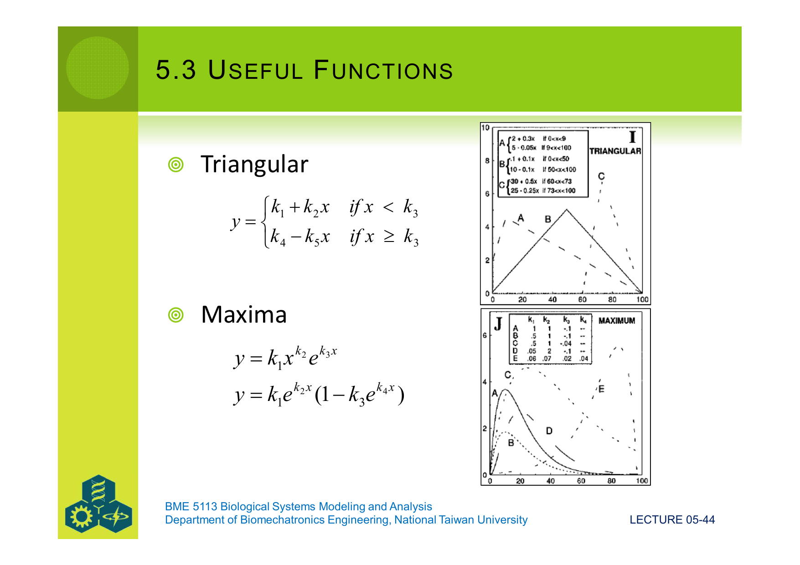

### 5.3.5 溫度最適與雙峰

很多生物對溫度有「最適區」:太冷不行、太熱也不行。

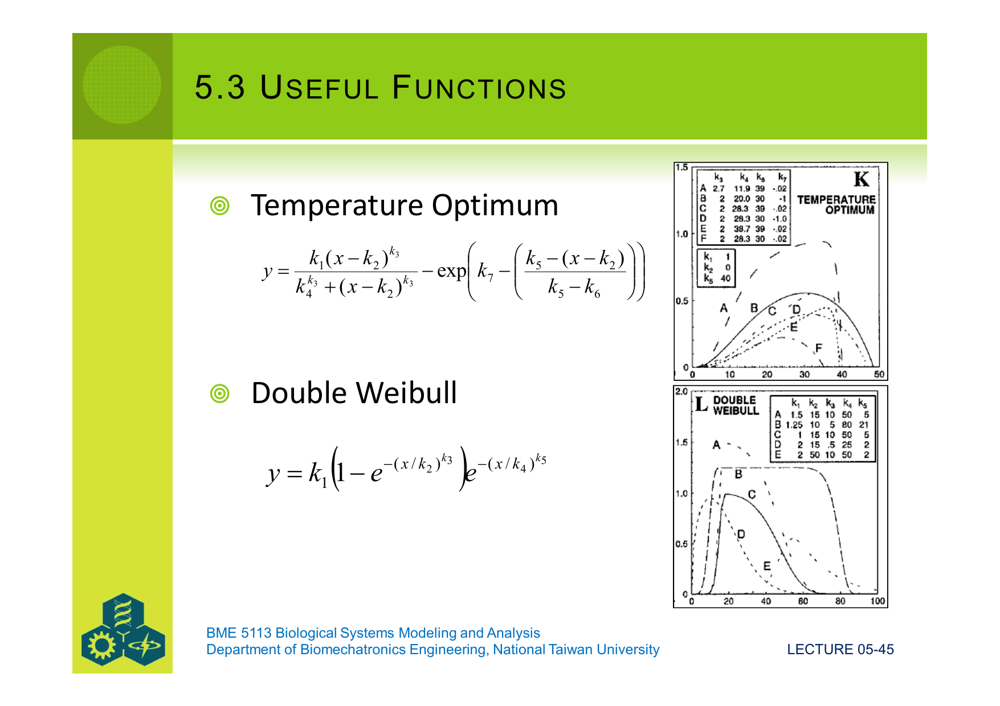

**Temperature Optimum** 是一個複雜的兩段式公式,能精確擬合「酵素活性 vs 溫度」這種「**有最佳溫度的鐘形曲線**」。
**Double Weibull** 用兩個 Weibull 相乘,可以精確調出**任意形狀的「先升後降」曲線**(平台寬度、上升下降的陡度都可獨立控制)。

### 5.3.6 多項式與週期函數

- **多項式 (Polynomial)**:$y = a_0 + a_1 x + a_2 x^2 + \cdots + a_n x^n$ ——萬能擬合,但**容易 overfit**(第二課討論過!)。
- **有理函數 (Rational)**:多項式除以多項式。
- **三角函數 (Trigonometric)**:$y = \sum M_i + A_i \cos(\omega_i (x - x_0))$ ——適合**週期性**現象(季節、心跳、晝夜)。
- **三次樣條 (Cubic Spline)**:把資料切段,每段用三次多項式,接合處平滑——**對沒有理論模型的曲線特別好用**。

### 5.3.7 選擇與軟體

> 「除非有理論上的理由,選哪個函數很大程度上是品味問題,以及該函數的『參數能否被合理詮釋』。」

實務工具(原講義建議):
- **TableCurve 2D**:[sigmaplot.co.uk](http://www.sigmaplot.co.uk/products/tablecurve2d/tablecurve2d.php)
- **SimFit**:[simfit.uk](https://simfit.uk/simfit.html)

這些工具可以自動拿幾百個函數來擬合你的資料,並依擬合品質排序。

---

## 5.4 範例

### 5.4.1 不同單位的流動

當系統有**多種單位的狀態變數**(像 g 蛋白質 vs g 碳),不能讓它們「互流」(回想第三課的錯誤 #9),但可以透過「**輔助變數 (Mass Action)**」讓彼此的「率」互相影響:

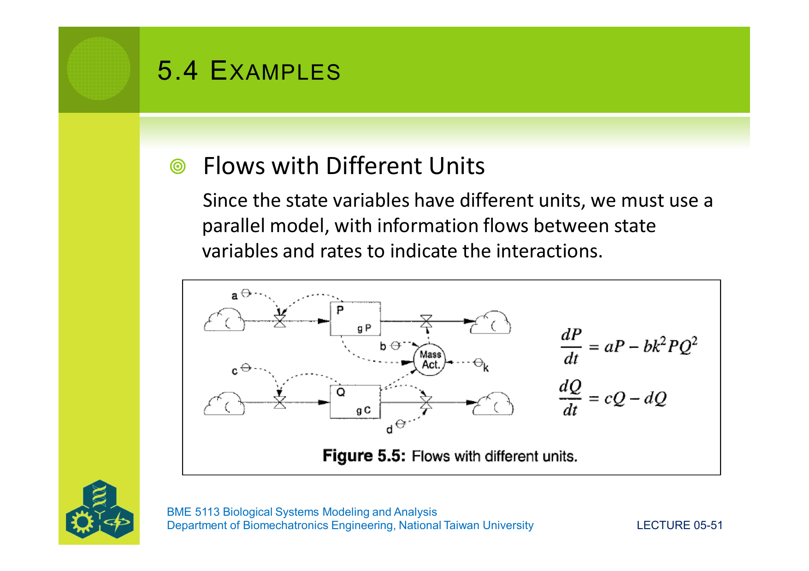

對應的方程式:

$$
\begin{aligned}
\frac{dP}{dt} &= aP \;-\; b\,k^2\,P\,Q^2 \\[3pt]
\frac{dQ}{dt} &= cQ \;-\; dQ
\end{aligned}
$$

中間的「Mass Action」輔助變數,接受 $P$、$Q$、$k$ 三個資訊流的影響,**透過資訊流(虛線)**影響 $P$ 的死亡率——但 $P$ 跟 $Q$ 之間**沒有實際物質流動**。

### 5.4.2 含驅動變數的模型

把第 5.1.10 節的「時間驅動」變數整合進複雜模型:

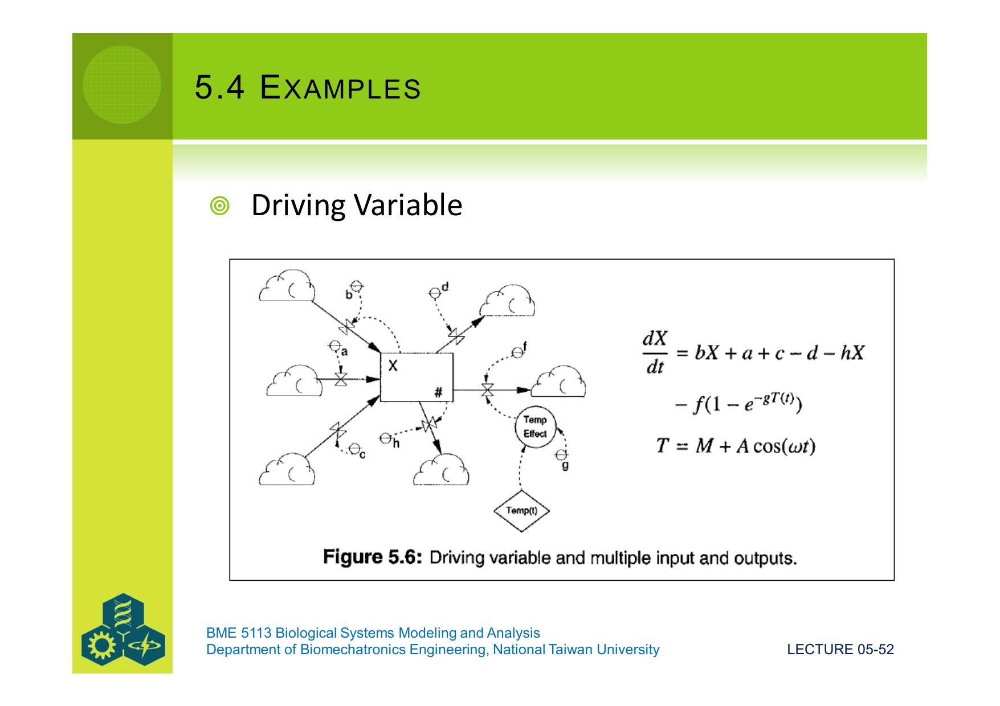

對應方程式:

$$
\begin{aligned}
\frac{dX}{dt} &= bX + a + c - d - hX \;-\; f \bigl(1 - e^{-g T(t)}\bigr) \\[3pt]
T(t) &= M + A \cos(\omega t)
\end{aligned}
$$

- $X$ 是狀態變數
- $T(t)$ 是溫度——隨時間餘弦變動的驅動變數
- 「Temp Effect」是輔助變數:把溫度轉換成「對 $X$ 速率的影響」(用一個飽和型 $1 - e^{-gT}$ 表達)
- 多個源/匯(雲)代表多種輸入輸出

### 5.4.3 騎自行車——回饋控制的數學

這個範例**沒有生物意義,但用來示範回饋控制**:

> 騎兩輪自行車,當前輪偏左時,**右手要更用力推**(或左手放鬆)才能讓車正回中央。

設:
- $r$:右手出的力
- $l$:左手出的力
- $D$:車輪偏離中央的量

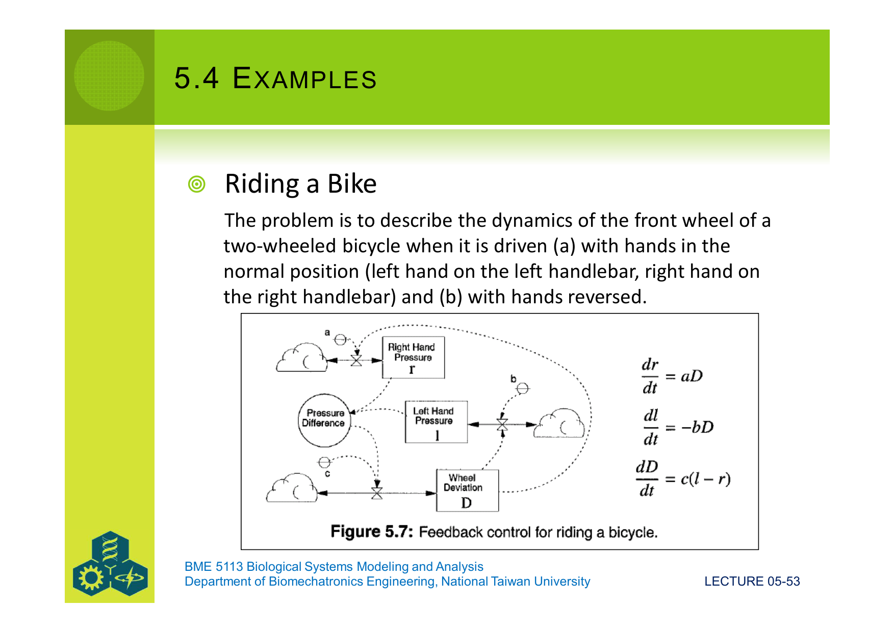

方程式:

$$
\frac{dr}{dt} = a D, \qquad \frac{dl}{dt} = -bD, \qquad \frac{dD}{dt} = c(l - r)
$$

- 第一條:車偏右($D>0$)→ 右手用力加大 → 不對,**應該偏右時左手用力加大才對**!所以這應該是「正常握把(左手在左、右手在右)」的方程式,設計用來「**修正偏離**」。
- 第三條:右手用力比左手大($r > l$)→ 車輪向左偏移 ($dD/dt < 0$)。

當**左右手交換握把**(顛倒)時,$a$、$b$ 的正負號改變,**正回饋變負、負變正** → 騎車的人會發現車根本騎不直——這就是為什麼小時候第一次騎車很難!

### 5.4.4 釀啤酒——糖、酵母、酒精

最後一個範例,**完整使用所有工具**:

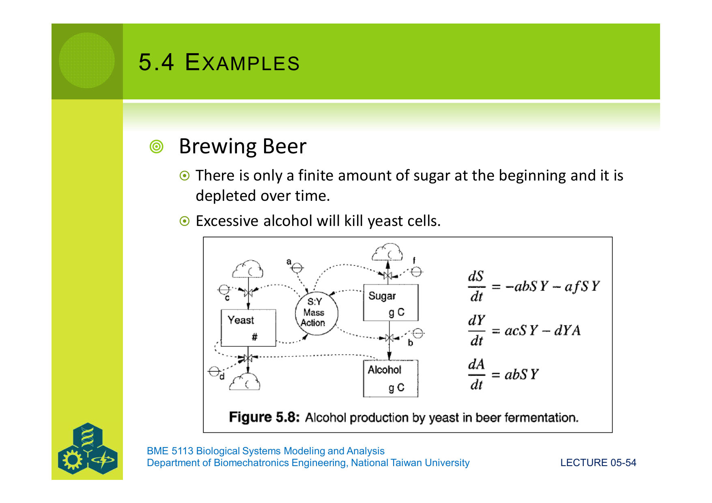

**生物學**:酵母(Y)吃糖(S),生產酒精(A);過多酒精會殺死酵母。

對應 ODE:

$$
\begin{aligned}
\frac{dS}{dt} &= -ab S Y - a f S Y \;\;\;\quad\text{(糖被吃)} \\[3pt]
\frac{dY}{dt} &= a c S Y - d Y A \;\;\;\quad\text{(酵母繁殖,但被酒精殺)} \\[3pt]
\frac{dA}{dt} &= a b S Y \;\;\;\quad\text{(酒精由糖+酵母產生)}
\end{aligned}
$$

**用到的工具**:
- **質量作用**(SY 乘積)
- **負反饋**(酒精殺酵母)
- **質能守恆**(糖被吃掉的量 = 酒精產生 + CO2 散逸 + 酵母吸收)

Vensim 模擬結果:

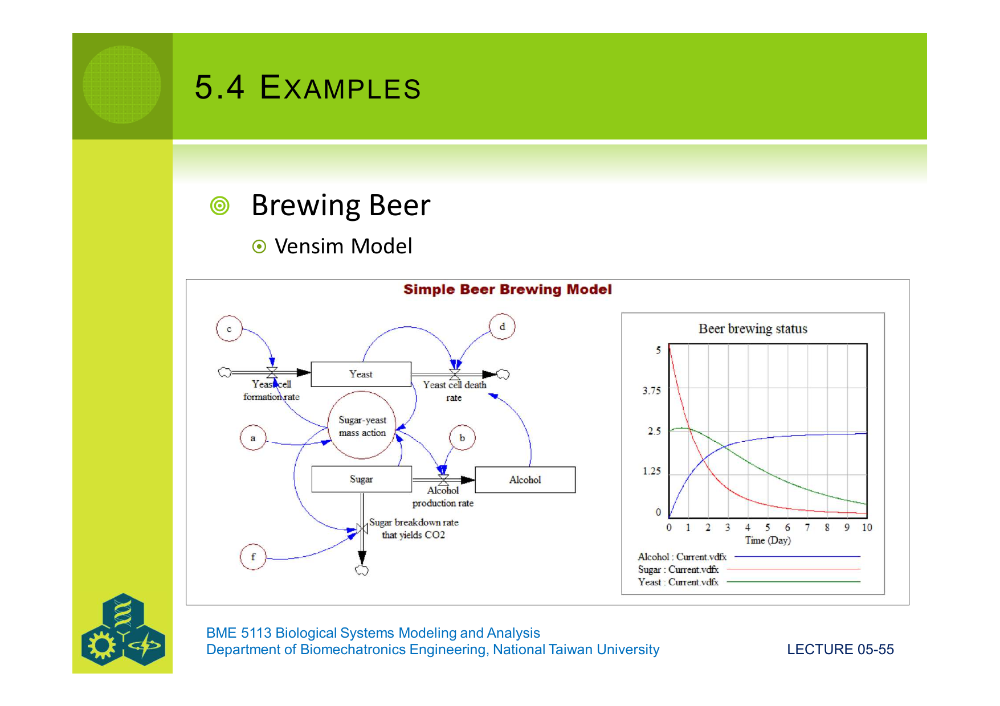

- **紅線(糖)**:單調下降——一開始有 5 單位,逐漸被吃光。
- **綠線(酵母)**:先上升(糖充足),後下降(酒精太多,酵母被殺)。
- **藍線(酒精)**:**S 型曲線**——一開始慢,中間快(酵母多 + 糖多),最後達到飽和(糖用完)。

這個模型可以預測:**如果改變初始糖量、發酵溫度、酵母種類,啤酒的酒精濃度會怎麼變?** 這正是工業釀酒師關心的問題。

---

## 本課小結

我們在這一課:

- 從**質能守恆**這個最基本的原理出發,推導了 **1D 守恆方程式** $\dfrac{\partial C}{\partial t} = -\dfrac{\partial F}{\partial x}$;
- 介紹了 **偏導數** 的概念——把其他變數凍住,只對一個變數求變化率;
- 學了 PDE 中四種空間過程的數學形式:**平流、分子擴散、湍流擴散、反應**;
- 看了 **Turing 系統**——激活子+抑制子+不同擴散率 → 自發產生空間圖案——並驗證了它能解釋斑馬魚條紋、蝴蝶眼斑等真實生物現象;
- 整合了 **8 種基本工具**(常數、相對速率、回饋、質量作用、守恆、多因子、不連續、時間驅動);
- 學了三個實務技巧:**單位檢查**、**無因次化**(2 個參數變 0 個!)、**守恆消除狀態變數**;
- 認識了一系列**實用函數家族**(線性、指數、飽和、Hill、Richards、Triangular、Maxima……),知道何時用哪個;
- 用 4 個範例(多單位流、驅動變數、騎車、啤酒)看了所有工具如何在一個模型裡組合。

下一課,我們從「**怎麼寫方程式**」轉到「**怎麼解方程式**」——當 ODE 沒有解析解時,電腦怎麼一步一步算出近似解?有哪些不同的數值方法?
