# 第六課:數值技巧——讓電腦把方程式「跑出來」

第四、五課我們學會了寫 ODE 和 PDE。但**真實世界裡,絕大多數方程式沒有解析解**——我們沒辦法用筆推導出 $y(t)$ 的公式,只能讓電腦**一步一步算出近似值**。

這一課就是教你電腦怎麼做這件事:Euler 法、Runge-Kutta 法、可變步長、stiff 方程式、以及 PDE 的數值解。

## 課程綱要

- 6.1 電腦會犯什麼錯
- 6.2 ODE 的數值積分:Euler 法與 Runge-Kutta 家族
- 6.3 數值不穩定與 stiff 方程式
- 6.4 可變時間步長 + 軟體工具(MATLAB / Python)
- 6.5 PDE 的數值解:Method of Lines

---

## 6.1 電腦會犯什麼錯

### 6.1.1 浮點數的有限表示

電腦用**有限位元**儲存數字,所以每個實數其實只是「最接近的可表示值」。標準 IEEE 754 把實數表示成 **mantissa(尾數)+ exponent(指數)** 的形式:

| 精度 | 尾數位元 | 指數位元 | 有效位數 | 最大值 | 最小值 |
|---|---|---|---|---|---|
| **Single 單精度** | 23 | 8 | ≈9 位 | $3.4 \times 10^{38}$ | $1.2 \times 10^{-38}$ |
| **Double 雙精度** | 52 | 11 | ≈15 位 | $1.8 \times 10^{308}$ | $2.2 \times 10^{-308}$ |

科學計算**幾乎總是用 double**——15 位精度足以應付大多數情況。

### 6.1.2 四種數值誤差

| 名稱 | 來源 | 例子 |
|---|---|---|
| **Round-off 捨入誤差** | 存不下完整位數,自動四捨五入 | $0.1 + 0.2 \neq 0.3$(差個 $10^{-17}$) |
| **Truncation 截斷誤差** | 演算法把無窮級數截掉前 n 項 | Taylor 展開只取到 $x^2$ |
| **Propagation 傳播誤差** | 迭代演算法每一步都累積一點點誤差 | Euler 法 100 步累積出大偏差 |
| **Overflow / Underflow** | 數字太大或太小,超出可表示範圍 | $e^{1000}$ 太大、$e^{-1000}$ 變 0 |

### 6.1.3 區域 vs 全域誤差

在迭代演算法中,有兩個尺度的誤差:

- **局部誤差 (local error)**:單一步驟產生的誤差。
- **全域誤差 (global error)**:所有局部誤差累積後,跟真實解的總偏差。

通常**全域誤差 ≫ 局部誤差** ——一個看起來很小的局部錯誤,跑了 1000 步以後可以累積成大災難。本課的核心就是學**怎麼控制全域誤差**。

#### 一個寫程式的小技巧:算平均的兩種方式

下面是計算 N 個數的平均值:

| 「壞」寫法 | 「好」寫法 |
|---|---|
| `mean = 0` | `gmean = 0` |
| `for i = 1..N:` | `for i = 1..N:` |
| `&nbsp;&nbsp;mean = mean + A[i]` | `&nbsp;&nbsp;gmean = gmean + (A[i] - gmean) / i` |
| `mean = mean / N` |  |

**為什麼右邊比較好?** 左邊先把 N 個數加在一起,如果 N 很大、A[i] 也大,中間值可能超過浮點數的有效位數,後面加的小數字就被「四捨」掉了——精度損失。
右邊每一步都是「目前平均值 + 小修正」,中間值始終跟最終答案相當大小,捨入誤差小很多。

**教訓**:**寫科學程式時,加法的順序也是設計選擇**——大數字優先加可能讓小數字被「吃掉」。

---

## 6.2 ODE 的數值積分

回到核心問題:**給一個 ODE $\dfrac{dy}{dt} = f(y, t)$ 和初始值 $y_0$,怎麼算出 $y(t)$ 在後續時刻的值?**

### 6.2.1 斜率場(Slope Field)——理解所有 ODE 數值法的關鍵

對於 ODE $\dot y = f(y, t)$,**在 $(t, y)$ 平面上的每一個點**,我們都知道**那一點的斜率**就是 $f(y, t)$。把這些斜率畫成「小箭頭」,就得到**斜率場**。

**真實解就是在這個斜率場上「沿著箭頭走」的曲線**。

「數值積分」的任務,就是:**從初始點 $(t_0, y_0)$ 出發,沿著斜率場一步一步走,逼近真實解**。

不同的數值方法,差別在於**走得多聰明**:Euler 法是最簡單的,RK 是更聰明的。

### 6.2.2 Euler's Method —— 最簡單的「跟斜率走」

> 在當下位置量斜率 $f(y_t, t)$,然後沿這個斜率走 $\Delta t$ 步,得到下一個位置。

$$
\boxed{\; y_{t + \Delta t} \;\approx\; y_t \;+\; \Delta t \cdot f(y_t, t) \;} \qquad (\text{式 6.1})
$$

(這就是第四課末尾介紹過的 Euler approximation。)

#### 視覺化:Euler 在斜率場中走

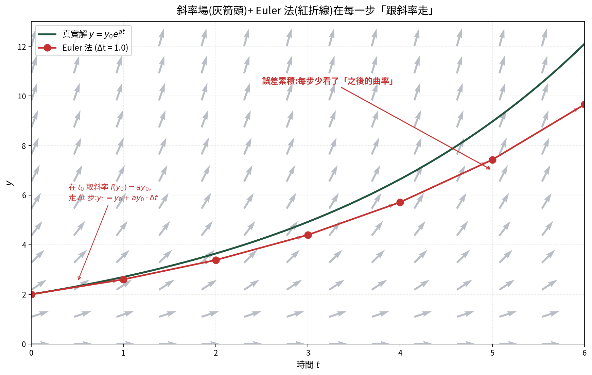

灰箭頭是斜率場,綠線是真實解 $y = y_0 e^{at}$,紅色折線是 Euler 法的軌跡(每一步用「**當下的斜率**」走一段直線)。

**重點觀察**:Euler 軌跡總是**在真實解下方**——因為**這是個凹向上的曲線**,直線走法只看到了「當下的斜率」,沒看到「之後曲率會讓你更高」。誤差一步比一步大。

對照原講義圖 6.2(同樣概念):

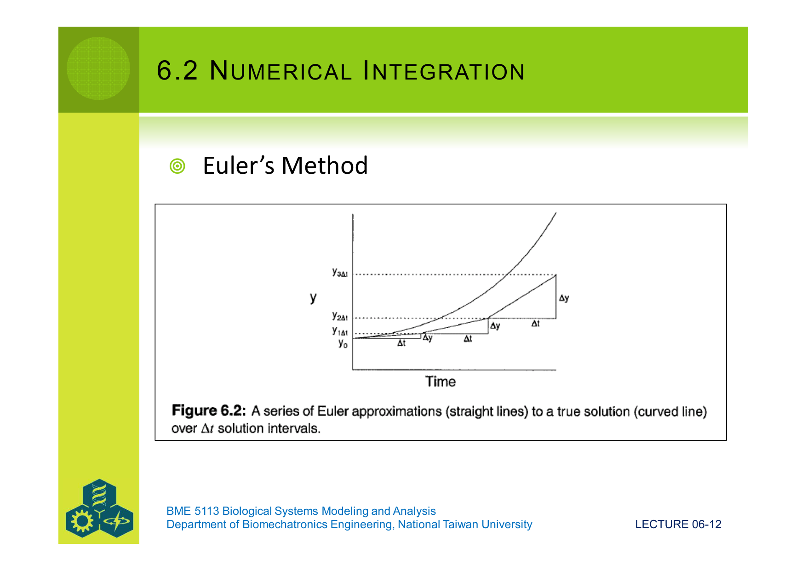

#### Euler 法處理多變數系統

當有**多個耦合的 ODE**,**先算所有導數,再一次更新所有狀態**——不能算一個更新一個!

例:Lotka-Volterra 捕食者—被食者(第四課的式 4.23/24):

$$
\frac{dV}{dt} = rV - bVP, \qquad \frac{dP}{dt} = bcVP - dP \qquad (\text{式 6.2})
$$

對應的 Euler 更新:

$$
\begin{aligned}
V_{t + \Delta t} &= V_t + \bigl[ r V_t - b V_t P_t \bigr] \Delta t \\
P_{t + \Delta t} &= P_t + \bigl[ b c V_t P_t - d P_t \bigr] \Delta t
\end{aligned}
\qquad (\text{式 6.3})
$$

**注意**:右邊用的是 $V_t$ 和 $P_t$(時刻 $t$ 的值),**不是**剛更新的 $V_{t+\Delta t}$。**先算所有速率,再同時更新所有狀態**——這個順序是對的!

### 6.2.3 Runge-Kutta(RK)家族——更聰明的「先試探,再決定」

Euler 法的問題:**只看當下的斜率**,忽略「整個步長內斜率會變」。

**RK 法的核心想法**:**在一個步長內,取幾個位置的斜率,加權平均**,得到更代表整段的「平均斜率」。

#### RK-2(中點法)

對一個 $\Delta t$ 的步長,**取兩個斜率**:

1. **斜率 1** $\Delta^1 y$:用當下位置的斜率,跨**半個 $\Delta t$**,得到一個「試探點」 $y^1$:
   $$
   \Delta^1 y = f(y_t, t)\,\Delta t, \qquad y^1 = y_t + \frac{\Delta^1 y}{2}
   $$
2. **斜率 2** $\Delta^2 y$:在試探點 $y^1$(中點位置)再量斜率:
   $$
   \Delta^2 y = f(y^1, t + \Delta t/2)\,\Delta t
   $$
3. **加權合成**:這次完全相信第二個斜率(中點斜率比起點斜率更代表整段):
   $$
   y_{t + \Delta t} = y_t + 0 \cdot \Delta^1 y + 1 \cdot \Delta^2 y
   $$

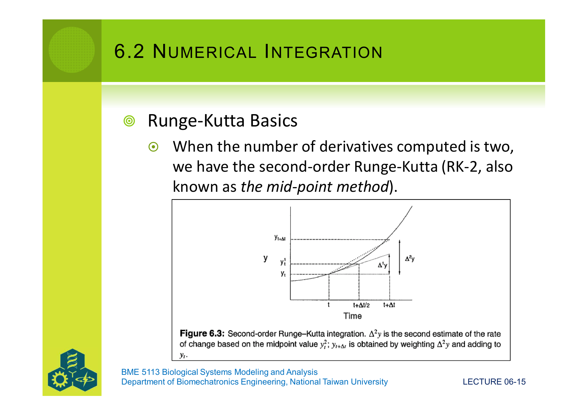

#### RK-4(最常用的版本)

對一個 $\Delta t$,**取四個斜率**:當下、兩個中點(用不同試探的中點)、終點。然後用「**Simpson 加權**」合成:

$$
\Delta^* y = \frac{1}{6} \bigl( \Delta^1 y + 2\Delta^2 y + 2\Delta^3 y + \Delta^4 y \bigr)
$$

$$
y_{t + \Delta t} = y_t + \Delta^* y
$$

**RK-4 的特性**:
- 每步要算 4 次導數(比 Euler 多 4 倍計算量)
- 但**全域誤差**是 $O(\Delta t^4)$,而 Euler 是 $O(\Delta t)$
- **即使用更大的 $\Delta t$,RK-4 都比 Euler 準很多**

### 6.2.4 實測:Euler vs RK-2 vs RK-4

用同一個 ODE($\dot y = 0.5 y$、$y_0 = 10$)跑三種方法,看到 $t = 4$ 時的誤差:

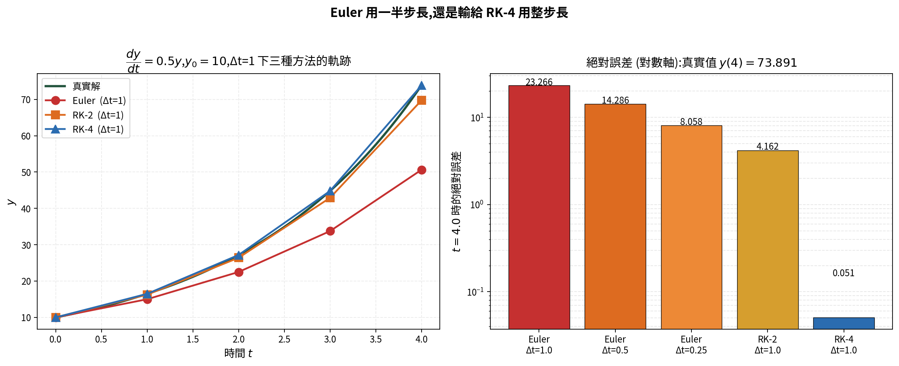

關鍵數字($t=4$,真實值 $y = 73.891$):

| 方法 | Δt | 在 $t=4$ 的絕對誤差 |
|---|---|---|
| Euler | 1.00 | **23.266**(離譜) |
| Euler | 0.50 | 14.286 |
| Euler | 0.25 | 8.058 |
| **RK-2** | **1.00** | **4.162** |
| **RK-4** | **1.00** | **0.051** ← 最準 |

對照原講義表 6.2:

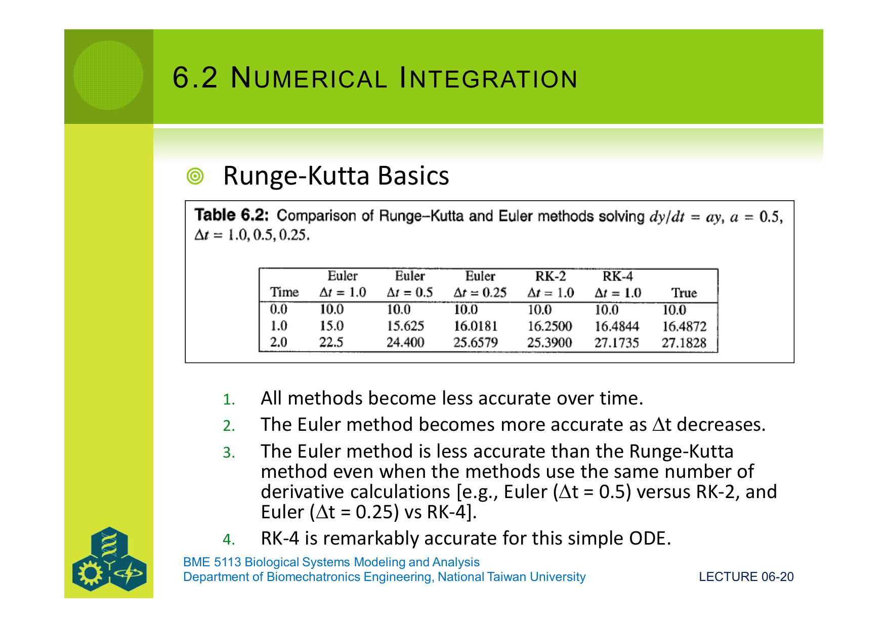

**結論**(重要到要做成表格):

1. **所有方法都會隨時間累積誤差**。
2. **Euler 法當 Δt 變小時會變準**——但很慢:Δt 砍一半,誤差只小一倍左右。
3. **同樣的計算量,RK 比 Euler 準很多**:
   - Euler Δt=0.5(每步算 1 次導數 × 8 步 = 8 次)→ 誤差 14.3
   - RK-2 Δt=1.0(每步算 2 次導數 × 4 步 = 8 次)→ 誤差 4.2 ✓ 好很多
   - Euler Δt=0.25(× 16 步 = 16 次)→ 誤差 8.1
   - RK-4 Δt=1.0(× 4 步 = 16 次)→ 誤差 **0.051** ✓ 好幾個量級
4. **RK-4 是大多數情境的最佳選擇**——準、不太貴、容易實作。

> **這就是為什麼 MATLAB 的預設 ODE solver 是 ode45**(基於 RK-4/5)。

---

## 6.3 數值不穩定與 stiff 方程式

RK-4 很好,但**不是萬靈丹**。有一類方程式叫做 **stiff(僵硬)方程式**,任何顯式方法(包括 RK)都會在大 Δt 下「爆炸」。

### 6.3.1 什麼是 stiff?

> **Stiff 方程式**:系統內**多個時間尺度差異巨大**(快過程比慢過程快好幾個量級)。

生物系統很容易出現:

| 系統 | 快過程 | 慢過程 | 比例 |
|---|---|---|---|
| **藻類養分吸收** | 養分跨膜運輸(微秒) | 細胞分裂(數小時) | $10^{10}$ |
| **光合作用** | 酵素動力學(秒以下) | 葉片整體光合(分鐘) | $10^3$ |
| **化學反應** | 反應(毫秒) | 大反應槽溫度變化(分鐘) | $10^6$ |

當系統有這麼大的時間尺度差,**Δt 必須遷就最快的過程**,否則數值方法會崩潰。

### 6.3.2 範例:快速衰減的方程式

最簡單的例子:$\dfrac{dy}{dt} = -k y$,$k = 50$(很大)。
真實解:$y(t) = e^{-50 t}$,**會在 $t = 0.1$ 衰減到大約 $0.7\%$**。

#### Euler 法的行為

Euler 法的更新式是:

$$
y_{t+\Delta t} = y_t + \Delta t \cdot (-k) y_t = y_t (1 - k \Delta t)
$$

**注意這個 $(1 - k \Delta t)$ 係數**!
- 當 $k \Delta t < 1$(也就是 $\Delta t < 1/k$):$0 < (1 - k\Delta t) < 1$,$y$ 會慢慢衰減——OK。
- 當 $1 < k \Delta t < 2$:$-1 < (1 - k\Delta t) < 0$,$y$ 會**正負來回振盪**,但振幅縮小——不好但勉強可接受。
- 當 $k \Delta t > 2$:$|1 - k\Delta t| > 1$,$y$ **正負來回振盪而且越來越大**——**爆炸!**

對 $k = 50$:$\Delta t$ 必須**小於 $0.04$** 才能單調衰減,**小於 $0.02$** 才安全。

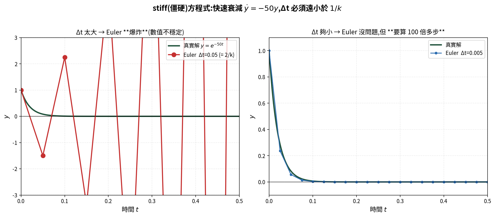

左邊用 $\Delta t = 0.05$(= $2/k$,正好在不穩定邊界)→ **Euler 在 $-3$ 到 $+3$ 之間瘋狂振盪**,完全不像真實的指數衰減。
右邊用 $\Delta t = 0.005$(= $1/(10k)$)→ 結果跟真實解貼合,但**要算 100 倍多的步**。

### 6.3.3 真實案例:Robertson 化學反應系統

更現實的 stiff 範例是 **Robertson(1966)的化學反應網路**:

$$
\begin{aligned}
A &\xrightarrow{0.04} B \quad (\text{慢}) \\
B + B &\xrightarrow{3 \times 10^7} C + B \quad (\text{超快}) \\
B + C &\xrightarrow{10^4} A + C \quad (\text{快})
\end{aligned}
$$

對應的 ODE 組(初始條件 $y_1 = 1$,$y_2 = y_3 = 0$):

$$
\begin{aligned}
\frac{dy_1}{dt} &= -0.04 y_1 + 10^4 y_2 y_3 \\
\frac{dy_2}{dt} &= +0.04 y_1 - 10^4 y_2 y_3 - 3 \times 10^7 y_2^2 \\
\frac{dy_3}{dt} &= +3 \times 10^7 y_2^2
\end{aligned}
$$

**注意速率常數的差距:$0.04$ 跟 $3 \times 10^7$ 相差 $7.5 \times 10^8$ 倍!**
這是教科書級的 stiff 系統,用 ode45 (RK-4/5) 會很慘,要改用專門的 stiff 求解器(`ode15s`、`Radau`、`BDF` 等)。

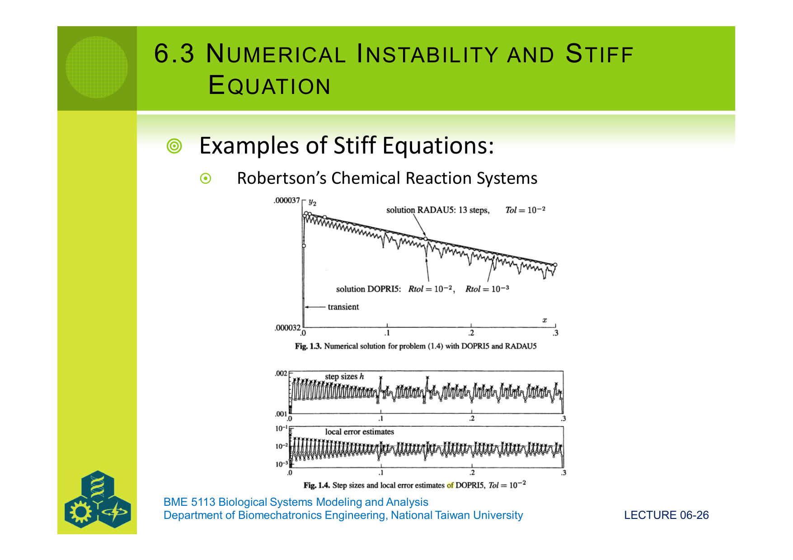

### 6.3.4 兩種應對方式

| 方法 | 做法 | 適用 |
|---|---|---|
| **(A) 建模上的拆解** | 把快、慢過程做成獨立的子模型,用準穩態假設消掉快過程 | 像第四課的 Michaelis-Menten——把超快的酵素—受質結合用穩態假設化簡掉 |
| **(B) 數值上的改進** | 用「**隱式 (implicit)** 方法」,例如後向 Euler 或 BDF——它們對任何 Δt 都穩定 | 用現成的 stiff solver(ode15s、Radau 等) |

### 6.3.5 怎麼知道你的系統是 stiff?

> **粗略檢查法**:**如果在任何一步**,$\left|\dfrac{1}{x_i}\dfrac{dx_i}{dt}\right| > 0.2$,就要考慮減小 $\Delta t$ 或改用 stiff solver。

意思:**任何一個狀態變數,在一步內變化超過 20%**,就太大了——表示 Δt 跟系統的特徵時間相近,Euler/RK 容易出問題。

更安全的做法:**在初期把 Δt 從很大變到很小,看結果是否一致**——如果差很多,就是 Δt 還不夠小。

---

## 6.4 可變時間步長 + 軟體工具

### 6.4.1 為什麼要可變步長

不同時段的「**好 Δt**」不一樣:
- 系統劇烈變化時(像震盪的峰),要小 Δt
- 系統穩定時,可以大 Δt 省計算

人工設定 Δt 太麻煩——**讓電腦自動調**才聰明。

### 6.4.2 全域誤差 vs Δt 的 U 形曲線

很神奇地,**Δt 並不是越小越好**——太小會被 round-off 主宰:

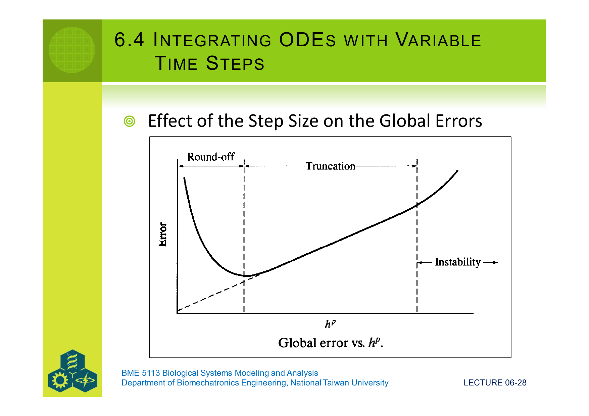

- **Δt 太大**(右側 / instability):RK 也撐不住,爆炸。
- **Δt 中等**(truncation 主導):誤差隨 Δt 線性下降。
- **Δt 太小**(左側 / round-off 主導):每步幾乎沒進展,但每步都產生 round-off,反而誤差上升。

最佳的 Δt 在「**U 形曲線的底部**」——可變步長演算法的目標就是動態找到這個甜蜜點。

### 6.4.3 Step-Doubling 法

最直觀的可變步長策略:

1. 用當前 Δt **走一個整步**,得到 $y_{t+\Delta t}$。
2. 用兩個 $\Delta t / 2$ **走兩半步**,得到 $y^{*}_{t+\Delta t}$。
3. **比較兩個結果**:$E_{\Delta t} = |y_{t+\Delta t} - y^{*}_{t+\Delta t}|$ 就是這一步的誤差估計。
4. 計算**相對誤差** $e_{\Delta t} = E_{\Delta t} / y_t$。
5. 如果 $e_{\Delta t}$ **太大** → 縮小 Δt;**太小** → 放大 Δt。

對 Euler 法,因為 $E \propto \Delta t^2$,我們可以解出最佳新 Δt:

$$
\Delta'\!t \;=\; \Delta t \cdot \left( \frac{e'_{\Delta t}}{e_{\Delta t}} \right)^{1/2}
$$

其中 $e'_{\Delta t}$ 是「目標誤差」(我們希望達到的水準)。

### 6.4.4 Runge-Kutta-Fehlberg(RKF45)

Step-doubling 在 RK-4 上太貴:**4 個導數計算 × (1 整步 + 2 半步) = 11 次**。
**RKF45** 是個聰明設計:**用 6 次導數計算同時算出 RK-4 和 RK-5 的結果**,差異就是誤差估計。
這就是 MATLAB `ode45` 和 SciPy `RK45` 背後的演算法。

### 6.4.5 MATLAB 的 ODE 求解器家族

MATLAB 提供整套 solver,**根據問題選對的**:

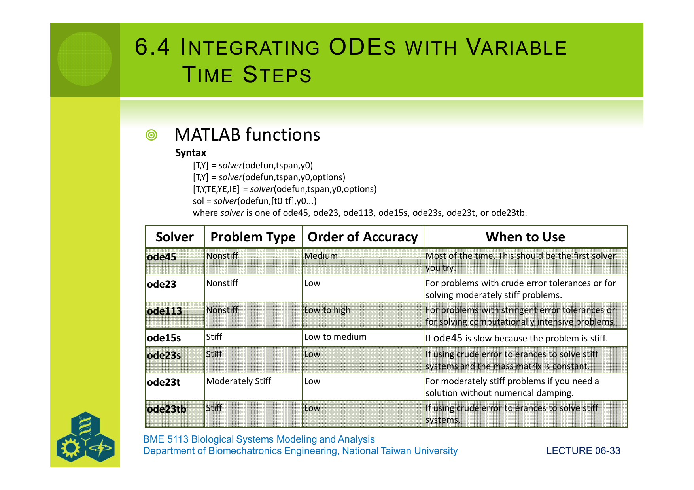

簡化選擇規則:

| 你的問題 | 建議用 |
|---|---|
| 一般情況(優先試) | `ode45` |
| 寬鬆誤差容忍、或中度 stiff | `ode23` |
| 需要極高精度 | `ode113` |
| **Stiff** 系統 | `ode15s`、`ode23s` |
| 中度 stiff、要無數值阻尼 | `ode23t` |

MATLAB 範例(Lotka-Volterra 模擬):

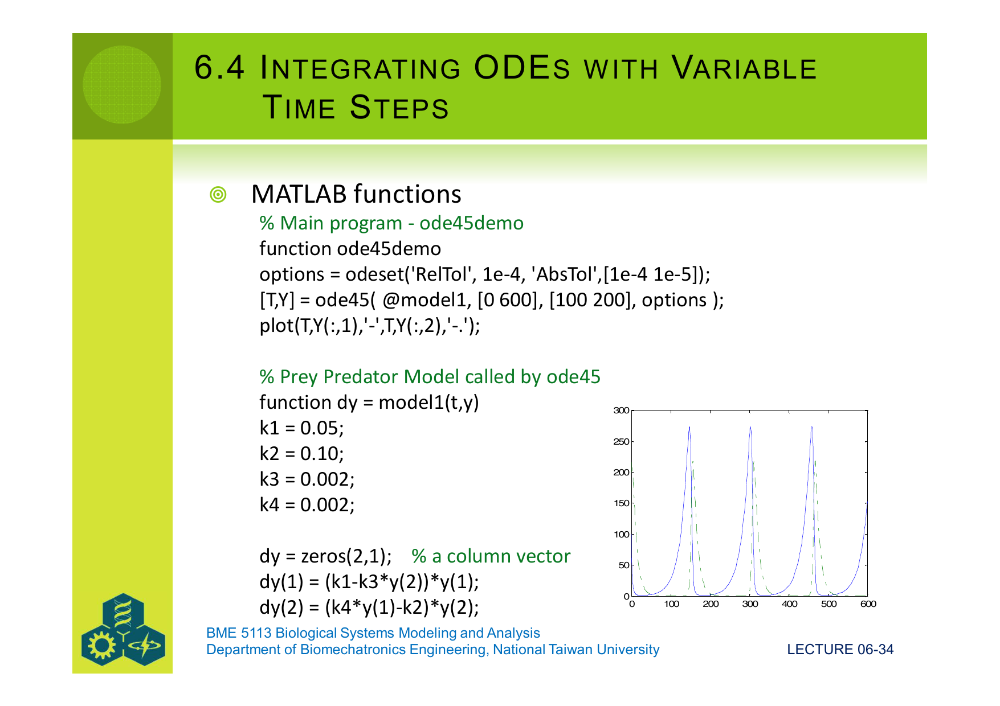

### 6.4.6 Python 的 ODE 求解器

Python(SciPy)的對應工具:

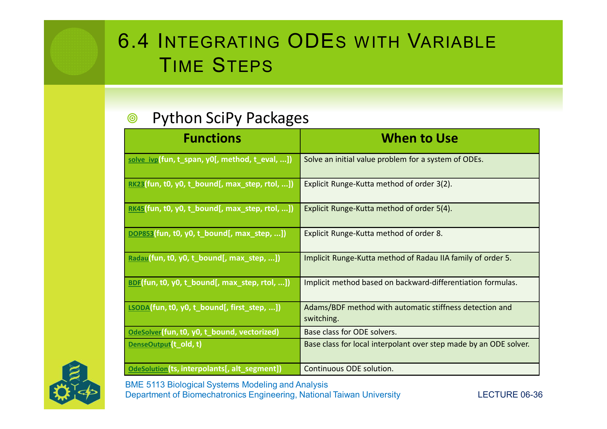

最常用的入口是 `scipy.integrate.solve_ivp`,**透過 `method=` 參數選底層演算法**:
- `'RK45'`(預設,類似 MATLAB `ode45`)
- `'RK23'`、`'DOP853'`(更高階)
- `'Radau'`、`'BDF'`、`'LSODA'`(處理 stiff)

範例:

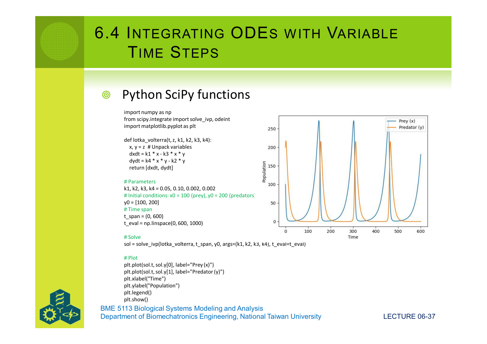

```python
import numpy as np
from scipy.integrate import solve_ivp
import matplotlib.pyplot as plt

def lotka_volterra(t, z, k1, k2, k3, k4):
    x, y = z
    dxdt = k1 * x - k3 * x * y
    dydt = k4 * x * y - k2 * y
    return [dxdt, dydt]

k1, k2, k3, k4 = 0.05, 0.10, 0.002, 0.002
y0 = [100, 200]
t_span = (0, 600)
t_eval = np.linspace(0, 600, 1000)

sol = solve_ivp(lotka_volterra, t_span, y0,
                args=(k1, k2, k3, k4), t_eval=t_eval)

plt.plot(sol.t, sol.y[0], label="Prey (x)")
plt.plot(sol.t, sol.y[1], label="Predator (y)")
plt.legend(); plt.show()
```

**這 20 行程式就能解任何 ODE 系統**——不必自己寫 Euler/RK。

### 6.4.7 其他生態系

完整的 Python ODE 生態:

| 套件 | 特點 |
|---|---|
| **SciPy** | 通用,stiff & non-stiff,標準起點 |
| **SymPy** | 求解析解(如果存在) |
| **JAX** | GPU 加速、可微分 ODE(深度學習) |
| **TensorFlow Probability** | 把 ODE 嵌進 ML 模型 |
| **TorchDiffEq** | PyTorch 的 Neural ODE |
| **DifferentialEquations.jl** | Julia 的高速 solver(最快的選項之一) |

---

## 6.5 PDE 的數值解:Method of Lines

回到第五課的 PDE。例如反應—平流—擴散方程式:

$$
\frac{\partial p}{\partial t} \;=\; -U_x \frac{\partial p}{\partial x} \;+\; D \frac{\partial^2 p}{\partial x^2} \;-\; kp\bigl(1 - \frac{b}{B}\bigr) \qquad (\text{式 6.7})
$$

這怎麼用電腦解?

### 6.5.1 核心想法:空間離散化

> **把連續的 $x$ 切成 $N$ 個離散格點 (grid points)** $x_1, x_2, \ldots, x_N$。
> 每個格點上的濃度 $p_i = p(x_i, t)$ 是「**時間的函數**」(空間已被固定在格點上)。
> 這樣 **1 條 PDE 變成 $N$ 條互相耦合的 ODE**——而 ODE 我們已經會解!

#### 把空間偏導數換成「差分」

**一階偏導**(中央差分):

$$
\left(\frac{\partial p}{\partial x}\right)_{x_i} \;\approx\; \frac{p_{i+1} - p_{i-1}}{2 \Delta x} \qquad (\text{式 6.5})
$$

直覺:用「**左右鄰居的差**除以**兩倍距離**」,就是 $x_i$ 那一點斜率的近似。

**二階偏導**(中央差分):

$$
\left(\frac{\partial^2 p}{\partial x^2}\right)_{x_i} \;\approx\; \frac{p_{i+1} - 2 p_i + p_{i-1}}{(\Delta x)^2} \qquad (\text{式 6.6})
$$

直覺:「左鄰加右鄰減二倍中心」量到的是**曲率**——曲線在 $x_i$ 凹的程度。

### 6.5.2 Method of Lines

把這些近似代入 PDE,每個格點 $i$ 得到一個 ODE:

$$
\frac{dp_i}{dt} \;=\; -U_x \cdot \frac{p_{i+1} - p_{i-1}}{2 \Delta x} \;+\; D \cdot \frac{p_{i+1} - 2 p_i + p_{i-1}}{(\Delta x)^2} \;-\; k p_i \bigl(1 - \frac{b_i}{B}\bigr)
$$

**$N$ 個格點 → $N$ 條 ODE**,所有 ODE 耦合在一起(每個都依賴左右鄰居),用前面學的 RK-4 或 ode45 一起解。

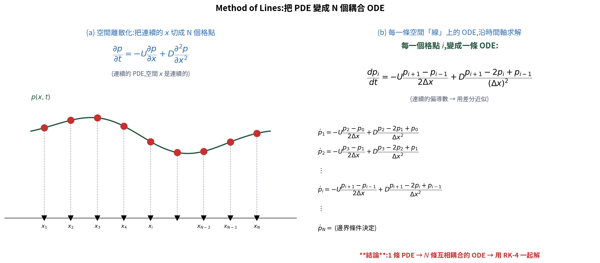

也對照原講義圖 6.4:

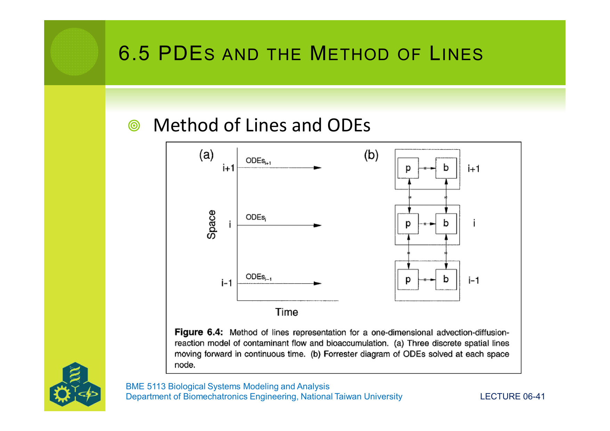

(a) 左邊:空間被切成幾條水平「線」(line),每條線是一個格點的時間軌跡。
(b) 右邊:每個格點本質上是一個 Forrester 圖(本範例有 $p$ 和 $b$ 兩個狀態變數),彼此用資訊流交換鄰居的值。

### 6.5.3 Grid 大小的取捨

> **時間步長 $\Delta t$ 跟空間格距 $\Delta x$ 是耦合的**——兩者必須一起選。

- **$\Delta x$ 太大** → 空間細節抓不到(像把 1024×1024 的圖片壓成 16×16,看不清楚)
- **$\Delta x$ 太小** → $N$ 太多,$N$ 條 ODE 計算量大;而且**$\Delta t$ 也要變小**(穩定性條件:$\Delta t \lesssim (\Delta x)^2 / (2D)$,叫 **CFL 條件**)

實務:**先用粗 grid 試**,看趨勢對不對;再加密 grid 直到結果穩定。

### 6.5.4 邊界條件 (Boundary Conditions)

式 6.8 對「內部」格點 ($2 \le i \le N-1$) 都成立,但**邊界格點($i = 1$ 和 $i = N$)沒有左鄰居或右鄰居**——必須**另外處理**。

**4 種邊界情況**:

| # | 情境 | 處理 |
|---|---|---|
| 1 | 真實邊界(物理邊緣) | 設成固定值或固定通量 |
| 2 | 嵌在更大 grid 裡 | 用更大 grid 的值作為「鄰居」 |
| 3 | 虛擬邊界格點 | 用插值或外推設定 |
| 4 | 拓撲不對應物理空間 | 依問題設計 |

**2 種設定方式**:
- **Dirichlet 條件**:**固定邊界值**(例:$p_1 = 0$)。
- **Neumann 條件**:**固定邊界通量**(例:$\partial p / \partial x = 0$,代表「沒東西進出」)。

### 6.5.5 範例:蝴蝶翅膀圖案(Dilão & Sainhas, 2003)

翅膀上的色素分布 $M_1, M_2$ 由幾個生化反應 + 擴散控制——5 條耦合 PDE:

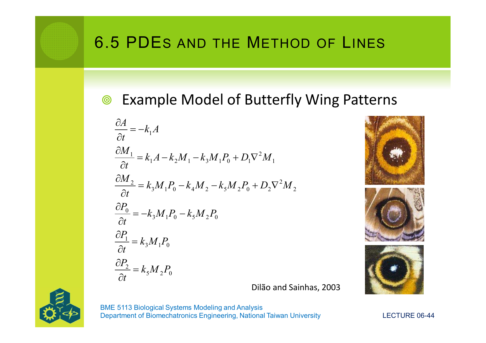

模擬結果可以重現多種真實的眼斑圖案:

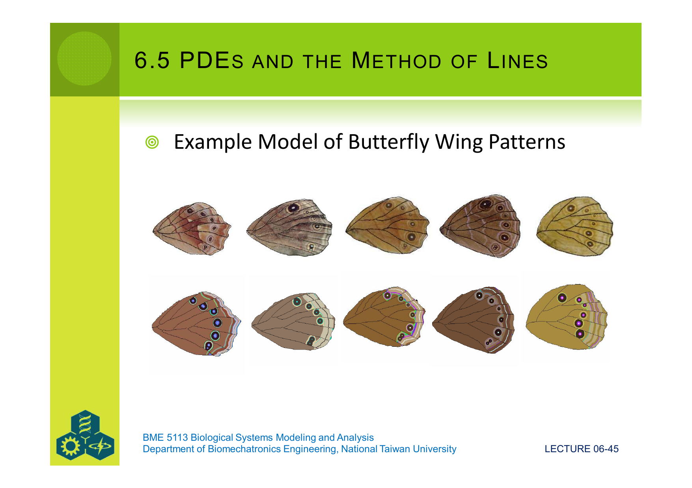

**注意**:這跟第五課的 Turing 系統不同——這裡用顯式的「源 + 匯」配置產生眼斑,**參考實驗觀察的色素濃度梯度,反推方程式參數**。

### 6.5.6 範例:稻米吸水的水分分布(2D)

更實用的案例:**稻穀浸水時,水從外殼往內擴散到胚乳的速率**——關係到米煮起來的口感與時間。

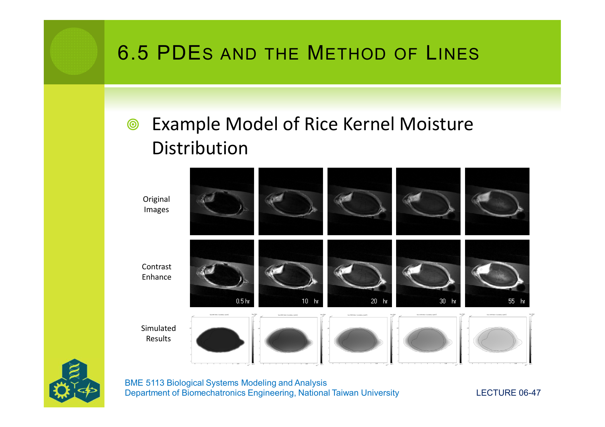

上排:MRI 拍到的真實水分分布,從 0.5 hr 到 55 hr。
下排:用 2D 擴散方程式 + Method of Lines 解出來的模擬結果,跟真實觀察**幾乎一模一樣**。

**這就是 PDE 數值解的實用價值**:用方程式 + 電腦,**取代昂貴或不可能的實驗**。

---

## 本課小結

我們在這一課:

- 學了**電腦犯錯的四種方式**(round-off、truncation、propagation、overflow);
- 介紹了**斜率場**——所有 ODE 數值法的共通直覺;
- 從 **Euler 法**(最簡單但誤差大)→ **RK-2(中點法)** → **RK-4** 一路推進,並用實測數字證明 **RK-4 每步多算幾次導數,但全域上比 Euler 準幾個量級**;
- 認識了 **stiff 方程式**——系統有多個時間尺度時,顯式方法會崩潰,要改用 **stiff solver**(ode15s、Radau、BDF);
- 學了**可變時間步長**——電腦自動找最佳 Δt,這就是 ode45、RKF45 的內部機制;
- 看到了 **MATLAB / Python 完整的 ODE 工具鏈**,可以一行程式碼解任意 ODE;
- 對 PDE,介紹了 **Method of Lines**:把連續的 $x$ 切成 N 個格點,**1 條 PDE → N 條耦合 ODE**,然後用 ODE 解法。

至此**「怎麼建模」與「怎麼解模型」的完整工具鏈**已經建立。從第一課到第六課:**目標 → 假設 → Forrester 圖 → ODE/PDE → 數值解**。

下一課我們會進入**模型驗證 (Validation)** 與**模型分析 (Analysis)**——解出來的結果**對不對**?**告訴我們什麼?**
