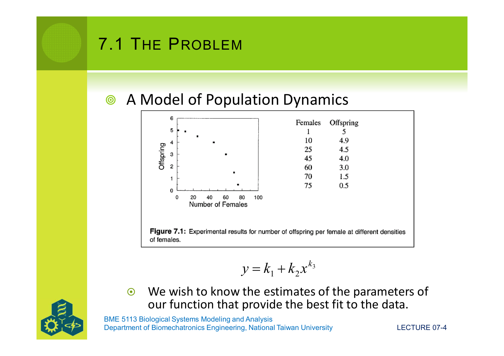
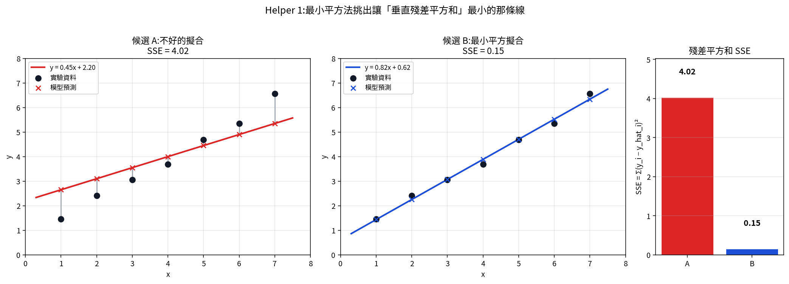
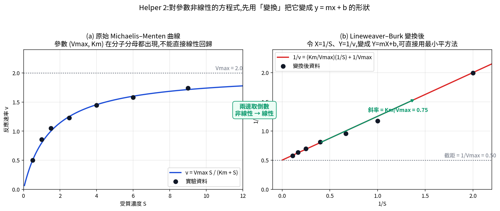
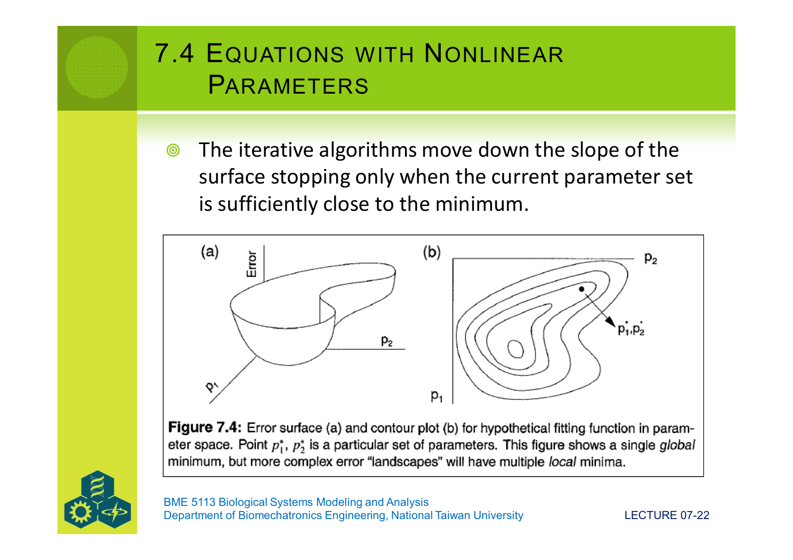
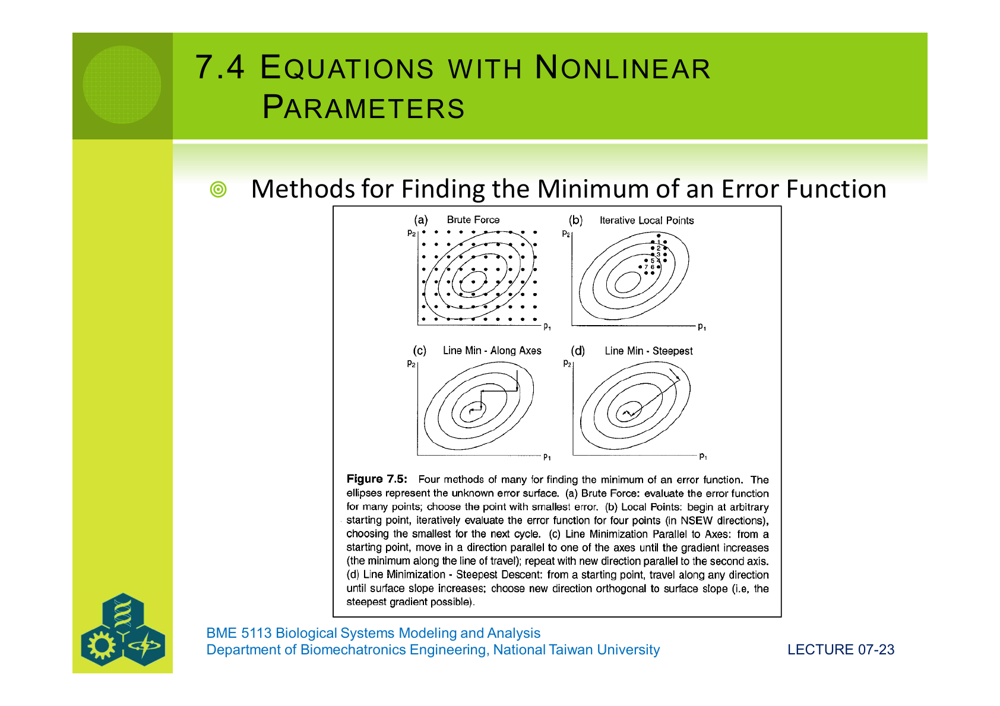
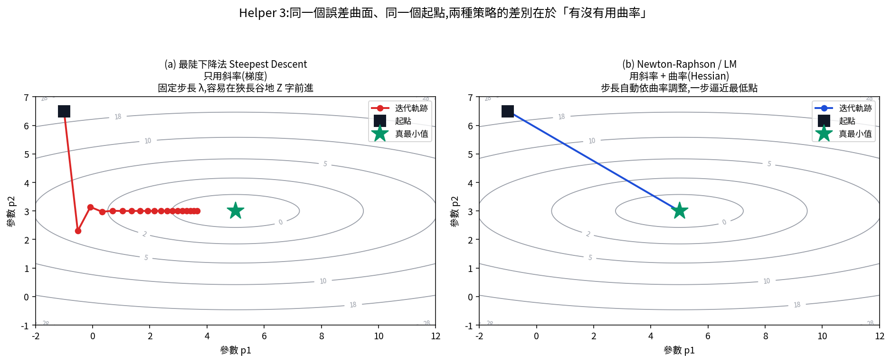
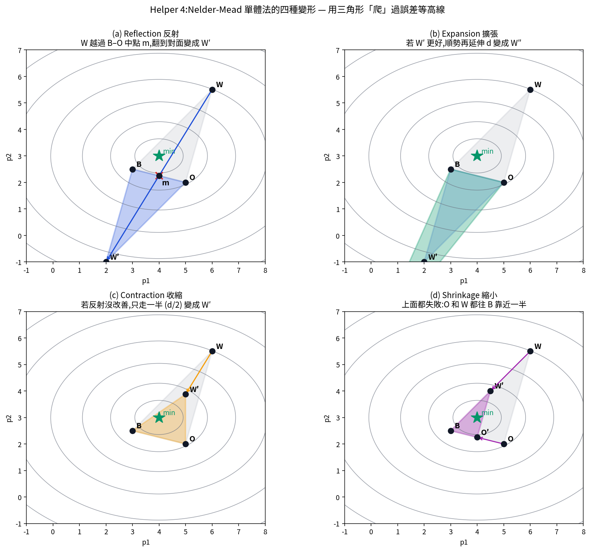
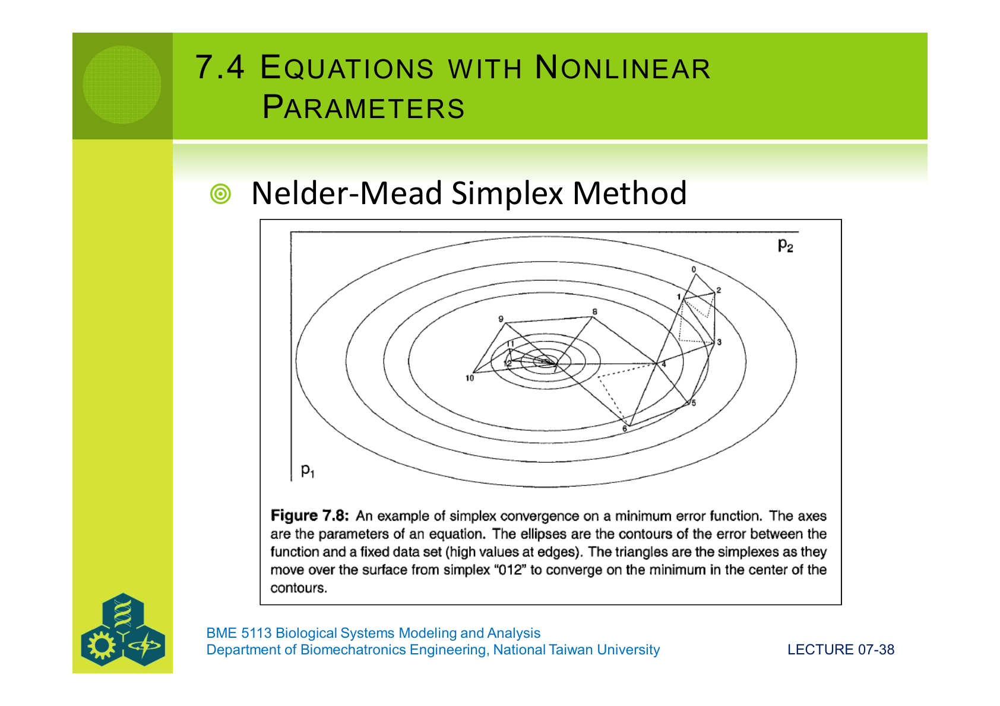

# Lecture 07:參數估計(Parameter Estimation)

> 我們已經會寫模型、會數值解 ODE,但模型裡頭的 r、K、α、β 從哪裡來?
> 這一講要回答:**面對一堆實驗資料,怎麼挑出讓模型「最貼近資料」的那組數字**。

---

## 0. 為什麼這一講重要?

回想前面六講做過的事:

- Lec 04–05:寫出物種成長、酵素動力、捕食者-獵物等模型,例如 logistic 方程
  $\dfrac{dN}{dt} = r\,N\left(1 - \dfrac{N}{K}\right)$。
- Lec 06:用 Euler、RK4 把這些 ODE 在電腦上求數值解。

但是 — 你怎麼知道 $r = 0.3$ 還是 $r = 0.7$?$K = 100$ 還是 $K = 1\,000$?

這些「**寫在模型裡、但實際數值未知**」的量就叫做**參數(parameters)**。
它們的值不能從紙上推出來,只能從**真實實驗資料**反推。

> 這個反推的過程,就是**參數估計**(parameter estimation)
> ,也叫**模型校準**(model calibration)。

換句話說,參數估計回答的問題是:

> 「給定我假設的模型 $f(x;\,p_1, p_2, \ldots)$,以及一堆 $(x_i, y_i)$ 資料,
> 哪一組 $(p_1, p_2, \ldots)$ 讓 $f$ 通過資料時「總誤差最小」?」

---

## §7.1 The Problem:什麼叫「最佳擬合」?

### 7.1.1 一個具體例子

PDF 原始 Fig 7.1 給了一筆族群密度與後代數量的資料:

| Females (x) | 1 | 10 | 25 | 45 | 60 | 70 | 75 |
|---|---|---|---|---|---|---|---|
| Offspring per female (y) | 5.0 | 4.9 | 4.5 | 4.0 | 3.0 | 1.5 | 0.5 |

(密度上升 → 個體後代下降,密度依賴的成長)

研究者**先猜**一個函數形式:

$$
y = k_1 + k_2\,x^{k_3}
$$

剩下的工作就是找出讓這條曲線最貼近 7 個資料點的 $(k_1, k_2, k_3)$。
這就是參數估計的標準姿勢:**形式先猜、數值用資料定**。



### 7.1.2 「貼近」要怎麼量?

直覺上「貼近」=「資料點離曲線都很近」。但「近」可以用很多種方式量:

| 候選距離 | 表達 | 直覺 |
|---|---|---|
| 1. 歐氏距離 | 點到曲線最短距離 | 幾何上最自然,但對 $x$、$y$ 不對稱 |
| 2. **垂直距離平方和** | $\sum_i (y_i - f(x_i))^2$ | 最常用,稱**最小平方** |
| 3. 卡方 | $\sum_i \dfrac{(y_i - f(x_i))^2}{\sigma_i^2}$ | 對不同點的不確定性加權 |
| 4. 絕對值 | $\sum_i \lvert y_i - f(x_i) \rvert$ | 對極端值不敏感 |
| 5. 最大距離 | $\max_i \lvert y_i - f(x_i) \rvert$ | 「最糟那一點」最小化 |

本講重點放在 (2)**最小平方法(least squares)**,因為它有幾個工程上很實用的特性:

1. 平方讓「正負誤差互相抵消」的問題消失;
2. 平方讓「離曲線越遠的點懲罰越大」,逼迫曲線去抓住所有點;
3. 平方是**處處可微**的(絕對值在 0 點不可微),這對後面要用「微分=0」找最小值的方法很關鍵。

### 7.1.3 最小平方法的數學定義

設模型函數是 $f(x_i;\, p_1, \ldots, p_k)$,實驗資料是 $\{(x_i, y_i)\}_{i=1}^n$。
**第 i 個資料點的殘差(residual)** 是:

$$
\varepsilon_i \;=\; y_i - f(x_i;\,p_1, \ldots, p_k)
$$

**最小平方目標函數**是所有殘差平方加總:

$$
\boxed{\;
E(p_1, \ldots, p_k) \;=\; \sum_{i=1}^{n} \varepsilon_i^{\,2}
\;=\; \sum_{i=1}^{n}\bigl(y_i - f(x_i;\,p_1,\ldots,p_k)\bigr)^2
\;}
$$

讀作:**「對所有資料點,把『實際值減去模型預測』平方加起來,得到的總誤差是 $p_1, \ldots, p_k$ 的函數」**。

我們要做的事是:

$$
(\hat p_1, \ldots, \hat p_k) \;=\; \underset{p_1, \ldots, p_k}{\arg\min}\;E(p_1, \ldots, p_k)
$$

讀作:**「在所有可能的參數組合中,挑出讓總誤差 $E$ 最小的那一組,標上帽子代表估計值」**。

### Helper 1:「最小平方」到底在挑什麼?

下圖把這件事視覺化。同樣一筆資料,候選 A(紅線)是隨便猜的;候選 B(藍線)是最小平方挑出來的。每個資料點到曲線的灰色垂直線段就是「殘差」,我們把所有灰線長度平方加起來就是 SSE(右側長條圖)。最小平方做的事就是**讓那根長條盡可能矮**。



注意三件事:

1. **「殘差」永遠垂直**,因為我們挑的是 $y_i$ 與 $f(x_i)$ 的差,而不是點到曲線的最短距離。
2. **平方放大了大的偏差**:候選 A 有幾個點偏得很遠,SSE 飆高;候選 B 把這些偏差攤平了。
3. 即使是 B,也不是「殘差 = 0」 — 因為**資料有雜訊**,任何曲線都不可能穿過所有點;我們只是讓總誤差最小。

> **小結**:參數估計 = 用最小平方目標函數 $E$,在參數空間裡找最低點。
> 接下來的每一節都在回答:**「最低點到底要怎麼找?」**

---

## §7.2 Simple Linear Regression:一個變數的線性模型

### 7.2.1 直線方程式與最小平方解

最簡單的情況:模型是一條直線。

$$
y = m\,x + b, \quad \text{要估的參數是 }(m, b)
$$

代進最小平方目標函數:

$$
E(m, b) \;=\; \sum_{i=1}^{n} \bigl(y_i - (m\,x_i + b)\bigr)^2
$$

要找 $E$ 的最小值,用我們在 Lec 05 學過的偏微分。**「最低點」的條件是兩個偏微分都等於零**:

$$
\dfrac{\partial E}{\partial m} = 0, \qquad \dfrac{\partial E}{\partial b} = 0
$$

把這兩個式子展開,就得到一組**對 $m$ 和 $b$ 線性**的方程組(這正是「線性回歸」這個名字的來源):

$$
\hat m = \dfrac{n \sum x_i y_i - \sum x_i \sum y_i}{n \sum x_i^2 - (\sum x_i)^2},
\qquad
\hat b = \bar y - \hat m\,\bar x
$$

> 重點:**只有當「殘差對參數 $\partial \varepsilon / \partial p_j$ 是線性的」時,我們可以一步代公式得到答案**。
> 線性方程式正是這種乖學生 — 不必迭代、不必猜起點。

### 7.2.2 真實研究裡很少有直線

但生物學家面對的方程式,大多不是直線。例如:

- **指數成長** $N(t) = N_0 e^{rt}$
- **Michaelis-Menten** $v = \dfrac{V_{\max}\,S}{K_m + S}$
- **冪函數** $y = a\,x^b$

對這些函數,「殘差對參數」不是線性的,直接用線性回歸公式會錯。

那要怎麼辦?

### 7.2.3 解法之一:把它變回線性的形狀

很多非線性方程其實**只是穿了個變換的外衣**,內裡是線性的。
把外衣脫掉(做變數變換),就能套線性回歸。

| 原方程 | 變換 | 變換後 |
|---|---|---|
| $y = a\,e^{bx}$ | 兩邊取自然對數 | $\ln y = \ln a + b\,x$ |
| $y = a\,x^b$ | 兩邊取對數 | $\log y = \log a + b\,\log x$ |
| $v = \dfrac{V_{\max} S}{K_m + S}$ | 兩邊取倒數 | $\dfrac{1}{v} = \dfrac{K_m}{V_{\max}}\dfrac{1}{S} + \dfrac{1}{V_{\max}}$ |

最後一個變換有個特別的名字:**Lineweaver–Burk plot**(雙倒數圖),
是酵素動力學的經典工具。

### Helper 2:Lineweaver–Burk 變換的直覺

下圖左邊是原始的 Michaelis–Menten 曲線(彎彎的飽和形狀,參數 $V_{\max}$、$K_m$ 在分子分母各一個);
右邊是 $X = 1/S$、$Y = 1/v$ 變換後的圖(乖乖一條直線,$V_{\max}$ 變成截距倒數,$K_m/V_{\max}$ 變成斜率)。



### 7.2.4 變換的代價

變換很方便,但**會把資料的雜訊結構也跟著扭曲**。

例如:資料 $v_i$ 假設雜訊是常態分佈、變異數固定。
取倒數後 $1/v_i$ 的雜訊就**不再**是常態、變異數**不再**固定 — 接近 0 的 $v$ 經過倒數會被放得超大,把整條擬合線都拉歪。

> 所以後面 §7.7 第 1 點會明白寫:**「Beware of transformations.
> 能用非線性回歸(下一節)就盡量別硬用變換。」**

---

## §7.3 Nonlinear Equations Linear in the Parameters:多項式回歸

### 7.3.1 一個容易混淆的名詞

「**對參數線性 / Linear in the parameters**」是這一節最關鍵的詞。
請和「對 $x$ 線性」分開來看:

- $y = m\,x + b$ ── 對 $x$ 線性,對 $(m, b)$ 也線性 ✓
- $y = a\,x^2 + b\,x + c$ ── 對 $x$ **不**線性,但對 $(a, b, c)$ **是**線性 ✓
- $y = a\,e^{bx}$ ── 對 $x$ 不線性,對 $(a, b)$ 也不線性 ✗

> 中間那一型(對 $x$ 不線性但對參數線性),雖然函數本身彎彎曲曲,
> **但「殘差 vs 參數」還是線性的**,所以仍然可以用線性最小平方,一步解出來,不必迭代。

### 7.3.2 多項式回歸的矩陣推導

想擬合 $k$ 次多項式 $y = a_0 + a_1 x + a_2 x^2 + \cdots + a_k x^k$。
把 $n$ 筆資料整套寫成矩陣形式:

$$
\underbrace{\begin{pmatrix} y_1 \\ y_2 \\ \vdots \\ y_n \end{pmatrix}}_{\mathbf{y}}
=
\underbrace{\begin{pmatrix}
1 & x_1 & x_1^2 & \cdots & x_1^k \\
1 & x_2 & x_2^2 & \cdots & x_2^k \\
\vdots & & & & \vdots \\
1 & x_n & x_n^2 & \cdots & x_n^k
\end{pmatrix}}_{\mathbf{X}}
\underbrace{\begin{pmatrix} a_0 \\ a_1 \\ \vdots \\ a_k \end{pmatrix}}_{\mathbf{a}}
+
\underbrace{\begin{pmatrix} \varepsilon_1 \\ \varepsilon_2 \\ \vdots \\ \varepsilon_n \end{pmatrix}}_{\boldsymbol{\varepsilon}}
$$

用偏微分 $\partial E / \partial a_j = 0$ 對 $k+1$ 個參數同時求解,
經過幾步矩陣推導,得到**正規方程式(Normal Equations)**:

$$
\boxed{\;\mathbf{X}^\top \mathbf{X}\,\mathbf{a}
\;=\; \mathbf{X}^\top \mathbf{y}\;}
\qquad\Longrightarrow\qquad
\hat{\mathbf{a}} = (\mathbf{X}^\top \mathbf{X})^{-1}\,\mathbf{X}^\top \mathbf{y}
$$

實務上**不會真的算反矩陣**(數值不穩),會用 QR 分解或 SVD,但概念上就是一次性線性求解、沒有迭代。

### 7.3.3 一個概念上的警訊

多項式越高次,理論上越能「貼住」每個資料點。
那為什麼不直接擬合一個 100 次多項式呢?

因為這會**過度配適(overfitting)**:擬合曲線扭來扭去去討好每一個雜訊點,
但對「沒看過的新資料」反而預測糟糕。
這個議題我們在 §7.7 警告 4 會再提一次。

---

## §7.4 Equations with Nonlinear Parameters:一定得迭代了

### 7.4.1 為什麼變換、矩陣這兩招都沒用?

如果參數真的是非線性的(像 $y = a / (1 + b\,e^{c\,x})$,$c$ 卡在指數裡,沒辦法變換掉),
那麼把偏微分 $\partial E / \partial p_j = 0$ 寫出來,你得到的會是
**一組非線性方程組**,**沒有封閉解**。

唯一的出路是:**從某個猜測點出發,一步步往「誤差較低」的方向走**,直到走不下去為止。
這就叫**迭代法(iterative methods)**。

迭代法的核心是兩個問題:

1. **方向**:現在的點要往哪一個方向走,才會讓誤差變小?
2. **步長**:這一步要走多遠?走太短會慢、走太長會跨過最低點。

### 7.4.2 誤差曲面與等高線

把誤差 $E$ 想成一個地形:橫軸 $p_1$、縱軸 $p_2$、高度 $E$。
最小平方法要做的事就是**從某處出發,沿著山坡走到山谷底**。

PDF 原始 Fig 7.4 同時用 3D 立體圖和等高線圖呈現這個概念:



> 提醒:現實的誤差曲面**通常不是漂亮的單一碗**,而是有多個山谷、山脊、平台 —
> 所有迭代法只能保證找到**附近的最低點(局部最小)**,
> 不保證找到**全圖最低點(全域最小)**。這是後面 §7.7 警告 1 的根源。

### 7.4.3 找最低點的四個策略

PDF 原始 Fig 7.5 把四種不同層次的策略畫在一起,從最暴力到最聰明:



| (a) Brute Force | 整個參數空間網格全跑,挑誤差最小那點。**準但慢得要命**,參數一多就跑不完。 |
| (b) Iterative Local Points | 在當前位置的 N/S/E/W 四個鄰居測誤差,往最小的鄰居走 |
| (c) Line Min – Along Axes | 沿著 $p_1$ 軸下坡到極小,再沿 $p_2$ 軸下坡到極小,交替 |
| (d) Line Min – Steepest | 沿著當前**最陡下降方向**(梯度反方向)下坡到極小 |

(d) 是大部分**梯度法**家族(Steepest Descent、Newton、LM)的基本骨架。
要把 (d) 寫成程式,我們需要先學一個共通的數學工具:**Taylor 展開**。

### 🛠 數學工具迷你導讀:Taylor 展開

**遇到的障礙**:誤差函數 $E(p)$ 形狀任意,我們又得在每一步「猜下一步往哪走、走多遠」。
有沒有辦法,在當前點附近,用一個**簡單的函數**去近似 $E$,讓我們用簡單函數的最小值來預測下一步?

**這個工具叫什麼**:Taylor expansion(泰勒展開)。
任何「足夠平滑」的函數,在某一點 $p_0$ 附近,都可以寫成多項式近似:

$$
\underbrace{f(p)}_{\text{原函數}}
\;\approx\;
\underbrace{f(p_0)}_{\text{常數項}}
\;+\;\underbrace{f'(p_0)\,(p - p_0)}_{\text{一階:切線}}
\;+\;\underbrace{\tfrac{1}{2}\,f''(p_0)\,(p - p_0)^2}_{\text{二階:拋物線}}
\;+\;\cdots
$$

**小例子**:對 $f(p) = e^p$,在 $p_0 = 0$ 展開:

- $f(0) = 1$,$f'(0) = 1$,$f''(0) = 1$。
- 所以 $e^p \approx 1 + p + \tfrac{1}{2}p^2$,在 $p$ 很小時非常準。
  例如 $e^{0.1} \approx 1 + 0.1 + 0.005 = 1.105$,真值 $1.10517$,差 0.0002。

**關鍵性質**:

1. 只取到**一階**項 → 用**切線**近似原函數;對應 **Gauss 法**。
2. 取到**二階**項 → 用**拋物線**近似;對應 **Newton-Raphson** 與 **LM**。
3. 階數越高越準,但計算量也越大;實務上多止於二階。

**Sanity check**:Taylor 展開只有在**接近 $p_0$**才精確,
所以梯度法走的每一步都不能太大,否則近似失準、可能往錯誤方向跑。

> **記住**:從這裡開始,所有梯度法都是同一句話的變奏 ──
> **「在當前點對誤差曲面做 Taylor 展開,把那個近似函數的最低點當作下一步」**。

### 7.4.4 多參數時的梯度與 Hessian

兩個參數時,Taylor 展開要寫成向量、矩陣形式。
誤差函數 $E(p_1, p_2)$ 的一階展開涉及**梯度向量**:

$$
\nabla E \;=\; \begin{pmatrix} \partial E / \partial p_1 \\ \partial E / \partial p_2 \end{pmatrix}
$$

讀作:「**梯度**就是把所有偏微分疊成一個向量,它指向最陡上升方向」。
所以**最陡下降方向是 $-\nabla E$**(取負號)。

二階展開額外涉及**Hessian 矩陣**(課本 Eq. 7.8):

$$
\mathbf{C} \;=\;
\begin{pmatrix}
\dfrac{\partial^2 E}{\partial p_1^2} & \dfrac{\partial^2 E}{\partial p_1 \partial p_2} \\[1ex]
\dfrac{\partial^2 E}{\partial p_2 \partial p_1} & \dfrac{\partial^2 E}{\partial p_2^2}
\end{pmatrix}
$$

讀作:「**Hessian**就是把所有二階偏微分(斜率的斜率)排成 $2\times 2$ 矩陣,
描述誤差曲面在當前點是『淺碗』還是『深碗』、是『方向均勻』還是『狹長』」。

> 對角元素 $\partial^2 E / \partial p_j^2$:單一參數方向的曲率;
> 非對角元素 $\partial^2 E / \partial p_1 \partial p_2$:兩參數**耦合**的程度。

### 7.4.5 通用迭代公式

不管哪種梯度法,迭代公式都長這樣:

$$
\mathbf{p}_{i+1} \;=\; \mathbf{p}_i + \Delta \mathbf{p}_i
\tag{7.7}
$$

差別只在**怎麼算 $\Delta \mathbf{p}_i$**:

| 方法 | $\Delta \mathbf{p}_i$ 的公式 | 用到的東西 |
|---|---|---|
| **Steepest Descent** | $-\lambda\,\nabla E$ | 只用梯度,$\lambda$ 是固定步長 |
| **Newton-Raphson** | $-\mathbf{C}^{-1}\,\nabla E$ | 梯度 + Hessian |
| **Gauss** | (一階 Taylor 的線性化解) | 殘差的 Jacobian,計算量介於兩者之間 |
| **Levenberg-Marquardt (LM)** | $-(\mathbf{C} + \lambda \mathbf{I})^{-1}\,\nabla E$ | 在 SD 與 Newton 間「自動切換」 |

LM 的設計很聰明:

- 當 $\lambda$ 很大 → $\mathbf{C} + \lambda \mathbf{I} \approx \lambda \mathbf{I}$,公式退化成 Steepest Descent(離最小值遠時很穩);
- 當 $\lambda$ 很小 → 接近純 Newton-Raphson(靠近最小值時收斂快)。

> **LM 法是「實務上最常用」的非線性最小平方求解器**,
> Python 的 `scipy.optimize.curve_fit(method='lm')`、MATLAB 的 `lsqnonlin` 預設都用它。

### Helper 3:同一個誤差曲面,「只用斜率」vs「斜率 + 曲率」

下圖左邊是純 Steepest Descent(只看梯度,固定步長),右邊是 Newton/LM(用 Hessian 修正方向):



看左邊的 Z 字軌跡:這是**狹長谷地**典型的失敗模式。
梯度雖然指向「目前下降最快」的方向,但因為谷狹長,梯度方向幾乎垂直於「真正通往谷底」的方向,所以每一步只能斜插一小段,反覆來回。

右邊只跑兩步就直接到了 — 因為 Hessian 知道**這個方向曲率小**(谷沿著它走很遠才會升起),
所以在那個方向上敢踏一大步;反之在曲率大的方向就只敢小步。

### 7.4.6 一維小例子:看清楚 Steepest Descent vs Newton

(課本 Eq. 7.11–7.12)假設誤差是漂亮的拋物線:

$$
E(p) = 0.1\,p^2 - 2\,p + 10
$$

一階導數:$\dfrac{dE}{dp} = -2 + 0.2\,p$;二階導數:$\dfrac{d^2 E}{dp^2} = 0.2$(常數)。

從 $p_0 = 20$ 起步:

- **Steepest Descent**($\lambda = 1$): $p_1 = 20 - (1) \cdot [-2 + 0.2 \cdot 20] = 20 - 2 = 18$。
  一步走了 2,離真最小值 $p^\ast = 10$ 還很遠。
- **Newton**(用曲率 $0.2$ 當「自動步長」): $p_1 = 20 - (1/0.2) \cdot [-2 + 0.2 \cdot 20] = 20 - 10 = 10$。
  **一步直接到最小值**。

對拋物線而言,Newton 是「一擊必殺」 — 因為拋物線的 Taylor 二階展開就是它自己,沒有近似誤差。

### 7.4.7 Direct Methods:不用微分的另一條路

梯度法的麻煩在於**要算微分**:模型複雜時,解析微分難寫、數值微分又貴又抖。

**Direct methods**(也叫 derivative-free methods)選擇完全不算微分,只看誤差值本身。
其中最有名的是 **Nelder-Mead simplex(單體法)**。

### 7.4.8 Nelder-Mead Simplex Method

**核心想法**:在參數空間裡放一個**幾何形狀**(2 個參數時用三角形,3 個參數用四面體,$n$ 個參數用「$n+1$ 頂點的多胞形」),
讓它像變形蟲一樣**爬過誤差曲面**直到包住最低點。

每一輪都先把三個頂點按誤差排名:

- **B**(Best):最低誤差
- **O**(Other / intermediate):中間
- **W**(Worst):最高誤差

然後對 W 做下面四種運算之一(見 Table 7.1):

| 運算 | 規則 | 直覺 |
|---|---|---|
| **Reflection 反射** | W 翻過 B–O 中點 $m$,走 $d$ 變成 W′(總共 $2d$) | 「最糟的點對著好邊翻過去看看」 |
| **Expansion 擴張** | 若 W′ 比 W 更好,沿同方向再走 $d$ 變成 W″ | 「翻過去有改善,再衝遠一點」 |
| **Contraction 收縮** | 若反射沒改善,W 只走半距(到 W′ = W 朝 $m$ 走 $d/2$) | 「反射太冒進,改走一半」 |
| **Shrinkage 縮小** | 上面都不行 → O 和 W 同時往 B 靠近一半 | 「整個三角形對 B 縮一半,重新出發」 |

### Helper 4:四種 Simplex 運算同框比較



注意每一種運算都**只需要計算新頂點的誤差**,完全不碰微分。
這讓 Simplex:

- 對「不可微」或「微分難算」的問題特別好用(例如模型本身需要跑數值模擬才能算誤差)
- 對含**雜訊**的誤差曲面比較不敏感
- 缺點:在高維(>20 個參數)收斂會很慢

PDF 原始 Fig 7.8 顯示 simplex 從遠處一路爬向最小值的真實軌跡:



注意它走的不是一條漂亮的直線,而是不斷反射、擴張、有時收縮 — 像一隻邊摸索邊前進的章魚。

### 7.4.9 程式碼一覽

兩種主流工具的呼叫方式幾乎一模一樣:

**MATLAB** — LM 法(`lsqnonlin`)與 Simplex 法(`fminsearch`):

```matlab
% LM 法
init_guess = [3.5 2.3 4.9];
parameter_hat = lsqnonlin(@mycurve, init_guess, [], [], xdata, ydata);

% Simplex 法
start = [1; 0];
estimated_lambda = fminsearch(@(x) fitfun(x, t, y), start);
```

**Python** — SciPy 的 `curve_fit`(預設 LM)與 `minimize`(可選 Nelder-Mead):

```python
from scipy import optimize

def model_func(x, a, b, c):
    return a / (1.0 + b * np.exp(c * x))

# LM 法
p_hat, cov = optimize.curve_fit(model_func, xdata, ydata,
                                 method='lm', p0=[2.9, 2.3, 4.9])

# Nelder-Mead
result = optimize.minimize(lambda p: error_fn(p, xdata, ydata),
                            x0=[2.9, 2.3, 4.9],
                            method='Nelder-Mead')
```

**初始猜測 `p0` 很重要**:給得太離譜會落到別的局部最小,給得近真值才會穩。
所以後面 §7.7 警告 1 才會說:**用不同起點各跑一遍,看是否收斂到同一答案**。

---

## §7.5 Calibration to Dynamic Data:擬合「時間序列」

### 7.5.1 動態資料是什麼?

到目前為止講的都是靜態關係 $y = f(x)$。
但生物系統很多是**隨時間變化**的:細菌族群、酵素反應進度、感染人數隨日期。
資料形式變成「時間點 $t_i$ 對應狀態 $N_i$」,模型形式則是 **ODE**:

$$
\dfrac{dN}{dt} = g(N;\,p_1, \ldots, p_k)
$$

擬合方式變成:找出讓模型 ODE 解 $N(t;\,\mathbf{p})$ 在所有觀測時間點都最接近實驗值的 $\mathbf{p}$。

### 7.5.2 兩種情境

**情境 1:ODE 有解析解** — 直接把解析解當「非線性函數」丟給上面的演算法。

例如 logistic 模型:

$$
\dfrac{dN}{dt} = r\,N\!\left(1 - \dfrac{N}{K}\right)
\quad\Longrightarrow\quad
N(t) = \dfrac{K}{1 + e^{\beta - r\,t}}
\tag{7.13}
$$

這個 $N(t)$ 對 $(r, K, \beta)$ 是非線性的,但是是**可以一行寫出來的函數**。
直接交給 LM 或 Simplex 處理即可。

**情境 2:ODE 沒有解析解** — 大部分耦合非線性 ODE 都是這樣。
這時不能直接「代公式」,只能**每換一次參數就用 RK4 把整條軌跡跑出來**,然後算誤差。

```
[猜一組 p] → [用 RK4 解 ODE] → [軌跡 vs 資料 → 算 SSE] → [送進 Simplex/LM] → [更新 p]
                              ↑                                              │
                              └─────────── 重複 ────────────────────────────┘
```

這個迴圈每一步都要解一次 ODE,**計算成本很高**。
所以實務上常用 **Simplex 法**(不必算微分,每步只要跑模型),特別適合這種情境。

### 7.5.3 系統識別(System Identification)

對線性系統:

$$
\dfrac{dx}{dt} = a\,x + b\,y, \qquad \dfrac{dy}{dt} = c\,x + d\,y
$$

它的解一定是若干指數函數的線性組合 $x(t) = \sum_j C_j e^{\lambda_j t}$。
擬合這種「指數和」就是**系統識別**這個經典領域,從工程控制、生物動力學到神經訊號分析都會用到。

---

## §7.6 Evolutionary Techniques:仿生物演化的最佳化

### 7.6.1 概念

前面所有方法都是「**一個探勘點**」沿著梯度或 simplex 移動。
**演化計算(evolutionary computation)** 不一樣 — 它一次放出**一群點(族群)**,
讓每個點在參數空間裡是一隻「**生物**」,適應度(fitness)就是**誤差函數的倒數**:誤差越小,生物越強。

每一代:

1. **選擇**:誤差大的(弱的)被淘汰;
2. **交配**:存活的兩兩配對,後代的位置是父母位置的某種混合;
3. **突變**:後代隨機抖動一點點;
4. 形成新一代,**繼續演化**直到沒有顯著改善。

這個家族包括:

- **遺傳演算法(GA, Genetic Algorithm)** — 把參數編成「染色體」,做交叉與突變
- **粒子群最佳化(PSO, Particle Swarm Optimization)** — 粒子互相觀察,集體趨向最佳區
- **差分演化(DE, Differential Evolution)** — 用族群成員之差來產生突變

### 7.6.2 為什麼這套有用?

**最大優勢**:對**多峰**誤差曲面(多個局部最小)效果好。
因為族群分散在多個位置,一次同時探索好幾個山谷,不會像梯度法一頭栽進某個淺谷出不來。

**代價**:

- 收斂慢(每代要算很多隻生物的誤差)
- 沒有微分概念,精準度比 LM 差
- 通常用來「找全域最小的大概位置」,然後**再交給 LM 做最終精修**(混合策略)

---

## §7.7 Parameter Estimation Cautions:七條鐵則

PDF 結尾的七條警告,值得用紅筆記住:

### 適用於所有方法

1. **小心變換**(§7.2.4)。雜訊結構會被扭曲,寧可用非線性回歸。
2. **檢查離群值**。一兩個離譜的點會嚴重拉歪最小平方擬合(因為平方放大誤差)。
3. **不要外推**。擬合區間外、甚至區間內的稀疏處,模型預測都不可靠。有理函數對多筆資料更危險。
4. **不要只看 $r^2$**。塞夠多參數,$r^2$ 一定能接近 1,但這叫**過度配適**,模型對新資料毫無預測力。
5. **永遠把資料和擬合曲線畫出來**。視覺檢查能抓到一堆統計量看不到的問題(系統性偏差、漏抓的曲折)。

### 適用於迭代法

6. **迭代法只找局部最小**。**用多個不同起點各跑一遍**,看是否都收斂到同一個答案;
   或用演化演算法做全域初始搜索。
7. **微分敏感於曲面粗糙度**。誤差曲面起伏劇烈時,數值微分會跑偏;
   這時 Simplex 之類不必微分的方法反而較穩。**用不同步長重驗一遍**也是好習慣。

### 額外的迭代法細節

8. **大部分迭代法給不出精確 $r^2$**。需要時可用 **bootstrap** 或對誤差函數做多項式擬合來近似。
9. **停止條件要看清楚**。迭代會在兩個條件之一觸發時停:
   (a) 殘差的相對變化小於閾值(這是「真的收斂了」);
   (b) 迭代次數爆表(這是「逃出來算了」)。
   ── 一定要檢查是哪個條件停的;**若是 (b),很可能根本沒收斂**,要加大上限再跑。

---

## 一句話總結

> **參數估計 = 在參數空間裡找誤差函數的最低點。**
>
> - **線性模型** → 偏微分 = 0 一步解出來。
> - **「對參數線性」的非線性模型(多項式)** → 矩陣正規方程式。
> - **真正非線性模型** → 迭代:
>   - 用微分:Steepest Descent / Newton / **Levenberg-Marquardt**(常用)
>   - 不用微分:**Nelder-Mead Simplex**(對雜訊/不可微較穩)
> - **動態 ODE 資料** → 每換一次參數就跑一次模型,常配 Simplex。
> - **避免落入局部最小** → 多起點重跑,或用演化演算法做全域搜索。

---

## 下一講預告

到目前為止,我們的模型都是**確定性的(deterministic)** — 給同一組參數和初始條件,
答案永遠相同。但真實生物系統充滿**隨機性**:細胞層級的分子事件、族群層級的個體差異、環境的隨機擾動。

Lecture 08 將進入**隨機性建模(stochasticity)** — 我們會看到當系統規模小、事件離散時,
ODE 不再夠用,必須改用**Gillespie 演算法**、**隨機微分方程(SDE)**、
或**個體基模型(IBM, individual-based models)** 來捕捉「同一組參數、每跑一次結果都不同」的真實樣貌。

擬合這類隨機模型需要更進階的工具(無解析似然、頻譜匹配、ABC 等),
但 Lecture 07 的「定義誤差、找最低點」這個核心精神依舊適用。
