# Lecture 08:模型驗證(Model Validation)

> 前一講教我們怎麼挑出「最貼合資料」的參數;這一講要回答更尖銳的問題:
> **「最貼合」的模型,真的就「對」嗎?要怎麼證明它不對?**

---

## 0. 為什麼這一講重要?

到目前為止,我們已經:

- **Lec 03**:畫過 Forrester 流圖,把概念變成箱-閥圖。
- **Lec 04–05**:寫出族群、酵素、捕食-獵物等 ODE。
- **Lec 06**:用 Euler / RK4 把這些方程在電腦上跑出來。
- **Lec 07**:用最小平方、Levenberg-Marquardt、Nelder-Mead 把參數調到讓殘差最小。

到這裡為止,模型已經「跑得出數字」且「配得上資料」。但 — **這不代表模型是對的**。Lec 07 教我們的全部都是「在我擁有的資料上,讓模型最貼近」,這只是**校準(calibration)**。**驗證(validation)**問的是不一樣的問題:

> 「如果我把模型丟到**沒看過的情境**去,它會繼續對嗎?」
> 「我憑什麼相信它?」

更直白地說:Lec 07 是「把曲線壓在點上」,Lec 08 是「請懷疑這條曲線」。在生物系統建模裡,這個差別會直接影響到「能不能用這個模型做控制、做預測、做決策」 — 從藥物動力學到生態管理都一樣。

> 這一講把「驗證」拆成三件事:
>
> 1. **驗證的哲學**(§8.1–8.2)— 「驗證」這個詞到底想說什麼?用什麼邏輯來「否證」一個模型?
> 2. **驗證的技術**(§8.3)— 真正動手的時候,有哪些統計量、哪些檢定可以用?
> 3. **模型辨別**(§8.4)— 我同時有兩個都不錯的模型,該選哪個?

---

## §8.1 Insight and Illumination:模型不是給數字,是給洞察

老師在開場放了一句:

> "Modeling, like computing and statistics, should produce **insight**, not merely numbers."

模型如果只是吐出數字,那它跟一張試算表沒區別。我們之所以建模,是因為**模型應該幫我們看清楚系統怎麼運作**。要評估一個模型「夠不夠好」,有三條互補的軸:

| 軸 | 中文 | 在問什麼 |
|---|---|---|
| **Validity** | 有效性 | 模型在多大程度上,反映了外在世界? |
| **Uncertainty** | 不確定性 | 模型方程式、參數、系統邊界,各自有多少「我不知道」? |
| **Behavior** | 行為 | 變數之間怎麼共動?在什麼條件下動態相似? |

三條軸合起來才是「模型的品質」 — 一個 r² 很高但對參數極度敏感的模型,在 Validity 上勝出,但 Uncertainty 上輸光。Lec 08 主要在處理 Validity 這條軸,Lec 09 會專門處理 Uncertainty 與 Behavior。

---

## §8.2 Validation: When Models Go Bad

### 8.2.1 「驗證」這個詞到底在說什麼?

系統科學裡,**validation** 通常表示:

> 「模型品質**對於建模目標**的程度。」

注意這個定義裡的限定詞 — 不是「對於真實世界」,而是「對於建模目標」。同一個 ODE 拿來做「描述酵素催化」可能是好的,拿來做「臨床劑量決策」就可能不及格。

近年有人主張用 **corroboration**(佐證)或 **confirmation**(確認)取代「validation」,因為「驗證」聽起來太絕對。教材作者更偏好 **plausible**(合情合理),因為:

- 模型品質是**連續的**,不是 0/1。
- 完美的模型基本上不存在。
- 評估模型是個**無止盡**的過程 — 隨著資料增加,你會一直發現新的不一致。

### 8.2.2 什麼叫「好模型」?七個常用的判準

| 判準 | 中文 | 例子 |
|---|---|---|
| Usefulness for control/management | 用得上(能控制系統嗎?) | 血糖調控、生態管理 |
| Understanding / insight | 帶來洞察 | 釐清回饋環的方向 |
| Accuracy of predictions | 預測準 | 一週後血漿濃度誤差 < 10% |
| Simplicity / elegance | 簡單漂亮 | 不該為了高 r² 加 20 個參數 |
| Generality | 通用性(能套到多少系統?) | 同一個酵素方程適用許多受質 |
| Robustness | 對假設不敏感 | 換個參數 5% 結論不變 |
| Low cost | 跑起來不貴 | 不用 GPU 群跑一週 |

**關鍵警語**:目標決定權重。給臨床用的模型「Accuracy + Robustness」最重要;給課堂教學用的模型「Insight + Simplicity」最重要。

### 8.2.3 形式邏輯小工具:Modus tollens vs 肯定後件

**(障礙)** 我們怎麼「證明一個模型錯」?直接的答案是 — 看它預測什麼,然後做實驗。如果預測沒實現,我們就否定模型。可是這個推理形式正不正確?有沒有反例?

**(工具名稱)** 我們會用到兩種命題邏輯的推理:

- **Modus tollens(否定後件式)** — 邏輯上**有效**。
- **Affirming the consequent(肯定後件式)** — 邏輯上**無效**(這是個常見謬誤)。

**(小例子)**

> Modus tollens:
> - 如果 Spock 是人類,他就會行為不合邏輯。 (A ⇒ B)
> - Spock 沒有行為不合邏輯。 (¬B)
> - ∴ Spock 不是人類。 (¬A) ✓
>
> Affirming the consequent:
> - 如果 Frodo 弄丟戒指,他會生病。 (A ⇒ B)
> - Frodo 生病了。 (B)
> - ∴ Frodo 弄丟了戒指。 (A) ✗ ← 錯誤推理

**(關鍵性質)** Modus tollens 是科學否證的基礎:**只要 B 沒實現,就足以否定 A**;但反過來,**B 實現了不能證明 A 是對的**(因為可能有別的原因導致 B)。

**(套用到模型驗證)** 把 A 當成「模型(整套假設)」,B 當成「模型推出的預測」。如果預測對了,**不能說模型對**(可能巧合對);如果預測錯了,**可以說模型錯了**。所以驗證的本質,其實是**永無止盡地嘗試否證**。

**(看起來合理嗎?)** 是的,但有個複雜化:**A 不是單一假設,A 是一大堆假設的合取**:

$$
(a_1 \wedge a_2 \wedge a_3 \wedge \cdots \wedge a_n) \;\Rightarrow\; B
$$

如果預測 B 失敗,Modus tollens 只告訴我們「$(a_1 \wedge \cdots \wedge a_n)$ 整體錯了」,**但不告訴我們哪一個 $a_i$ 錯了**。所以實務上我們會:

- 做獨立實驗去估個別參數;
- 做敏感性分析看哪個參數影響大;
- 建幾個不同的替代模型來互相比較。

### 8.2.4 The Geometry of Validation:用集合來看驗證

Mankin 等人 (1977) 提出一個很乾淨的圖像。定義三個集合:

- **S** = 可在系統上做的所有測量(觀察集合)
- **M** = 模型可以預測的所有測量(預測集合)
- **Q = S ∩ M** = 兩者重疊、且實際上一致的部分(**正確預測**)
- **P** = 全宇宙可想像得到的測量(包圍 S 和 M)

從這個圖像可以推出兩個量化指標:

$$
\text{model reliability}\;=\;\dfrac{|Q|}{|M|}
\qquad
\text{model adequacy}\;=\;\dfrac{|Q|}{|S|}
$$

- **可靠度(reliability)** 問:「模型說的話,有多少比例是對的?」分母是模型的「出口」。
- **適切度(adequacy)** 問:「系統的觀測,有多少比例被模型抓到?」分母是系統的「真相」。

下面的 helper 圖把這層幾何畫出來 — 左邊是原始 Fig 8.1 的重畫,右邊五個小圖對應 Fig 8.2 的五種情境:

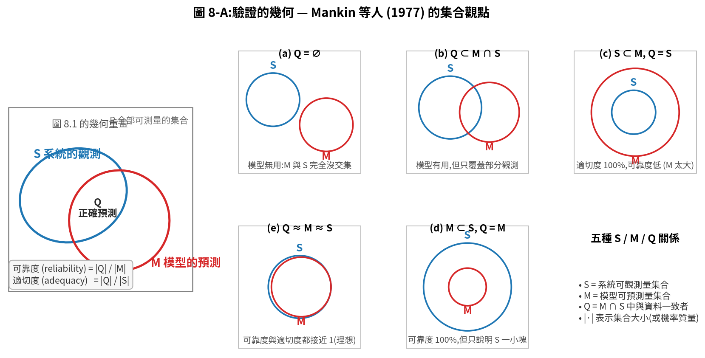

對照原始圖:

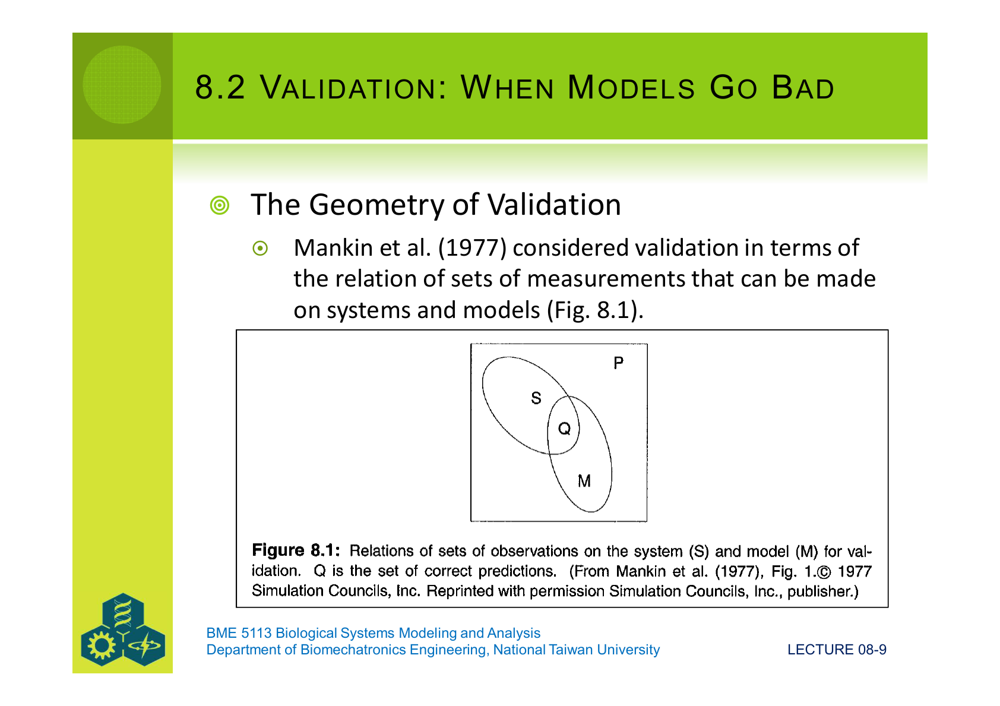
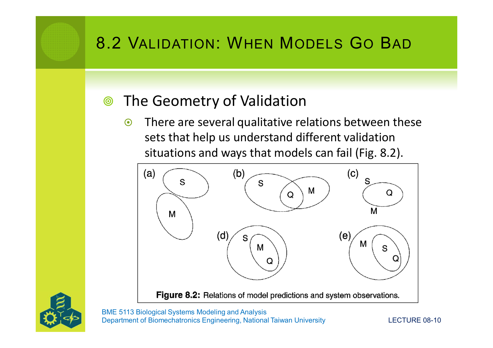

**為什麼要分這兩個指標?** 因為一個模型可能在某一個高、另一個低:

- **(c)** 模型 M 是 S 的超集 → 適切度 = 1(每一個觀測都能解釋),但可靠度低(M 還預測了一堆沒觀測到的東西)。臨床上「不會錯但會亂講」的模型。
- **(d)** 模型 M 是 S 的子集 → 可靠度 = 1(模型每句話都對),但適切度低(它只說了 S 的一小塊)。「不會錯但話很少」的模型。
- 真實研究中常常只報告 |Q| 的大小,或最多算到 adequacy。**Reliability 比較難評估,因為它要求我們知道「模型還會預測什麼沒被測過的東西」**,而這需要把模型搬到不同系統、不同地理、不同參數情境下去考驗。

### 8.2.5 驗證可以拿什麼變數來比?

模型輸出與資料能對比的「量」未必只有狀態變數本身。常見的還有:

- **狀態變數的函數**(換單位、加總、做比值)
- **時間或空間平均**、**頻率分布**
- **極大值** / **極小值** 或極值出現的**時間**
- **多個狀態變數的比值**(e.g. 捕食者/獵物比)

實務上,「比什麼」常常**比「怎麼比」更重要**。例如做心血管模型,把心輸出量的「**峰值時刻**」和資料對齊,往往比把整條波形對齊更能反映你關心的生理機制。

### 8.2.6 四個前置條件

要做有意義的驗證,得先檢查:

1. **資料獨立性(Data Independence)** — 驗證用的資料,**不能**是調參數時用過的資料,否則只是 calibration。再抽樣手法(cross-validation、jackknife、bootstrap)是處理「我資料不夠多」時的妥協。
2. **單一/多重響應** — 你要看一個變數還是好幾個?後者要決定「分開比」還是「一起比」。
3. **單一/多時間點** — 要在哪幾個時刻比?用單一時刻要說清楚理由;用多時刻則要小心**時間自相關**會破壞標準 t-test 的假設。
4. **是否有複製(replication)** — 統計檢定通常需要「至少一邊有變異」。若系統與模型都是單一執行,只能用回歸類方法(它不要求複製)。

---

## §8.3 The Techniques of Validation

§8.3 是這一講最厚的一節,因為它對應到一張完整的「工具表」(教材 Table 8.1 + 8.2)。下面是濃縮版,實作時可以當查找表用:

| 方法 | 比的是什麼 | 要不要複製? | 處理時間序列? |
|---|---|---|---|
| **1:1 Regression** | 斜率=1、截距=0 | 不用 | 不行(忽略順序) |
| **r / R²** | 相關性 | 不用 | 不行 |
| **Lack-of-Fit** | 模型是否系統性偏離 | **要**(同 x 多次測量) | 不行 |
| **Paired t-test** | 配對差是否為零 | 不用 | 不行 |
| **Profile analysis** | 多變數多時刻軌跡是否平行 | **要** | **可以** |
| **95% CI 法** | 模型有沒有落在資料 95% CI 裡 | **要**或隨機模型 | 可以 |
| **Turing test** | 人類專家分得出來嗎? | 不用 | 可以 |
| **LRT(似然比)** | 兩個 nested 模型 | 不用 | — |
| **AIC** | 配適 vs 複雜度 | 不用 | — |
| **Bayes** | 後驗機率 | 不用 | — |
| **MSEP / RMSEP** | 平均平方誤差(可分解) | 不用 | — |
| **MAE / MA%E** | 平均絕對誤差 / 百分比 | 不用 | — |
| **EF(模型效率)** | 把誤差用資料變異性標準化 | 不用 | — |
| **Theil's U** | 把誤差用模型+資料兩邊變異性標準化 | 不用 | — |
| **Janus J²** | 驗證誤差 / 校準誤差 | 不用 | — |

下面挑三組最常用的來細講。

### 8.3.1 觀測 vs 預測的散點圖:相關係數的陷阱

把資料 $Y_i$ 對模型預測 $X_i$ 畫散點圖,然後比較**回歸線**和**1:1 線**。**相關係數**(Pearson r)定義是:

$$
r \;=\; \dfrac{1}{n-1}\sum_{i=1}^{n}\left(\dfrac{X_i - \bar X}{s_X}\right)\left(\dfrac{Y_i - \bar Y}{s_Y}\right)
$$

讀作:「**把 X 和 Y 都換成 z-score(減均值除標準差),再把兩兩相乘加總、除以 n−1**」。它衡量的是「兩個變數的**直線關係**有多強」。

**問題在這**:r 高 ≠ 模型對。下面是教材 Fig 8.4 想傳達的訊息,重畫如下:

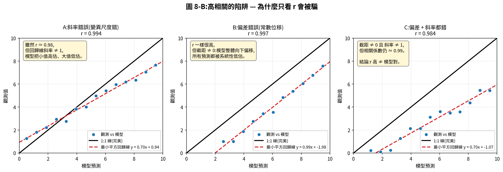

對照原始圖:

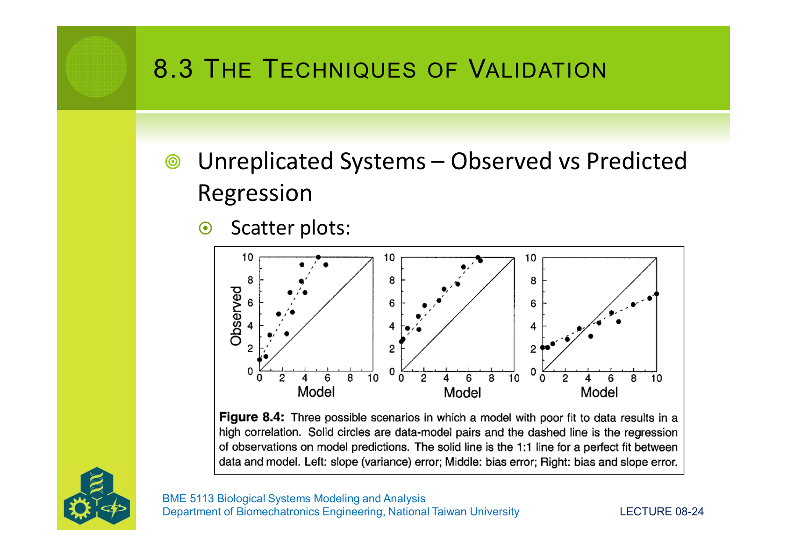

- **A:斜率錯誤** — 回歸線斜率 ≠ 1。直觀上模型在小值區「高估」、大值區「低估」,但 r 還是 0.98。
- **B:偏差錯誤** — 截距 ≠ 0。模型系統性整體偏低或偏高。
- **C:兩種都錯** — 兩者並存。

**結論**:**只看 r 會被騙**。所以人們發明了「**1:1 回歸**」 — 同時檢定「斜率=1 且 截距=0」:

$$
F \;=\; \dfrac{n\,a^{2} \;+\; 2\,a(b-1)\sum X_i \;+\; (b-1)^{2}\sum X_i^{2}}{2\,s_{Y\cdot X}^{2}}
$$

其中 $a$ 是截距、$b$ 是斜率,$s_{Y\cdot X}^{2}$ 是迴歸殘差變異數。F 越小越好。Mayer & Butler (1993) 的比較研究說 **1:1 回歸比配對 t-test 更嚴格**(後者較容易接受不好的模型)。

### 8.3.2 Type I 與 Type II 誤差

統計檢定永遠有兩種錯:

- **Type I** = 拒絕一個真正對的虛無假設(α 錯誤)— 把一個好模型誤判為壞。
- **Type II** = 沒有拒絕一個真正錯的虛無假設(β 錯誤)— 把一個壞模型放過去。

教材 Fig 8.5 給出三個例子(對應上面 A/B/C 的數據細節),顯示同一筆資料下不同檢定可能犯不同錯誤。

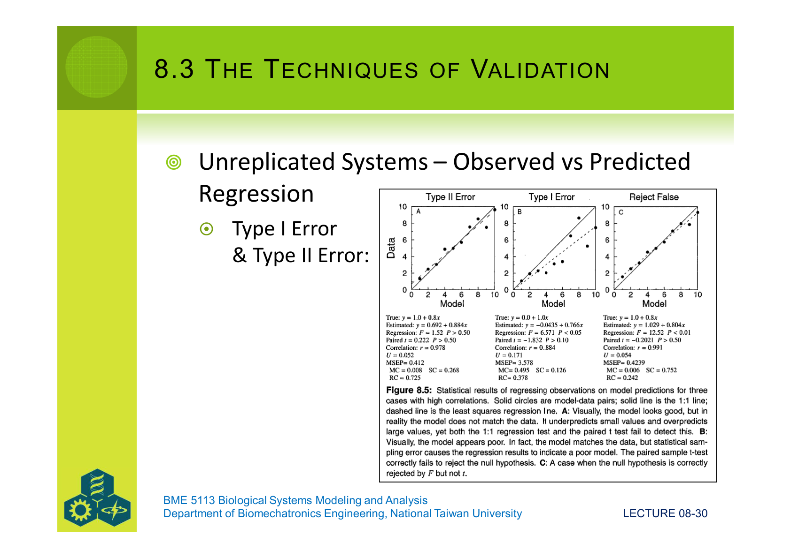

**哪一種錯誤更糟?要看你的應用**:

- 用模型做新藥試驗:**Type II 致命** — 把錯的模型放過去,病人吃下去。
- 用模型做生態理論探索:**Type I 比較痛** — 把好的洞察當錯的丟掉。

### 8.3.3 MSEP 的三種成分:把誤差拆給你看

**(障礙)** 配對 t-test 跟 1:1 回歸都會告訴你模型「過/不過」,但不會告訴你**錯在哪裡**。

**(工具名稱)** **MSEP 分解(Mean Squared Error of Prediction decomposition)**:

$$
\text{MSEP} \;=\; \dfrac{1}{n}\sum_{i=1}^{n}(X_i - Y_i)^2
\;=\; \underbrace{(\bar X - \bar Y)^2}_{\text{均值誤差}}
\;+\; \underbrace{(s_X - r\,s_Y)^2}_{\text{斜率誤差}}
\;+\; \underbrace{(1 - r^2)\,s_Y^2}_{\text{隨機誤差}}
$$

把整個 MSEP 除過去,可以得到三個**比例**,合起來恰好為 1:

$$
1 \;=\; \text{MC} \;+\; \text{SC} \;+\; \text{RC}
$$

- **MC(Mean Component)** — 「均值差佔的比例」。模型整體偏移、有 bias。
- **SC(Slope Component)** — 「斜率偏離 1 佔的比例」。模型對變化範圍的拿捏錯了。
- **RC(Random Component)** — 「無法以線性關係解釋的散布」。模型本身配得對,但雜訊大。

**(套用)** Helper 3 把這件事視覺化 — 四個假想模型,每個 MSEP 數值差不多,但分解後的「錯在哪」完全不同:

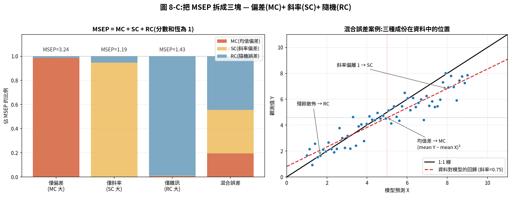

**(看起來合理嗎?)** 是。**僅偏差**的那一根 MC 幾乎佔滿;**僅斜率**那一根 SC 佔滿;**僅雜訊**那一根 RC 佔滿。換句話說,**MSEP 分解就像給模型做 X 光,讓你看到「錯誤的形狀」**。看到 MC 大就去檢查初始條件或常數項;看到 SC 大就去檢查斜率參數;看到 RC 大就要承認「結構配得對,但資料就是吵」。

### 8.3.4 其他常見指標:何時用哪一個?

| 指標 | 公式骨幹 | 重點 | 何時用 |
|---|---|---|---|
| **MAE** | $\frac{1}{n}\sum \lvert Y_i - X_i \rvert$ | 同單位,對極端值不敏感 | 想保留物理單位、不要被離群點主導 |
| **MA%E** | $\frac{100}{n}\sum \dfrac{\lvert Y_i - X_i \rvert}{\lvert Y_i \rvert}$ | 百分比,跨變數比較 | 比較不同量級的變數 |
| **Theil's $U$** | $\frac{\sqrt{\frac{1}{n}\sum(X_i-Y_i)^2}}{\sqrt{\frac{1}{n}\sum X_i^2}+\sqrt{\frac{1}{n}\sum Y_i^2}}$ | 模型誤差除以「兩邊變異性的和」 | 想跨資料集做比較 |
| **EF(模型效率)** | $1 - \dfrac{\sum(Y_i - X_i)^2}{\sum(Y_i - \bar Y)^2}$ | 把模型誤差除以「資料變異」 | EF=1 完美;EF=0 等同預測 $\bar Y$;EF<0 比平均還爛 |
| **Janus $J^2$** | $\dfrac{\text{MSEP}_{\text{validation}}}{\text{MSEP}_{\text{calibration}}}$ | 驗證/校準誤差比 | $J^2$ 越接近 1 越穩定,>>1 表示模型「換了資料就崩」 |

**Janus 是兩面神**(羅馬神話雙面神),這個指標的意義就是讓你「同時看校準與驗證兩張臉」。一個 EF 很高的模型,如果 $J^2$ 跳到 5,代表它**過配資料**,出題就垮了。

### 8.3.5 多重響應與時間序列:更難的情境

到目前為止都假設「只有一個 Y」。但生物模型動輒有 5–10 個狀態變數,且每個變數有自己的時序。

**多重響應**最簡單的處理是把每個變數的指標加總:

$$
U_s \;=\; \dfrac{1}{K}\sum_{k=1}^{K} U_k
\qquad\qquad
\text{MSEP}_s \;=\; \sum_{k=1}^{K} \text{MSEP}_k
$$

**時間序列**會引入**自相關**,標準的 t-test、ANOVA 都會出問題。教材建議三類工具:

- **重複量測 ANOVA / 分區設計(split-plot)** — 把實驗排成「同一受試者,多個時間 + 多個處理」,把對應變異性切開。
- **Profile analysis(剖面分析)** — 多變數版的配對 t-test。檢定「**模型與資料在每個時間的差異都是零**」這個強假設,用的是 **Hotelling's $T^2$ 統計量**(等於把單變數 Student's t 推廣到多維)。
- **Cross-correlation(交叉相關)** — 兩段自相關時間序列在不同 lag 下的相關性,把自相關的影響吸收到 lag 裡。
- **95% CI 法** — 最簡單:把資料的 95% 信賴區間畫出來,看模型預測有沒有落進去。

**圖 8.3 例子**(三個假想模型對同一筆 oscillation 資料):

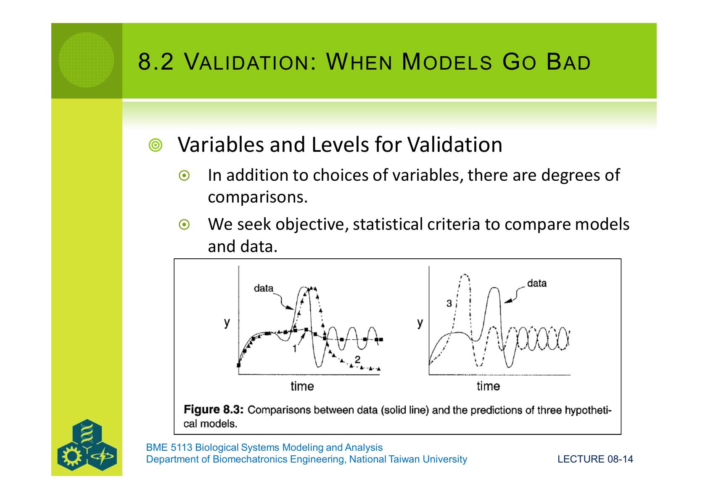

從這張圖可看到肉眼上「模型 1 抓住了趨勢但震盪相位錯,模型 2 起步對但後面發散,模型 3 整段都不像」 — 而這種「**眼睛看得出**」的差別,正是 §8.4 要用機率語言形式化的東西。

---

## §8.4 Model Discrimination:兩個都不錯,該選哪個?

驗證問「夠不夠像?」,辨別問「**比較像**的是哪一個?」。後者要用**機率語言**。

### 8.4.1 似然函數(Likelihood Function)— 一次小教學

**(障礙)** 我手上有資料,我想問:「**參數是 $\theta_1$ 比較合理,還是 $\theta_2$ 比較合理?**」這個問題在最小平方框架下沒法直接回答,因為 SSE 不是機率。

**(工具名稱)** **似然函數**:

> 把標準的「機率」反過來想 — **資料當已知,參數當變數**。
> 「在 $\theta$ 這個假設下,我會抽到目前這筆資料的機率有多大?」

**(小例子 — 骰子)** 擲一顆骰子 5 次,觀察到 2 次「3 點」。如果是公正骰,P(出 3 點) = 1/6 ≈ 0.167。但這筆資料**最有可能**出自哪個 $\theta$?

二項分布給出的機率是:

$$
b(x; n, \theta) \;=\; \dfrac{n!}{x!(n-x)!}\,\theta^{x}\,(1-\theta)^{n-x}
$$

固定 $n=5$、$x=2$,把 $\theta$ 變成自變數,就是似然函數:

$$
L(\theta \mid [x, n]) \;=\; \dfrac{5!}{2!\,3!}\,\theta^{2}\,(1-\theta)^{3}
$$

**(關鍵性質)**

- 對固定資料,$L$ **只是 $\theta$ 的函數**,不是 $\theta$ 的機率密度(積分不一定為 1)。
- $L$ 越大,該 $\theta$ 越能「解釋」這筆資料。
- 讓 $L$ 最大的那個 $\theta$,叫做 **最大似然估計(MLE)**,寫作 $\hat\theta$。
- 在常態誤差下,**MLE = 最小平方解**(這就是把 §8.4 跟 §7.4 接起來的橋)。

**(套用)** 對骰子例:對 $L(\theta)$ 求微分為零,得 $\hat\theta = x/n = 2/5 = 0.4$。如果骰子真的公正,$\theta$ 應該是 1/6;但資料偏好 0.4。差多少?定義**似然比**:

$$
R \;=\; \dfrac{L(\hat\theta = 0.4)}{L(\theta = 1/6)} \;\approx\; 2.15
$$

意思是「資料**比較像**從 $\theta=0.4$ 抽出,大約是公正情境的 2.15 倍」。Reilly (1970) 的經驗法則:**R > 10** 才足以拒絕「公正骰」。R = 2.15 太小,所以這次我們**不能拒絕骰子公正**(就像 §8.3 的 Type II 風險)。

**(看起來合理嗎?)** 視覺化:

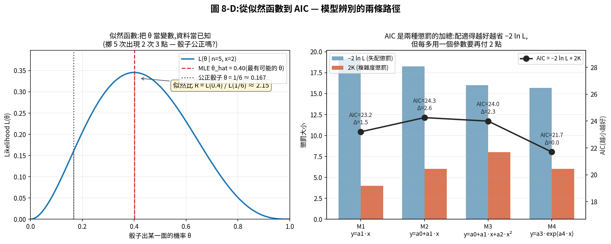
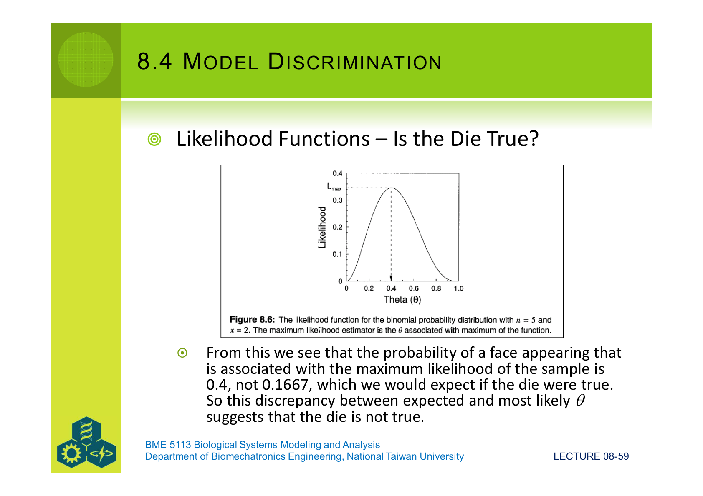

### 8.4.2 從似然到 RSS:把這套搬到一般模型上

實務上我們不擲骰子,而是配模型 $y_i = f(x_i; \theta_j) + \varepsilon_{ij}$。假設誤差 $\varepsilon$ 服從常態 $N(0, \sigma^2)$,則整筆資料的聯合機率(似然)是:

$$
L(\theta, \sigma^2 \mid \text{data}) \;=\; \prod_{i=1}^{n}\dfrac{1}{\sqrt{2\pi\sigma^2}}\exp\!\left(-\dfrac{(y_i - f(x_i;\theta))^2}{2\sigma^2}\right)
$$

四件最重要的性質:

1. $\sum (y_i - f(x_i;\theta))^2 = \mathrm{RSS}$ ← **回到最小平方**。
2. RSS 大 → 似然小,反之亦然。
3. $L$ 有**唯一最大**,對應 RSS 最小。
4. 在最大值處,$\hat\sigma^2 = \mathrm{RSS}/n = \mathrm{MSEP}$。

代入後,log-似然簡化為:

$$
\ln L \;=\; -\dfrac{n}{2}\ln(\hat\sigma^2) \;-\; \dfrac{n}{2}\ln(2\pi) \;-\; \dfrac{n}{2}
$$

只剩 $\hat\sigma^2$ 跟 $n$,計算超簡單。

### 8.4.3 LRT:nested 模型的卡方檢定

**Nested(嵌套)** 模型:把較複雜模型的某些參數設為 0,就會退化成較簡單模型。例:

- M1: $y = a_1 x$
- M2: $y = a_0 + a_1 x$ ← M1 是 M2 設 $a_0 = 0$
- M3: $y = a_0 + a_1 x + a_2 x^2$ ← M2 是 M3 設 $a_2 = 0$

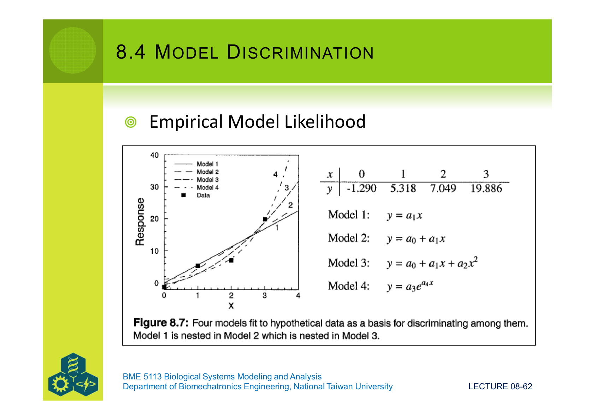

若兩個 nested 模型的對數似然分別是 $\ln L_s$(簡單)與 $\ln L_c$(複雜),則:

$$
\chi^2 \;=\; -2\,[\ln L_s - \ln L_c]
$$

它**近似服從卡方分布**,自由度等於兩模型參數數量差。虛無假設是「簡單模型已足夠」(複雜模型沒帶來顯著改善)。χ² 越大,越能拒絕虛無假設、選複雜模型。

在 Fig 8.7 那筆資料上,LRT 結果是 M1→M3 的 P 值 0.201,M2→M3 的 P 值 0.133 — 都沒過 0.05,代表**M3 不顯著比 M1 或 M2 好**,即便它的 RSS 較小。

### 8.4.4 AIC:不是 nested 也能比

**(障礙)** LRT 只能比 nested 模型。可是 M4: $y = a_3 e^{a_4 x}$ 跟 M3: $y = a_0 + a_1 x + a_2 x^2$ 不是 nested,LRT 用不了。怎麼辦?

**(工具名稱)** **Akaike Information Criterion(AIC)**:

$$
\mathrm{AIC} \;=\; -2\,\ln L \;+\; 2K
$$

其中 $K$ 是被估計參數的個數(模型參數 + 誤差變異性 σ²)。

**(關鍵性質)**

- 第一項 $-2\ln L$:**配適得越好 → 越小**。
- 第二項 $2K$:**參數越多 → 越大**(複雜度懲罰)。
- 兩項相加,**AIC 越小越好**。
- AIC 對「nested 與否」沒要求,任何同資料、同 $y$ 範圍的模型都可比。

**(看起來合理嗎?)** Helper 4 右側:對 Fig 8.7 的四個模型畫出兩種懲罰,以及最終 AIC:

可以看到 M3 雖然 RSS 最小,但 K = 4 反讓 AIC 反彈;M4 用 3 個參數抓到差不多的擬合,**AIC 最低**。換句話說:**AIC 偏好「以最少參數抓到夠好擬合」的模型**,這正是 Occam's razor 在統計上的具體實現。

**(經驗法則 — Burnham & Anderson 1998)** 定義 $\Delta_i = \mathrm{AIC}_i - \mathrm{AIC}_{\min}$:

| $\Delta_i$ | 結論 |
|---|---|
| $\le 2$ | 跟最佳模型差不多,**留著** |
| 4–7 | 差一點,慎用 |
| $> 10$ | **直接淘汰** |

教材以**Dursban(殺蟲劑)在水生微宇宙的傳輸**為例,比較了 7 個 nested/structural 模型,結果模型 4a 取得 $\mathrm{AIC}_{\min}$,其餘的 $\Delta_i$ 全部超過 8.9(其中 5 個 > 40),所以辨別力極強。

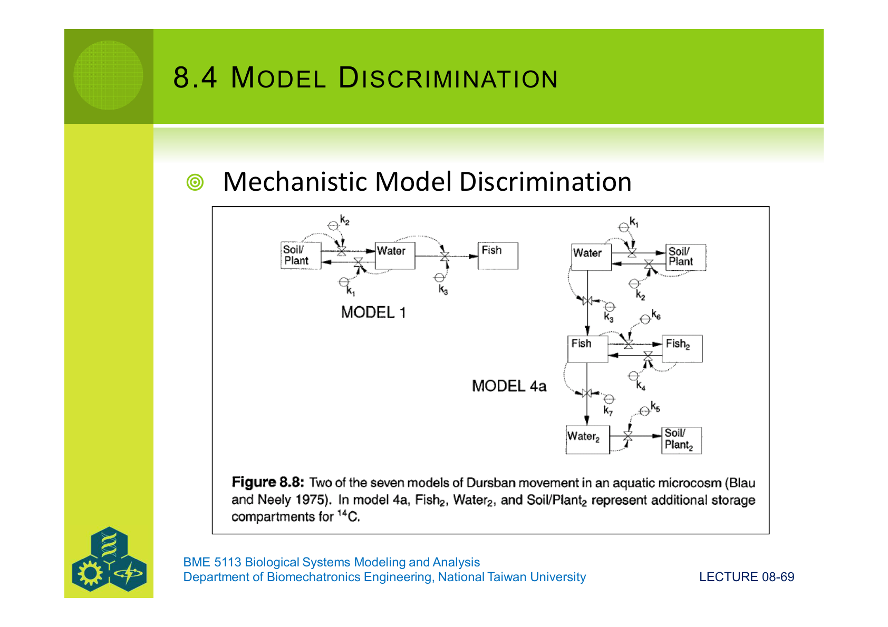
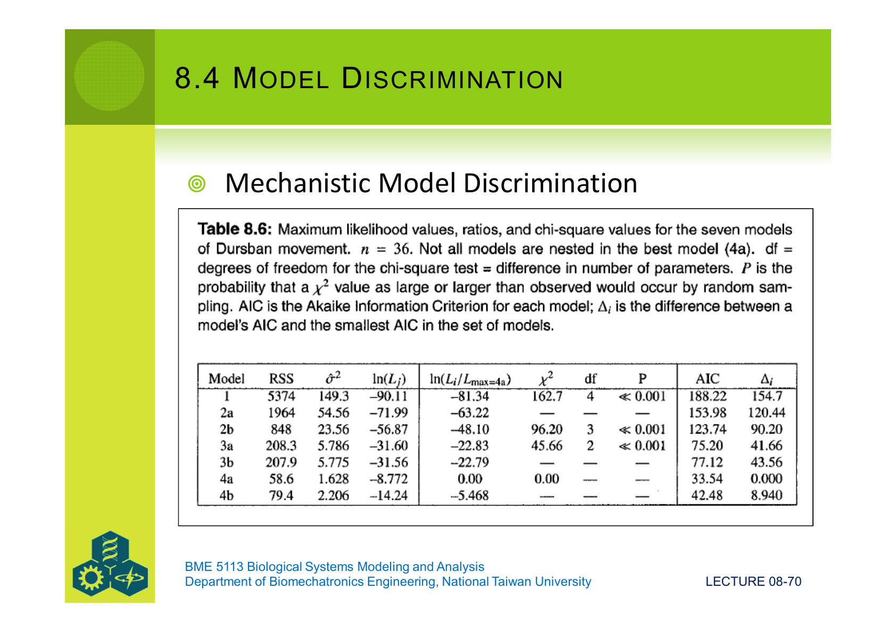

### 8.4.5 Bayesian Inference:給模型一個機率

**(障礙)** LRT 與 AIC 都只給「相對」的排名,沒給出「模型 i 是真的的機率是多少」這個直接答案。

**(工具名稱)** **貝氏推論**用貝氏定理把先驗轉成後驗:

$$
P(M_i \mid Y) \;=\; \dfrac{P(M_i)\,P(Y \mid M_i)}{\sum_{j=1}^{m} P(M_j)\,P(Y \mid M_j)}
$$

讀作:**「給定觀測 Y,模型 $M_i$ 是真的的後驗機率 = (先驗 × 似然)/正規化分母」**。

- **先驗** $P(M_i)$:在看到資料前,我認為 $M_i$ 對的機率。若無資訊就用均勻先驗 $1/m$。
- **似然** $P(Y \mid M_i)$:在 $M_i$ 為真時,看到 Y 的機率 — 通常用最大似然估計值。
- **分母**:把分子加總,讓所有模型機率合起來等於 1。

**(套用)** 教材用同一組 Dursban 模型 + 均勻先驗 $1/7$ 算出 Table 8.7,結果 **模型 4a 後驗機率 = 0.9958**(其他全部小於 0.005)。也就是說,**從貝氏觀點來看,4a 幾乎一定是七者中最好的**,結論跟 AIC 一致。

**(看起來合理嗎?)** 是 — 貝氏的最大好處是答案以「機率」形式表達,可以直接做決策;最大壞處是「先驗從哪來」這件事永遠有爭議(尤其在有先驗資料的領域)。

---

## §8.5 Meta-Models:模型的模型

Kleijnen 的 **meta-model** 流程:

1. **跑一系列原模型**(可能很慢很大),收集輸入–輸出組合,當成「資料」。
2. **配一個簡單模型**(線性或非線性回歸)去描述這些「資料」。
3. **用一組新的原模型輸入再驗證 meta-model**,看它能不能在沒看過的輸入上預測得對。

為什麼這做有用?因為 meta-model 把「複雜機械式模型」凝鍊成「**容易做敏感性分析、容易嵌入更大決策系統**的代表式」。在實務上,氣候模擬、流體模擬、藥物 PBPK 模擬都用這類「**surrogate model**」加速 — 而它的「對不對」,**還是要回到 §8.3 的那套技術去驗**。

換句話說:**meta-model 是被驗證對象變了,但驗證的邏輯沒變**。

---

## §8.6 Précis on Validation:把這一講收成一頁

1. **驗證 ≠ 校準**。Lec 07 只保證「我手上的資料配得好」;Lec 08 保證的是「換批資料還站得住」。
2. **「對」不存在,只有「合情合理」**。Modus tollens 只給否定,給不出肯定 — 驗證是無止盡的過程。
3. **要同時看可靠度與適切度**。多數論文只報導 |Q| 或 adequacy;reliability 通常被偷懶略過。
4. **r 高不代表模型對**。看散點圖、看 1:1 回歸、看 MSEP 分解,才看得到「錯在哪」。
5. **MSEP = MC + SC + RC**。三塊解釋三種不同的錯,告訴你下一步要修什麼。
6. **辨別兩個都不錯的模型用似然**。Nested 用 LRT,任意用 AIC,要機率用 Bayes — 三者結論常常一致,但角度不同。
7. **AIC 的核心是「配適 + 複雜度」雙懲罰**。多一個參數要付 2 點,所以多參數要值得這 2 點。
8. **時間序列要小心自相關**。標準 t-test 假設獨立,違反就崩;改用 Profile analysis、cross-correlation 或 95% CI 法。

---

## 連到下一講:Lecture 09 — Model Analysis

到這裡為止,我們知道**模型對不對、好不好、選哪一個**。下一步要問:

> **「模型內部到底發生了什麼?」**

Lecture 09(Model Analysis)會打開模型的引擎蓋:

- **§9.1 Analyzing Model Responses** — 模型在不同輸入下會做出什麼樣的反應?哪些輸入帶動哪些輸出?
- **§9.2 Uncertainty Analysis** — 我們對每個參數其實只有「估計值 ± 不確定度」。這份不確定度如何傳到模型輸出?這就是 §8.1 一開始提到的 **Uncertainty** 軸。
- **§9.3 Analysis of Model Behavior** — 在參數空間裡,模型表現出什麼樣的動力學結構?哪些區域行為相似?哪些區域突然切換?
- **§9.4 Mathematical Details** — 上面三件事背後的數學工具:Sobol 指數、Monte Carlo 傳播、雅可比矩陣特徵值分析。

換句話說,**Lec 08 把模型「對外」拍 X 光**(模型 vs 資料),**Lec 09 把模型「對內」拍 X 光**(輸出 vs 輸入、變數 vs 變數)。兩講合起來才完成「模型評估」的完整圖像。

> **下一講重點預習** — 三個關鍵字:**靈敏度(sensitivity)、不確定性傳播(uncertainty propagation)、行為分區(behavioral regimes)**。準備好把 §8.1 提到的 Validity / Uncertainty / Behavior 三條軸,真正地各別量化。
