# Lecture 09:模型分析(Model Analysis)

> Lec 08 從外面看模型 — 它對不對、好不好、跟資料合不合。
> 這一講把模型「**翻開引擎蓋**」 — 從裡面看它怎麼運作:
> 哪些參數真正在牽動結果?誤差怎麼從輸入傳到輸出?系統到底會收斂、發散還是繞圈?

---

## 0. 為什麼這一講重要?

到目前為止,我們對「模型」做的事都是**外部**的:

- Lec 04–06:寫模型、跑模型。
- Lec 07:把參數調到讓模型最貼資料。
- Lec 08:檢查模型對不對、選比較好的一個。

但有三個根本問題還沒回答:

1. 「**模型對哪些參數敏感?**」 — 改 r 一點點輸出就亂,改 K 改了等於沒改,我們需要知道。
2. 「**我參數估錯時,模型錯多少?**」 — 每個參數都有 ± 不確定度,這些不確定度會放大還是抵銷?
3. 「**模型長期會穩定下來,還是會發散?**」 — 平衡點在哪?平衡點是吸引子(吸進去)還是排斥子(被踢出去)?

這三題就是 Lecture 09 的全部:

| 問題 | 對應節 | 主要工具 |
|---|---|---|
| 哪些參數重要? | §9.2 — Sensitivity Analysis | 靈敏度指標 S、Fractional Factorial / ANOVA |
| 不確定度怎麼傳? | §9.2 — Error Analysis | Taylor 展開、Monte Carlo |
| 系統行為長什麼樣? | §9.3 — Behavior | Equilibria、Nullclines、Eigenvalues、Routh-Hurwitz |

§9.4 是 §9.3 用到的線性代數補充(為什麼 det(A − λI) = 0、Cramer 法則、特徵向量)。

---

## §9.1 Analyzing Model Responses:這一講要做兩種「主動操作」

Lec 08 的驗證是**被動**比較:資料怎麼樣,我們就拿模型去比。Lec 09 改成**主動**操作模型,看它在不同情境下會怎麼反應。教材把這些操作分成兩類:

1. **動方程式 / 動參數** — 用來探討建模者本身對「真實參數值」的不確定度。
2. **動狀態變數** — 把系統從平衡點推開一點,看它會不會自己回去。

這兩類操作各自對應到後面 §9.2(不確定度)與 §9.3(穩定性)。把它放在心裡:**整個 Lec 09 都是在「擾動模型,然後看反應」**。

---

## §9.2 Uncertainty Analysis:我們其實不知道參數的真值

### 9.2.1 不確定度從哪裡來?

教材把不確定度的來源分成三類:

| 來源 | 中文 | 對策 |
|---|---|---|
| **Biological hypotheses & math formulation** | 生物假設與數學公式 | 沒有捷徑 — 多學、多設計實驗、選更聰明的公式 |
| **Parameter values** | 參數的真值 | **Sensitivity + Error analysis** |
| **Natural variation** | 系統本身的隨機波動 | **Stochastic models**(Lec 10 重點) |

第一類沒有公式可治,只能靠科學家本身的功力。後面兩類就是 Lec 09 + Lec 10 的工具區。

### 9.2.2 Parameter Sensitivity Analysis:概念與四種用途

**Parameter sensitivity analysis** 問的是:

> 「**參數變動一小步,模型輸出會變多少?**」

換個說法,我們把模型看成一個函數 $R = f(p_1, p_2, \ldots, p_k)$。在「**參數空間**」裡,$f$ 是一個曲面。我們想知道:這個曲面**陡不陡**?哪邊陡、哪邊平?(下圖左是 3D 曲面,右是它的等高線。)

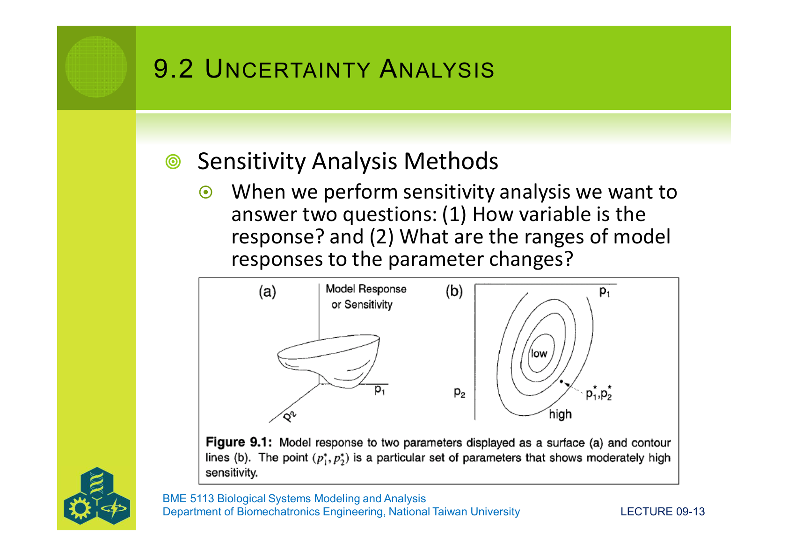

回答這個問題,**四個常見用途**:

1. **Validation(驗證):** 直覺認為生物系統不會對小擾動瘋狂反應。若模型對小擾動超敏感,而某個參數的估計又不準,模型輸出的可信度就跟著掉。
2. **Research Design(研究設計):** 對哪些參數敏感,就把實驗預算花在那。對哪些參數不敏感,就不必再投錢了。
3. **System Control(系統控制):** 要控制系統,得知道哪些「旋鈕」真的能拉動輸出。對輸出沒影響的參數 ≠ 控制變數。
4. **Theory(理論):** 想理解「為什麼這個模型會出現極限環?」就要找出**哪個參數負責產生這個行為**。

可被選作「靈敏度變數」的東西很多:

- 某固定時刻的狀態變數值
- 時間平均
- 極值(最大值/最小值)
- 達到極值的時間
- 狀態變數的簡單組合(和、比)

### 9.2.3 靈敏度分析的兩個基本策略

要描繪「參數空間裡的曲面」,有兩種完全不同的策略:

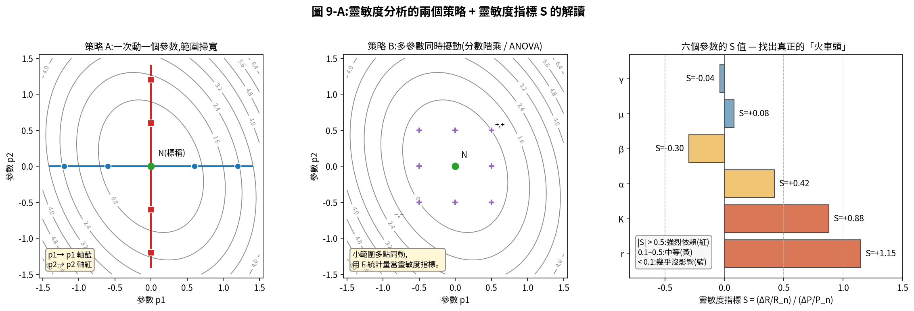

對照原始圖:

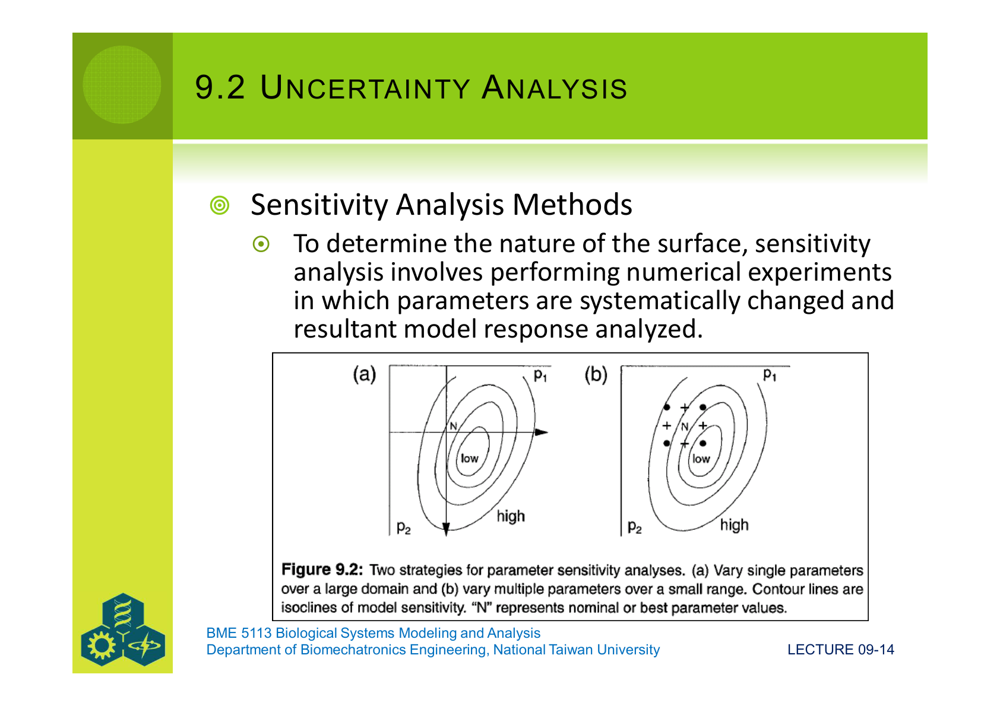

- **策略 A:一次動一個,範圍掃寬** — 固定其他參數,把某個參數從 0.5×N 掃到 2×N,把模型反覆跑,看輸出怎麼變。優點是直覺、可視化;缺點是**沒抓到交互作用**(p1 與 p2 同時動會發生什麼?它看不到)。
- **策略 B:多參數同時微擾(分數階乘 / fractional factorial)** — 在 N 點附近做一個正負微幅同動的小網格,把這當實驗設計丟進 ANOVA,用 **F 統計量** 當靈敏度指標。這種設計**用很少模型執行次數**就抓得到主效應 + 交互作用。

### 9.2.4 單一參數靈敏度指標 S

教材的 9.1 式定義了**靈敏度指標**:

$$
S \;=\; \dfrac{(R_a - R_n)\,/\,R_n}{(P_a - P_n)\,/\,P_n}
$$

讀作:**「模型輸出的相對變化 ÷ 參數的相對變化」**。下標 $n$ 是「標稱」(nominal,參考值),下標 $a$ 是「改變後」(altered)。

幾個性質:

- $S$ **無單位**(分子分母都是相對變化,單位互消)。
- $|S| \approx 1$:輸出變化與參數變化「同比例」。
- $|S| > 1$:**放大** — 輸出比參數還敏感。
- $|S| < 1$:**抵銷** — 輸出沒那麼敏感。
- $S < 0$:逆相關。

教材 Table 9.1 的例子是密度無關生長模型 $N(t) = N_0 e^{rt}$,固定 $t = 10$、$r_n = 0.1$、$N_0 = 2$:

| 參數方向 | Nominal input | Nominal output | Altered input | Altered output | S |
|---|---|---|---|---|---|
| $r^+$ | 0.1 | 5.4 | 0.12 | 6.6 | **1.15** |
| $r^-$ | 0.1 | 5.4 | 0.08 | 4.5 | **0.88** |

**注意 $r^+$ 與 $r^-$ 的 $S$ 不一樣** — 這是因為 $e^{rt}$ 是非線性的,**正向擾動的放大率比反向大**。在強非線性區域,這種「正負不對稱」是常態。

Helper 1 右側那個橫條圖就是 $S$ 的視覺呈現 — 紅(|S|>0.5,真正影響大)、黃(0.1–0.5,中等)、藍(<0.1,可以暫時忽略)。**研究預算就應該往紅色橫條那幾個參數倒**。

### 9.2.5 多參數同動 + Fractional Factorial / ANOVA

當你想算「p1 與 p2 同時動 +5%」這種多維情境的靈敏度,9.1 式的分母要換成多維距離:

$$
d \;=\; \sqrt{(p_1 - p_1')^2 + (p_2 - p_2')^2 + \cdots}
$$

或者改用一個更聰明的方法:**把參數靈敏度當成 ANOVA 實驗**。
- 每個參數有 "+" 和 "−" 兩個位準。
- 用 fractional factorial 設計挑出**少量**組合執行模型。
- 對輸出做 ANOVA,取每個參數(及交互項)的 **F 統計量** 當作靈敏度指標。

注意:這裡 F 不是拿來做正式假設檢定,只是當**索引**用,因為一般情境下 ANOVA 的獨立性假設並不成立。

### 9.2.6 動態靈敏度:靈敏度會隨時間變

到目前為止 $S$ 都是一個「點估計」,但生物系統是動態的 — 同樣的參數擾動,在初期影響可能很小,在後期可能被指數放大,反之亦然。實務上我們要把**整段時間軌跡**都畫出來。

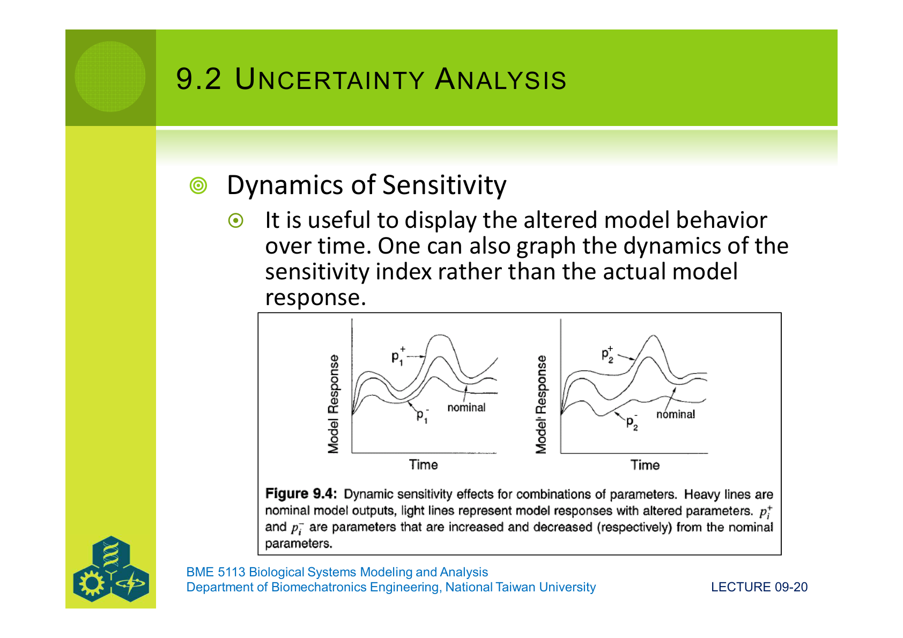

教材在這裡建議了一個彙整公式(把時間 × 變數兩個下標一起加起來):

$$
\mathbf{S} \;=\; \sum_{i}\sum_{j} S_{ij}
$$

其中 $i$ 是時刻,$j$ 是變數。但加總會把「正負抵銷」 — 真正使用時通常要看**絕對值的平均** 或 **平方和**,別被零誤導。

### 9.2.7 Error Analysis:從「敏感度」進化到「方差傳播」

**(障礙)** Sensitivity 給的是「平均值附近的斜率」。但實際上每個參數都有它自己的 **分布(平均 ± 標準差)**;光知道斜率不夠 — 我要知道「**輸出最後分布長什麼樣**」。

**(工具名稱)** **Error Analysis** = 方差傳播(propagation of variance / error propagation)。

**(關鍵概念)** 它建立在**一階 Taylor 展開**之上(我們在 Lec 07 介紹過 Taylor — 這裡只用第一項):

$$
z \;=\; f(x, y) \;\approx\; f(\bar x, \bar y) \;+\; \left.\dfrac{\partial f}{\partial x}\right|_{\bar x,\bar y}\!(x - \bar x) \;+\; \left.\dfrac{\partial f}{\partial y}\right|_{\bar x,\bar y}\!(y - \bar y)
$$

也就是「把曲面 $f$ 在 $(\bar x, \bar y)$ 用一張**斜面**取代」。然後我們計算偏離平均的平方期望值(就是變異數),平方後展開:

$$
\boxed{\;
\mathrm{Var}(z) \;\approx\; \sum_{i=1}^{n}\sum_{j=1}^{n}\dfrac{\partial f}{\partial x_i}\dfrac{\partial f}{\partial x_j}\,\mathrm{Cov}(x_i, x_j)
\;}
$$

讀作:**「z 的變異數,等於把所有「f 對每個變數的偏微分」兩兩相乘,再用它們的共變異數加權加起來」**。

當變數**互不相關**時,$\mathrm{Cov}(x_i, x_j) = 0$ for $i \ne j$,公式塌縮成:

$$
\mathrm{Var}(z) \;\approx\; \sum_{i=1}^{n}\left(\dfrac{\partial f}{\partial x_i}\right)^{2}\sigma_{x_i}^{2}
$$

更簡潔。教材 Table 9.2 把最常用的四種運算列好了:

| 函數 | 不相關 | 相關 |
|---|---|---|
| $z = x + y$ | $\sigma_z^2 = \sigma_x^2 + \sigma_y^2$ | $+\,2\sigma_{xy}$ |
| $z = x - y$ | $\sigma_z^2 = \sigma_x^2 + \sigma_y^2$ | $-\,2\sigma_{xy}$ |
| $z = xy$ | $\sigma_z^2 = \bar y^2\sigma_x^2 + \bar x^2\sigma_y^2$ | $+\,2\bar x\bar y\,\sigma_{xy}$ |
| $z = x/y$ | $\sigma_z^2 = \bar y^{-2}\sigma_x^2 + (\bar x/\bar y^2)^2 \sigma_y^2$ | $-\,2(\bar x/\bar y^3)\sigma_{xy}$ |

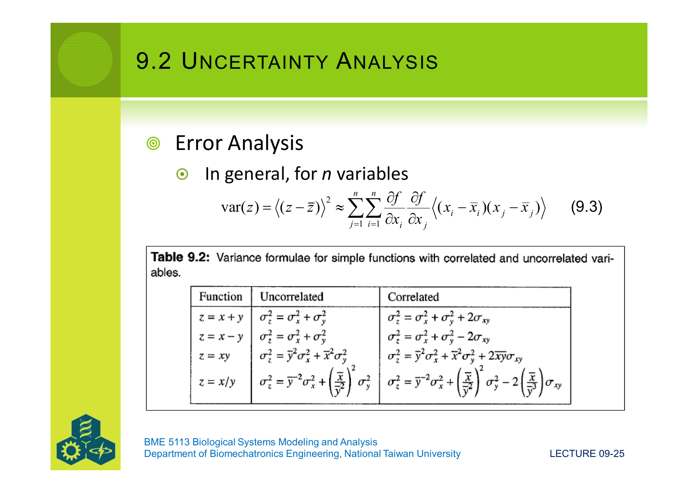

注意三件事:

1. **加減法**的方差只跟兩個 σ² 相加(誤差不會抵銷)。
2. **乘除法**的方差會受到變數的平均值「放大」 — $\bar x$ 大、$\bar y$ 大,輸出方差也跟著大。
3. **相關項** $\sigma_{xy}$ 可正可負 — **負相關可以幫你消誤差**,正相關會加重它。

### 9.2.8 放大 vs 抵銷:同樣的 σ_x,結果可以差很多

從公式可以看出 $\mathrm{Var}(z) \propto (\partial f/\partial x)^2$ — 也就是**輸出的方差被「平方倍的局部斜率」放大**。如果函數在 $\bar x$ 點很陡,σ_x 就會被放大成大很多的 σ_z(amplified);如果函數很平緩,σ_x 反而被壓縮(compensated)。

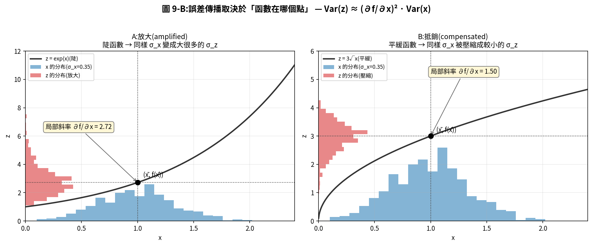
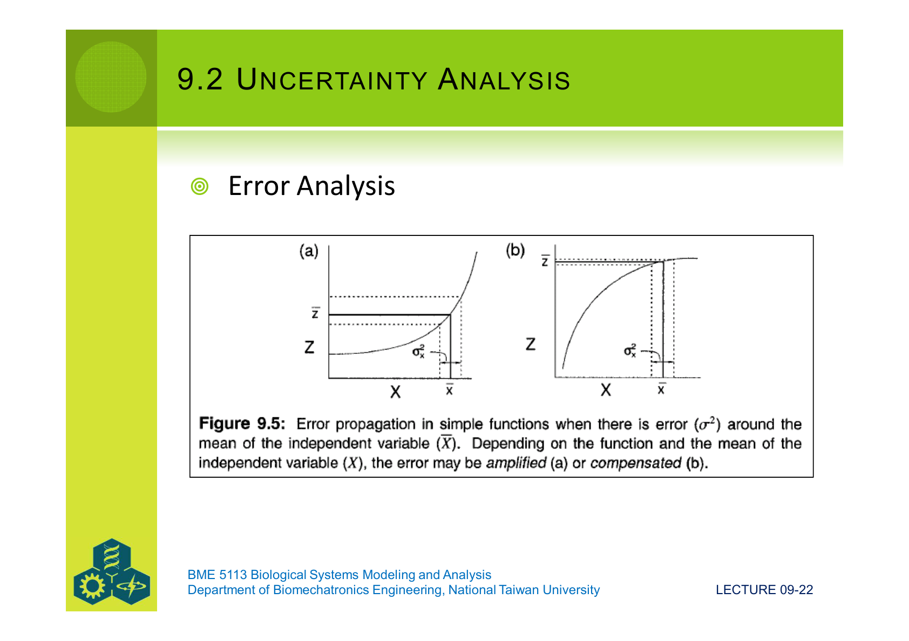

實務意義:**同樣不確定的參數,在「線性區」遠比在「飽和區」傷害大**。設計實驗時把工作點選在飽和區,可以自然壓掉誤差;反之在指數爆炸區,誤差會被指數放大。

### 9.2.9 Pielou 滅絕模型:一次走過解析方差傳播

教材給了一個一行字的滅絕模型(Pielou 1977):

$$
P \;=\; \left(\dfrac{d}{b}\right)^{n}
$$

- $d$ = 死亡率
- $b$ = 出生率
- $n$ = 初始族群數

對它套 9.3 式(三個變數彼此獨立),得 Eq 9.5:

$$
\mathrm{Var}(P) \;=\; \left(\dfrac{\bar n\,\bar d^{\,\bar n - 1}}{\bar b^{\,\bar n}}\right)^{\!2}\!\sigma_d^2
\;+\; \left(\dfrac{\bar n\,\bar d^{\,\bar n}\,\bar b^{\,\bar n - 1}}{\bar b^{\,2\bar n}}\right)^{\!2}\!\sigma_b^2
\;+\; \left(\ln\dfrac{\bar d}{\bar b}\,\left(\dfrac{\bar d}{\bar b}\right)^{\bar n}\right)^{\!2}\!\sigma_n^2
$$

教材給的具體數值是 $\bar d = 0.8$、$\bar b = 0.9$、$\bar n = 10$,以及對應的標準差 0.157、0.174、0.69。代入後:

- $\mathbb{E}[P] \approx 0.308$(只是把均值代進去算)
- $\mathrm{Var}(P) \approx 0.72$,$\sigma_P \approx 0.849$
- 95% 信賴區間 $\approx 0.308 \pm 1.96 \times 0.849 = (-1.36,\; +1.97)$

**重點來了** — CI 上界 1.97 > 1、下界 −1.36 < 0,但**機率本來該在 [0, 1] 之間**。這個矛盾在告訴我們:**Taylor 一階近似在這個工作點不夠用** — 因為 $(d/b)^n$ 對 $n$ 是強非線性的。換句話說,解析方差傳播在強非線性場景會**直接違反物理約束**。

### 9.2.10 Monte Carlo Error Analysis:對付強非線性的解法

**(障礙)** Taylor 一階解析不適合強非線性,而二階以上手算又太累。

**(工具名稱)** **Monte Carlo error analysis**:

1. 對每個參數,選一個合理的機率分布。
2. 從這些分布隨機抽 $N$ 組(例如 N=1000)。
3. 每組都跑一次完整模型,得到一個輸出。
4. 把 $N$ 個輸出做統計(直方圖、平均、CI 都直接計算)。

**(關鍵性質)** Monte Carlo 不靠 Taylor 近似,所以對強非線性也適用。代價是要算 $N$ 次模型,但現代電腦 $N = 1000$ 通常很便宜。

**(套用 Pielou)** 對同一個滅絕模型,我們用 Monte Carlo 跑 1000 次:

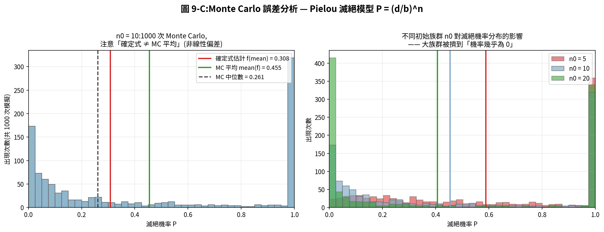
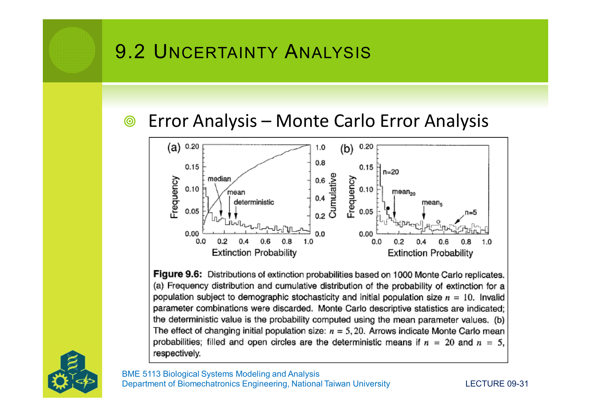

幾個值得注意的觀察:

1. **分布形狀偏斜** — 不是常態,是右偏(很多次是 P ≈ 0,少數次很大)。Taylor 近似的對稱常態 CI 在這裡完全不能用。
2. **「確定式估計」≠「MC 平均」** — 確定式 $f(\bar d / \bar b) = (0.8/0.9)^{10} = 0.308$,但 MC 平均 ≠ 0.308。這是因為 $\mathbb{E}[f(X)] \ne f(\mathbb{E}[X])$ 對非線性 $f$ 一般成立(這就是 **Jensen 不等式**)。
3. **初始族群影響很大** — $n_0 = 5$ 時整個分布偏右(高滅絕機率),$n_0 = 20$ 時被擠到接近 0。

**(看起來合理嗎?)** 是。Monte Carlo 給出的不是「點估計 ± 對稱誤差」,而是一個**完整的輸出分布**,這在強非線性、長尾、邊界限制的問題裡是不可或缺的。

**(MC 兩個實務煩惱)**

- 我要假設參數從**什麼分布**抽?如果不知道,要找一個跟生物知識相容的(例如連續正值用 lognormal、比例用 beta)。
- 我抽的樣本能不能**充分代表分布的尾巴**?如果我關心 95% 以外的極端,光 N = 100 是不夠的 — 拉丁超立方(Latin Hypercube Sampling)是常用的補救。

### 9.2.11 Aggregation Analysis:把細節合併會引入多少誤差?

實務上,模型常把細節合併成粗變數(例如把「五個物種」合併成「掠食者整體」)。**Aggregation analysis** 量化「合併」這個簡化動作會帶來多少誤差。

- **Perfect aggregation**(Iwasa et al. 1987):合併前後,每個時刻動態完全相同(極嚴格)。
- 較寬鬆的版本只要求平衡點上「合併變數之和 = 詳細模型加總」相等。
- 沒有太多解析工具,主要用 Monte Carlo 對比細模型與粗模型的輸出。

### 9.2.12 連回 Lec 08

Lec 08 提到「驗證的幾何」 — Mankin's S、M、Q。Sensitivity / Error / Aggregation 都是**主動探索 prediction space**(模型集合 M)的工具,合在一起就拼出「模型在多廣泛的條件下還站得住」的圖像。換句話說,Lec 08 是**對外**比資料,Lec 09 §9.2 是**對內**探範圍,兩者一起才能評斷 reliability 與 adequacy。

---

## §9.3 Analysis of Model Behavior:模型長期會做什麼?

§9.2 動的是參數,§9.3 動的是**狀態變數本身**。我們把系統從平衡點推開一點點,看它會不會自己回去 — 這就是**穩定性分析**。

### 9.3.1 Equilibria:平衡點與它的意義

**Equilibrium(平衡點)**:狀態變數隨時間都不變的位置,即所有 $\dot x_i = 0$。

對 Lotka-Volterra 模型:

$$
\dfrac{dV}{dt} = aV - bVP,\qquad \dfrac{dP}{dt} = cbVP - dP
$$

把右邊設為 0,解出來兩個平衡點:

$$
(V^\ast, P^\ast) = (0, 0) \quad\text{以及}\quad (V^\ast, P^\ast) = \left(\dfrac{d}{cb},\;\dfrac{a}{b}\right)
$$

**(為什麼要找平衡點?)** 三件事:

1. 平衡點給出**長期行為的代數描述** — 模型長期會停在哪裡?
2. 平衡點的**位置與數量**幫我們解釋暫態行為。
3. **穩定性分析就是繞著平衡點做** — 它是出發點。

### 9.3.2 Stability:概念

**Stability analysis** 問:在平衡點附近推一下,系統會不會回來?教材給出一個 8 種一維、9 種二維的「動物園」,概覽如下:

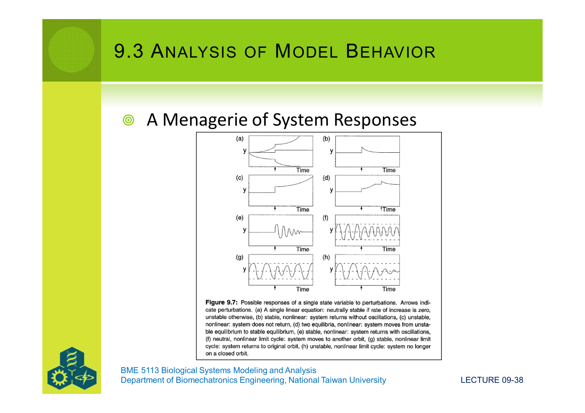
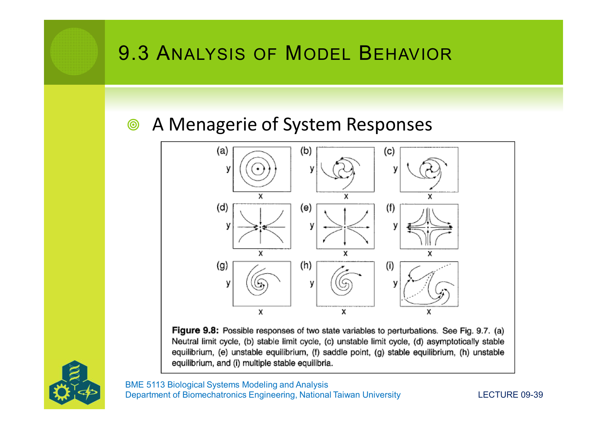

最常見的有六種:**穩定/不穩定節點、鞍點、穩定/不穩定螺旋、中心**。我們在後面 Helper 4 會把這六種放在同一張圖。

「全域穩定」對非線性系統幾乎總是難解,所以我們退而求其次,做**局部(neighborhood)穩定性分析** — 只看平衡點附近的小範圍。

### 9.3.3 Nullclines:用圖像直接看穩定性

**Nullclines(等零線)** = 每個狀態變數的「導數為零」軌跡的集合。把所有變數的 nullcline 同時畫上去,它們的**交點就是平衡點**;而軌跡會被 nullcline 引導 — 在 $\dot x = 0$ 線上 $x$ 不動,只 $y$ 動,反之亦然。

對 Lotka-Volterra:

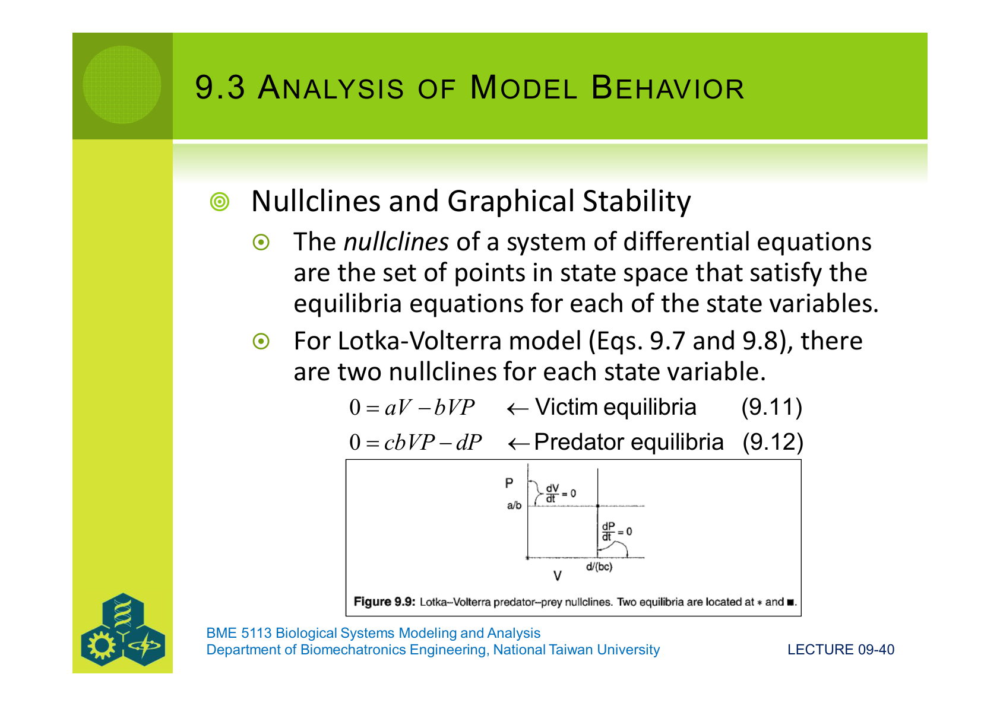

對 Gause 競爭方程(兩物種):

$$
\dfrac{dn_1}{dt} = r_1 n_1 \left(1 - \dfrac{n_1 + \alpha n_2}{K_1}\right),\qquad
\dfrac{dn_2}{dt} = r_2 n_2 \left(1 - \dfrac{n_2 + \beta n_1}{K_2}\right)
$$

由方程式得到 4 條 nullcline、4 個交點(包括原點)。教材畫了著名的「四種競爭結果」圖:

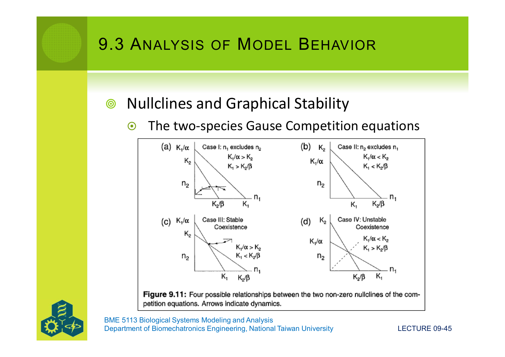

- **Case I:** $n_1$ 排擠 $n_2$
- **Case II:** $n_2$ 排擠 $n_1$
- **Case III:** **穩定共存**(兩條 nullcline 相交,且內部交點是吸引子)
- **Case IV:** **不穩定共存**(內部交點是排斥子或鞍點)

決定哪一種,只看四個不等式 — $K_1/\alpha$ vs $K_2$、$K_1$ vs $K_2/\beta$ — 也就是「**有沒有比較吃得了對方**」。

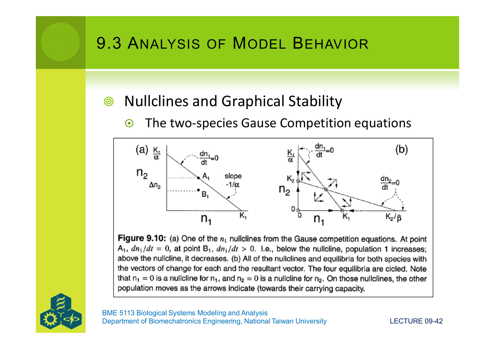

Nullcline 法的好處是**直接看圖就能定性**;缺點是**只在 2D 直觀**,3 變數以上會吃力,5 變數以上幾乎無用。

### 9.3.4 Jacobian 矩陣(迷你導讀)

**(障礙)** 真實生物模型大多是非線性,直接套線性穩定性公式行不通。怎麼辦?

**(工具名稱)** **Jacobian 矩陣** — 把非線性 ODE 在平衡點**線性化**的工具。

**(關鍵想法)** 在平衡點 $X^\ast$ 附近,把每個變數寫成「平衡點 + 小擾動」:$X = X^\ast + x$。對非線性方程 $dX/dt = f(X)$ 做一階 Taylor:

$$
\dfrac{dx}{dt} \;\approx\; \left.\dfrac{\partial f}{\partial x}\right|_{X^\ast}\!\cdot x
$$

對多變數系統,所有偏微分排成一個矩陣:

$$
\mathbf{J} \;=\;
\begin{pmatrix}
\partial f_1/\partial x_1 & \partial f_1/\partial x_2 & \cdots \\
\partial f_2/\partial x_1 & \partial f_2/\partial x_2 & \cdots \\
\vdots & \vdots & \ddots
\end{pmatrix}_{X^\ast}
$$

這就是 **Jacobian**。它把**小擾動的線性行為**完全打包好,接著我們處理它就像處理線性系統。

**(套用 Gause)** 教材給出 Gause 競爭 Jacobian(對共存平衡點計算):

| $r_1$ | α | $K_1$ | $r_2$ | β | $K_2$ |
|---|---|---|---|---|---|
| 0.05 | 0.2 | 200 | 0.05 | 6.0 | 1100 |

代入後 Jacobian 為:

$$
\mathbf{J} = \begin{pmatrix} -0.025 & -0.005 \\ -0.1364 & -0.0228 \end{pmatrix}
$$

接下來怎麼判穩定性?要從這個矩陣解出**特徵值**(下一節)。

### 9.3.5 特徵值與特徵向量(迷你導讀)

**(障礙)** 給我 Jacobian,我怎麼知道系統會收斂、發散還是繞圈?

**(工具名稱)** **特徵值(eigenvalue,λ)** 與 **特徵向量(eigenvector,c)**。

**(小例子)** 對線性系統 $\dot{\mathbf{x}} = \mathbf{A}\mathbf{x}$,假設解的形式是 $\mathbf{x} = \mathbf{c}\,e^{\lambda t}$(指數成長/衰減)。代入後:

$$
\lambda \mathbf{c}\,e^{\lambda t} \;=\; \mathbf{A}\,\mathbf{c}\,e^{\lambda t}
\quad\Longrightarrow\quad
\lambda \mathbf{c} \;=\; \mathbf{A}\,\mathbf{c}
\quad\Longrightarrow\quad
(\mathbf{A} - \lambda \mathbf{I})\,\mathbf{c} \;=\; \mathbf{0}
$$

要這個方程有**非零解**,係數矩陣必須**奇異**:

$$
\boxed{\;\det(\mathbf{A} - \lambda \mathbf{I}) \;=\; 0\;}
$$

這就是**特徵方程**。展開後是一個 $m$ 次多項式($m$ = 狀態變數數),根就是特徵值 $\lambda_1, \ldots, \lambda_m$。

**(關鍵性質 — λ 的符號決定一切)**

| λ 的形式 | 意義 | 平衡點分類 |
|---|---|---|
| 全為實數,**全部 < 0** | 所有擾動指數衰減 | **穩定節點** |
| 全為實數,**全部 > 0** | 所有擾動指數成長 | **不穩定節點** |
| 實數,**有正有負** | 某方向收斂,某方向逃逸 | **鞍點** |
| 複數,**實部 < 0** | 邊轉邊收斂 | **穩定螺旋** |
| 複數,**實部 > 0** | 邊轉邊發散 | **不穩定螺旋** |
| 純虛數(實部 = 0) | 永遠繞圈 | **中心**(neutral) |

**(套用回 Gause)** 上節的 Jacobian 給出特徵方程:

$$
\lambda^2 + 0.0477\,\lambda - 0.000114 \;=\; 0
$$

根:$\lambda_1 = 0.0460$、$\lambda_2 = -0.0938$。**一正一負 → 鞍點**(對應 Fig 9.8f)。也就是這個共存平衡點**不穩定** — 沿著一條方向會收斂(稱為 **separatrix**,分界線),其餘方向會逃逸。

**(看起來合理嗎?)** 是 — 把上面六種狀況做成一張視覺字典:

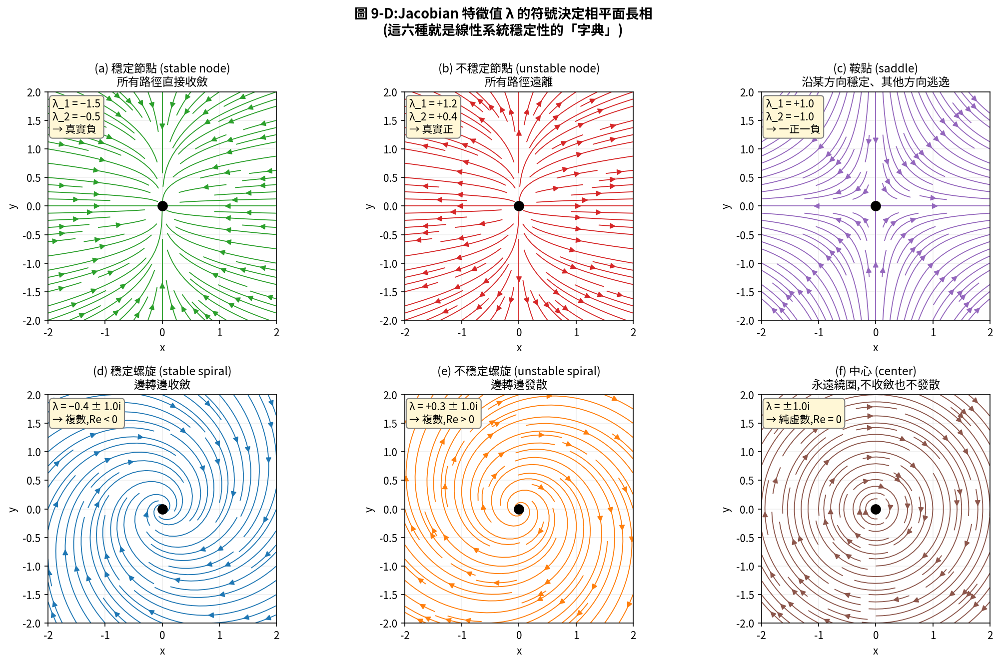

這張圖就是「給我 Jacobian、給我特徵值,我立刻知道相平面長什麼樣」的對應表。看到實數正/負/混合,看到複數實部正/負 — 直接對到對應的圖。

### 9.3.6 對虛數 λ 多說兩句:振盪是怎麼產生的

當特徵值是複數 $\lambda = \rho \pm i\kappa$,代入 $x = c e^{\lambda t}$ 並用 Euler 公式 $e^{i\kappa t} = \cos(\kappa t) + i\sin(\kappa t)$,解就分成兩部分:

$$
x(t) \;=\; e^{\rho t}\bigl[\,A\cos(\kappa t) + B\sin(\kappa t)\,\bigr]
$$

- **$e^{\rho t}$** 控制**振幅怎麼變**(ρ > 0 發散、ρ < 0 衰減、ρ = 0 不變)。
- **$\kappa$** 控制**振盪頻率**(週期 $T = 2\pi/\kappa$)。

**重要洞察**:**單一狀態變數的線性 ODE 不會產生振盪;振盪至少需要兩個變數**。這就是為什麼:

- $dN/dt = -kN$ 只會單調衰減。
- 預測者-獵物模型(兩變數)可以產生週期循環。

### 9.3.7 Routh–Hurwitz 準則:不解多項式也能判穩定

**(障礙)** 6 變數系統的特徵方程是 6 次多項式 — 手算不可能,而我們只關心「**所有實部是不是都負的**」,不需要實際解出根。

**(工具)** **Routh–Hurwitz 準則**從特徵多項式的**係數**直接判讀,不必動手解多項式。對 2 維系統:

$$
\lambda^2 + a_1\lambda + a_2 = 0 \quad\Rightarrow\quad
\text{穩定} \iff a_1 > 0 \text{ 且 } a_2 > 0
$$

對 3 維:

$$
\lambda^3 + a_1\lambda^2 + a_2\lambda + a_3 = 0 \quad\Rightarrow\quad
\text{穩定} \iff a_1 > 0,\, a_3 > 0,\, a_1 a_2 > a_3
$$

May (1973) 把 $m = 1, \ldots, 5$ 的規則都列了表。這個方法在解析推導生物模型穩定性條件時特別好用,因為它把「穩定」翻譯成**對參數的不等式**,可以直接看出哪些參數的範圍會導致系統失穩。

### 9.3.8 Précis on Stability Analysis:五步驟

教材的彙整完美對應整節:

1. **找平衡點** — 解 $\dot{\mathbf{x}} = 0$。
2. **建 Jacobian** — 對非線性模型做偏微分,代入平衡點數值。
3. **寫特徵方程** — $\det(\mathbf{J} - \lambda \mathbf{I}) = 0$。
4. **檢查 $\max\,\mathrm{Re}\,\lambda_i$** — 都 < 0 ⇒ 穩定。
5. **或者用 Routh–Hurwitz** — 不解 λ 直接從係數判讀。

**幾個忠告**:

- 平衡點的閉式解未必存在(即便它在模型裡存在),這時 nullcline 法可以接手。
- 三個以上變數,nullcline 法畫不出來;這時穩定性分析(Jacobian + 特徵值)就是主要工具。
- 穩定性分析只看**局部** — 全域行為要靠 Lyapunov 函數、bifurcation 分析或直接數值積分。

---

## §9.4 Mathematical Details:背後的線性代數

§9.3 引入了一個關鍵公式 $\det(\mathbf{A} - \lambda \mathbf{I}) = 0$,§9.4 用兩段話交代它的來歷。

### 9.4.1 為什麼會冒出行列式?

把 $(\mathbf{A} - \lambda \mathbf{I})\mathbf{c} = \mathbf{0}$ 看成 $\mathbf{D}\mathbf{c} = \mathbf{0}$。

- 如果 $\mathbf{D}$ **可逆**,兩邊乘 $\mathbf{D}^{-1}$ 得 $\mathbf{c} = \mathbf{0}$ — 只有零解,沒用。
- 我們想要**非零解**,所以 $\mathbf{D}$ **必須奇異**(不可逆)。
- 矩陣奇異 ⟺ **$\det \mathbf{D} = 0$**。

這就是 $\det(\mathbf{A} - \lambda \mathbf{I}) = 0$ 的由來:**它是「非零特徵向量存在」的等價條件**。

### 9.4.2 Cramer 法則(順便講一下)

如果是非齊次方程 $\mathbf{D}\mathbf{x} = \mathbf{b}$,而 $\mathbf{D}$ 可逆,**Cramer 法則**給出每個 $x_i$ 的閉式:

$$
x_i \;=\; \dfrac{\det(\mathbf{D}_i)}{\det(\mathbf{D})}
$$

其中 $\mathbf{D}_i$ 是把 $\mathbf{D}$ 的第 $i$ 欄換成 $\mathbf{b}$ 得到的矩陣。在 2 維情況下手算很快,大於 3 維就建議用數值方法(LU、QR);Cramer 在這裡主要是**概念上的橋**。

### 9.4.3 特徵向量怎麼算出來

知道 λ 之後,把 λ 代回 $(\mathbf{A} - \lambda \mathbf{I})\mathbf{c} = \mathbf{0}$ 解 c。由於是齊次方程,解差一個常數,所以通常**任挑 $c_1 = 1$ 然後解其餘分量**。

教材給出 2×2 的快算公式:對 $\mathbf{A}$,兩個特徵向量是:

$$
\mathbf{c}_1 = \begin{pmatrix} 1 \\ (\lambda_1 - a_{11})/a_{12} \end{pmatrix}
\qquad
\mathbf{c}_2 = \begin{pmatrix} 1 \\ (\lambda_2 - a_{11})/a_{12} \end{pmatrix}
$$

特徵向量的方向就是**相平面上的「主軸」** — 沿著 $\mathbf{c}_1$ 走,系統純粹以 $e^{\lambda_1 t}$ 變化;沿著 $\mathbf{c}_2$ 走,純粹以 $e^{\lambda_2 t}$ 變化。鞍點的 separatrix 就是負特徵值對應的特徵向量。

---

## 連到下一講:Lecture 10 — 來自亂中的秩序

Lec 09 的 Uncertainty Analysis 雖然引入了 Monte Carlo,但模型本身仍是**確定式**(deterministic):同樣輸入永遠得到同樣輸出。然而真實生物系統有**內生的隨機性** — 細胞反應的分子數有限會抖動(demographic stochasticity)、環境隨時間隨機波動(environmental stochasticity)、神經元發放有隨機延遲。

> **Lecture 10:Stochastic Models**(隨機模型)會把確定式 ODE 重新寫成包含隨機過程的版本,常見三條路徑:
>
> 1. **Discrete-event Stochastic Simulation(離散事件隨機模擬)** — 例如 Gillespie 演算法,適合分子數很少的反應網路。
> 2. **Stochastic Differential Equations(SDE)** — 在 ODE 上加一個白雜訊項 $\sigma\,dW_t$,適合大量分子但仍有可觀波動。
> 3. **Individual-Based Models(IBM)** — 模擬每個個體的決定,適合異質性大的生態系。

下一講的關鍵字會是:**Poisson process、White noise、Itô lemma、Master equation、ensemble average**。準備好把「機率」當動詞用 — 不是「事後估誤差」,而是「**模型本身就是機率語句**」。

> Lec 09 把模型「擾動 + 線性化」當顯微鏡看;Lec 10 把「機率」當顯微鏡。
> 它們是兩種「**對模型內部**」的觀看方式,合起來才完成 §8.1 提到的 Validity / **Uncertainty** / **Behavior** 三條軸。
