# Lecture 10:隨機建模(Stochastic Models)

> 前面九講把模型當作「**確定式**」 — 給定初值與參數,輸出唯一。
> 真實生物世界不是這樣 — **同樣的條件可以重來,結果不會一樣**。
> 這一講把「隨機」直接寫進模型,把預測從「**一個值**」改成「**一個分布**」。

---

## 0. 為什麼這一講重要?

整本課的旅程到這裡:

- Lec 04–06:確定式 ODE — 給 $(N_0, r, K)$ 我就能算出 $N(t)$ 每個時刻。
- Lec 07:從資料反推「最佳」參數。
- Lec 08:檢查模型對不對。
- Lec 09 §9.2:量化「參數不確定度傳到輸出」 — 但 ODE 本身仍然是確定的。

**現在這個假設要打破**。生物學裡至少三件事一定要用機率語言才能講清楚:

1. **環境隨機性(environmental stochasticity)** — 溫度、降雨、食物供應每天不一樣 → 參數本身在跳。
2. **族群隨機性 / 分子隨機性(demographic / molecular stochasticity)** — 個體數很少時,「平均死亡率」不夠用,因為「沒有半個個體死掉」這種事 — 事件是**離散**的。
3. **離散狀態的隨機切換** — 鹿在水域、草地、睡覺區之間切換,並不照微分方程,而是用機率切。

教材把對應工具分成五節:

| 節 | 主題 | 核心問題 |
|---|---|---|
| §10.1 | Monte Carlo 大概念 | 為什麼要把隨機放進模型? |
| §10.2 | 隨機數 | 電腦怎麼生成「隨機」?怎麼從任意分布抽樣? |
| §10.3 | 抽樣策略 | 為什麼純 random sampling 不夠? |
| §10.4 | 應用在 ODE | 把隨機加進微分方程怎麼跑? |
| §10.5 | Markov 過程 | 離散狀態 + 機率轉移怎麼分析? |

---

## §10.1 There's Nothing Like a Random World

教材開場一句話:

> "Repeatedly simulating random models allows us to estimate characteristics of the probabilistic model response. This process is called **Monte Carlo simulation**."

Lec 09 §9.2 已經摸到 Monte Carlo(對 Pielou 模型);這裡正式把它當主角。

**為什麼叫 Monte Carlo?** 因為 1940 年代物理學家 Ulam 與 von Neumann 在洛斯阿拉莫斯做中子擴散模擬,需要大量抽樣 — 同事的舅舅常去摩納哥 Monte Carlo 賭場,於是借了名字。**核心思路**就是「**用大量隨機抽樣去逼近一個你算不出來的積分或機率**」。

三個典型用途:

1. **統計假設(Statistical Hypotheses)** — 例如做 bootstrap、permutation test。
2. **微分/差分方程** — §10.4 重點。
3. **Markov 過程** — §10.5 重點。

面對自然隨機,建模者有**兩個基本選擇**:

| 選擇 | 中文 | 何時用 |
|---|---|---|
| Ignore variability,model the mean | 忽略波動、只建平均行為 | 變異很小、預測平均值就夠 |
| Build a stochastic model | 直接把隨機寫進模型 | 變異大、極端事件決定結果、需要 CI |

這一講教你怎麼用後一條路。

---

## §10.2 Random Numbers:電腦怎麼「製造隨機」?

### 10.2.1 偽隨機(Pseudo-random)的本質

電腦是**確定式機器**,沒有真正的隨機。它用一條**遞迴公式**算出一串看起來像隨機的數字。所以這些叫**偽隨機數(pseudo-random numbers)**:

- 每一項由上一項唯一決定。
- 給定**種子(seed)** $U_0$ 後,整條序列完全可重現(這在 debug、重現研究結果時是好事)。
- 序列**最終會重複**,稱為**週期(period)**。

### 10.2.2 線性同餘法(Linear Congruential Method,LCG)

最常見的演算法:

$$
U_{i+1} \;=\; (a\,U_i \;+\; c)\;\bmod\;m
$$

其中:

- $a$ = 乘子(multiplier)
- $c$ = 加項(increment),若 $c = 0$ 稱**乘法同餘法**
- $m$ = 模數(modulus)
- $\bmod$ = 取餘數

例如教材給的玩具版本 $x_{n+1} = x_n^2 \bmod 31417$,從 $x_0 = 123$ 開始得到 123、15129、13796、5430、… — 看起來夠亂。

「**好 LCG**」的四個判準:

1. **週期長** — 還沒重複前能用很久。
2. **計算快**。
3. **分布像 uniform** — 平均、方差、偏度、尾部都對。
4. **記憶體佔用小**。

常見的「**現代版**」$m = 2^{32}$ 給的週期約 $4 \times 10^9$。Press 等 (1992) 的「**洗牌**」技巧把週期推到約 $2 \times 10^{18}$。Python / NumPy 預設用 **Mersenne Twister** 週期 $2^{19937} - 1$,基本上一輩子用不完。

### 10.2.3 隨機性檢驗(隨機產生器要怎麼驗?)

三類常見測試:

1. **頻率分布(histogram)** — 看 $U$ 是不是均勻散在 [0, 1]。
2. **卡方檢定(Chi-square)** — 形式化的頻率檢定。
3. **Lattice test(網格檢定)** — 把 $(U_i, U_{i+1})$ 畫成散點;真隨機應該均勻散在單位正方形,**壞 LCG 會冒出明顯條紋或網格**。

這是視覺上最強大的測試,因為它能抓到**頻率分布過得了關但相關性不對**的情境。Helper 1 對比兩條 LCG:

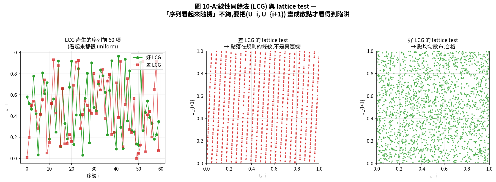

對照原始圖:

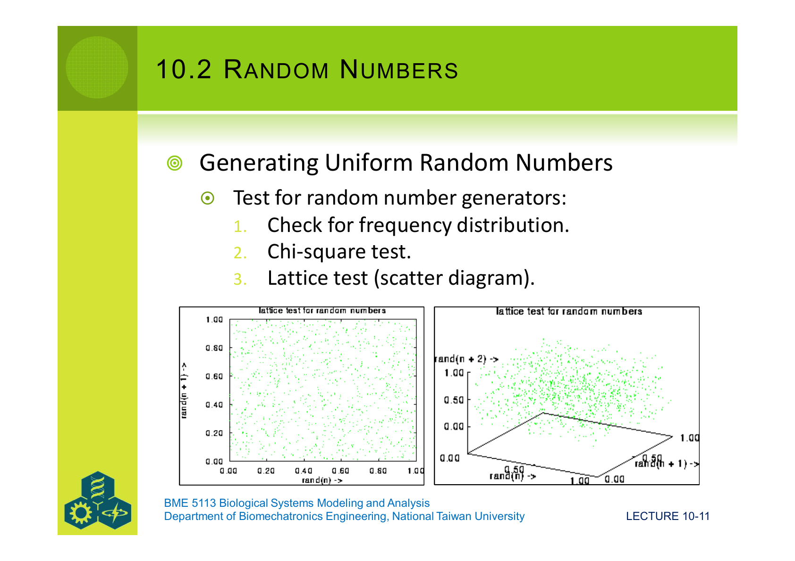

歷史上著名的爛 LCG 是 **RANDU**(IBM 1960s):$U_{i+1} = 65539 \cdot U_i \bmod 2^{31}$。它過得了 1D 與 2D 檢驗,但在 3D 把 $(U_i, U_{i+1}, U_{i+2})$ 畫出來,所有點落在 **15 個平行平面**上 — 後果是 1960–80 年代許多用 RANDU 跑的計算結果都不可信。教訓:**用標準函式庫的 RNG,不要自己寫**。

### 10.2.4 從 uniform 到任何分布:Box–Muller 法產生 normal 隨機數

**(障礙)** RNG 給的是 $U(0,1)$。我想要 $N(\mu, \sigma^2)$ 怎麼辦?

**(工具名稱)** **Box–Muller 變換** — 用**兩個**獨立 $U_1, U_2 \sim U(0,1)$ 一次造出**兩個**獨立 $z_1, z_2 \sim N(0,1)$:

$$
z_1 \;=\; \sqrt{-2\ln U_1}\,\cos(2\pi U_2)
\qquad
z_2 \;=\; \sqrt{-2\ln U_1}\,\sin(2\pi U_2)
$$

**(關鍵性質)** $z_1, z_2$ 是**獨立的標準常態**(可以證,但這裡略過)。把它調到任意 $N(\mu, \sigma^2)$:

$$
y \;=\; \sigma z + \mu
$$

### 10.2.5 從 uniform 到任何分布:逆累積方法

**(障礙)** 對其他連續分布(指數、Weibull、Cauchy、...),Box–Muller 那種神來一筆未必存在。要一個**通用方法**。

**(工具名稱)** **Inverse Cumulative(Inverse CDF / Inverse Transform)Method**。

**(關鍵想法)** 任何連續分布的 cdf $F(x) = P(X \le x)$ 都把 $x$ 映射到 [0, 1]。**反過來**,如果 $U \sim U(0, 1)$,那 $X = F^{-1}(U)$ 就會服從原本的分布。

**(五步驟)**

1. 寫出 pdf $f(x)$。
2. 求 cdf:$F(x) = \int_{-\infty}^{x} f(t)\,dt$。
3. 用 $F(-\infty) = 0$、$F(+\infty) = 1$ 定積分常數。
4. 抽 $U \sim U(0, 1)$。
5. 反解 $F(x) = U$ 得 $x = F^{-1}(U)$。

**(套用 — Wrapped Cauchy)** 教材給了一個 wrapped Cauchy 的例子,pdf 是

$$
f(\phi) \;=\; \dfrac{1 - \rho^2}{2\pi\bigl[1 + \rho^2 - 2\rho\cos(\phi - \theta)\bigr]}
$$

對 $\phi$ 積分後得 cdf,再反解可得

$$
\phi \;=\; \theta + 2\arctan\!\left(\dfrac{1-\rho}{1+\rho}\,\tan\!\bigl(\pi(U - 0.5)\bigr)\right)
$$

這就是「抽一個 $U \sim U(0,1)$,塞進去就得到一個 wrapped Cauchy 角度」 — 一行公式就解決抽樣問題。

Helper 2 把整個流程視覺化(用 gamma(2, 1) 作 demo):

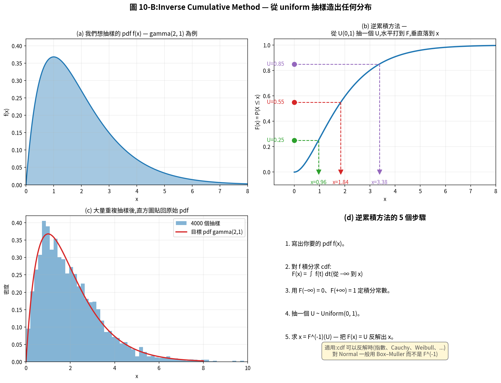

對照原始 Fig 10.1 的離散版(溫度資料):

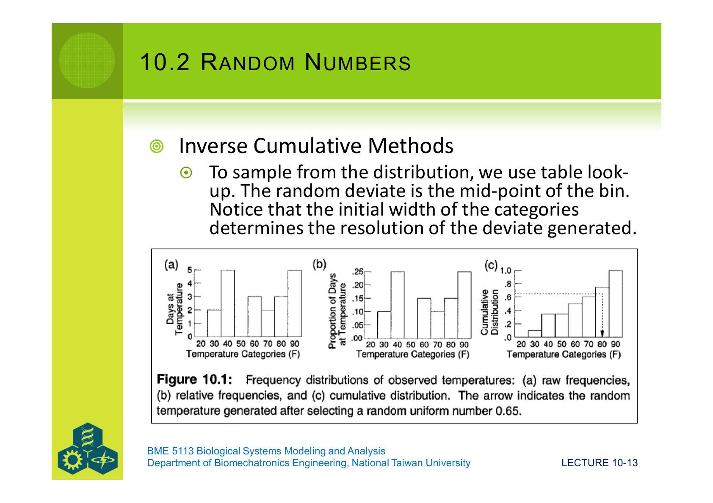

**離散版**做法一模一樣:把資料分箱、累積、查表。注意分箱寬度決定了抽樣的解析度。

**(看起來合理嗎?)** 是。Helper 2 (c) 顯示 4000 次抽樣的直方圖**完全貼合原始 pdf**。

### 10.2.6 常用分布速覽

教材列了 9 種連續/離散分布的數學定義、平均、方差、MLE。下面用一張表速覽:

| 分布 | 形狀 | 典型用途 |
|---|---|---|
| **Uniform $U(a, b)$** | 矩形 | 預設假設、所有隨機數的源頭 |
| **Normal $N(\mu, \sigma^2)$** | 鐘形 | 中央極限定理 — 多源誤差的累積 |
| **Lognormal $LN(\mu, \sigma^2)$** | 右偏 | 體型、收入、生物大小、任務時間 |
| **Exponential $\exp(\beta)$** | 從 0 開始衰減 | 「事件間距」(無記憶性) |
| **Gamma $\Gamma(\alpha, \beta)$** | 右偏(α 控形狀) | $\alpha$ 個獨立指數事件之和 |
| **Weibull $W(\alpha, \beta)$** | 多種形狀 | 設備壽命、可靠度 |
| **Beta $B(\alpha_1, \alpha_2)$** | 限 [0, 1] | 機率、比例的先驗 |
| **Binomial $B(m, p)$** | 二項 | $m$ 次伯努利試驗的成功數 |
| **Poisson $\mathrm{Poi}(\lambda)$** | 計數 | 稀有獨立事件的計數(放射衰變、突變) |
| **Geometric $\mathrm{Geom}(p)$** | 幾何 | 第一次成功前的失敗次數 |

幾個關鍵連結要記住:

- **Normal vs Lognormal**:$X \sim LN(\mu, \sigma^2) \iff \ln X \sim N(\mu, \sigma^2)$。把生物量取 log 後做常態分析,等價於假設原始量是 lognormal。
- **Exponential 的「無記憶性」**:$P(X > s + t \mid X > s) = P(X > t)$ — 已經等了 s 秒,接下來等待時間的分布跟剛開始一樣。
- **Exponential vs Gamma**:$\sum_{i=1}^{m} X_i \sim \Gamma(m, \beta)$,當 $X_i \sim \exp(\beta)$ 獨立。
- **Binomial → Poisson**:$m$ 大、$p$ 小、$\lambda = mp$ 固定,Binomial 收斂到 Poisson。

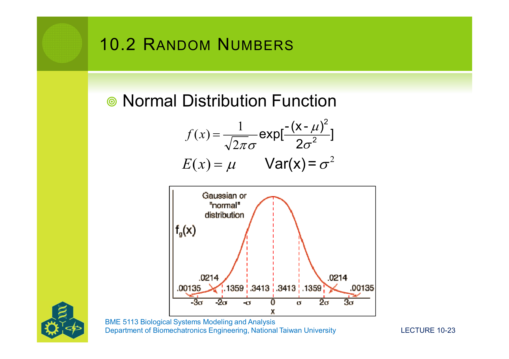
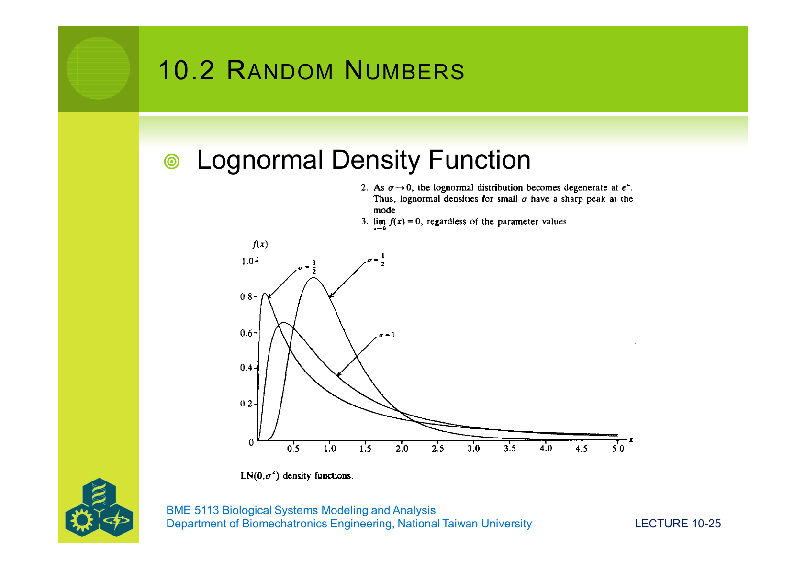
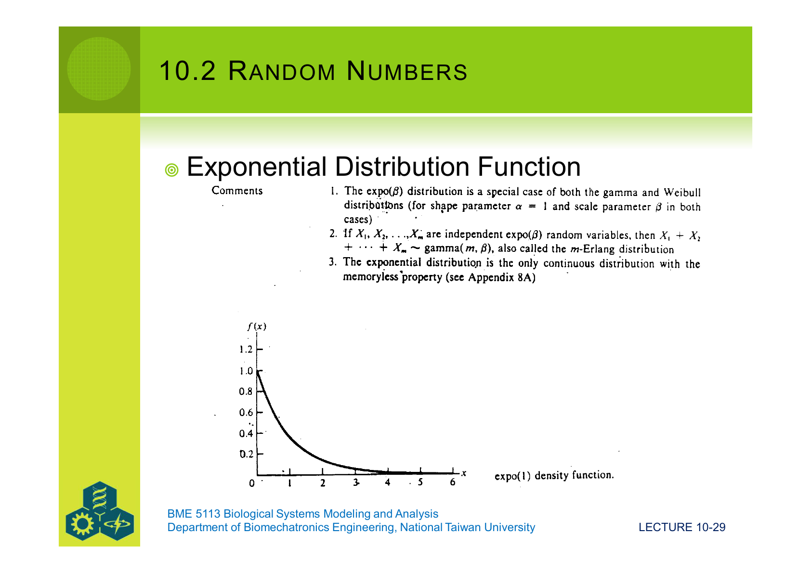
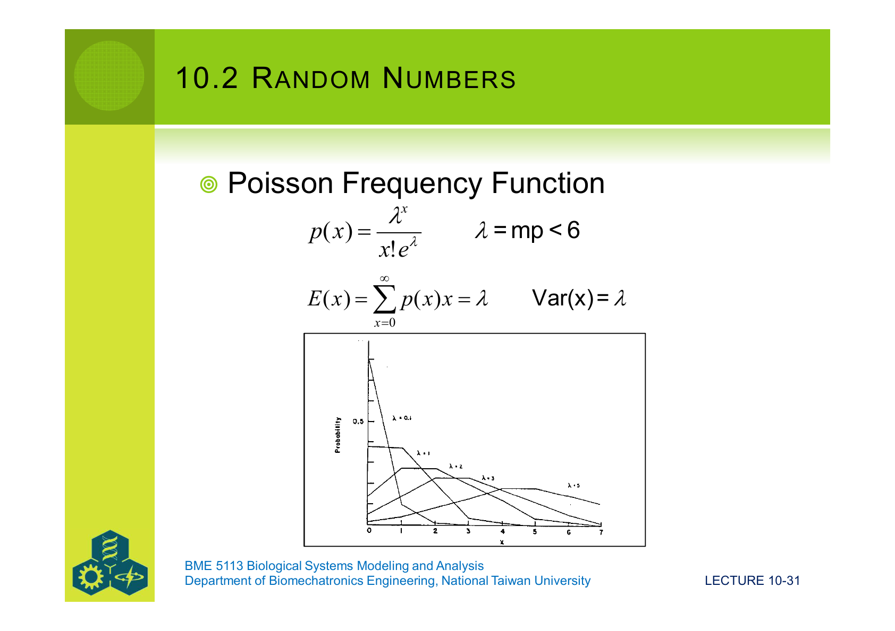
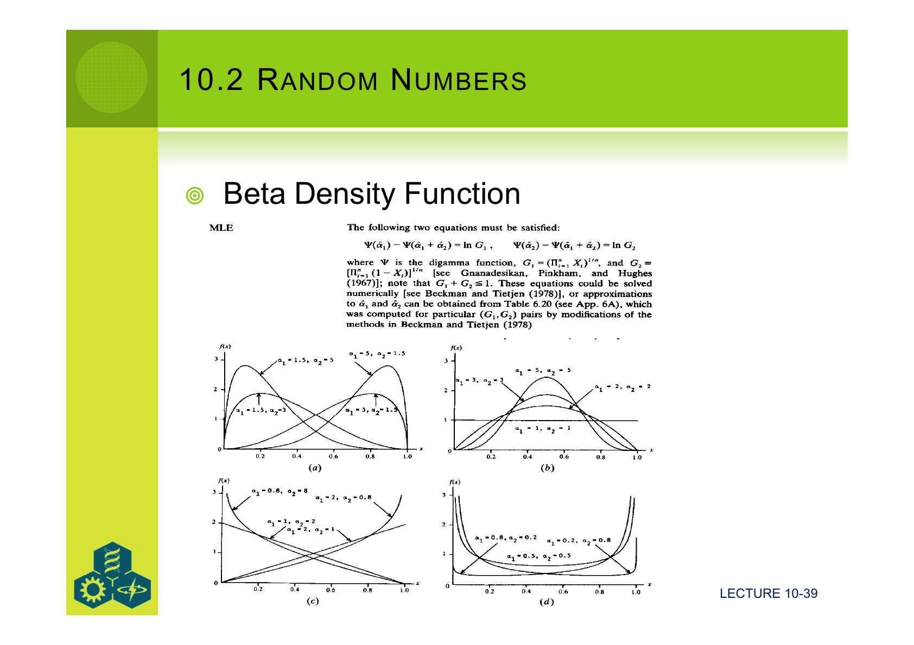

### 10.2.7 多變量(Multivariate)分布

如果幾個變數**有相關性**,不能各自獨立抽。教材對**多變量常態**給了一個簡潔做法:

1. 用 Box–Muller 抽 $n$ 個獨立 $z_i \sim N(0, 1)$,組成向量 $\mathbf{z}$。
2. 變換:$\mathbf{y} = \mathbf{m} + \mathbf{S}\mathbf{z}$,其中 $\mathbf{m}$ 是平均向量,$\mathbf{S}$ 由共變異矩陣 $\mathbf{V}$ 拆解而來。
3. 關係:$\mathbf{V} = \mathbf{S}\mathbf{S}^\top$ — **這就是 Cholesky 分解**。

當 $n = 2$,可以手解 $\mathbf{S}$ 的四個元素;$n > 2$ 用 NumPy 的 `numpy.linalg.cholesky(V)` 即可。

---

## §10.3 Sampling Strategies:不只是「抽就好」

對同樣的目標分布,**怎麼抽**會大大影響 Monte Carlo 的效率。三種策略:

| 策略 | 中文 | 優點 | 缺點 |
|---|---|---|---|
| **Random sampling** | 純隨機抽 | 最簡單 | 尾巴抽不到、收斂慢 |
| **Stratified sampling** | 分層抽樣 | 各層都有代表 | 要事先分層 |
| **Latin Hypercube Sampling(LHS)** | 拉丁超立方 | 多維下抽得最均勻 | 要紀錄每個維度的「已抽位置」 |

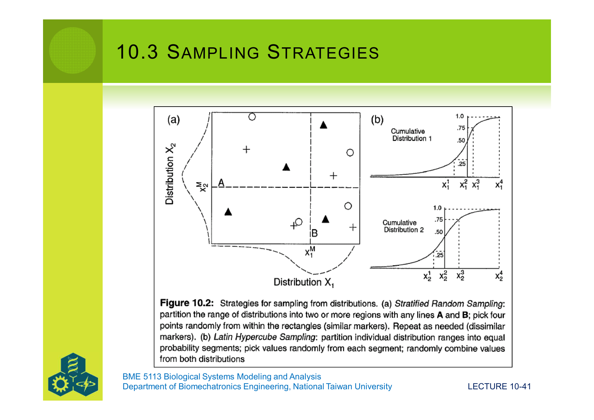

**(LHS 怎麼做?)**

1. 每個變量的 cdf 切成 $N$ 個等機率段(每段機率 $1/N$)。
2. 從每段隨機抽一個值。
3. 對不同變數,**把抽到的值隨機配對**(像拉丁方格)。

結果:每個變量都「**保證每個 cdf 區段被取到一次**」 — 不會有大段被遺漏。在 Lec 09 §9.2 提到的「**Monte Carlo 對尾部抽樣不足**」這個問題上,LHS 是最常見的補救。

**實務指引**:
- 維度低($\le 3$)、$N$ 大($> 10^4$):純 random sampling 也夠。
- 維度中等(4–10)、$N$ 中等(1000–10000):**用 LHS**。
- 維度高($> 20$)、$N$ 小:考慮 Quasi-Monte Carlo(Sobol、Halton 序列)。

---

## §10.4 Applications to Differential Equations:把隨機加進 ODE

### 10.4.1 在 ODE 哪裡加隨機?

四個可能位置:

1. **初始條件** $X_0$ 從某分布抽。
2. **驅動變數**(外部輸入,如環境溫度)隨機。
3. **參數**(如 $r$、$K$)隨機。
4. **狀態變數本身**每一步加 noise。

最常見的做法是 (2) + (3) — 對每個時刻 $t$ 的參數抽新值。

教材給的例子是**密度無關成長**:

$$
\dfrac{dX}{dt} \;=\; r_t\bigl[N(\mu, \sigma^2)\bigr]\,X
$$

意思是「**$r$ 每個時刻從 $N(\mu, \sigma^2)$ 重抽**」。離散時間版本就是:

$$
X_{t+1} \;=\; X_t \;+\; r_t \cdot X_t \cdot \Delta t,\quad r_t \sim N(\mu, \sigma^2)
$$

### 10.4.2 環境 vs 族群隨機性

兩種來源在生物學裡概念不同:

| 類型 | 中文 | 來源 | 例子 |
|---|---|---|---|
| **Environmental stochasticity** | 環境隨機 | 外在波動同時影響整個族群 | 一場寒流讓所有個體都減少;雨季豐年 |
| **Demographic stochasticity** | 族群隨機 | 個體事件離散,只有少量個體時影響大 | 5 隻孔雀魚的群裡,死掉一隻就是 −20%;5 萬隻時忽略不計 |

它們**疊加**起來才是完整的生物隨機性。Environmental 用「加在參數上的高斯噪音」就能近似;demographic 嚴格說要用 §10.5 的 Markov / 計數型方法。

### 10.4.3 Monte Carlo 模擬 ODE 的五步驟

教材清單:

1. 決定哪些**參數**用哪些**分布**(估其平均與變異)。
2. 在模擬主迴圈內,**每一個時間步抽新參數值**,代入 ODE。
3. 把整段軌跡存起來。
4. 重複 1000 / 10000 次 — 得到一組 **Monte Carlo replicates**。
5. 對所得到的軌跡群做統計(平均、CI、滅絕機率、極大值、...)。

### 10.4.4 範例:隨機 logistic 方程(May 1973)

把 $r$、$K$ 看成隨機:

$$
\dfrac{dV}{dt} \;=\; rV\!\left(1 - \dfrac{V}{K}\right)
$$

教材的處理方式:把方程同除 $r/K$,引入無因次時間 $\tau = (r/K)\,t$,並把**加性高斯噪音**加在 $K$ 上:

$$
\boxed{\;
\dfrac{dV}{d\tau} \;=\; V\bigl[K + N(0, \sigma^2) - V\bigr]
\;}
$$

也就是「每一步,$K$ 都隨機地動一下」。三種雜訊量級顯示完全不同的行為:

| σ | 動態特徵 |
|---|---|
| 0.1 | 軌跡在 K 附近輕微波動,跟確定式幾乎沒差 |
| 0.44 | 中等擾動,但長期分布仍集中在 K 附近 |
| 1.44 | 大擾動 → **早期就滅絕**(V 撞到 0) |

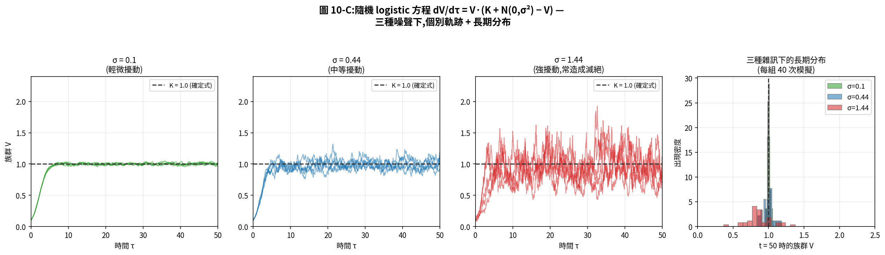

對照原始圖:

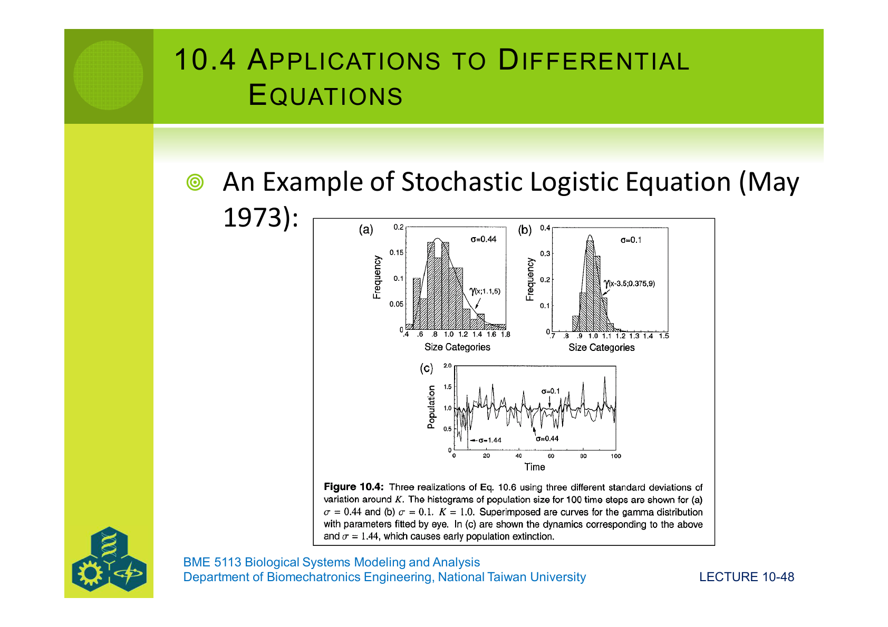
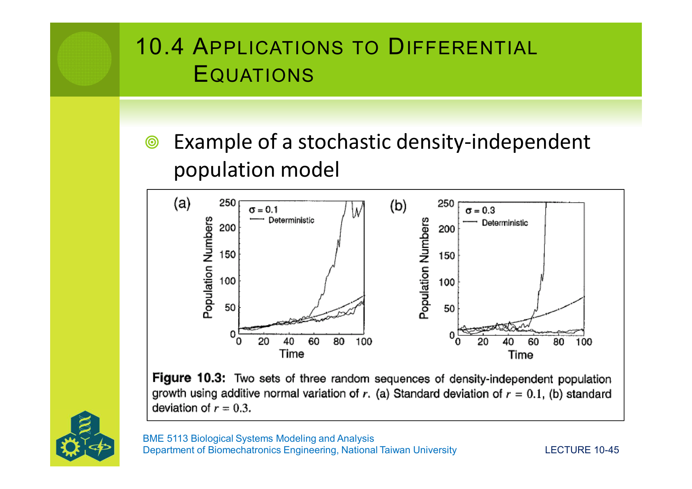

**洞察**:

- σ 小,Monte Carlo 平均 ≈ 確定式結果 — 確定式模型可以當代理。
- σ 大,**Monte Carlo 平均 ≠ 確定式** — 因為一些軌跡先滅絕,平均被左拉。
- 確定式預測**不會給你滅絕風險** — 它只給一條軌跡。Monte Carlo 直接給「100 次模擬有幾次滅絕」的機率。

### 10.4.5 分析隨機系統的三個問題

教材列了三個關鍵問題:

1. 單一系統的 $X(t)$ 是什麼性質?(看一條軌跡)
2. **集合(ensemble)** 中眾多系統的統計分布是什麼?(看 N 條軌跡的 cross section)
3. 隨機動態的穩定性?(Lec 09 的線性化能不能搬過來?)

第三題的答案是:**只能搬到「擾動很小、平均行為主導」的情境**。強隨機時要靠 Fokker–Planck 方程或 Stochastic Lyapunov function — 這已經跨進 §10.5 的範圍。

---

## §10.5 Markov Processes:離散狀態的隨機切換

### 10.5.1 什麼是 Markov 過程?

**Markov 過程**用機率語言描述「**狀態有限**、**下一步只取決於當下狀態**」的系統:

> **無記憶性(Markov property)**:
> $P(X_{t+1} = j \mid X_t = i,\, X_{t-1}, X_{t-2}, \ldots) \;=\; P(X_{t+1} = j \mid X_t = i)$

也就是「**過去的歷史不重要,只看現在**」。這是個非常強(但常常**夠用**)的近似。

兩種觀看角度:

- **個體角度**:一隻鹿,在 $t = 0$ 在水域,$t = 1$ 在草地,... 序列地拜訪各狀態。
- **集合角度**:一大群鹿,$t = 0$ 時 100% 在水域,$t = 1$ 時 60% 在水域、20% 在草地、...。

**兩種解讀用同一套數學描述**:**轉移矩陣 $\mathbf{P}$**。

### 10.5.2 轉移矩陣的性質

定義:$P_{ij} = P(X_{t+1} = j \mid X_t = i)$。

要求兩件事:

1. 每個元素 $P_{ij} \in [0, 1]$。
2. **每一列加起來等於 1**($\sum_j P_{ij} = 1$ — 「從狀態 $i$ 跳出去到某狀態的機率合為 1」)。

教材給的例子:

$$
\mathbf{P} = \begin{pmatrix}
\tfrac{1}{4} & \tfrac{1}{4} & \tfrac{1}{2} \\
0 & 1 & 0 \\
\tfrac{1}{3} & \tfrac{1}{3} & \tfrac{1}{3}
\end{pmatrix}
$$

注意第二列 $(0, 1, 0)$ 表示「**狀態 2 是吸收態(absorbing state)** — 一旦進去就出不來」。

### 10.5.3 演化:$\mathbf{p}_{t+1} = \mathbf{p}_t \mathbf{P}$

定義 $\mathbf{p}_t$ 為「時間 $t$ 時各狀態的機率列向量」。下一刻:

$$
\boxed{\;
\mathbf{p}_{t+1} \;=\; \mathbf{p}_t \,\mathbf{P}
\;}
$$

代入 $\mathbf{p}_t = \mathbf{p}_0 \mathbf{P}^{t}$ — **$n$ 步轉移矩陣等於 $\mathbf{P}^n$**(矩陣自乘 $n$ 次)。

**關鍵性質**:對大多數 $\mathbf{P}$(滿足 ergodicity 的條件),$\mathbf{p}_t$ 會**收斂**到一個**與初始無關**的固定分布 $\mathbf{p}^*$,滿足:

$$
\mathbf{p}^* \;=\; \mathbf{p}^* \,\mathbf{P}
$$

也就是 $\mathbf{P}^\top$ 的特徵值 1 對應的左特徵向量(再標準化讓元素和為 1)。

### 10.5.4 範例:鹿的水–草–睡覺三狀態切換

教材 Table 10.1 給的例子:

$$
\mathbf{P} = \begin{pmatrix}
0.60 & 0.20 & 0.20 \\
0.25 & 0.50 & 0.25 \\
0.25 & 0.25 & 0.50
\end{pmatrix}
$$

對應「水 → 水 60%、水 → 草 20%、水 → 睡 20%;草 → ...;睡 → ...」。從初始 $\mathbf{p}_0 = (1, 0, 0)$(鹿在水域)出發:

| n | $\mathbf{p}_n$ |
|---|---|
| 0 | (1.000, 0.000, 0.000) |
| 1 | (0.600, 0.200, 0.200) |
| 2 | (0.460, 0.270, 0.270) |
| 4 | (0.394, 0.303, 0.303) |
| 16 | (0.3848, 0.3076, 0.3076) |
| 32 | (0.3846, 0.3077, 0.3077) |
| 64 | (0.3846, 0.3077, 0.3077)(完全收斂) |

不管初始狀態為何,**長期都收斂到固定分布 $(5/13, 4/13, 4/13)$**。Helper 4 把這個過程畫出來:

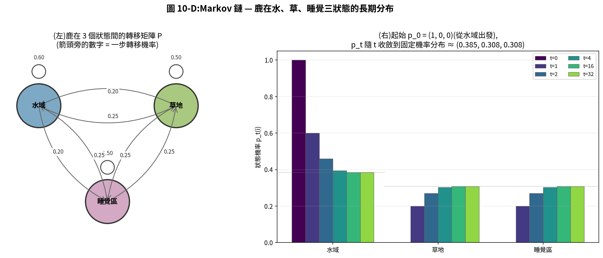

對照原始 Table 10.1:

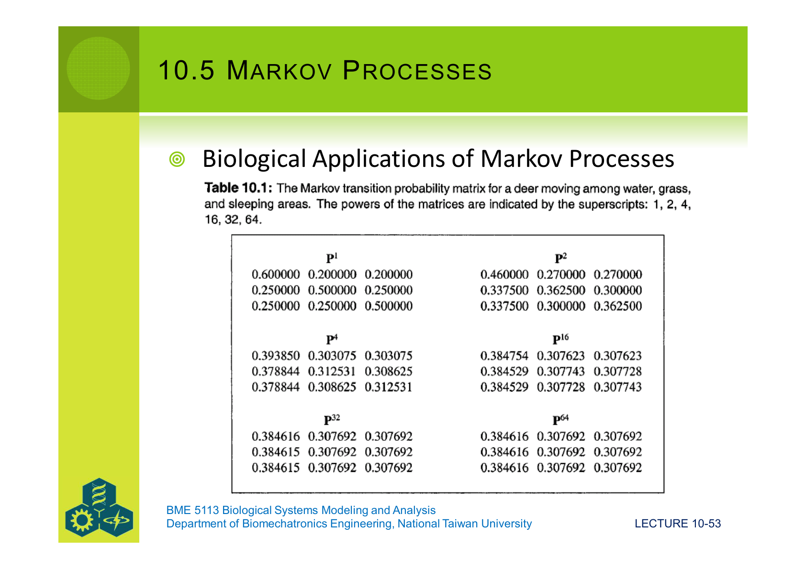

### 10.5.5 模擬 Markov 鏈(逐個體版)

如果你想看「**單一個體的軌跡**」而不是「**整個族群的分布**」,演算法:

1. 把 $\mathbf{P}$ 的每一列**累積化**:第 $i$ 列變成 $(P_{i1},\, P_{i1}+P_{i2},\, \ldots,\, 1)$。
2. 從某個初始狀態 $s_t$ 出發。
3. 抽 $U \sim U(0, 1)$。
4. 在第 $s_t$ 列裡找 $j$ 使得 $P^{\text{cum}}_{i,j-1} < U \le P^{\text{cum}}_{i,j}$,把 $j$ 作為新狀態 $s_{t+1}$。
5. 重複到所需的步數。

這其實是把 §10.2 的「逆累積方法」**套到離散分布上**。

### 10.5.6 Markov 假設的限制與 Semi-Markov

Markov 假設兩件強事:

- $\mathbf{P}$ **常數**(不隨時間或狀態變)。
- **無記憶性** — 過去的歷史不影響轉移。

真實生物常常違反這兩條:

- 一隻鹿在水域停留越久,**離開的機率應該變高**(無記憶性失效)。
- 季節變化會讓 $\mathbf{P}$ 變化(常數失效)。

**Semi-Markov 過程** 是放寬第二條的版本 — 每個狀態的「**停留時間**」自己有分布,不必是幾何分布(Markov 對停留時間隱含的就是幾何分布)。實作上把「**停留時間**」改抽 Weibull 或 lognormal,通常就足以重現實驗觀察。

---

## 整門課收尾:從 Lec 01 到 Lec 10 的旅程

| 階段 | Lecture | 你帶走什麼 |
|---|---|---|
| 概念 | 01–03 | 模型 = 用一個簡化版本回答特定問題;Forrester 圖把假設可視化 |
| 工具 | 04–06 | 質量守恆 → ODE,用 Euler / RK4 在電腦上跑 |
| 配資料 | 07 | 最小平方 + 梯度方法 + Nelder-Mead 求參數 |
| 評估 | 08 | 驗證(reliability vs adequacy)+ AIC/Bayes 辨別模型 |
| 內探 | 09 | 靈敏度 + 誤差傳播 + 穩定性(eigenvalues / nullclines) |
| 隨機 | **10** | 把確定式換成機率語言,Monte Carlo / Markov |

回頭看,Lec 08 §8.1 提到模型評估的三條軸:

- **Validity** → Lec 08 把它操作化(對外比)。
- **Uncertainty** → Lec 09 §9.2 + Lec 10 §10.2–10.4 把它操作化(對內探 + 隨機傳播)。
- **Behavior** → Lec 09 §9.3 + Lec 10 §10.5 把它操作化(穩定性 + 隨機動力)。

**三條軸現在全部都有具體工具**。當你下次寫一個模型,自我檢查清單可以是:

1. **概念清楚嗎?**(Lec 01–03:寫得出 Forrester 圖嗎?)
2. **方程式對得上守恆律嗎?**(Lec 04–05)
3. **數值解收斂嗎?**(Lec 06:Euler 跟 RK4 結果一致嗎?)
4. **參數從哪裡來?**(Lec 07:有用最小平方/MCMC 配過實驗?)
5. **驗證過了嗎?**(Lec 08:用獨立資料還貼合?MSEP 分解告訴你錯在哪?)
6. **對哪些參數敏感?**(Lec 09 §9.2:S 表畫過了?)
7. **長期會收斂、發散還是繞圈?**(Lec 09 §9.3:eigenvalues 算過了?)
8. **隨機性會放大還是壓抑?**(Lec 10:做過 σ 變化的 MC 嗎?)

> 一個模型同時能通過這八關,**它就不再是「猜的數字」,而是「值得信任的洞察工具」** — 也就是 Lec 08 §8.1 一開始那句:
>
> > "Modeling, like computing and statistics, should produce **insight**, not merely numbers."

恭喜走完整門課。模型不是答案,**模型是問題**;問得好的模型,讓世界稍微清楚一點。
